= ManageIQ 5.3 Control Guide

== Introduction

ManageIQ delivers the insight, control, and automation enterprises need to address the challenges of managing virtual environments. This technology enables enterprises with existing virtual infrastructures to improve visibility and control, and those starting virtualization deployments to build and operate a well-managed virtual infrastructure.

ManageIQ 5.3 is comprised of a single component, the ManageIQ. It has the following feature sets:

* Insight: Discovery, Monitoring, Utilization, Performance, Reporting, Analytics, Chargeback, and Trending.
* Control: Security, Compliance, Alerting, and Policy-Based Resource, and Configuration Enforcement.
* Automate: IT Process, Task and Event, Provisioning, and Workload Management and Orchestration.
* Integrate: Systems Management, Tools and Processes, Event Consoles, Configuration Management Database (CMDB), Role-based Administration (RBA), and Web Services.

=== Architecture

The diagram below describes the capabilities of ManageIQ. Its features are designed to work together to provide robust management and maintenance of your virtual infrastructure.

image:images/1845.png[Features]

*Figure 1.1. Features*

 +

The architecture comprises the following components:

* The ManageIQ Appliance (Appliance) which is supplied as a secure, high-performance, preconfigured virtual machine. It provides support for Secure Socket Layer (SSL) communications.
* The ManageIQ Server (Server) resides on the Appliance. It is the software layer that communicates between the SmartProxy and the Virtual Management Database. It includes support for Secure Socket Layer (SSL) communications.
* The Virtual Management Database (VMDB) resides either on the Appliance or another computer accessible to the Appliance. It is the definitive source of intelligence collected about your Virtual Infrastructure. It also holds status information regarding Appliance tasks.
* The ManageIQ Console (Console) is the Web interface used to view and control the Server and Appliance. It is consumed through Web 2.0 mash-ups and web services (WS Management) interfaces.
* The SmartProxy can reside on the Appliance or on an ESX Server. If not embedded in the Server, the SmartProxy can be deployed from the Appliance. Each storage location must have a SmartProxy with visibility to it. The SmartProxy acts on behalf of the Appliance communicating with it over HTTPS (SSL) on standard port 443.

=== Requirements

To use ManageIQ, the following requirements must be met:

* One of the following Web Browsers:
** Mozilla Firefox for versions supported under Mozilla's Extended Support Release (ESR)
** Internet Explorer 8 or higher
** Google Chrome for Business
* A monitor with minimum resolution of 1280x1024.
* Adobe Flash Player 9 or above. At the time of publication, you can access it at http://www.adobe.com/products/flashplayer/[http://www.adobe.com/products/flashplayer/].
* The ManageIQ Appliance must already be installed and activated in your enterprise environment.
* The SmartProxy must have visibility to the virtual machines and cloud instances that you want to control.
* The resources that you want to control must have a SmartProxy associated with them.

IMPORTANT: Due to browser limitations, ManageIQ supports logging in to only one tab for each multi-tabbed browser. Console settings are saved for the active tab only. For the same reason, ManageIQ does not guarantee that the browser's *Back* button will produce the desired results. ManageIQ recommends using the breadcrumbs provided in the Console.

=== Terminology

*The following terms are used throughout this document. Review them before proceeding.*

Account Role::
  A designation assigned to a user allowing or restricting a user to parts and functions of the ManageIQ console.
Action::
  An execution that is performed after a condition is evaluated.
Alert::
  ManageIQ alerts notify administrators and monitoring systems of critical configuration changes and threshold limits in the virtual environment. The notification can take the form of either an email or an SNMP trap.
Analysis Profile::
  A customized scan of hosts, virtual machines, or instances. You can collect information from categories, files, event logs, and registry entries.
Cloud::
  A pool of on-demand and highly available computing resources. The usage of these resources are scaled depending on the user requirements and metered for cost.
ManageIQ Appliance::
  A virtual machine on which the virtual management database (VMDB) and ManageIQ server reside.
ManageIQ Console::
  A web-based interface into the ManageIQ Appliance.
ManageIQ Role::
  A designation assigned to a ManageIQ server that defines what a ManageIQ server can do.
ManageIQ Server::
  The application that runs on the ManageIQ Appliance and communicates with the SmartProxy and the VMDB.
Cluster::
  Hosts that are grouped together to provide high availability and load balancing.
Condition::
  A test of criteria triggered by an event.
Discovery::
  Process run by the ManageIQ server which finds virtual machine and cloud providers.
Drift::
  The comparison of a virtual machine, instance, host, cluster to itself at different points in time.
Event::
  A trigger to check a condition.
Event Monitor::
  Software on the ManageIQ Appliance which monitors external providers for events and sends them to the ManageIQ server.
Host::
  A computer on which virtual machine monitor software is loaded.
Instance/Cloud Instance::
  A on-demand virtual machine based upon a predefined image and uses a scalable set of hardware resources such as CPU, memory, networking interfaces.
Managed/Registered VM::
  A virtual machine that is connected to a host and exists in the VMDB. Also, a template that is connected to a provider and exists in the VMDB. Note that templates cannot be connected to a host.
Managed/Unregistered VM::
  A virtual machine or template that resides on a repository or is no longer connected to a provider or host and exists in the VMDB. A virtual machine that was previously considered registered may become unregistered if the virtual machine was removed from provider inventory.
Provider::
  A computer on which software is loaded which manages multiple virtual machines that reside on multiple hosts.
Policy::
  A combination of an event, a condition, and an action used to manage a virtual machine.
Policy Profile::
  A set of policies.
Refresh::
  A process run by the ManageIQ server which checks for relationships of the provider or host to other resources, such as storage locations, repositories, virtual machines, or instances. It also checks the power states of those resources.
Resource::
  A host, provider, instance, virtual machine, repository, or datastore.
Resource Pool::
  A group of virtual machines across which CPU and memory resources are allocated.
Repository::
  A place on a datastore resource which contains virtual machines.
SmartProxy::
  The SmartProxy is a software agent that acts on behalf of the ManageIQ Appliance to perform actions on hosts, providers, storage and virtual machines.
  +
  The SmartProxy can be configured to reside on the ManageIQ Appliance or on an ESX server version. The SmartProxy can be deployed from the ManageIQ Appliance, and provides visibility to the VMFS storage. Each storage location must have a SmartProxy with visibility to it. The SmartProxy acts on behalf of the ManageIQ Appliance. If the SmartProxy is not embedded in the ManageIQ server, it communicates with the ManageIQ Appliance over HTTPS (SSL) on standard port 443.
SmartState Analysis::
  Process run by the SmartProxy which collects the details of a virtual machine or instance. Such details include accounts, drivers, network information, hardware, and security patches. This process is also run by the ManageIQ server on hosts and clusters. The data is stored in the VMDB.
SmartTags::
  Descriptors that allow you to create a customized, searchable index for the resources in your clouds and infrastructure.
Storage Location::
  A device, such as a VMware datastore, where digital information resides that is connected to a resource.
Tags::
  Descriptive terms defined by a ManageIQ user or the system used to categorize a resource.
Template::
  A template is a copy of a preconfigured virtual machine, designed to capture installed software and software configurations, as well as the hardware configuration, of the original virtual machine.
Unmanaged Virtual Machine::
  Files discovered on a datastore that do not have a virtual machine associated with them in the VMDB. These files may be registered to a provider that the ManageIQ server does not have configuration information on. Possible causes may be that the provider has not been discovered or that the provider has been discovered, but no security credentials have been provided.
Virtual Machine::
  A software implementation of a system that functions similar to a physical machine. Virtual machines utilize the hardware infrastructure of a physical host, or a set of physical hosts, to provide a scalable and on-demand method of system provisioning.
Virtual Management Database (VMDB)::
  Database used by the ManageIQ Appliance to store information about your resources, users, and anything else required to manage your virtual enterprise.
Virtual Thumbnail::
  An icon divided into smaller areas that summarize the properties of a resource.

=== About this Guide

This Guide includes the following sections:

* _Policies_ provides instructions on control and compliance policies. Respectively instructing on how to create regular control policies (with examples), and how to create policies specifically to check for compliance.
* _Events_ provides information on what is an event, the event types, and events and descriptions.
* _Conditions_ provides instructions on how to create a conditional test on virtual machines. It outlines how to create, edit, copy, and delete a condition.
* _Actions_ provides information on what actions are able to be performed after the condition is evaluated. Covering custom actions, how to edit an action, and how to delete an action.
* _Assigning_ policy profiles provides instructions on how to assign these policies to resources in your enterprise.
* _Alerts_ provides instructions on how to create alerts that can than be sent through email and SNMP.
* _Alert Profiles_ provides instructions on creating groups of standard alerts.
* _Importing and Exporting_ provides information on importing and exporting policies, policy profiles, and alerts from one VMDB to another.

 +

'''''

== Events

Policies are used to manage your virtual environment. There are two types of policies available: compliance and control. Compliance policies are used to harden your virtual infrastructure, making sure that your security requirements are adhered to. Control policies are used to check for a specific condition and perform an action based on the outcome. For example:

* Prevent virtual machines from running without an administrator account.
* Prevent virtual machines from starting if certain patches are not applied.
* Configure the behavior of a production virtual machine to only start if it is running on a production host.
* Force a SmartState Analysis when a host is added or removed from a cluster.

=== Control Policies

A control policy is a combination of an event, a condition, and an action. This combination provides management capabilities in your virtual environment.

* An event is a trigger to check a condition.
* A condition is a test triggered by an event.
* An action is an execution that occurs if a condition is met.

==== Creating Control Policies

Create control policies by combining an event, a condition, and an action. Plan carefully the purpose of your policy before creating it. You can also use a scope expression that is tested immediately when the policy is triggered by an event. If the item is out of scope, then the policy does not continue on to the conditions, and none of the associated actions run.

The procedure below describes how to create a control policy, its underlying conditions, and assign its events and actions in one process. Conditions and custom actions can be created separately as well. Those procedures are described in later sections in conditions and actions. Also, a description of all events is provided in events.

1.  Navigate to *Control* → *Explorer*.
2.  Click the *Policies* accordion, and select *Control Policies*.
3.  Select either *Host Control Policies* or *VM Control Policies*.
4.  Click image:images/1847.png[image] (*Configuration*), image:images/1848.png[image] (*Add a New Control Host/Vm Policy*).
5.  Type in a *Description*.
+
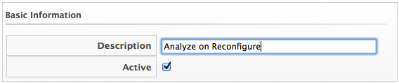
6.  Uncheck *Active* if you do not want this policy processed even when assigned to a resource.
7.  You can enter a *Scope* here (You can also create a scope as part of a condition, or not use one at all). If the host or virtual machine is not included in the scope, no actions will be run.
8.  In the *Notes* area, add a detailed explanation of the policy.
9.  Click *Add*. You are brought to the page where you add conditions and events to your new policy.
+
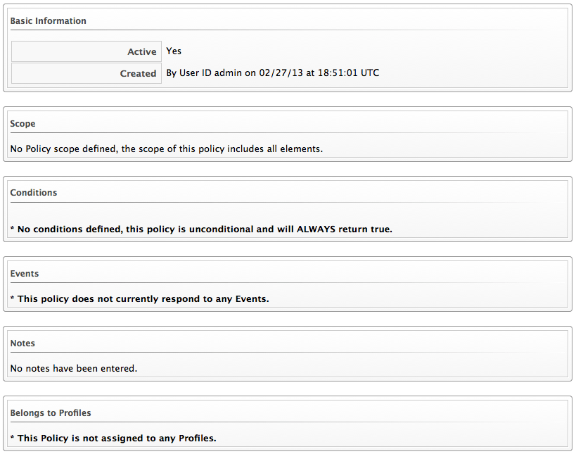
10. Click image:images/1847.png[image] (*Configuration*) to associate conditions, events, and actions with the policy.

==== Editing Basic Information, Scope, and Notes for a Policy

As your enterprise's needs change, you can change the name of a policy or its scope. If the items being evaluated are out of scope, policy processing stops and no actions run.

1.  Navigate to *Control* → *Explorer*.
2.  Click the *Policies* accordion, and select the policy to edit.
3.  Click image:images/1847.png[image] (*Configuration*), image:images/1851.png[image] (*Edit Basic Info, Scope, and Notes*).
4.  In the *Scope* area, create a general condition based on a simple attribute. Or, click on an existing expression to edit it. Based on what you choose, different options appear. Recall that a scope is optional for a policy.
+
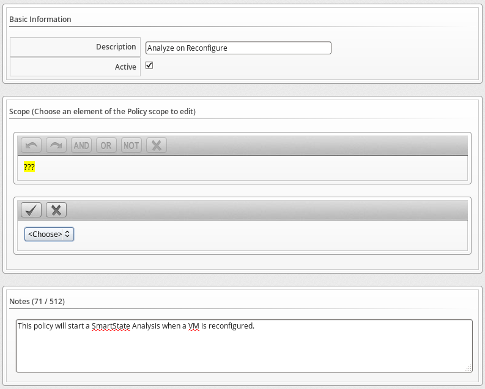
* Click *Field* to create criteria based on field values.
+
image:images/1854.png[image]
* Click *Count of* to create criteria based on the count of something, such as the number of snapshots for a virtual machine, or the number of virtual machines on a host.
+
image:images/1855.png[image]
* Click *Tag* to create criteria based on tags assigned to your resources. For example, you can check the power state of a virtual machine or see if it is tagged as production.
+
image:images/1856.png[image]
* Click *Find* to seek a particular value, and then check a property. For example, finding the `Admin` account and checking that it is enabled. Use the following check commands:
** *Check Any*: The result is true if one or more of the find results satisfy the check condition.
** *Check All*: All of the find results must match for a true result.
** *Check Count*: If the result satisfies the expression in check count, the result is true.
+
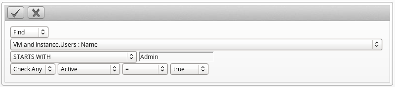
* Click *Registry* to create criteria based on registry values. For example, you can check if DCOM is enabled on a Windows System. Note that this applies only to Windows operating systems. Registry will only be available if you are editing a VM Control Policy.
+
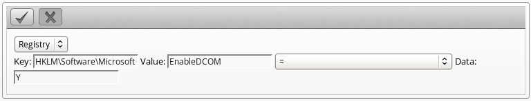
5.  Click  (*Commit Expression Element Changes*) to add the scope.
6.  In the *Notes* area, make the required changes.
7.  Click *Save*.

==== Copying a Policy

You can copy a policy if its contents are similar to a new one that you want to create, then change the condition or event associated with it. This enables you to make new policies efficiently.

1.  Navigate to *Control* → *Explorer*.
2.  Click the *Policies* accordion, and select the policy you want to copy.
+
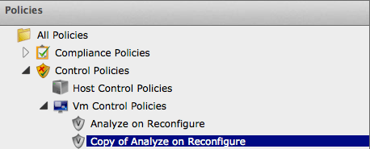
3.  Click image:images/1847.png[image] (*Configuration*),  (*Copy this Policy to new Policy*).
4.  Click *OK* to confirm.

The new policy is created with a prefix of `Copy of` in its description, and it can be viewed in the *Policy* accordion.

==== Deleting a Policy

You can remove policies that you no longer need. You can only remove policies that are not assigned to a policy profile.

1.  Navigate to *Control* → *Explorer*.
2.  Click the *Policies* accordion, and select the policy you want to remove.
3.  Click image:images/1847.png[image] (*Configuration*), image:images/1861.png[image] (*Delete this Host/VM and Instance Policy*).
4.  Click *OK* to confirm.

==== Creating a New Policy Condition

If you have not already created a condition to use with this policy, you can create one directly from inside the policy. A condition can contain two elements, a scope, and an expression. The expression is mandatory, but the scope is optional. A scope is a general attribute that is quickly checked before evaluating a more complex expression. You can create a scope at either the policy or condition level.

1.  Navigate to *Control* → *Explorer*.
2.  Click the *Policies* accordion, and select the policy you want to create a new condition for.
3.  Click image:images/1847.png[image] (*Configuration*),  (*Create a new Condition assigned to this Policy*).
4.  Type in a *Description* for the condition. It must be unique to all the conditions.
+
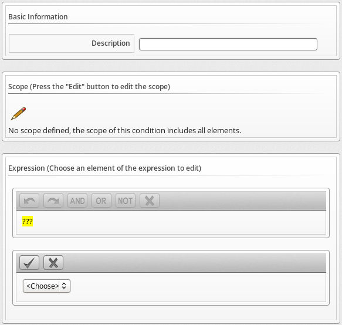
5.  Click image:images/1851.png[image] (*Edit this Scope*) in the *Scope* area to create a general expression based on a simple attribute, such as operating system version. Based on what you choose, different options display. Scope is optional.
* Click *Field* to create criteria based on field values.
+
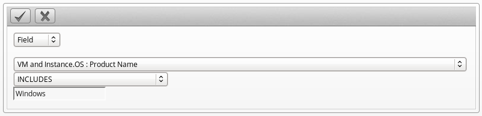
* Click *Count of* to create criteria based on the count of something, such as the number of snapshots for a virtual machine, or the number of virtual machines on a host.
+
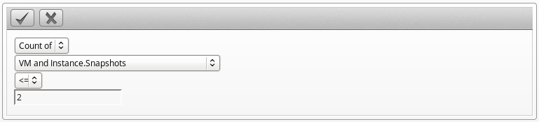
* Click *Tag* to create criteria based on tags assigned to your resources. For example, you can check the power state of a virtual machine or see if it is tagged as production.
+
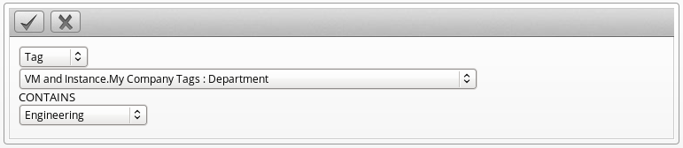
* Click *Find* to seek a particular value, and then check a property. For example, finding the Admin account and checking that it is enabled. Use the following check commands:
** *Check Any*: The result is true if one or more of the find results satisfy the check condition.
** *Check All*: All of the find results must match for a true result.
** *Check Count*: If the result satisfies the expression in check count, the result is true.
+
image:images/1868.png[image]
* Click *Registry* to create criteria based on registry values. For example, you can check if DCOM is enabled on a Windows System. Note that this applies only to Windows operating systems. Registry is only available if you are creating a VM Control Policy.
+
image:images/1869.png[image]
6.  Click  (*Commit expression element changes*) to add the scope.
7.  Click image:images/1851.png[image] (*Edit this Expression*) in the *Expression* area. Based on what you choose, options display as per the choices presented in the *Scope* area detailed above.
8.  Click  (*Commit Expression Element Changes*) to add the expression.
9.  In *Notes*, type in a detailed explanation of the condition.
10. Click *Add*.

The condition is created and is assigned directly to the policy. Note that the condition can be assigned to other policies.

==== Editing Policy Condition Assignments

Use this procedure to use a condition that has already been created either separately or as part of another policy. You can also remove a condition from a policy that no longer applies.

1.  Navigate to *Control* → *Explorer*.
2.  Click the *Policies* accordion, and select the policy you want to assign conditions to.
3.  Click image:images/1847.png[image] (*Configuration*),  (*Edit this Policy's Condition assignments*).
4.  From the *Condition Selection* area, you can assign conditions to the policy, remove all conditions from the policy, or remove specific conditions from the policy.
+
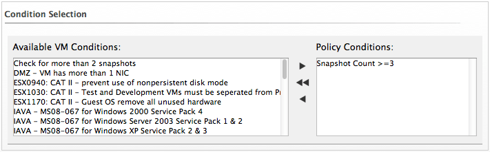
* To add one or some conditions, select all the conditions you want to apply from the *Available Conditions* box. Use *Ctrl* to add multiple conditions to a policy. Then, click  (*Move selected Conditions into this Policy*).
* Click  (*Remove all Conditions from this Policy*) to unassign any conditions from this policy.
* To remove one or some conditions, select all the conditions you want to remove from the *Policy Conditions* box. Use *Ctrl* to select multiple conditions. Then, click image:images/1878.png[image] (*Remove selected Conditions from this Policy*)
5.  Click *Save*.

==== Editing Policy Event Assignments

The policy evaluates its scopes and conditions when specified events occur in your virtual infrastructure. This procedure enables you to select those events and the actions that should occur based on the evaluation of the scopes and conditions for the policy.

1.  Navigate to *Control* → *Explorer*.
2.  Click the *Policies* accordion and select the control policy you want to assign events to.
3.  Click image:images/1847.png[image] (*Configuration*), image:images/1880.png[image] (*Edit this Policy's Event assignments*).
4.  Check all the events you want to assign to this policy. For a description of the events, see _Events_.
5.  Click *Save*.

==== Assigning an Action to an Event

This procedure describes how to assign an action to an event.

1.  Navigate to *Control* → *Explorer*.
2.  Click the *Policies* accordion, and select the policy you want to assign actions to.
3.  From the *Events* area, click on the description of the event you want to assign an action to.
4.  Click image:images/1847.png[image] (*Configuration*), image:images/1881.png[image] (*Edit Actions for this Policy Event*).
5.  Select all the appropriate actions from the *Available Actions* box, inside the *Order of Actions if ALL Conditions are True*. These are the actions that will take place if the resources meet the Condition of the Policy.
+
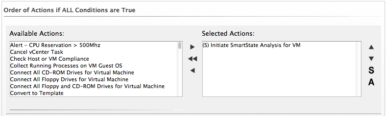
+
NOTE: Each selected action can be executed synchronously or asynchronously; synchronous actions will not start until the previous synchronous action is completed, and asynchronous action allows the next action to start whether or not the first action has completed. Also, at least one ManageIQ server in the ManageIQ zone must have the notifier server role enabled for the trap to be sent.
6.  Click the add button (  ), then:
* Click the action, then click  (*Set selected Actions to Asynchronous*) to make it asynchronous.
* Click the action, then click 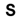 (*Set selected Actions to Synchronous*) to make it synchronous. If creating a synchronous action, use the up and down arrows to identify in what order you want the actions to run.
7.  Select all the actions from the appropriate *Available Actions* box, inside of the *Order of Actions if ANY Conditions are False*. These are the actions that take place if the resources do not meet the condition of the policy.
8.  Click *Save*.

=== Compliance Policies

Compliance policies are specifically designed to secure your environment by checking conditions that you create. These conditions can include the same conditions that you would use in a control policy, and most of the procedures are the same. However, a compliance policy automatically assigns the mark as a compliant action when the virtual machine or host passes all of the conditions. If any of the conditions are not met, then the virtual machine or host is marked as non-compliant. The compliance status is shown in the summary screen for the virtual machine or host and on the compare and drift screens.

==== Creating a Compliance Policy

Create compliance policies by assigning or creating a condition. ManageIQ automatically assigns the events and actions to the compliance policy as opposed to a control policy where you must define this yourself. The VM or host compliance check event is assigned to the compliance policy. A compliance policy runs the mark as compliant action when the virtual machine or host passes all of the conditions. If any of the conditions are not met, then the virtual machine or host is marked as non-compliant.

If you do not know how to create a condition, see Section 2.1.5, “Creating a New Policy Condition”. Carefully plan the purpose of your policy before creating it. You can also use a scope expression that is tested immediately when the compliance check event triggers the policy. If the item is out of scope, then the policy does not continue on to the conditions, and none of the associated actions run.

1.  Navigate to *Control* → *Explorer*.
2.  Click on the *Policies* accordion, and select VM or host compliances policies.
3.  Click image:images/1847.png[image] (*Configuration*), image:images/1848.png[image] (*Add a new Compliance Policy*).
4.  Type in a *Description* for the policy.
+
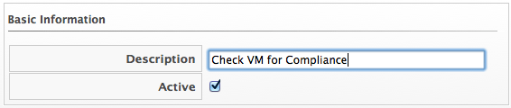
5.  Uncheck *Active* if you do not want this policy processed even when assigned to a resource.
6.  You can enter a scope here. (You can also create a scope as part of a condition, or not use one at all.) If the host or virtual machine is not included in the scope, NO actions run.
7.  In the *Notes* area, add a detailed explanation of the policy.
8.  Click *Add*.
9.  Click image:images/1847.png[image] (*Configuration*),  (*Edit this Policy's Condition assignments*).
10. Select the required conditions from the *Available Conditions* box. Use the *Ctrl* key to select multiple actions.
+
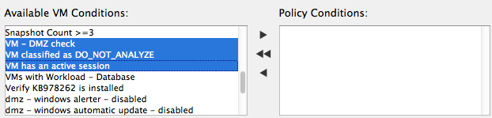
11. Click  (*Move selected Conditions into this Policy*).
12. Click *Save*. By default, if ANY of the conditions are false, the virtual machine is marked as non-compliant.
13. To add other actions, such as sending an email if the virtual machine fails the compliance test, click *VM Compliance Check*.
14. Click image:images/1847.png[image] (*Configuration*), image:images/1881.png[image] (*Edit Actions for this Policy Event*).
15. Select *Stop Virtual Machine* and *Send Email* from the *Available Actions* area in *Order of Actions if ANY conditions are False*. (*Mark as Non-Compliant* should already be selected.)
+
image:images/1933.png[image]
16. Click  (*Move selected Actions into this Event*).
17. Click *Add*.

You can now make this part of a policy profile. After assigning the policy profile to the virtual machine, you can check it for its compliance status either on a schedule or on demand.

==== Creating a Compliance Condition to Check Host File Contents

ManageIQ Control provides the ability to create a compliance condition that checks file contents. Use this to be sure that internal operating system settings meet your security criteria. Regular expressions are used to create the search pattern. Test your regular expressions thoroughly before using them in a production environment.

Note that to search file contents you will need to have collected the file using a host analysis profile. See the _ManageIQ Insight Guide_ for instructions.

1.  Navigate to *Control* → *Explorer*.
2.  Click the *Conditions* accordion, and select *Host Conditions*.
3.  Click image:images/1847.png[image] (*Configuration*), image:images/1848.png[image] (*Add a New Host Condition*).
4.  In *Basic Information*, type in a *Description* for the condition.
+
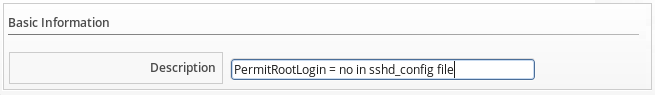
5.  Editing the *Scope* area is not necessary for this procedure. Skip editing any *Scope* conditions.
6.  If the *Expression* area is not automatically opened, click image:images/1851.png[image] (*Edit this Expression*), then edit the condition area to create a general condition based on a simple attribute. Based on what you choose, different options appear.
* Click *Find*, then *Host.Files : Name*, and the parameters to select the file that you want to check.
* Click *Check Any*, *Contents*, *Regular Expression Matches*, and type the expression. For example, if you want to make sure that permit root login is set to no, type `^\s*PermitRootLogin\s+no`.
+
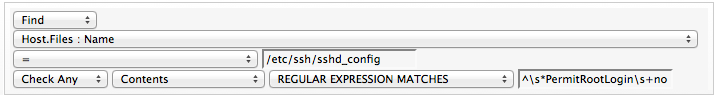
7.  Click  (*Commit expression element changes*) to add the expression.
8.  In *Notes* area, type in a detailed explanation of the condition.
9.  Click *Add*.

==== Checking for Compliance

After you have created your compliance policies and assigned them to a policy profile, you can check compliance in two ways. You can either schedule the compliance check or perform the check directly from the summary screen.

The compliance check runs all compliance policies that are assigned to the host or virtual machine. If the item fails any of the checks, it is marked as non-compliant in the item's summary screen.

NOTE: To schedule, you must have `EvmRole-administrator` access to the ManageIQ server.

===== Scheduling a Compliance Check

1.  Navigate to *Configure* → *Configuration*
2.  Click the *Settings* accordion, and select *Schedules*.
3.  Click image:images/1847.png[image] (*Configuration*), image:images/1848.png[image] (*Add a new Schedule*).
4.  In the *Basic Information* area, type in a name and description for the schedule.
+
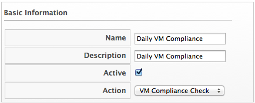
5.  Check *Active* if you want to enable this scan.
6.  From the *Action* dropdown, select the type of compliance check you want to schedule. Depending on the type of analysis you choose, you are presented with one of the following group boxes:
* If you choose *VM Compliance Check*, you are presented with *VM Selection* where you can choose to check all VMs, all VMs for a specific provider, all VMs for a cluster, all VMs for a specific host, a single VM, or you can select VMs using a global filter.
+
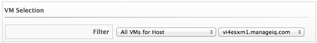
* If you choose *Host Compliance Check*, you are presented with *Host Selection* where you can choose to analyze all hosts, all hosts for a specific provider, all hosts for a cluster, a single host, or you can select hosts using a global filter.
+
NOTE: You can only schedule a host analysis for connected virtual machines, not repository virtual machines that were discovered through that host. Since repository virtual machines do not retain a relationship with the host that discovered them, there is no current way to scan them through the scheduling feature. The host is shown because it may have connected virtual machines in the future when the schedule is set to run.
7.  In the *Timer* area, click the *Run* dropdown to specify how often you want the analysis to run. Your options after that depend on which run option you choose.
+
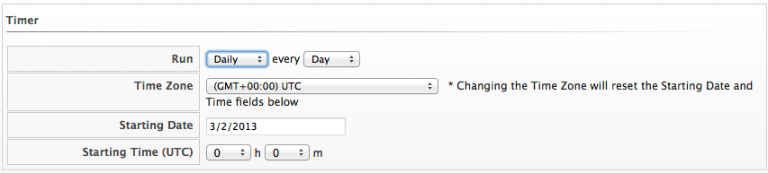
* Select *Once* to have the analysis run just one time.
* Select *Daily* to run the analysis on a daily basis. You are prompted to select how many days you want between each analysis.
* Select *Hourly* to run the analysis hourly. You are prompted to select how many hours you want between each analysis.
8.  Select the time zone for the schedule.
9.  Type or select a date to begin the schedule in *Starting Date*.
10. Select a starting time based on a 24-hour clock in the selected time zone.
11. Click *Add*.

===== Checking a Virtual Machine for Compliance from the Summary Screen

1.  Navigate to *Infrastructure* → *Virtual Machines*, click the virtual machine you want to check for compliance.
2.  Click image:images/1941.png[image] (*Policy*), and then  (*Check Compliance of Last Known Configuration*).
3.  A confirmation message appears. Click *OK*.
4.  If it says *Available* next to *History* you can click it to view the compliance history.
+
image:images/1943.png[image]

===== Checking a Host for Compliance from the Summary Screen

1.  Navigate to *Infrastructure* → *Hosts*, click the host you want to check for compliance.
2.  Click image:images/1941.png[image] (*Policy*), and then  (*Check Compliance of Last Known Configuration*) or  (*Analyze then Check Compliance*).
3.  To view the compliance history, click *Available* next to *History*.
+
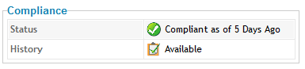

Events are triggers that cause a condition to be tested. ManageIQ Control provides several Events, that can be divided into functional types. Events cannot be modified.

*Table 3.1. Event Types*

[width="100%",cols="<50%,<50%",options="header",]
|=====================================================================================================================================================================================================================
|Category |Description
|Datastore Operation |Events related to datastore analysis.
|Authentication Validation |Events related to credential validation for hosts and providers.
|Company Tag |Events related to assigning and removing company tags from an infrastructure object.
|Compliance |Events related to checking compliance policies.
|Host Operation |Events related to the connection state of a host and status of a SmartState Analysis on a host.
|VM Configuration |Events associated with a change in configuration of a virtual machine. These include, but are not limited to, clone, create, template create, and settings change.
|VM Lifecycle |Events such as VM discovery, provisioning, and VM retirement.
|VM Operation |Events associated with power states or locations of virtual machines and virtual desktop machines. These include, but are not limited to, power off, power on, reset, resume, VM shutdown, and suspend.
|=====================================================================================================================================================================================================================

 +

Each type has a set of events that you can select to trigger the checking of a condition.

*Table 3.2. Events and Descriptions*

[width="100%",cols="<50%,<50%",options="header",]
|========================================================================================================================================================================================================================================================================
|Event |Description
|Datastore Analysis Complete |Check the condition when a SmartState Analysis of datastore completes.
|Datastore Analysis Request |Check the condition when a SmartState Analysis for a datastore is requested from the ManageIQ console.
|Host Added to Cluster |Check the condition when a host is added to a cluster.
|Host Analysis Complete |Check the condition when a SmartState Analysis of host completes.
|Host Analysis Request |Check the condition when a SmartState Analysis is requested from the ManageIQ console.
|Host Auth Changed |Check the condition when host authentication credentials are changed in the ManageIQ console.
|Host Auth Error |Check the condition if there is any other error connecting to the host such as ssh/vim handshaking problems, timeouts, or any other uncategorized error.
|Host Auth Incomplete Credentials |Check the condition if host authentication credentials are not complete in the ManageIQ console.
|Host Auth Invalid |Check the condition if ManageIQ is able to communicate with the host and the credentials fail.
|Host Auth Unreachable |Check the condition if ManageIQ is unable to communicate with the host.
|Host Auth Valid |Check the condition when the host authentication credentials entered in the ManageIQ console are valid.
|Host C & U Processing Complete |Check the condition when the processing of capacity and utilization data has finished.
|Host Compliance Check |Check the condition when a compliance check is performed on a host.
|Host Compliance Failed |Check the condition when a host fails a compliance check.
|Host Compliance Passed |Check the condition when a host passes a compliance check.
|Host Connect |Check the condition when a host connects to a provider.
|Host Disconnect |Check the condition when a host disconnects from a provider.
|Host Removed from Cluster |Check the condition when a host is removed from a cluster.
|Provider Auth Changed |_For use only with ManageIQ automate, for future use in policies._ Check the condition when provider authentication credentials are changed in the ManageIQ console.
|Provider Auth Error |_For use only with ManageIQ automate, for future use in policies._ Check the condition if there is any other error connecting to the provider such as ssh/vim handshaking problems, timeouts, or any other uncategorized error.
|Provider Auth Incomplete Credentials |_For use only with ManageIQ automate, for future use in policies._ Check the condition if provider authentication credentials are not complete in the ManageIQ console.
|Provider Auth Invalid |_For use only with ManageIQ automate, for future use in policies._ Check the condition if ManageIQ is able to communicate with the provider and the credentials fail.
|Provider Auth Unreachable |_For use only with ManageIQ automate, for future use in policies._ Check the condition if ManageIQ is unable to communicate with the provider.
|Provider Auth Valid |_For use only with ManageIQ automate, for future use in policies._ Check the condition when the provider authentication credentials entered in the ManageIQ console are valid.
|Service Provision Complete |Check the condition when the service provision is complete.
|Service Retired |Check the condition when the service has been retired.
|Service Retirement Warning |Check the condition when the service is about to retire.
|Service Start Request |Check the condition when the service has been requested to start.
|Service Started |Check the condition when the service has started.
|Service Stop Request |Check the condition when the service has been requested to stop.
|Service Stopped |Check the condition when the service has stopped.
|Tag Complete |Check the condition after a company tag is assigned.
|Tag Parent Cluster Complete |Check the condition after a company tag is assigned to the virtual machines parent cluster.
|Tag Parent Datastore Complete |Check the condition after a company tag is assigned to the virtual machines parent datastore.
|Tag Parent Host Complete |Check the condition after a company tag is assigned to the virtual machines parent host.
|Tag Parent Resource Pool Complete |Check the condition after a company tag is assigned to the virtual machines parent resource pool.
|Tag Request |Check the condition when assignment of a company tag is attempted.
|Un-Tag Complete |Check the condition when a company tag is removed.
|Un-Tag Parent Cluster Complete |Check the condition after a company tag is removed from the virtual machines parent cluster.
|Un-Tag Parent Datastore Complete |Check the condition after a company tag is removed from the virtual machines parent datastore.
|Un-Tag Parent Host Complete |Check the condition after a company tag is removed from the virtual machines parent host.
|Un-Tag Parent Resource Pool Complete |Check the condition after a company tag is assigned to the virtual machines parent resource pool.
|Un-Tag Request |Check the condition when an attempt is made to remove a company tag.
|VDI Connecting to Session |Check the condition when a VDI session is started.
|VDI Disconnected from Session |Check the condition when a VDI session is disconnected.
|VDI Login Session |Check the condition when a user logs on to a VDI session.
|VDI Logoff Session |Check the condition when a user logs off from a VDI session.
|VM Analysis Complete |Check the condition when a SmartState Analysis of virtual machine completes.
|VM Analysis Failure |Check the condition when a SmartState Analysis of virtual machine fails.
|VM Analysis Request |Check the condition when a SmartState Analysis is requested from the ManageIQ console.
|VM Analysis Start |Check the condition when a SmartState Analysis of virtual machine is started.
|VM C & U Processing Complete |Check the condition when the processing of capacity and utilization data has finished.
|VM Clone Complete |Check the condition when a virtual machine is cloned.
|VM Clone Start |Check the condition when a virtual machine clone is started.
|VM Compliance Check |Check the condition when a compliance check is performed on a host.
|VM Compliance Failed |Check the condition when a host fails a compliance check.
|VM Compliance Passed |Check the condition when a host passes a compliance check.
|VM Create Complete |Check the condition when a virtual machine is created.
|VM Delete (from Disk) Request |Check the condition when someone tries to delete a virtual machine from disk from the ManageIQ console.
|VM Discovery |Check the condition when ManageIQ discovers a virtual machine.
|VM Guest Reboot |Check the condition when the virtual machine is rebooted.
|VM Guest Reboot Request |Check the condition when someone tries to reboot a virtual machine from the ManageIQ console.
|VM Guest Shutdown |Check the condition when the operating system of a virtual machine shuts down.
|VM Guest Shutdown Request |Check the condition when someone tries to shutdown the operating system of a virtual machine from the ManageIQ console.
|VM Live Migration (VMOTION) |Check the condition when a VMOTION is performed.
|VM Power Off |Check the condition when a virtual machine is turned off.
|VM Power Off Request |Check the condition when someone tries to power off a virtual machine from the ManageIQ console.
|VM Power On |Check the condition when a virtual machine is turned on.
|VM Power On Request |Check the condition when someone tries to turn on a virtual machine from the ManageIQ console.
|VM Provision Complete |Check the condition when a VM is provisioned.
|VM Remote Console Connected |Check the condition when the VM is connected to a remote console.
|VM Removal from Inventory |Check the condition when a virtual machine is unregistered.
|VM Removal from Inventory Request |Check the condition when a request is sent from the ManageIQ console to unregister a virtual machine.
|VM Reset |Check the condition when a virtual machine is restarted.
|VM Reset Request |Check the condition when a virtual machine is restarted from the ManageIQ console.
|VM Retired |Check the condition when a virtual machine is retired.
|VM Retirement Warning |Check the condition when a warning threshold is reached for retirement.
|VM Settings Change |Check the condition when the settings of virtual machine are changed.
|VM Snapshot Create Complete |Check the condition when a snapshot is completed.
|VM Snapshot Create Request |Check the condition when someone tries to create a snapshot of a virtual machine from the ManageIQ console.
|VM Snapshot Create Started |Check the condition when a snapshot creation is started.
|VM Standby of Guest |Check the condition when the operating system of a virtual machine goes to standby.
|VM Standby of Guest Request |Check the condition when someone tries to put the operating system of a virtual machine in standby from the ManageIQ console.
|VM Suspend |Check the condition when a virtual machine is suspended.
|VM Suspend Request |Check the condition when someone tries to suspend a virtual machine from the ManageIQ console.
|VM Template Create Complete |Check the condition when a virtual machine template is created.
|========================================================================================================================================================================================================================================================================

 +

== Conditions

Conditions are tests performed on attributes of virtual machines. A condition can contain two elements, a scope, and an expression. The expression is mandatory, but the scope is optional. A scope is a general attribute that is quickly checked before evaluating a more complex expression. For example, you might use a scope to check the operating system, and use an expression to check for a specific set of applications or security patches that only apply to the operating system referenced in the scope. If no conditions, scope or expression, are defined for a policy, the policy is considered unconditional and returns a true value.

=== Creating a Condition

You can create a condition either from within a policy screen or by going directly to the expression editor in the ManageIQ console. You need to define a description and an expression element. The expression element defines what criteria you want to use to test the condition.

1.  Navigate to *Control* → *Explorer*.
2.  Click the *Conditions* accordion, and select either *Host Conditions* or *VM Conditions*.
3.  Click image:images/1847.png[image] (*Configuration*), image:images/1848.png[image] (*Add a New Host*).
4.  Type in a *Description* for the condition.
+
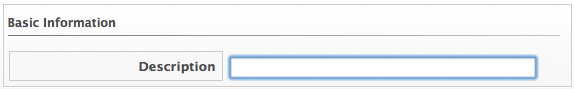
5.  Click image:images/1851.png[image] (*Edit this Scope*) in the *Scope* area to create a general condition based on a simple attribute. Based on what you choose, different options appear. Creating a scope is optional.
+
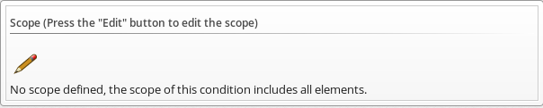
* Click *Field* to create criteria based on field values.
+
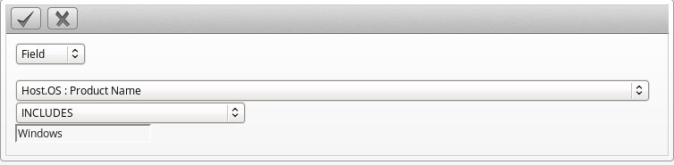
* Click *Count of* to create criteria based on the count of something, such as the number of network adapters on the host.
+
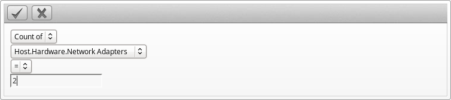
* Click *Tag* to create criteria based on tags assigned to your resources. For example, you can check the power state of a virtual machine or see if it is tagged as production.
+
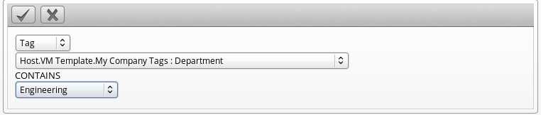
* Click *Find* to seek a particular value, and then check a property. For example, finding the Admin account and checking that it is enabled. Use the following check commands:
** *Check Any*: The result is true if one or more of the find results satisfy the check condition.
** *Check All*: All of the find results must match for a true result.
** *Check Count*: If the result satisfies the expression in check count, the result is true.
+
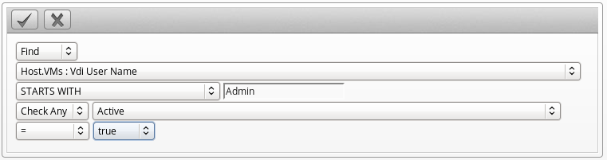
* Click *Registry* to create criteria based on registry values. For example, you can check if DCOM is enabled on a Windows System. Note that this applies only to Windows operating systems. Registry will only be available if you are creating a VM Condition.
+
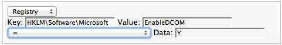
6.  Click  (*Commit Expression Element Changes*) to add the scope.
7.  Click image:images/1851.png[image] (*Edit this Condition*) in the *Expression* area to create a general condition based on a simple attribute. Based on what you choose, different options appear.
* Click *Field* to create criteria based on field values.
+
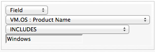
* Click *Count of* to create criteria based on the count of something, such as the number of snapshots for a virtual machine, or the number of virtual machines on a host.
+
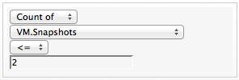
* Click *Tag* to create criteria based on tags assigned to your resources. For example, you can check the power state of a virtual machine or see if it is tagged as production.
+
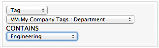
* Click *Find* to seek a particular value, and then check a property. For example, finding the Admin account and checking that it is enabled. Use the following check commands.
** *Check Any*: The result is true if one or more of the find results satisfy the check condition.
** *Check All*: All of the find results must match for a true result.
** *Check Count*: If the result satisfies the expression in check count, the result is true.
+
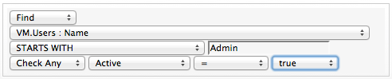
* Click *Registry* to create criteria based on registry values. For example, you can check if DCOM is enabled on a Windows System. Note that this applies only to Windows operating systems.
+
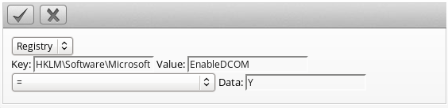
8.  Click  (*Commit Expression Element Changes*) to add the expression.
9.  In *Notes*, type in a detailed explanation of the condition.
10. Click *Add*.

=== Editing a Condition

Edit a condition to add more expressions to it or modify its properties. You can edit conditions that you have created.

1.  Navigate to *Control* → *Explorer*.
2.  Click the *Conditions* accordion, and click on the condition you want to edit.
3.  Click image:images/1847.png[image] (*Configuration*), image:images/1851.png[image] (*Edit this Condition*).
4.  Click in either the *Scope* or *Expression* area, and click the part of the condition to edit.
+
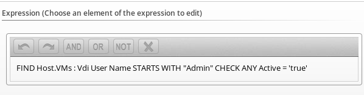
5.  Make any edits for the current expression.
* Click  (*Commit expression element changes*) to add the changes.
* Click image:images/1899.png[image] (*Undo the previous change*) to remove the change you just made.
* Click  (*Redo the previous change*) to put the change that you just made back.
* Click image:images/1901.png[image] (*AND with a new expression element*) to create a logical AND with a new expression element.
* Click 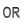 (*OR with a new expression element*) to create a logical OR with a new expression element.
* Click image:images/1903.png[image] (*Wrap this expression element with a NOT*) to create a logical NOT on an expression element
* Click  (*Remove this expression element*) to take out the current expression element.
6.  When you have made all of the changes to the condition, click *Save*.

=== Copying a Condition

You can copy a condition to create a similar condition, then change the values associated with it. You can copy the sample conditions provided to customize them to your environment.

1.  Navigate to *Control* → *Explorer*.
2.  Click the *Conditions* accordion, and select the condition you want to copy.
3.  Click image:images/1847.png[image] (*Configuration*),  (*Copy this Condition to a new Condition*).
4.  Make any changes you need for the new condition. The description must be unique to all conditions.
5.  Click *Add*.

=== Deleting a Condition

Remove conditions that are no longer applicable. You can only delete conditions that are not part of a policy. To be able to delete the condition, you must remove the policy first.

1.  Navigate to *Control* → *Explorer*.
2.  Click the *Conditions* accordion, and click on the condition you want to remove.
3.  Click image:images/1847.png[image] (*Configuration*), image:images/1861.png[image] (*Delete this VM and Instance Condition*).
4.  Click *OK* to confirm.

== Actions

Actions are performed after the condition is evaluated. ManageIQ Control comes with a set of default actions that you can choose from. You can also create some of your own.

*Table 5.1. Default Actions and Descriptions*

[width="100%",cols="<50%,<50%",options="header",]
|=========================================================================================================================================
|Action |Description
|Cancel vCenter Task |Stop current vCenter Task. Due to limitations of vCenter, this applies only to cloning tasks.
|Check Host or VM Compliance |Run compliance checks.
|Collect Running Processes on VM Guest OS |Collect the list of running processes from the guest operating system.
|Connect All CD-ROM Drives for Virtual Machine |Connect all the CD-ROM drives for the virtual Machine.
|Connect All Floppy Drives for Virtual Machine |Connect all the floppy drives for the virtual machine.
|Connect All Floppy and CD-ROM Drives for Virtual Machine |Connect all of the floppy and CD-ROM drives for virtual machine.
|Convert to Template |Convert this virtual machine to a template.
|Delete all Snapshots |Remove all snapshots for a virtual machine.
|Delete Most Recent Snapshot |Removes a virtual machine's most recent snapshot.
|Delete VM from Disk |Remove the virtual machine from disk.
|Disconnect All CD-ROM Drives for Virtual Machine |Disconnect all the CD-ROM drives for the virtual machine.
|Disconnect All Floppy Drives for Virtual Machine |Disconnect all the floppy drives for the virtual machine.
|Disconnect All Floppy and CD-ROM Drives for Virtual Machine |Disconnect all of the floppy and CD-ROM drives for virtual machine.
|Execute an external script |Run an external script.
|Generate Audit Event |Write an entry to the audit log and to the VMDB.
|Generate log message |Write an entry to the ManageIQ log.
|Initiate SmartState Analysis for Host |Start a SmartState Analysis for a host.
|Initiate SmartState Analysis for VM |Start a SmartState Analysis for a virtual machine.
|Mark as Non-Compliant |Used with compliance policies. Mark resource as non-compliant. (Compliance status is viewable in summary screens.)
|Prevent current event from proceeding |Stop the current event from continuing.
|Put Virtual Machine Guest OS in Standby |Put the virtual machines operating system in standby mode.
|Raise Automation Event |Used with ManageIQ automate.
|Refresh data from vCenter |Perform a refresh of the vCenter.
|Remove Virtual Machine from Inventory |Take the virtual machine out of inventory.
|Retire Virtual Machine |Retire the virtual machine. (It will remain in inventory, but cannot be started.)
|Shutdown Virtual Machines Guest OS |Shut down the virtual machine's operating system.
|Start Virtual Machine |Power on the virtual machine.
|Stop Virtual Machine |Power off the virtual machine.
|Suspend Virtual Machine |Suspend the virtual machine.
|=========================================================================================================================================

 +

=== Custom Actions

You can create a custom action using the ManageIQ console. Enter a description and action type. Procedures for each type of action are shown in the sections below. When you create a policy, you can associate actions with specific events.

*Table 5.2. Custom Actions and Descriptions*

[width="100%",cols="<50%,<50%",options="header",]
|================================================================================================================================================
|Custom Action |Description
|Assign Profile to Analysis Task |When initiating a Smart State Analysis event, you can assign a specific analysis profile.
|Create a Snapshot |Creates a snapshot with a name that you provide.
|Delete Snapshots by Age |Removes snapshots based on how old they are.
|Evaluate Alerts |Checks for alerts. This is required for the alert to be delivered.
|Inherit Parent Tags |Assigns tags from the parent cluster, host, datastore, or resource pool.
|Invoke a Custom Automation |For use with ManageIQ automate.
|Reconfigure CPUs |Reconfigure the number of CPUs for a virtual machine to the number you specify.
|Reconfigure Memory |Reconfigure the amount of memory for a virtual machine to the amount you specify.
|Remove Tags |Removes tags from the resource.
|Send an E-mail |Send an email to an address that you provide. This type of action can be used in an alert.
|Send an SNMP trap |Send an SNMP (Simple Network Management Protocol) trap to the host you specify. This type of action can be used for an alert.
|Set a Custom Attribute in vCenter |Set the value of a custom attribute in vCenter.
|Tag |Assign a company tag that you specify to a virtual machine.
|================================================================================================================================================

 +

==== Creating an Assign Profile to Analysis Task Action

Use this action for assigning specific analysis profiles to virtual machines. You must create an analysis profile before assigning it to an action. You can only assign this action to an analysis start event. See the _ManageIQ Settings and Operations Guide_ for information on how to create analysis profiles.

1.  Navigate to *Control* → *Explorer*.
2.  Click the *Actions* accordion, then click image:images/1847.png[image] (*Configuration*), image:images/1848.png[image] (*Add a new Action*).
3.  Type in a *Description* for the *Action Type*.
+
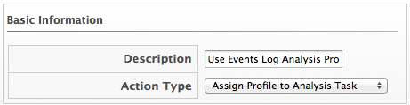
4.  Select *Assign Profile to Analysis Task* from *Action Type*.
5.  Select a profile from the *Analysis profiles*.
6.  Click *Add*.

==== Creating a Snapshot Action

1.  Navigate to *Control* → *Explorer*.
2.  Click the *Actions* accordion, then click image:images/1847.png[image] (*Configuration*), image:images/1848.png[image] (*Add a new Action*).
3.  Type in a *Description* for the action.
+
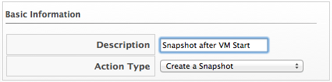
4.  Select *Create a Snapshot* from *Action Type*.
5.  Type in a *Snapshot Name*.
+
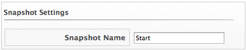
6.  Click *Add* when you are finished.

==== Deleting Snapshots by Age

1.  Navigate to *Control* → *Explorer*.
2.  Click the *Actions* accordion, then click image:images/1847.png[image] (*Configuration*), image:images/1848.png[image] (*Add a new Action*).
3.  Type in a *Description* for the action.
+
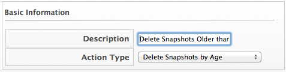
4.  Select *Delete Snapshots by Age* from *Action Type*.
5.  Select the age of snapshots to delete.
+
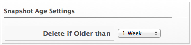
6.  Click *Add*.

==== Evaluating an Alert

1.  Navigate to *Control* → *Explorer*.
2.  Click the *Actions* accordion, then click image:images/1847.png[image] (*Configuration*), image:images/1848.png[image] (*Add a new Action*).
3.  Type in a *Description* for the action.
+
image:images/1911.png[image]
4.  Select *Evaluate Alerts* from *Action Type*.
5.  Select the alerts to be evaluated and click  (Move selected Alerts into this Action). Use the *Ctrl* key to select multiple alerts.
+
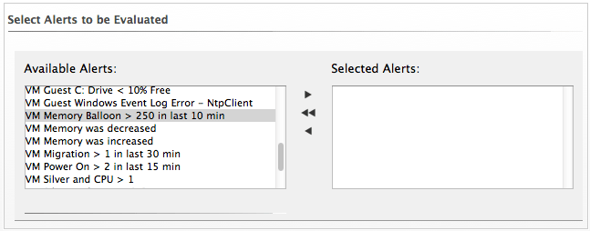
6.  Click *Add*.

==== Creating an Inherit Tag Action

1.  Navigate to *Control* → *Explorer*.
2.  Click the *Actions* accordion, and click image:images/1847.png[image] (*Configuration*), image:images/1848.png[image] (*Add a new Action*).
3.  Type in a *Description* for the action.
+
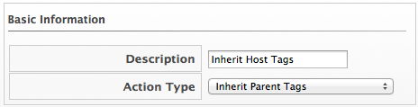
4.  Select *Inherit Parent Tag* from *Action Type*.
5.  Select the type of parent item to inherit from in *Parent Type*.
6.  Check all categories that you want inherited.
+
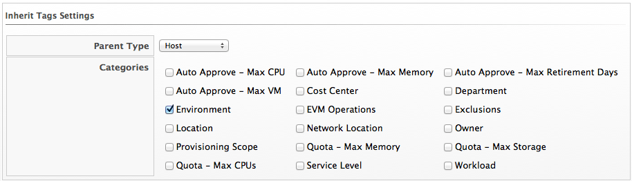
7.  Click *Add*.

==== Creating a CPU Reconfigure Action

1.  Navigate to *Control* → *Explorer*.
2.  Click the *Actions* accordion, then click image:images/1847.png[image] (*Configuration*), image:images/1848.png[image] (*Add a new Action*).
3.  Type in a *Description* for the action.
+
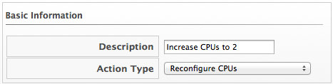
4.  Select *Reconfigure CPUs* from *Action Type*.
5.  Select a number from *Number of CPUs*.
+
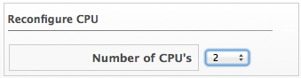
6.  Click *Add*.

==== Creating a Memory Reconfigure Action

1.  Navigate to *Control* → *Explorer*.
2.  Click the *Actions* accordion, then click image:images/1847.png[image] (*Configuration*), image:images/1848.png[image] (*Add a new Action*).
3.  Type in a *Description* for the action.
+
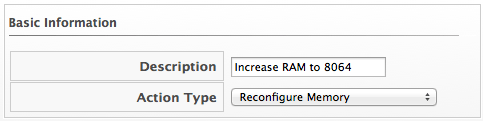
4.  Select *Reconfigure Memory* from *Action Type*.
5.  Type in a new value for *Memory Size*.
+
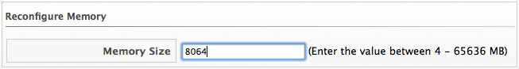
6.  Click *Add*.

==== Creating a Remove Tag Action

1.  Navigate to *Control* → *Explorer*.
2.  Click the *Actions* accordion, then click image:images/1847.png[image] (*Configuration*), image:images/1848.png[image] (*Add a new Action*).
3.  Type in a *Description* for the action.
+
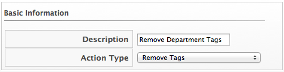
4.  Select *Remove Tags* from *Action Type*.
5.  Check the category of tags you want to remove.
+
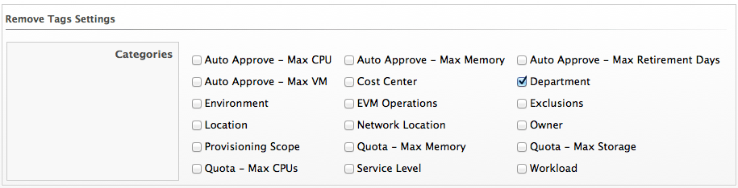
6.  Click *Add*.

==== Creating an E-mail Action

NOTE: To be able to send any emails from the ManageIQ server, you must have the notifier server role enabled and have defined settings for SMTP email in Configuration-Operations-Server. For further information regarding SMTP, see the Settings and Operations guide.

1.  Navigate to *Control* → *Explorer*.
2.  Click the *Actions* accordion, then click image:images/1847.png[image] (*Configuration*), image:images/1848.png[image] (*Add a new Action*).
3.  Type in a *Description* for the action.
+
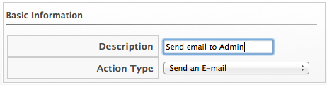
4.  Select *Send an E-mail* from *Action Type*.
5.  Type in a *From E-mail Address* and *To E-mail Address*.
+

6.  Click *Add*.

==== Creating an SNMP Action

1.  Navigate to *Control* → *Explorer*.
2.  Click the *Actions* accordion, then click image:images/1847.png[image] (*Configuration*), image:images/1848.png[image] (*Add a new Action*).
3.  Type in a *Description* for the action.
+

4.  Select *Send an SNMP Trap* from *Action Type*.
5.  image:images/1923.png[image]
+
Type in the IP for the host to send the trap to, select the version of SNMP that you are using, and type in the Trap Object ID. Type in multiple hosts if you require the trap sent to multiple SNMP hosts.
* If using SNMP V1, you are prompted for a Trap Number. Type 1, 2, or 3, based on the appropriate Suffix Number from table below.
* If using SNMP V2, you are prompted for a Trap Object ID. Type info, warning, or critical, based on the table below.
+
Trap Object ID and Suffix Number
+
[width="99%",cols="<34%,<33%,<33%",options="header",]
|================================================================
|Object ID |Suffix Number Added to PEN |PEN with the Suffix Added
|info |1 |1.3.6.1.4.1.33482.1
|warn, warning |2 |1.3.6.1.4.1.33482.2
|crit, critical, error |3 |1.3.6.1.4.1.33482.3
|================================================================
6.  Type in the variables that you require in your message.
7.  Click *Add*.

NOTE: When adding an SNMP action, be sure to set it as asynchronous.

==== Creating a Set Custom Attribute Action

The custom attribute must already exist in vCenter. See the vCenter documentation for instructions. In this example, an attribute called ManageIQ policy already exists.

1.  Navigate to *Control* → *Explorer*.
2.  Click the *Actions* accordion, then click image:images/1847.png[image] (*Configuration*), image:images/1848.png[image] (*Add a new Action*).
3.  Type in a *Description* for the action.
+

4.  Select *Set a Custom Attribute in vCenter* from *Action Type*.
5.  Type in the *Attribute Name* and *Value to Set*.
+

6.  Click *Add*.

==== Creating a Tag Action

1.  Navigate to *Control* → *Explorer*.
2.  Click the *Actions* accordion, then click image:images/1847.png[image] (*Configuration*), image:images/1848.png[image] (*Add a new Action*).
3.  Type in a description for the action.
+
image:images/1928.png[image]
4.  Select *Tag* from *Action Type*.
5.  Click on the appropriate tag to apply from the list provided.
+

6.  Click *Add*.

=== Editing an Action

Edit an action to modify its properties. You cannot edit any of the default actions supplied with ManageIQ. Only actions that you create can be changed.

Note that when you view an action, you can see what policies it has been assigned to.

1.  Navigate to *Control* → *Explorer*.
2.  Click the *Actions* accordion, then click on the action you need to edit.
3.  Click image:images/1847.png[image] (*Configuration*), image:images/1851.png[image] (*Edit this Action*) on the detail view of the action.
4.  Make any required changes.
5.  Click *Save*.

The action is modified and can be added to a policy. If the action is already party of a policy, the policy is automatically updated.

=== Deleting an Action

Delete unused actions to keep your environment uncluttered. You cannot delete default actions or actions that are currently assigned to a policy. The delete button is unavailable if the action is in use.

1.  Navigate to *Control* → *Explorer*.
2.  Click the *Actions* accordion, click on the action you need to remove.
3.  Click image:images/1847.png[image] (*Configuration*), image:images/1861.png[image] (*Delete this Action*) on the detail view of the tree.
4.  Click *OK* to confirm.

== Policy Profiles

=== Creating Policy Profiles

Policy profiles are groups of policies that you need to use at the same time. A policy profile can have one or more policies. Policy profiles can be assigned to either a host or a virtual machine.

1.  Navigate to *Control* → *Explorer*.
2.  Click on the *Policy Profiles* accordion, then click image:images/1847.png[image] (*Configuration*), then image:images/1848.png[image] (*Add a New Policy Profile*).
3.  In the *Basic Information* area, type in a unique description for the policy profile.
+

4.  From *Available Policies* in the *Policy Selection* area select all the policies you need to apply to this policy profile. Use the *Ctrl* key to select multiple policies.
+

5.  Click  to add the Policies.
+
image:images/1929.png[image]
6.  Add to the *Notes* area if required.
7.  Click *Add*.

The policy profile is added. You can now assign the policy profile to providers, hosts, and repositories. In addition, you can verify that the virtual machine complies with the policy profile using the _Resultant Set of Policy_ feature.

=== Deleting a Policy Profile

Remove policy profiles that you no longer need. This does not remove the policies associated with the policy profile.

1.  Navigate to *Control* → *Explorer*.
2.  Click on the *Policy Profile* accordion, then click the policy profile you want to remove.
3.  Click image:images/1847.png[image] (*Configuration*), image:images/1861.png[image] (*Remove this Policy Profile*).
4.  Click *OK* to confirm.

=== Simulating Policy

Before assigning a policy profile to a virtual machine, use the ManageIQ controls policy simulation feature to determine if a virtual machine passes a policy profile.

==== Simulating Policy Profiles on Virtual Machines

1.  Navigate to *Infrastructure* → *Virtual Machines*, select the virtual machines you need to evaluate.
2.  Click image:images/1941.png[image] (*Policy*), and then click  (*Policy Simulation*).
3.  From the *Select a Policy Profile to add* dropdown, click the policy you need to apply to the selected virtual machines.
+

4.  The virtual machine thumbnail displays in the *Policy Simulation* area.
* A check sign in the lower right quadrant of the virtual thumbnail shows that the virtual machine passes policy.
* A minus sign in the lower right quadrant of the virtual thumbnail shows that the virtual machine fails policy.
5.  Click on a virtual machine in the *Policy Simulation* area to see its details.
6.  Expand a policy profile by clicking on it to see its member policies and the status of the conditions.
* Check _`Show out of scope items`_ to show all conditions, whether or not the virtual machine passes the scope part of the condition. Uncheck it to hide conditions where the scope part fails.
* Next to _`Show policies`_, check _`Successful`_ to show policies that are passed and check _`Failed`_ to see the policies that have failed. The default is to show both.
* Items in green text passed the condition.
* Items in red text failed the condition.
* Items in red italics failed the condition, but do not change the outcome of the scope.

If you evaluate multiple policy profiles, you can see both policy profiles and a tree expanding down to their conditions.

=== Assigning Policy Profiles

After creating your policy profiles, you are ready to evaluate and assign them. Policy profiles are assigned to virtual machines, providers, clusters, hosts, resource pools, and repositories. Policies within a profile run either on a Host or virtual machine based on the type of policy created.

* Assign a policy profile to a virtual machine to apply the policy profile to a specific virtual machine, independent of its related host, provider, or repository.
* Assign a policy profile to a provider to apply the policy profile to all virtual machines or hosts registered to that provider.
* Assign a policy profile to a cluster to apply the policy profile to all virtual machines or hosts assigned to that cluster.
* Assign a VM policy profile to a host to apply the policy profile to that specific host or all virtual machines registered to that Host.
* Assign a VM policy profile to a resource pool to apply the policy profile to all virtual machines or hosts assigned to that resource pool.
* Assign a VM policy profile to a repository to apply the policy profile to all virtual machines registered to that repository.

==== Assigning Policy Profiles to a Provider

1.  Navigate to *Infrastructure* → *Providers*, verify the provider you need to assign the policy profiles to.
2.  Click image:images/1941.png[image] (*Policy*), and then click image:images/1952.png[image] (*Manage Policies*).
3.  From the *Select Policy Profiles* area, you can click on the triangle next to a desired policy profile to expand it and see its member policies.
4.  Check the policy profiles you require to apply to the provider. It turns blue to show its assignment state has changed.
5.  Click *Save*.

==== Removing Policy Profiles from a Provider

1.  Navigate to *Infrastructure* → *Providers*, check the providers you want to remove the policy profile from.
2.  Click image:images/1941.png[image] (*Policy*), and then click image:images/1952.png[image] (*Manage Policies*).
3.  Uncheck the policy profile you need to remove. It turns blue to show that its assignment state has changed.
4.  Click *Save*.

==== Assigning Policy Profiles to a Cluster

1.  Navigate to *Infrastructure* → *Clusters*, check the clusters you need to assign policy profiles to.
2.  Click image:images/1941.png[image] (*Policy*), and then click image:images/1952.png[image] (*Manage Policies*).
3.  From the *Select Policy Profiles* area, you can click on the triangle next to a desired policy profile to expand it and see its member policies.
4.  Check the policy profiles you need to apply to the cluster. It turns blue to show its assignment state has changed.
5.  Click *Save*.

==== Removing Policy Profiles from a Cluster

1.  Navigate to *Infrastructure* → *Clusters*, check the clusters you need to remove the policy profiles from.
2.  Click image:images/1941.png[image] (*Policy*), and then click image:images/1952.png[image] (*Manage Policies*).
3.  From the *Select Policy Profiles* area, you can click on the triangle next to a desired policy profile to expand it and see its member policies.
4.  Uncheck the policy profiles you need to remove. It turns blue to show that its assignment state has changed.
5.  Click *Save*.

==== Assigning Policy Profiles to a Host

1.  Navigate to *Infrastructure* → *Hosts*, check the hosts you need to assign policy profiles to.
2.  Click image:images/1941.png[image] (*Policy*), and then click image:images/1952.png[image] (*Manage Policies*).
3.  From the *Select Policy Profiles* area, click on the triangle next to a desired policy profile to expand it and see its member policies.
4.  Check the policy profiles you need to apply to the host. It turns blue to show its assignment state has changed.
5.  Click *Save*.

==== Removing Policy Profiles from a Host

1.  Navigate to *Infrastructure* → *Hosts*, check the hosts you need to remove the policy profiles from.
2.  Click image:images/1941.png[image] (*Policy*), and then click image:images/1952.png[image] (*Manage Policies*).
3.  Uncheck the policy profiles you need to remove. It turns blue to show that its assignment state has changed.
4.  Click *Save*.

==== Assigning Policy Profiles to a Virtual Machine

1.  Navigate to *Infrastructure* → *Virtual Machines*, check the virtual machines you need to assign policy profiles to.
2.  Click image:images/1941.png[image] (*Policy*), and then click image:images/1952.png[image] (*Manage Policies*).
3.  From the *Select Policy Profiles* area, click on the triangle next to a desired policy profile to expand it and see its member policies.
4.  Check the policy profiles you need to apply to the host. It will turn blue to show that its assignment state has changed.
5.  Click *Save*.

==== Removing Policy Profiles from a Virtual Machine

1.  Navigate to *Infrastructure* → *Virtual Machines*, check the virtual machines you want to remove the policy profile from.
2.  Click image:images/1941.png[image] (*Policy*), and then click image:images/1952.png[image] (*Manage Policies*).
3.  Uncheck the policy profile you need to remove. It turns blue to show that its assignment state has changed.
4.  Click *Save*.

==== Assigning Policy Profiles to a Resource Pool

1.  Navigate to *Infrastructure* → *Resource Pools*, check the resource pools you need to assign policy profiles to.
2.  Click image:images/1941.png[image] (*Policy*), and then click image:images/1952.png[image] (*Manage Policies*).
3.  From the *Select Policy Profiles* area, click on the triangle next to a desired policy profile to expand it and see its member policies.
4.  Click the policy profiles you need to apply to the resource pools. It turns blue to show its assignment state has changed.
5.  Click *Save*.

==== Removing Policy Profiles from a Resource Pool

1.  Navigate to *Infrastructure* → *Resource Pools*, check the resource pools you need to remove the policy profiles from.
2.  Click image:images/1941.png[image] (*Policy*), and then click image:images/1952.png[image] (*Manage Policies*).
3.  From the *Select Policy Profiles* area, click on the triangle next to a desired policy profile to expand it and see its member policies.
4.  Uncheck the policy profiles you need to remove. It turns blue to show that its assignment state has changed.
5.  Click *Save*.

==== Assigning Policies to a Repository

1.  Navigate to *Infrastructure* → *Repositories*, check the repositories you need to assign the policy profiles to.
2.  Click image:images/1941.png[image] (*Policy*), and then click image:images/1952.png[image] (*Manage Policies*).
3.  From the *Select Policy Profiles* area, click on the triangle next to a desired policy profile to expand it and see its member policies.
4.  Check the policy profiles you need to apply to the provider. It turns blue to show its assignment state has changed.
5.  Click *Save* to confirm.

==== Removing Policy Profiles from a Repository

1.  Navigate to *Infrastructure* → *Repositories*, check the repositories you need to remove the policy profile from.
2.  Click image:images/1941.png[image] (*Policy*), and then click image:images/1952.png[image] (*Manage Policies*).
3.  From the *Select Policy Profiles* area, click on the triangle next to a desired policy profile to expand it and see its member policies.
4.  Uncheck the policy profile you need to remove. It turns blue to show that its assignment state has changed.
5.  Click *Save*.

==== Assigning Policy Profiles to a Cloud Provider

1.  Navigate to *Clouds* → *Providers*, check the provider you need to assign the policy profiles to.
2.  Click image:images/1941.png[image] (*Policy*), and then click image:images/1952.png[image] (*Manage Policies*).
3.  From the *Select Policy Profiles* area, click on the triangle next to a desired policy profile to expand it and see its member policies.
4.  Check the policy profiles you need to apply to the provider. The ones that are different from the previous setting will show in blue.
5.  Click *Save*.

==== Removing Policy Profiles from a Cloud Provider

1.  Navigate to *Clouds* → *Providers*, check the providers you need to remove the policy profile from.
2.  Click image:images/1941.png[image] (*Policy*), and then click image:images/1952.png[image] (*Manage Policies*).
3.  From the *Select Policy Profiles* area, click on the triangle next to a desired policy profile to expand it and see its member policies.
4.  Uncheck the policy profile you need to remove. It turns blue to show that its assignment state has changed.
5.  Click *Save*.

==== Assigning Policy Profiles to an Instance

1.  From *Clouds* → *Instances*, check the instances you want to assign policy profiles to.
2.  Click image:images/1941.png[image] (*Policy*), and then click image:images/1952.png[image] (*Manage Policies*).
3.  From the *Select Policy Profiles* area, click on the triangle next to a desired policy profile to expand it and see its member policies.
4.  Check the policy profiles you want to apply to the instances. It turns blue to show its assignment state has changed.
5.  Click *Save*.

==== Removing Policy Profiles from an Instance

1.  Navigate to *Clouds* → *Instances*, check the instances you need to remove the policy profile from.
2.  Click image:images/1941.png[image] (*Policy*), and then click image:images/1952.png[image] (*Manage Policies*).
3.  From the *Select Policy Profiles* area, click on the triangle next to a desired policy profile to expand it and see its member policies.
4.  Uncheck the policy profile you need to remove. It turns blue to show that its assignment state has changed.
5.  Click *Save*.

=== Disabling a Policy in a Policy Profile

You can disable one policy in a profile without removing it from the policy, perhaps for trouble shooting purposes or because the policy is not required temporarily.

1.  Navigate to *Control* → *Explorer*.
2.  Click the *Policies* accordion, then navigate to the policy that you need to disable or navigate to the policy from the policy profile.
3.  Click image:images/1847.png[image] (*Configuration*), image:images/1851.png[image] (*Edit Basic Info, Scope, Notes*).
4.  Uncheck *Active*.
5.  Click *Save*.

=== Viewing Policy Simulation - Resultant Set of Policy (RSOP)

After the Policy Profiles are assigned, you can see the final result of the resolution of all policies based on which Events occur. Based on the result, you can adjust your Policies. To view RSOP, go to the control area in the ManageIQ console.

1.  Navigate to *Control* → *Simulation*.
2.  From the *Event Selection* area, select a type of event, and then the specific event you need the result for.
+

3.  From the *VM Selection* area, select the virtual machine from a provider, cluster, host, or a single virtual machine.
+

4.  Click *Submit*.

== Alerts

ManageIQ Alerts are used to notify administrators and monitoring systems on critical configuration changes and threshold limits in your virtual environment. The notification can take the form of an email or an SNMP trap. In addition, you can also invoke an automate process. ManageIQ provides you with some Alerts including Alerts specifically created for ManageIQ operations, but also enables you to create your own.

=== Notifier Server Role

ManageIQ also has a server role called Notifier specifically created for forwarding SNMP Traps and SMTP emails. If more than one ManageIQ server in a specific ManageIQ zone has this role, only one is active at a time.

NOTE: To be able to send an email from the ManageIQ Server, you must have the Notifier enabled. To enable this, you must have the `EvmRole-administrator` role.

=== Assigning the Notifier Role

1.  Navigate to *Configure* → *Configuration*.
2.  Click the *Settings* accordion, and select the ManageIQ server.
3.  From the *Server Control* tab, check the *Notifier* role.
+

4.  Click *Save*.

=== Creating an Alert

In this section, the basics of creating an Alert are described. Detailed instructions for the specific types of Alerts are given in the sections following.

1.  Navigate to *Control* → *Explorer*.
2.  Click on the *Alerts* accordion, then click image:images/1847.png[image] (*Configuration*), image:images/1848.png[image] (*Add a new Alert*).
1.  Type in a description for the alert.
2.  Check *Active* when you feel that the alert is ready to be enabled.
3.  From *Based On*, select the type of infrastructure item to base the alert on.
4.  The options shown in *What to Evaluate* change based on what you selected in *Based On*.
5.  In *Notification Frequency*, select how often you want to be notified if the event log threshold is reached.
3.  The parameters available are based on the *What to Evaluate* selection. See the following sections for additional details on each alert type.
4.  To send an email, check *Send an E-mail*. Parameters required for sending an email are displayed.
+

1.  In *From*, type in the sending email.
2.  Use *Add a ManageIQ User* to select a user. The ManageIQ user must have a valid email address entered under accounts.
3.  Use *Add (enter manually)* to type in the address not registered to a ManageIQ user. Then, click image:images/1848.png[image] (*Add*).
5.  If you check *Send an SNMP Trap*, type in the IP for the host to send the trap to, select the version of SNMP that you are using, and type in the Trap Object ID. Type in multiple hosts if you need the trap sent to multiple SNMP hosts.
* If using SNMP V1, you will be prompted for a Trap Number. Type 1, 2, or 3, based on the appropriate suffix number from table below.
* If using SNMP V2, you will be prompted for a Trap Object ID. Type info, warning, or critical, based on the table below.
* Trap Object ID and suffix number
+
[width="99%",cols="<34%,<33%,<33%",options="header",]
|================================================================
|Object ID |Suffix Number Added to PEN |PEN with the Suffix Added
|info |1 |1.3.6.1.4.1.33482.1
|warn, warning |2 |1.3.6.1.4.1.33482.2
|crit, critical, error |3 |1.3.6.1.4.1.33482.3
|================================================================
+

6.  To show the alert as an event on the ManageIQ timeline, check *Show on Timeline*. It shows as part of the Alarm/Status Change/Errors category.
7.  To invoke automation, check *Send a Management Event*. Type in the name of the event. This item exists in the *Process/Event Class*.
8.  Click *Add*.

=== Virtual Machine and Instance Alerts

For virtual machines, you can create alerts based on an event log threshold, an event threshold, normal operating range, and real time performance. You can also create an alert for when ManageIQ detects that VM hardware has been reconfigured, and when a VM value has been changed. Finally, you can create your own alerts based on a custom expression.

==== Creating an Event Log Threshold Alert

Use event log thresholds when you want to send a notification when certain items are found in the event logs for a virtual machine. A default analysis profile with event log items is required for this feature. See the _ManageIQ Insight Guide_ for details. In this example, we will check the virtual machines log for an error in the NTP Client.

1.  Navigate to *Control* → *Explorer*.
2.  Click on the *Alerts* accordion, then click image:images/1847.png[image] (*Configuration*), image:images/1848.png[image] (*Add a new Alert*).
3.  In the *Info* area:
1.  Type in a description for the alert.
2.  Check *Active* when you feel that the alert is ready to be enabled.
3.  From *Based On*, select *VM and Instance*.
4.  For *What to Evaluate*, select *Event Log Threshold*.
5.  In *Notification Frequency*, select how often you want to be notified if the event log threshold is reached.
4.  In the *Event Log Threshold Parameters* area, select the parameters for the event log message. You can set a threshold for a filter, level, or message source.
+

1.  Use *Message Filter*, to look for specific text in a message.
2.  Use *Event Level* to specify a message level and *Event Id* to filter for an event number. ManageIQ will report on the specified level and above. Specify an *Event Source* if that is how you want to filter log messages.
3.  Set *How Far Back to Check* in time you want to look for this message.
4.  If you only need an alert triggered when the log message has occurred a certain number of times, type the number in *Event Count Threshold*.
5.  After setting the parameters, select what you want the alert to do. You can send an email, create an SNMP Trap, let the alert show on the timeline, or send a management event to start an automation process.
6.  Click *Add*.

==== Creating an Event Threshold Alert

Event threshold alerts are targeted to detect when certain events occur more often than they should for virtual machines. For example, if a virtual machine is powered on too many times in a specific interval.

1.  Navigate to *Control* → *Explorer*.
2.  Click on the *Alerts* accordion, then click image:images/1847.png[image] (*Configuration*), image:images/1848.png[image] (*Add a new Alert*).
3.  In the *Info* area:
1.  Type in a description for the alert.
2.  Check *Active* when you feel that the alert is ready to be enabled.
3.  From *Based On*, select *VM and Instance*.
4.  For *What to Evaluate*, select *Event Threshold*.
5.  In *Notification Frequency*, select how often you want to be notified if the event threshold is reached.
4.  In the *Event Threshold Parameters* area:
+
image:images/1971.png[image]
1.  From *Event to Check*, select *Power Activity: PowerOnVM_Task_Complete*.
2.  From *How Far Back to Check*, select 15 Minutes.
3.  In *Event Count Threshold*, type 2.
5.  After setting the parameters, you then select what you want the alert to do. You can send an email, create an SNMP Trap, let the alert show on the timeline, or send a management event to start an automation process.
6.  Click *Add*.

==== Creating a Hardware Reconfigured Alert

Use a hardware reconfigure alert to detect changes to the amount of memory or the number of CPUs on a virtual machine.

1.  Navigate to *Control* → *Explorer*.
2.  Click the *Alerts* accordion, then click image:images/1847.png[image] (*Configuration*), image:images/1848.png[image] (*Add a new Alert*).
3.  In the *Info* area:
1.  Type in a description for the alert.
2.  From *Based On*, select *VM and Instance*.
3.  From *What to Evaluate*, select *Hardware Reconfigured*.
4.  In *Notification Frequency*, select how often you want to be notified if hardware reconfiguration is detected.
4.  From *Hardware Attribute*, select Number of CPUs. From the next dropdown, select *Decreased*.
+

5.  After setting the parameters, select what you want the alert to do. You can send an email, create an SNMP Trap, let the alert show on the timeline, or send a management event to start an automation process.
6.  Click *Add*.

==== Creating a Normal Operating Range Alert

Normal operating range alerts enables you to be notified when the normal operating range is exceeded, or falls below for a period of time from 1 minute to 2 hours. Capacity and utilization must be enabled for normal operating ranges to be calculated. See the _ManageIQ Settings and Operations Guide_ for instructions.

1.  Navigate to *Control* → *Explorer*.
2.  Click the *Alerts* accordion, then click image:images/1847.png[image] (*Configuration*), image:images/1848.png[image] (*Add a new Alert*).
3.  In the *Info* area:
1.  Type in a *Description* for the alert.
2.  From *Based On*, select *VM and Instance*.
3.  For *What to Evaluate*, select *Normal Operating Range*.
4.  In *Notification Frequency*, select how often you want to be notified if the performance threshold is reached.
4.  Set the threshold in the *Normal Operating Range Parameters* area.
+

1.  From *Performance Field*, select the field to check and whether you want to be notified if the field is exceeded or fell below.
2.  In *Field Meets Criteria for*, select the amount of time that the threshold requires to be met to trigger the alert.
5.  After setting the parameters, you then select what you want the alert to do. You can send an email, create an SNMP Trap, let the alert show on the timeline, or send a management event to start an automation process. See _Creating an Alert_.
6.  Click *Add*.

==== Creating a Real Time Performance Alert

Real Time Performance alerts enables you to be notified immediately when a performance threshold has been met for a virtual machine, host, or cluster. Capacity and Utilization must be enabled for performance thresholds to be detected. See the _ManageIQ Settings and Operations Guide_ for instructions.

1.  Navigate to *Control* → *Explorer*.
2.  Click the *Alert* accordion, then click image:images/1847.png[image] (*Configuration*), image:images/1848.png[image] (*Add a new Alert*).
3.  In the *Info* area:
1.  Type in a *Description* for the alert.
2.  From *Based On*, select *VM and Instance*.
3.  For *What to Evaluate*, select *Real Time Performance*.
4.  In *Notification Frequency*, select how often you want to be notified if the performance threshold is reached.
4.  Set the threshold in the *Real Time Performance Parameters* area.
+

1.  From *Performance Field*, select the field to check and any other parameters required for that field.
2.  In *And is Trending*, select *Don't Care* if it does not matter how the performance metric is trending. Otherwise, choose from the possible trending options.
3.  In *Field Meets Criteria for*, select the amount of time that the threshold requires to be met to trigger the alert.
4.  After setting the parameters, you then select what you want the alert to do. You can send an email, create an SNMP Trap, let the alert show on the timeline, or send a management event to start an automation process.
5.  Click *Add*.

==== Creating an Hourly Performance Alert

Hourly performance alerts enable you to be notified immediately when an hourly performance threshold has been met for a cluster. Capacity and Utilization must be enabled for performance thresholds to be detected. See the _ManageIQ Settings and Operations Guide_ for instructions.

1.  Navigate to *Control* → *Explorer*.
2.  Click the *Alerts* accordion.
3.  Click image:images/1847.png[image] (*Configuration*), image:images/1848.png[image] (*Add a new Alert*).
4.  In the *Info* area:
+
image:images/1979.png[image]
1.  Type in a *Description* for the alert.
2.  From *Based On*, select *Cluster*.
3.  For *What to Evaluate*, select *Hourly Performance*.
4.  In *Notification Frequency*, select how often you want to be notified if threshold is met.
5.  In the *Hourly Performance Parameters* area select performance field and the criteria. You can also select options from the *And is Trending* dropdown box and whether the *Debug Tracing* is true or false.
6.  After setting the parameters, you then select what you want the alert to do. You can send an email, create an SNMP Trap, let the alert show on the timeline, or send a management event to start an automation process.
7.  Click *Add*.

==== Creating a hostd Log Threshold Alert

Use hostd log threshold when you want to send a notification when certain items are found in the event logs for a host. A default analysis profile with event log items is required for this feature. See the _ManageIQ Insight Guide_ for details. In this example, we will check the Hosts log for a failure to validate a virtual machine's IP address.

1.  Navigate to *Control* → *Explorer*.
2.  Click the *Alert* accordion.
3.  Click image:images/1847.png[image] (*Configuration*), image:images/1848.png[image] (*Add a new Alert*).
4.  In the *Info* area:
+

1.  Type in a *Description* for the alert.
2.  From *Based On*, select *Host*.
3.  For *What to Evaluate*, select *Hostd Log Threshold*.
4.  In *Notification Frequency*, select how often you want to be notified if the log item is detected.
5.  In the *Hostd Log Threshold Parameters* area, select the parameters for the event log message. You can set a threshold for a filter, level, or message source.
+

1.  Use *Message Filter* to look for specific text in a message. Use *Message Level* to filter based on message level. ManageIQ reports on the specified level and above. Use *Message Source* to filter log messages based on its source.
2.  Set *How Far Back to Check* in days you want to look for this message.
3.  If you only want an alert triggered when the log message has occurred a certain number of times, type the number in *Event Count Threshold*.
6.  After setting the parameters, select what you want the alert to do. You can send an email, create an SNMP Trap, let the alert show on the timeline, or send a management event to start an automation process.
7.  Click *Add*.

==== Creating a VMware Alarm Alert

ManageIQ can use VMware alarms as a trigger for an alert. This type of alert can be created for a cluster, host, or virtual machine.

1.  Navigate to *Control* → *Explorer*.
2.  Click the *Alerts* accordion, then click image:images/1847.png[image] (*Configuration*), image:images/1848.png[image] (*Add a new Alert*).
3.  In the *Info* area:
1.  Type in a description for the alert.
2.  From *Based On*, select *Cluster*, *Host*, or *VM*.
3.  For *What to Evaluate*, select *VMware Alarm*.
4.  In *Notification Frequency*, select how often you want to be notified if the log item is detected.
4.  In the *VMware Alarm Parameters* area select the provider and alarm.
+

5.  After setting the parameters, you then select what you want the alert to do. You can send an email, create an SNMP Trap, let the alert show on the timeline, or send a management event to start an automation process.
6.  Click *Add*.

==== Creating an Expression Alert

Expression alerts enables you to create a notification based on any possible criteria for clusters, datastores, hosts, and virtual machines. In the example below, we look for a host whose datastore has less than 5% free space.

1.  Navigate to *Control* → *Explorer*.
2.  Click on the *Alerts* accordion, then click image:images/1847.png[image] (*Configuration*), image:images/1848.png[image] (*Add a new Alert*).
3.  In the *Info* area:
+

1.  Type in a description for the alert.
2.  From *Based On*, select *Host*.
3.  For *What to Evaluate*, select *Expression (Custom)*.
4.  In *Notification Frequency*, select how often you want to be notified if the expression is evaluated to true.
4.  Use the expression editor to create your expression. This is the same expression editor used to create Conditions. For details on how to use the expression editor, see Creating a Condition.
+

5.  Click  (*Commit expression element changes*) to accept the expression.
6.  After setting the parameters, you then select what you want the alert to do. You can send an email, create an SNMP Trap, let the alert show on the timeline, or send a management event to start an automation process.
7.  Click *Add*.

=== ManageIQ Operational Alerts

ManageIQ provides the ability to notify you when certain operational events occur. These can be configured as alerts from the Control page in the ManageIQ Console. Once the Alert and the Alert Profiles are created, you can assign them to ManageIQ Servers in the current Region.

==== Create an Operational Alert

1.  Navigate to *Control* → *Explorer*.
2.  Click on the *Alerts* accordion, then click image:images/1847.png[image] (*Configuration*), image:images/1848.png[image] (*Add a new Alert*).
3.  In the *Info* area:
1.  Type in a description for the alert.
2.  Check *Active* when you feel that the alert is ready to be enabled.
3.  From *Based On*, select *Server*.
4.  Select the appropriate driving event.
5.  In *Notification Frequency*, select how often you want to be notified if the event log threshold is reached.
4.  After setting the parameters, select what you want the alert to do. You can send an email, create an SNMP Trap, let the alert show on the timeline, or send a management event to start an automation process.
5.  Click *Add*.

==== Operational Alert Types

*Table 7.1. Operational Alerts*

[width="99%",cols="<34%,<33%,<33%",options="header",]
|==========================================================================================================================================================================================================================================================================================================================================
|Driving Event |Explanation (Thresholds, Description) |Proposed Action if Alert is Raised
|EVM Server Start |Alert is raised when an EVM Server starts. |[multiblock cell omitted]
|EVM Server Stop |Alert is raised when an EVM Server stops. |[multiblock cell omitted]
|EVM Server Not Responding |Alert is raised when one EVM server detects that another EVM Server has not responded in (2 minutes). |This is a sign of a problem that should be investigated. Check logs.
|EVM Server Exceeded Memory Limit |[multiblock cell omitted] |[multiblock cell omitted]
|EVM Server is Master |When one EVM Server takes over as a master server. |Typically, this should only occur when first starting a set of servers, perhaps following expected outages. If a server picks up as master in other situations, the old master had an issue that needs to be researched (such as server not responding in time).
|EVM Server High System Disk Usage |[multiblock cell omitted] |Something is filling the disk such as temp files used by the operating system such as, yum updates and normal /tmp files, or EVM temp files in /var/lib/data/miqtemp/.
|EVM Server High App Disk Usage |[multiblock cell omitted] |Possibly EVM temp files are being left around.
|EVM Server High Log Disk Usage |[multiblock cell omitted] |Logs are getting too big or are not being log rotated properly every day. Check most recent logs.
|EVM Server High DB Disk Usage |[multiblock cell omitted] |Database or database logging is getting too large. May need FULL vacuuming of PostgreSQL database.
|EVM Worker Started |Alert is raised when a worker is about to start. |[multiblock cell omitted]
|EVM Worker Stopped |Alert is raised when a worker is requested to stop. |[multiblock cell omitted]
|EVM Worker Killed |Alert is raised when a non- responsive worker does not restart on its own and is killed. |[multiblock cell omitted]
|EVM Worker Not Responding |Alert is raised when a worker has not responded for 2 minutes (:heartbeat_timeout) or has not started within 10 minutes (:starting_timeout). |[multiblock cell omitted]
|EVM Worker Exceeded Memory Limit |Alert is raised when a worker exceeds the memory threshold. The default is 150 MB, but some workers have their own value in the :memory_threshold section for that specific worker. |[multiblock cell omitted]
|EVM Worker Exceeded Uptime Limit |Alert is raised when a worker has been running longer than the :restart_interval. (Most workers are set to never restart using the 0.hours setting.) The EMS Refresh SmartProxy workers are set to restart every 2 hours. |[multiblock cell omitted]
|EVM Worker Exit File |Alert is raised when the scheduler worker exits due to a pending large ntp time change. |[multiblock cell omitted]
|==========================================================================================================================================================================================================================================================================================================================================

 +

=== Editing an Alert

After creating an alert, you can edit the threshold, expression, or the notification type.

1.  Navigate to *Control* → *Explorer*
2.  Click on the *Alerts* accordion, then click on the alert that you need to edit.
3.  Click image:images/1847.png[image] *(Configuration)*, image:images/1851.png[image] *(Edit this Alert)*.
4.  Make the required changes.
5.  Click *Save*.

=== Copying an Alert

You can copy an existing alert to create a new alert that is similar to the existing one, then change the values associated with it.

1.  Navigate to *Control* → *Explorer*.
2.  Click on the *Alert* accordion, then click on the alert that you want to copy.
3.  Click image:images/1847.png[image] (*Configuration*),  (*Copy this Alert*). Click *OK* to confirm.
4.  Make the required changes.
5.  Click *Add*.

=== Deleting an Alert

When an alert is no longer needed, you can remove it from your VMDB

1.  Navigate to *Control* → *Explorer*.
2.  Click on the *Alerts* accordion, then click on the alert that you want to delete.
3.  Click image:images/1847.png[image] (*Configuration*), image:images/1861.png[image] (*Delete this Alert*).
4.  Click *OK* to confirm.

=== Evaluating an Alert

An alert can either stand on its own or be assigned to a policy. To assign it for use in a policy, use the evaluate alert action.

1.  Navigate to *Control* → *Explorer*
2.  Click on the *Actions* accordion, then click image:images/1847.png[image] (*Configuration*), image:images/1848.png[image] (*Add a new Action*).
3.  Type in a *Description* for the action.
+
image:images/1911.png[image]
4.  Select *Evaluate Alerts* from *Action Type*.
5.  Select the alerts to be evaluated and click  (Move selected Alerts into this Action). Use *Ctrl* to move multiple alerts.
6.  Click *Add*.

== Alert Profiles

=== Creating Alert Profiles

Alert profiles enable you to create groups of standard alerts. An alert profile can have as many alerts assigned as you need, and can be assigned to clusters, datastores, hosts, and virtual machines.

1.  Navigate to *Control* → *Explorer*.
2.  Click on the *Alert Profiles* accordion, then click on the type of profile that you want to create.
3.  Click image:images/1847.png[image] (*Configuration*), image:images/1848.png[image] (*Add a new Profile*).
4.  In the *Basic Information* box, type in a unique *Description* for the alert profile.
5.  Select the desired alerts from the *Available Datastore Alerts* area. Use the *Ctrl* key to select multiple alerts.
6.  Click  to add the Alerts.
7.  Type in any additional description in the *Notes* area.
8.  Click *Add*.

=== Editing an Alert Profile

You can edit an alert profile as your enterprise's need change.

1.  Navigate to *Control* → *Explorer*.
2.  Click on the *Alert Profiles* accordion, then click the alert profile you want to edit.
3.  Click image:images/1847.png[image] (*Configuration*), image:images/1851.png[image] (*Edit this Alert Profile*).
4.  Make the required changes.
5.  Click *Save*.

=== Deleting an Alert Profile

Remove alert profiles that you no longer need. This does not remove the alerts associated with the alert profile.

1.  Navigate to *Control* → *Explorer*.
2.  Click on the *Alert Profiles* accordion, then click the alert profile you want to remove.
3.  Click image:images/1847.png[image] (*Configuration*), image:images/1861.png[image] (*Delete this Alert Profile*).
4.  Click *OK* to confirm.

=== Assigning an Alert Profile

After an alert profile is created and verified, you can assign it directly to a resource.

1.  Navigate to *Control* → *Explorer*.
2.  Click on the *Alert Profiles* accordion, then click on the alert profile that you want to assign.
3.  Click image:images/1847.png[image] (*Configuration*),  (*Edit Assignments for this Alert Profile*).
4.  The options presented change based on if the alert is for a cluster, datastore, ManageIQ server, host, or virtual machine and instance. You can assign to the enterprise, to specific hosts, cluster, resource pools, and providers, or based on assign tags. For a ManageIQ server alert profile, you can only assign to ManageIQ servers in the current Region.
5.  Click *Save*.

== Importing and Exporting

=== Importing and Exporting Policies, Policy Profiles, and Alerts

If you have multiple VMDBs, you can export policies, policy profiles, or alerts from one to another. You can export and import for use with other ManageIQ infrastructures.

1.  Copy the file to import to a location that is accessible to your ManageIQ Console.
2.  Navigate to *Control* → *Import/Export*.
3.  Click *Browse* to navigate to the location of the file.
4.  Select the file, and then click *Open* from the file selection box.
5.  Click *Upload*.
6.  Verify that these are the policies or policy profiles that you want to import.
7.  Click *Commit*.

=== Exporting a Policy, Policy Profile, or an Alert

1.  Navigate to *Control* → *Import/Export*.
2.  From the *Export dropdown*, select policy profiles, policies, or alerts, depending on what you want to export.
+

3.  From the *Available Profiles* or *Available Policies* or *Available Alerts* list, select the items to export. Use the *Ctrl* key to select multiple items to export into one file.
4.  Click *Export*.
5.  Follow the prompts in your browser to save the file.

== Resource Control

=== Accessing Virtual Machines and Hosts

This chapter details the ManageIQ Control feature set. These buttons enable you to control the power state of virtual machines; view timelines of the policy events for a virtual machine, host, provider, or cluster; and enable viewing through a web console.

For a general overview of the virtual machine, infrastructure component, and storage location buttons see the _ManageIQ Insight Guide_.

==== Controlling Virtual Machines

You can start, stop, and suspend a virtual machine through the ManageIQ console. To do this, the following requirements must be met:

* The virtual machine must be discovered.
* The virtual machine must be registered to a host and have a SmartProxy associated with it.
* The virtual machine cannot be in *Infrastructure* → *Repositories*.

===== Controlling the Power State of Virtual Machines

Start, stop, and suspend any number of virtual machines through the ManageIQ console using the following procedure.

1.  Navigate to *Infrastructure* → *Virtual Machines*.
2.  Check the virtual machines that you want to change the power state for.
3.  Click  (*Power Operations*). Note that the only operations that will be available are the ones that apply to the virtual machines' current power state.
4.  Click the button for the power operation you want.
1.  Click  (*Power On*) to start the selected virtual machines.
2.  Click  (*Power Off*) to stop the selected virtual machines.
3.  Click  (*Suspend*) to suspend the selected virtual machines.
4.  Click image:images/2001.png[image] (*Reset*) to stop the selected virtual machines.
5.  Click  (*Shutdown Guest*) to stop the guest operating system.
6.  Click image:images/2003.png[image] (*Restart Guest*) to restart the guest operating system.
5.  Click *OK* to confirm.

==== Retiring Virtual Machines

ManageIQ Control allows you to retire a virtual machine on a specific date or immediately. When a virtual machine is retired, it cannot start. There are three built-in policies involved with virtual machine retirement.

* When the virtual machine reaches the retire date, it is stopped if it is running.
* When a retired virtual machine is requested to start through ManageIQ, the virtual machine cannot start.
* When a provider starts a retired virtual machine outside of ManageIQ, the virtual machine is stopped.

===== Setting a Retirement Date for a Virtual Machine

ManageIQ enables you to retire a virtual machine on a specific date.

1.  From *Infrastructure* → *Virtual Machines*, click on the virtual machine that you want to set a retirement date for.
2.  Click image:images/2007.png[image] (*Lifecycle*),  (*Set Retirement Dates*).
3.  In the *Retirement Date* field, type in the desired retirement date, or you can select one from the calendar control.
4.  Click *Save*.

===== Removing a Retirement Date for a Virtual Machine

ManageIQ enables you to remove a retirement date for virtual machines.

1.  From *Infrastructure* → *Virtual Machines*, click on the virtual machine that you want to remove the retirement date from.
2.  Click image:images/2007.png[image] (*Lifecycle*),  (*Set Retirement Dates*).
3.  Click image:images/2009.png[image] (*Remove retirement date*).

===== Immediately Retiring a Virtual Machine

ManageIQ enables you to retire a virtual machine immediately.

1.  From *Infrastructure* → *Virtual Machines*, click on the virtual machine that you need to remove the retirement date from.
2.  Click image:images/2007.png[image] (*Lifecycle*),  (*Retire Selected Items*).

The virtual machine is immediately stopped and cannot restart.

==== Creating and Deleting Snapshots

Use ManageIQ Control to create, remove, and revert snapshots for your virtual machines.

===== Creating a Snapshot

Create a new snapshot before making changes to a virtual machine.

1.  From *Infrastructure* → *Virtual Machines*, click on the virtual machine that you want to create a snapshot for.
2.  From the *Properties* area, click *Snapshots*.
3.  Click image:images/1848.png[image] (*Create a new snapshot of this VM*).
4.  Type in a *Name* and *Description*. Check *Snapshot VM memory* if you want this option.
+

5.  Click *Create*.

===== Deleting a Snapshot

ManageIQ enables you to delete snapshots when you no longer need them.

1.  From *Infrastructure* → *Virtual Machines*, click on the virtual machine that you want to remove the snapshot from.
2.  From the *Properties* area, click *Snapshots*.
3.  Select the snapshot that you want to remove.
4.  Click image:images/1861.png[image] (*Delete Snapshots*), and then image:images/1861.png[image] (*Delete Selected Snapshot*).
5.  Click *OK* to confirm.

===== Deleting All Snapshots

ManageIQ enables you to delete snapshots when you no longer need them.

1.  From *Infrastructure* → *Virtual Machines*, click on the virtual machine that you want to remove all snapshots from.
2.  From the *Properties* area, click snapshots.
3.  Click image:images/1861.png[image] (*Delete Snapshots*), and then image:images/1861.png[image] (*Delete All Existing Snapshots*).
4.  Click *OK* to confirm.

NOTE: The snapshot deletion process can be followed under *Settings & Operations Tasks* → *My Other UI Tasks*. If new snapshots have made the virtual machine unusable, you can revert it from the ManageIQ console.

===== Reverting to a Previous Snapshot

1.  From *Infrastructure* → *Virtual Machines*, click on the virtual machine that you want to revert to a previous snapshot.
2.  From the *Properties* area, click snapshots.
3.  From the list of available snapshots, click the one you want to go back to.
4.  Click  (*Revert to selected snapshot*).
5.  Click *OK* to confirm.

=== Accessing Cloud Instances

The _ManageIQ Insight Guide_ describes the buttons for instances. This guide describes the additional buttons available with the ManageIQ Control feature set. These buttons allow you to control the power state of instances.

==== Controlling Instances

You can start and stop an instance through the ManageIQ Console. To do this, the following requirements must be met:

* The instance must be discovered.
* The instance must be registered to a host and have a SmartProxy associated with it.

===== Terminating the Power State of Instances

Stop any number of instances through the ManageIQ console using the following procedure.

1.  Navigate to *Clouds* → *Instances*.
2.  Check the instances that you want to terminate.
3.  Click  (*Power Operations*). Note that the only operations that will be available are the ones that apply to the instances' current power state.
4.  Click  (*Terminate*) to stop the selected instances.
5.  Click *OK* to confirm.

==== Retiring Instances

ManageIQ Control allows you to retire an instance on a specific date or immediately. When an instance is retired, it will not be allowed to start. There are three built-in policies involved with instance retirement.

* When the instance reaches the retire date, it will be stopped if it is running.
* When a retired instance is requested to start through ManageIQ, the instance will not be allowed to start.
* When a provider starts a retired instance outside of ManageIQ, the instance will be stopped.

===== Setting a Retirement Date for an Instance

ManageIQ allows you to retire an instance on a specific date.

1.  From *Clouds* → *Instances*, click on the instance that you want to set a retirement date for.
2.  Click image:images/2007.png[image] (*Lifecycle*), then click  (*Set Retirement Dates*).
3.  Either type in a date in the *Retirement Date* field or select one from the calendar control.
4.  Click *Save*.

===== Removing a Retirement Date for an Instance

ManageIQ allows you to remove a retirement date for instances.

1.  From *Clouds* → *Instances*, click on the instance that you want to remove the retirement date from.
2.  Click image:images/2007.png[image] (*Lifecycle*), and then click  (*Set Retirement Dates*).
3.  Click image:images/2009.png[image] (*Remove retirement date*).

===== Immediately Retiring an Instance

ManageIQ allows you to retire an instance immediately.

1.  From *Clouds* → *Instances*, click on the instance that you want to remove the retirement date from.
2.  Click image:images/2007.png[image] (*Lifecycle*).
3.  Click  (*Retire Selected Items*).

The instance is immediately stopped and cannot restart.

In ManageIQ, regular expressions can be used to search the contents of a file for a specific string for use in a condition. Below are listed the items most commonly used with ManageIQ to search strings. These are a small subset of all the items available to use in regular expressions. If you are unfamiliar with regular expressions, there are many resources available on the Internet, including http://www.regular-expressions.info/[www.regular-expressions.info]. Note that if you want to search a file, you must collect it as part of a host analysis profile.

*Table A.1. Regular Expressions*

[width="100%",cols="<50%,<50%",]
|=============================================================================================================
|Anchors |[multiblock cell omitted]
|^ |start of string
|$ |end of string
|Character Classes |[multiblock cell omitted]
|\s |white space including spaces, tabs, and line breaks
|\S |not white space
|\d |digit, same as [0-9]
|\D |not digit
|\w |word
|\W |not word
|Quantifiers |[multiblock cell omitted]
|* |0 or more of preceding characters
|+ |1 or more of preceding characters
|? |0 or 1 of preceding character
|Escape Character |[multiblock cell omitted]
|\ |put before a metacharacter to search for that actual character
|Metacharacters |[multiblock cell omitted]
|^ [ . $ \{ * ( \ + ) | ? < > |must be used with the Escape Character if you are searching specifically for it
|Special characters |[multiblock cell omitted]
|\n |new line
|\t |tab
|Groups and Ranges |[multiblock cell omitted]
|. |any character except new line (\n)
|(a|b) |a or b
|() |group
|[abc] |a or b or c
|[^abc] |not a or b or c
|[a-q] |letter between a and q
|[A-Q] |upper case letter between A and Q
|[0-7] |digit between 0 and 7
|Pattern modifiers |[multiblock cell omitted]
|i |case insensitive
|Other helpers |[multiblock cell omitted]
|.* |swallows text between 2 words
|\s+ |guarantees minimum of 1 whitespace between 2 words
|\s* |guarantees 0 or more whitespace between 2 words
|^\s* |beginning of line with zero or more whitespace
|\s+.* |swallows all text and white space between 2 words
|\d+ |guarantees minimum of 1 number between 2 words
|<\w> |identical to <[a-zA-Z0-(_]>
|=============================================================================================================

 +

*Table A.2. Examples*

[width="100%",cols="<50%,<50%",]
|===========================================================================================================================================================
|Description |Regular Expression
|([A-Za-z0-9]+) |Letters, numbers, hyphens
|Find the line beginning with sshd. Then, using a colon : as delimiter, check that the value four ":" over is equal to 99999 |^sshd:[^:]*:[^:]*:[^:]*:99999:
|Verify that PASS_MAX_DAYS exists starting in position 1 and a value after it is <= 90 |^\s*PASS_MAX_DAYS\s+([0-9]|[1-8][0-9]|90)
|Verify that ROOTPW (in any case) exists on an uncommented line |/^[^#]*ROOTPW/i
|Verify that line in file starts with size and the value after is <= 4096k |^\s*size\s+(409[0-6]|40[0-8][0-9]|[123][09]\{3}|\d\{1,3})k
|Find line with string restrict 127.0.0.1 that starts in position 1 to ensure it is not commented out |^\s*restrict\s+127\.0\.0\.1
|Find an uncommented line that contains "/home". There will be additional text before the desired string |^[^#]*\/home
|===========================================================================================================================================================