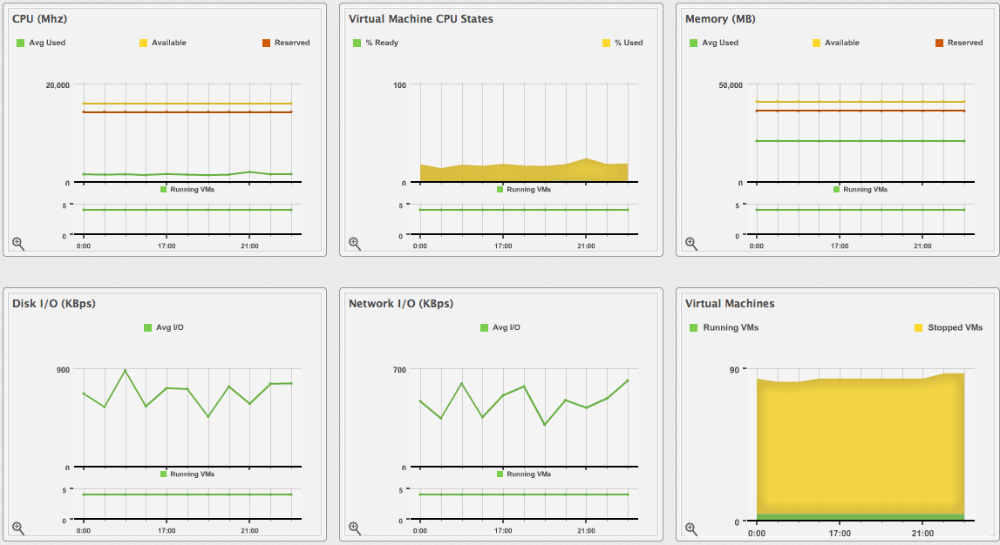
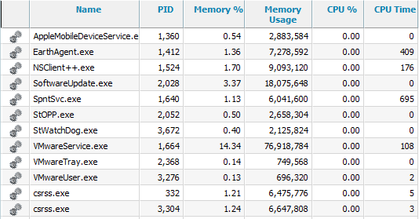
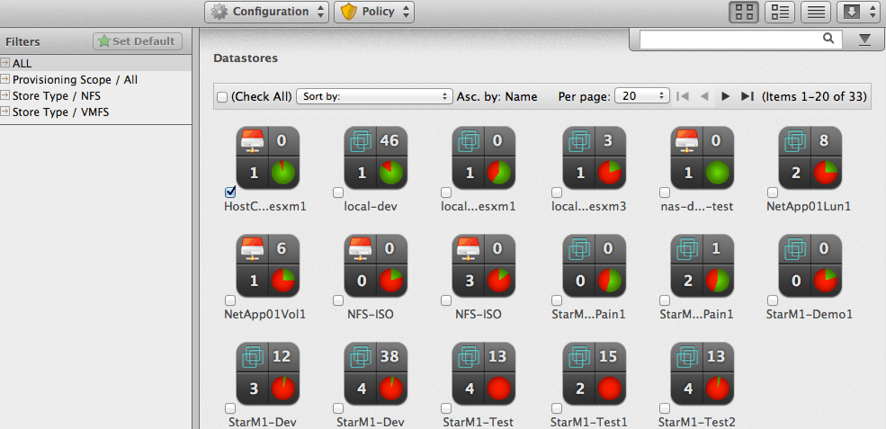
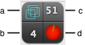
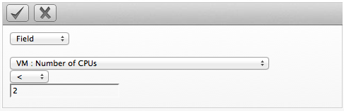

= ManageIQ 5.3 Insight Guide

== Introduction

ManageIQ delivers the insight, control, and automation enterprises need to address the challenges of managing virtual environments. This technology enables enterprises with existing virtual infrastructures to improve visibility and control, and those starting virtualization deployments to build and operate a well-managed virtual infrastructure.

ManageIQ 5.3 is comprised of a single component, the ManageIQ. It has the following feature sets:

* Insight: Discovery, Monitoring, Utilization, Performance, Reporting, Analytics, Chargeback, and Trending.
* Control: Security, Compliance, Alerting, and Policy-Based Resource, and Configuration Enforcement.
* Automate: IT Process, Task and Event, Provisioning, and Workload Management and Orchestration.
* Integrate: Systems Management, Tools and Processes, Event Consoles, Configuration Management Database (CMDB), Role-based Administration (RBA), and Web Services.

=== Architecture

The diagram below describes the capabilities of ManageIQ. Its features are designed to work together to provide robust management and maintenance of your virtual infrastructure.

image:images/1845.png[Features]

*Figure 1.1. Features*

 +

The architecture comprises the following components:

* The ManageIQ Appliance (Appliance) which is supplied as a secure, high-performance, preconfigured virtual machine. It provides support for Secure Socket Layer (SSL) communications.
* The ManageIQ Server (Server) resides on the Appliance. It is the software layer that communicates between the SmartProxy and the Virtual Management Database. It includes support for Secure Socket Layer (SSL) communications.
* The Virtual Management Database (VMDB) resides either on the Appliance or another computer accessible to the Appliance. It is the definitive source of intelligence collected about your Virtual Infrastructure. It also holds status information regarding Appliance tasks.
* The ManageIQ Console (Console) is the Web interface used to view and control the Server and Appliance. It is consumed through Web 2.0 mash-ups and web services (WS Management) interfaces.
* The SmartProxy can reside on the Appliance or on an ESX Server. If not embedded in the Server, the SmartProxy can be deployed from the Appliance. Each storage location must have a SmartProxy with visibility to it. The SmartProxy acts on behalf of the Appliance communicating with it over HTTPS (SSL) on standard port 443.

=== Requirements

To use ManageIQ, the following requirements must be met:

* One of the following Web Browsers:
** Mozilla Firefox for versions supported under Mozilla's Extended Support Release (ESR) link:#ftn.idm226489409056[^[1]^]
** Internet Explorer 8 or higher
** Google Chrome for Business
* A monitor with minimum resolution of 1280x1024.
* Adobe Flash Player 9 or above. At the time of publication, you can access it at http://www.adobe.com/products/flashplayer/[http://www.adobe.com/products/flashplayer/].
* The ManageIQ Appliance must already be installed and activated in your enterprise environment.
* The SmartProxy must have visibility to the virtual machines and cloud instances that you want to control.
* The resources that you want to control must have a SmartProxy associated with them.

IMPORTANT: Due to browser limitations, ManageIQ supports logging in to only one tab for each multi-tabbed browser. Console settings are saved for the active tab only. For the same reason, ManageIQ does not guarantee that the browser's *Back* button will produce the desired results. ManageIQ recommends using the breadcrumbs provided in the Console.

=== Terminology

*The following terms are used throughout this document. Review them before proceeding.*

Account Role::
  A designation assigned to a user allowing or restricting a user to parts and functions of the ManageIQ console.
Action::
  An execution that is performed after a condition is evaluated.
Alert::
  ManageIQ alerts notify administrators and monitoring systems of critical configuration changes and threshold limits in the virtual environment. The notification can take the form of either an email or an SNMP trap.
Analysis Profile::
  A customized scan of hosts, virtual machines, or instances. You can collect information from categories, files, event logs, and registry entries.
Cloud::
  A pool of on-demand and highly available computing resources. The usage of these resources are scaled depending on the user requirements and metered for cost.
ManageIQ Appliance::
  A virtual machine on which the virtual management database (VMDB) and ManageIQ server reside.
ManageIQ Console::
  A web-based interface into the ManageIQ Appliance.
ManageIQ Role::
  A designation assigned to a ManageIQ server that defines what a ManageIQ server can do.
ManageIQ Server::
  The application that runs on the ManageIQ Appliance and communicates with the SmartProxy and the VMDB.
Cluster::
  Hosts that are grouped together to provide high availability and load balancing.
Condition::
  A test of criteria triggered by an event.
Discovery::
  Process run by the ManageIQ server which finds virtual machine and cloud providers.
Drift::
  The comparison of a virtual machine, instance, host, cluster to itself at different points in time.
Event::
  A trigger to check a condition.
Event Monitor::
  Software on the ManageIQ Appliance which monitors external providers for events and sends them to the ManageIQ server.
Host::
  A computer on which virtual machine monitor software is loaded.
Instance/Cloud Instance::
  A on-demand virtual machine based upon a predefined image and uses a scalable set of hardware resources such as CPU, memory, networking interfaces.
Managed/Registered VM::
  A virtual machine that is connected to a host and exists in the VMDB. Also, a template that is connected to a provider and exists in the VMDB. Note that templates cannot be connected to a host.
Managed/Unregistered VM::
  A virtual machine or template that resides on a repository or is no longer connected to a provider or host and exists in the VMDB. A virtual machine that was previously considered registered may become unregistered if the virtual machine was removed from provider inventory.
Provider::
  A computer on which software is loaded which manages multiple virtual machines that reside on multiple hosts.
Policy::
  A combination of an event, a condition, and an action used to manage a virtual machine.
Policy Profile::
  A set of policies.
Refresh::
  A process run by the ManageIQ server which checks for relationships of the provider or host to other resources, such as storage locations, repositories, virtual machines, or instances. It also checks the power states of those resources.
Resource::
  A host, provider, instance, virtual machine, repository, or datastore.
Resource Pool::
  A group of virtual machines across which CPU and memory resources are allocated.
Repository::
  A place on a datastore resource which contains virtual machines.
SmartProxy::
  The SmartProxy is a software agent that acts on behalf of the ManageIQ Appliance to perform actions on hosts, providers, storage and virtual machines.
  +
  The SmartProxy can be configured to reside on the ManageIQ Appliance or on an ESX server version. The SmartProxy can be deployed from the ManageIQ Appliance, and provides visibility to the VMFS storage. Each storage location must have a SmartProxy with visibility to it. The SmartProxy acts on behalf of the ManageIQ Appliance. If the SmartProxy is not embedded in the ManageIQ server, it communicates with the ManageIQ Appliance over HTTPS (SSL) on standard port 443.
SmartState Analysis::
  Process run by the SmartProxy which collects the details of a virtual machine or instance. Such details include accounts, drivers, network information, hardware, and security patches. This process is also run by the ManageIQ server on hosts and clusters. The data is stored in the VMDB.
SmartTags::
  Descriptors that allow you to create a customized, searchable index for the resources in your clouds and infrastructure.
Storage Location::
  A device, such as a VMware datastore, where digital information resides that is connected to a resource.
Tags::
  Descriptive terms defined by a ManageIQ user or the system used to categorize a resource.
Template::
  A template is a copy of a preconfigured virtual machine, designed to capture installed software and software configurations, as well as the hardware configuration, of the original virtual machine.
Unmanaged Virtual Machine::
  Files discovered on a datastore that do not have a virtual machine associated with them in the VMDB. These files may be registered to a provider that the ManageIQ server does not have configuration information on. Possible causes may be that the provider has not been discovered or that the provider has been discovered, but no security credentials have been provided.
Virtual Machine::
  A software implementation of a system that functions similar to a physical machine. Virtual machines utilize the hardware infrastructure of a physical host, or a set of physical hosts, to provide a scalable and on-demand method of system provisioning.
Virtual Management Database (VMDB)::
  Database used by the ManageIQ Appliance to store information about your resources, users, and anything else required to manage your virtual enterprise.
Virtual Thumbnail::
  An icon divided into smaller areas that summarize the properties of a resource.

=== About this Guide

This Guide includes the following sections:

* _Common Infrastructure_ and _Cloud Controls_ describes the management of infrastructure items, reporting, and the search functionality available with ManageIQ.
* _Infrastructure_ tells you how to analyze and manipulate the Hosts, Providers, Clusters, Resource Pools, Datastores, and Repositories in your environment.
* _Cloud_ tells you how to manage your cloud providers. Describing how to add, discover, refresh, tag, review and remove your chosen cloud provider. Cloud computing provides a set of pooled resources used to create a set of scalable virtual machine instances.
* _Capacity Planning_ shows how to use capacity, utilization, and optimization features. This book describes how ManageIQ server can collect and analyze capacity and utilization data from your virtual infrastructure. Use this data to understand the limitations of your current environment and plan for growth.
* _Cloud Intelligence_ shows the ways in which you can view and analyze the information that has been accumulated. This section provides information about how to supports better information technology decision making and predictions for future virtual machine management using Cloud Intelligence.

== Common Infrastructure and Cloud Controls

The user views resources in multiple ways through the console. Each type of resource provides different buttons in the main tool bar. For all infrastructure items, users can:

* Change views
* Sort
* Create a report
* Search by collected data

*Figure 2.1. The Infrastructure User Interface*

 +

1.  Taskbar buttons
2.  View buttons
3.  Infrastructure Report outputs
4.  Advanced Search button
5.  Navigation bar
6.  Sort dropdown
7.  Main area

=== Changing Views

The *Configuration* page enables the user to set default views for different resources. However, the view is also controlled from the *Infrastructure* or *Cloud* items page. All *Infrastructure* or *Cloud* items have the same buttons for the different views available.

1.  Hover over *Infrastructure* or *Clouds* and click the page for the type of item to view.
2.  Click the appropriate button for the view.
* Click ** for Grid View.
* Click ** for Tile View.
* Click *image:images/2022.png[the List View icon]* for List View.

=== Sorting Infrastructure Items

Each item has different parameters to sort. For example, sort *Hosts* by SmartProxy version, or sort a *Datastore* by free space.

1.  Hover over *Infrastructure* or *Clouds* and click the page for the type of item to sort.
2.  Click the *Sort by* dropdown.
3.  Click the attribute to sort. The options presented depend on the type of configuration item selected.

=== Creating an Infrastructure Report

Create a quick report of infrastructure items in CSV, TXT, or PDF formats.

1.  Hover over *Infrastructure* or *Clouds* and click the page of the item for report generation.
2.  Click the *Download* button for the type of report.
* Click  *(Download this report in TXT format)* for a text file.
* Click  *(Download this report in CSV format)* for a csv file.
* Click  *(Download this report in PDF format)* for a PDF file.

=== Searching by Name

A search bar to the right of the taskbar on the *Providers*, *Clusters*, *Hosts*, and *Resource Pools* pages provide a method to enter names, or parts of names, for searching. Search for items in the following ways:

1.  Type characters that are included in the name. For example, if you type `sp1`, all names that include `sp1` appear such as `Windows2003sp1` and `Sp1clone`.
2.  Use an asterisk ("`*`") after the desired search term to search for names that begin with specific characters. For example, type `v*` to find all names that begin with the letter `v`.
3.  Use an asterisk ("`*`") before the desired search term to search for names that end with specific characters. For example, type `*sp2` to find all names that end with `sp2`.
4.  Erase all characters from the search box to go back to viewing all virtual machines.

1.  Hover over *Infrastructure* or *Clouds* and navigate to either the *Providers*, *Clusters*, *Hosts*, or *Resource Pools* page.
2.  In the *Name Filter* bar in the upper right corner of the window, type your criteria.
+

3.  Click  *(Search by Name within results)*, or press Enter.
4.  Type in another criterion to filter on what is currently displayed.
5.  Click  *(Search by Name within results)*, or press Enter.

=== Advanced Searching

Use ManageIQ's advanced filtering capabilities to do the following.

* Search by any information that has been discovered or collected using SmartState Analysis and by Company and System Tags that you have assigned.
* Import a filter used in a report.
* Save a search to be used again.

==== Searching for Infrastructure Items with Advanced Search

1.  Hover over *Infrastructure* or *Clouds* and click the page of the type of item to search.
2.  Click  *(Advanced Search)* to open the expression editor.
3.  Use the expression editor to choose the appropriate options for the search criteria. Different options appear based on the chosen criteria.
* Click *Field* to create criteria based on field values.
+

* Click *Count of* to create criteria based on the count of something, such as the number of snapshots for a virtual machine, or the number of virtual machines on a host.
+

* Click *Tag* to create criteria based on tags assigned to your resources.
+

* Click *Registry* to create criteria based on registry values.
+

* Click *Find* to seek a particular value and check a property.
+

4.  Make any edits for the current expression.
* Click  *(Undo the previous change)* to remove a change.
* Click image:images/1900.png[image] *(Redo the previous change)* to redo the change.
* Click  *(AND with a new expression element)* to create a logical AND with a new expression element.
* Click image:images/1902.png[image] *(OR with a new expression element)* to create a logical OR with a new expression element.
* Click  *(Wrap this expression element with a NOT)* to create a logical NOT on an expression element or to exclude all the items that match the expression.
* Click image:images/1904.png[image] *(Remove this expression element)* to take out the current expression element.
5.  Click image:images/1863.png[image] *(Commit expression element changes)* to add the expression or click image:images/1904.png[image] *(Discard expression element changes)* to remove changes.
6.  Click *Apply*.

==== Saving an Advanced Search

1.  Create an Advanced Search expression.
2.  Click *Save*.
3.  Type the a name for the search expression in *Save this search as*.
+
*Note*
+
The default title depends on the configuration item you have chosen.
4.  Click *Save*.

==== Loading a Report Filter or Search Expression

1.  Hover over *Infrastructure* or *Cloud* and click the page of the type of item to search.
2.  Click  *(Advanced Search)* to open the expression editor.
3.  Click *Load*.
4.  Select either a saved virtual machine search or a virtual machine report filter.
+
*Note*
+
The items you can choose to select depend on the type of resource you are searching for.
5.  Click *Load*.
6.  Click *Apply*.

== Infrastructure

Use the *Infrastructure* pages to view and collect information from your providers, clusters, hosts, and resource pools.

=== Providers

A provider is a server with software to manage multiple virtual machines that reside on multiple hosts. The *Providers* page, found under the Infrastructure tab, displays all discovered or added providers in your enterprise.

NOTE: Any applied filters will be in effect on this page.

Use the *Providers* taskbar to manage the existence of your providers and to initiate a refresh of them. These buttons are used to manage multiple providers at one time. To manage one provider, click on that item in the main area of the screen.

Console uses virtual thumbnails to describe providers. Each thumbnail contains four quadrants by default. This enables a user to glance at a provider for a quick view of its number of hosts and authentication status.

1.  Top left quadrant: Number of hosts
2.  Bottom left quadrant: Management system software
3.  Top right quadrant: For future use
4.  Bottom right quadrant: Authentication status

[width="100%",cols="<25%,<75%",options="header",]
|============================================================================================================
|Icon |Description
| |Validated: Valid authentication credentials have been added.
| |Invalid: Authentication credentials are invalid.
| |Unknown: Authentication status is unknown or no credentials have been entered.
|============================================================================================================

==== Adding a Provider

After initial installation and creation of a ManageIQ environment, you can add providers to the appliance.

1.  Navigate to *Infrastructure* → *Providers*.
2.  Click image:images/1847.png[image] *(Configuration)*, then click  *(Add a New Infrastructure Provider)*.
3.  Type in the *Name* of the provider to add. The *Name* is how the device is labeled in the console.
4.  Select the *Type* of provider: *Red Hat Enterprise Virtualization Manager* or *VMware vCenter*.
5.  Type in the *Host Name*, and *IP Address* of the provider to add.
6.  For Red Hat Enterprise Virtualization providers, enter the *API Port* if your provider uses a non-standard port for access.
7.  If you have multiple zones, select the appropriate one from *Zone*.
8.  Type in a *User ID* and *Password* with administrator privileges to the provider. To refresh a provider, these credentials are required.
9.  Click *Validate* to confirm that the user and password connects.
10. Click *Save*.

ManageIQ adds a new provider. Use this provider for virtual machine provisioning.

NOTE: To obtain historical Capacity and Utilization (C & U) data for Red Hat Enterprise Virtualization Manager, you will need to add credentials for the Red Hat C & U Database. Once discovered, and set up for C & U in ManageIQ, you can use ManageIQ to collect C & U from this point forward. For further information, refer to _Chapter 4. Data Collection Setup and Reports Installation_ in the _Red Hat Enterprise Virtualization 3.1 Installation Guide_.

==== Discovering Providers

After initial creation of a ManageIQ environment, discover the providers in your environment. To do this, use ManageIQ's ability to discover using a range of IP addresses.

1.  Navigate to *Infrastructure* → *Providers*.
2.  Click image:images/1847.png[image] *(Configuration)*, then click image:images/2119.png[image] *(Discover Infrastructure Providers)*.
3.  Check the type of provider to discover.
+

4.  Type in a *Subnet Range* of IP addresses staring with a *From Address* and ending with a *To Address*. The cursor automatically advances as you complete each octet.
+
image:images/2196.png[image]
5.  Click *Start* to confirm the discovery process.

The server searches for computers running supported providers. When available, the new providers display. These providers are named using a Hostname and IP address. To make them identifiable, edit the basic information for each provider.

==== Refreshing Providers

Refresh a provider to find other resources related to it. Use *Refresh* after initial discovery to get the latest data about the provider and the virtual machines it can access. Ensure the provider has credentials to do this. If the providers were added using *Discovery*, see _Editing Provider Information_.

1.  Navigate to *Infrastructure* → *Providers*.
2.  Check the providers to refresh.
3.  Click image:images/1847.png[image] *(Configuration)*, and then image:images/2003.png[image] *(Refresh Relationships and Power States)*.
4.  Click *OK* to confirm.

==== Tagging Multiple Providers

Apply tags to all providers to categorize them together at the same time. Before assigning tags, create them using instructions in the _ManageIQ Settings and Operations Guide_.

1.  Navigate to *Infrastructure* → *Providers*.
2.  Check the providers to tag.
3.  Click image:images/1941.png[image] (*Policy*), and then  (*Edit Tags*).
4.  Select a customer tag from the first dropdown, and then a value for the tag.
+
image:images/2194.png[image]
5.  Select more tags or click *Save* to save your changes.

==== Viewing a Provider

From a list of providers, you can review a specific provider by clicking on it. This displays various options to access provider information.

*Figure 3.1. Provider Management Screen*

 +

1.  Provider Taskbar: Choose between Configuration, Policy and Monitoring options for the selected provider
2.  Provider Summary: Displays provider summary such as Properties, Relationships, and Smart Management
3.  Provider Summary View: Choose between graphical or text view of the provider summary
4.  Provider Summary PDF: Generates provider summary in PDF format
5.  Provider Accordion: Displays details about Properties and Relationships for the selected provider

==== Editing Provider Information

Edit information about a provider such as the name, IP address, and login credentials.

1.  Navigate to *Infrastructure* → *Providers*.
2.  Click the provider to edit.
3.  Click image:images/1847.png[image] *(Configuration)*, and then image:images/1851.png[image] *(Edit Selected Infrastructure Provider)*.
4.  In *Basic Info*, edit the following:
* Use *Name* to set an easily identifiable name for the provider.
* Use *Host Name* to specify the hostname for the device.
* Use *IP Address* to set the IP address for communication with the provider.
* You cannot change the *Type* of provider.
* Edit the *API Port* if your provider uses a non-standard port for access.
* Use *Zone* to isolate traffic and provide load balancing capabilities. Specify the *Zone* this ManageIQ Appliance is a member. At startup, the zone is set to *Default*.
5.  Use *Credentials* to provide login credentials required for the provider.
+
image:images/2198.png[image]
* Use *User ID* to specify a login name.
* Use *Password* to specify the password for the *User ID*.
* Use *Verify Password* to confirm the password.
6.  Click *Validate* to confirm the user and password connects.
7.  Click *Save*.

NOTE: To obtain historical Capacity and Utilization (C & U) data for Red Hat Enterprise Virtualization Manager, you will need to add credentials for the Red Hat C & U Database. Once discovered, and set up for C & U in ManageIQ, you can use ManageIQ to collect C & U from this point forward. For further information, refer to _Chapter 4. Data Collection Setup and Reports Installation_ in the _Red Hat Enterprise Virtualization 3.1 Installation Guide_.

==== Removing Providers

If a provider has been decommissioned or requires some troubleshooting, it might require deletion from the VMDB.

1.  Navigate to *Infrastructure* → *Providers*.
2.  Check the Providers to delete.
3.  Click image:images/1847.png[image] *(Configuration)*, and then image:images/2157.png[image] *(Remove Infrastructure Providers from the VMDB)*.
4.  Click *OK* to confirm.

==== Viewing the Provider Timeline

View the timeline of events for the virtual machines registered to a provider.

1.  Navigate to *Infrastructure* → *Providers*.
2.  Click a provider.
3.  Click image:images/1994.png[image] *(Monitoring)*, and then  *(Show Timelines for this Provider)* from the taskbar, or from the provider accordion, click *Properties* → *Timeline*.
4.  From *Options*, customize the period of time to display and the types of events to see.
+

* Use *Show* to select regular Management Events or Policy Events.
* Use the *Interval* dropdown to select hourly or daily data points.
* Use *Date* to type the date for the timeline to display.
* If you select to view a daily timeline, use *Show* to set how many days back to go. The maximum history is 31 days.
* The three *Event Group* dropdowns allow you to select different groups of events to display. Each has its own color.
* From the *Level* dropdown, select a *Summary* event, or a *Detail* list of events. For example, the detail level of a *Power On* event might include the power on request, the starting event, and the actual *Power On* event. If you select *Summary*, only the Power On event displays in the timeline.

The timeline is displayed. To see more details about an item in the timeline, click on it. A balloon appears with a link to the resource.

==== Viewing Hosts and Clusters

Access a tree view of the hosts and clusters for a provider from the *Provider Summary*.

1.  Navigate to *Infrastructure* → *Providers*.
2.  Click the provider to view the hosts and clusters.
3.  Click on the *Relationships* accordion, then click *Hosts & Clusters*.

The hosts and clusters are displayed in a tree view. Hover over a host or virtual machines and its virtual thumbnail displays on the screen.

==== Viewing Virtual Machines and Templates

Access a tree view of the virtual machines and templates for a provider from the *Provider Summary*.

1.  Navigate to *Infrastructure* → *Providers*.
2.  Click the provider to view the virtual machines and templates.
3.  From accordion menu, click *Relationships*, then click *VMs & Templates*.

The virtual machines and templates are displayed in a tree view. Hover over a virtual machine or template and its virtual thumbnail displays on the screen.

=== Clusters

Clusters provide high availability and load balancing for a group of hosts. The *Clusters* page under *Infrastructure* displays the clusters discovered in your enterprise environment.

NOTE: Any filter applied will be in effect here.

Use the *Clusters Taskbar* to manage the analysis and tagging of your clusters. These buttons manage multiple clusters at one time. To manage one cluster, click on that cluster in the main area of the screen.

==== Performing SmartState Analysis on Clusters

Analyze a cluster to gather historical data to compare with previous points in time.

1.  Navigate to *Infrastructure* → *Clusters*.
2.  Check the clusters to analyze.
3.  Click image:images/1847.png[image] *(Configuration)*, and then  *(Perform SmartState Analysis)*.
4.  Click *OK* to confirm.

The SmartState Analysis begins and returns the current data.

==== Comparing Clusters

ManageIQ provides features to compare properties of clusters.

1.  Navigate to *Infrastructure* → *Clusters*.
2.  Check the Clusters to compare.
3.  Click image:images/1847.png[image] *(Configuration)*, and then  *(Compare selected Clusters)*. The comparison displays in a default expanded view and lists a limited set of properties.
+

4.  To delete a cluster from the comparison, click image:images/1861.png[image] *(Remove this Cluster from the Comparison)*.
5.  To go to a compressed view, click image:images/2024.png[image] *(Compressed View)*. To return to an expanded view, click image:images/2023.png[image] *(Expanded View)*.
6.  To change the base cluster that all other clusters compare to, click its label at the top of its column.
7.  To go to the cluster summary screen, click its virtual thumbnail or icon.
8.  There are three buttons in the taskbar to limit the type of views:
* Click  *(All attributes)* to see all attributes.
* Click image:images/2204.png[image] *(Attributes with different values)* to see only the attributes that are different across clusters.
* Click  *(Attributes with the same values)* to see only the attributes that are the same across clusters.
9.  To limit the mode of the view, there are two taskbar buttons.
* Click image:images/2022.png[image] *(Details Mode)* to see all details for an attribute.
* Click image:images/2025.png[image] *(Exists Mode)* to only see if an attribute exists compared to the base or not. This only applies to attributes that can have a Boolean property. For example, a user account exists or does not exist, or a piece of hardware that does or does not exist.

This creates a comparison between clusters. Export this data or create a report from your comparison for analysis using external tools.

===== Creating a Cluster Comparison Report

Create a quick report of to compare clusters in CSV, TXT, or PDF formats.

1.  Create the comparison to analyze.
2.  Click  *(Download)*.
3.  Click the output button for the type of report.
* Click  *(Download comparison report in TXT format)* for a text file.
* Click  *(Download comparison report in CSV format)* for a comma-separated file.
* Click  *(Download comparison report in PDF format)* for a PDF file.

==== Viewing a Cluster

You can click on a specific Cluster to view its details. The screen provides you with a Cluster Taskbar, a Cluster Accordion, and a Cluster Summary.

*Figure 3.2. Cluster Management Screen*

 +

1.  Cluster Taskbar: Choose between Configuration, Policy and Monitoring options for the selected Cluster
2.  Cluster Summary: See Cluster summary such as Relationships, Totals for Hosts, Totals for VMs
3.  Cluster Summary Views: Choose between graphical or text view of the cluster summary
4.  Cluster Summary PDF: Generates Cluster summary in PDF format
5.  Cluster Accordion: See details about Properties, Relationships, Storage Relationships for the selected Cluster

==== Tagging Clusters

Use tags to categorize clusters. Before assigning tags, create them using the instructions in the _ManageIQ Settings and Operations Guide_.

1.  Navigate to *Infrastructure* → *Clusters*.
2.  Check the Clusters to tag.
3.  Click image:images/1941.png[image] *(Policy)*, and then  *(Edit Tags)*.
+

4.  Select a customer tag from the first dropdown, and then a value for the tag.
5.  Select more tags or click *Save* to save your changes.

==== Viewing Capacity and Utilization Charts for a Cluster

View capacity and utilization for a cluster.

1.  Navigate to *Infrastructure* → *Clusters*.
2.  Click the Cluster to view Capacity and Utilization data.
3.  Click image:images/1994.png[image] *(Monitoring)*, and then image:images/1994.png[image] *(Utilization)* or from the accordion menu, click *Properties*, then *Capacity & Utilization*.
+
image:images/2208.png[image]
4.  From *Interval*, select to view hourly or daily data points and the dates to view data. Use *Group by* to group the lines by SmartTags. Use *Time Profiles* to select a time range for the data.

The *Capacity & Utilization* charts display.

NOTE: Daily charts only include full days of data. If a day does not include all the 24 data points for a day, the data does not show for that day.

==== Viewing Cluster Timeline

Use the cluster timeline to see a graphical depiction of operational and configuration events over time.

1.  Navigate to *Infrastructure* → *Clusters*.
2.  Click the cluster to view the timeline.
3.  Click image:images/1994.png[image] *(Monitoring)*, and then image:images/1994.png[image] *(Timelines)* or from the Cluster Accordion, click *Properties* → *Timeline*.
4.  From *Options*, customize the period of time to display, and the types of events to see.
+
image:images/2210.png[image]
* Use the *Interval* dropdown to select hourly or daily data points.
* Use *Date* to type the date for the timeline to display.
* If you select to view a daily timeline, use *Show* to set how many days back to go. The maximum history is 31 days.
* The three *Event Group* dropdowns allow the selection of different groups of events to display. Each has its own color.
* From the *Level* dropdown, select a *Summary* event if needed, or a *Detail* list of events. For example, the detail level of a *Power On* event might include the power on request, the starting event, and the actual *Power On* event. If you select *Summary*, the timeline only displays the Power On event.
5.  To see more detail on an item in the timeline, click on it. A balloon appears with a clickable link to the resource.

==== Detecting Drift on Clusters

Over time, a cluster's configuration might change. Drift is the comparison of a cluster to itself at different points in time. The cluster requires analysis at least twice to collect information. Detecting drift provides users with the following benefits:

* See the difference between the last known state of a cluster and its current state
* Review the configuration changes that happen to a particular cluster between multiple points in time.
* Capture the configuration drifts for a single cluster across a time period.

1.  Navigate to *Infrastructure* → *Clusters*.
2.  Click on the cluster to view drift.
3.  Click *Relationships* in the Cluster Accordion.
4.  Click *Drift History*.
5.  Check the analyses to compare.
6.  Click  *(Drift Analysis)* at the top of the screen. The results are displayed.
7.  Check the *Comparison* sections on the left to view in your comparison.
8.  Click the plus sign next to the section name to expand it.
* An item displayed on red text shows a change from the base analysis. An item displayed in black text shows no change from the base analysis.
* A  *(Changed from previous)* shows there has been a change since the last analysis.
* A  *(Same as previous)* means there has been no change since the last analysis.
* Click image:images/1861.png[image] *(Remove from drift)* at the bottom of a column to remove a specific analysis. The drift is then recalculated and the new results display.
9.  Click image:images/2023.png[image] *(Expanded View)* to see the expanded view. Click image:images/2024.png[image] *(Compressed View)* to compress the information.
10. Click the minus sign next to the section name to collapse it.
11. To limit the type of views, there are three buttons in the Taskbar.
* Click  *(All attributes)* to see all attributes of the sections selected.
* Click image:images/2204.png[image] *(Attributes with different values)* to see only the attributes different across drifts.
* Click  *(Attributes with the same values)* to see only the attributes the same across drifts.

The drift displays for your cluster. Download the data or create a report from the drift for analysis using external tools.

==== Creating a Drift Report for Clusters

Use the drift report feature to export information about your cluster's drift.

1.  Create a drift of a cluster.
2.  Click  *(Download)*.
3.  Click the output button for the type of report you want.
* Click  *(Download drift report in TXT format)* for a text file.
* Click  *(Download drift report in CSV format)* for a comma-separated file.
* Click  *(Download drift report in PDF format)* for a PDF file.

==== Removing Clusters

If a cluster has been decommissioned or requires troubleshooting, it might require removal from the VMDB.

1.  Navigate to *Infrastructure* → *Clusters*.
2.  Check the clusters to remove.
3.  Click image:images/1847.png[image] *(Configuration)*, and then image:images/2157.png[image] *(Remove Clusters from the VMDB)*.
4.  Click *OK* to confirm the removal of the clusters.

The clusters are deleted. Any virtual machines or hosts associated with these clusters remain, but are no longer associated with them.

=== Hosts

The *Hosts* page under *Infrastructure* displays the hosts discovered in your enterprise environment.

NOTE: Any applied filters will be in effect here.

After adding or sorting your hosts, click on one to examine it more closely and see its virtual machines, SmartProxy settings, and properties.

1.  Top left quadrant: Number of virtual machines on this host
2.  Bottom left quadrant: Virtual machine software
3.  Top right quadrant: Power state of host
4.  Bottom right quadrant: Authentication status

[width="100%",cols="<25%,<75%",options="header",]
|============================================================================================================
|Icon |Description
| |Validated: Valid authentication credentials have been added.
| |Invalid: Authentication credentials are invalid
| |Unknown: Authentication status is unknown or no credentials have been entered.
|============================================================================================================

==== Filtering Hosts

The Host Filter accordion is provided to easily navigate through the hosts. Use the ones provided or create your own. In addition, you can set a default filter.

===== Setting a Default Host Filter

Set the default filter for viewing your hosts.

1.  From the *Filters* accordion on the left, click on the filter to use.
2.  Click *Set Default* at the top of the filters list.

The default filter is set and marked by a green star next to its name.

===== Creating a Host Filter

Create a filter for viewing you hosts.

1.  Navigate to *Infrastructure* → *Hosts*.
2.  Click  *(Advanced Search)* to open the expression editor.
3.  Use the expression editor to choose the appropriate options for your criteria.
4.  Click *Save*.
5.  Type in a name for the search expression in *Save this search as*.
+
*Note*
+
This title depends on the type of resource you are searching.
6.  Click *Save*.

The filter is saved and displays in the *My Filters* area of the *Filter* accordion.

==== Performing SmartState Analysis on Hosts

Perform a SmartState Analysis on a host to collect additional information about it, such as patches, CPU, and memory.

NOTE: `root` or administrator credentials are required to get patch information.

1.  Navigate to *Infrastructure* → *Hosts*.
2.  Check the hosts to analyze.
3.  Click image:images/1847.png[image] *(Configuration)*, and then  *(Perform SmartState Analysis)*.
4.  Click *OK* to confirm.

==== Comparing Hosts

ManageIQ allows you to compare hosts and check operating systems, host software and version information, and hardware.

1.  Navigate to *Infrastructure* → *Hosts*.
2.  Check the hosts to compare.
3.  Click image:images/1847.png[image] *(Configuration)*, and then  *(Compare selected Hosts)*. The comparison displays in a default expanded view, which lists a limited set of properties.
4.  To remove a host from the comparison, click image:images/1861.png[image] *(Remove this Host from the comparison)* at the bottom of the column.
5.  To go to a compressed view, click image:images/2024.png[image] *(Compressed View)*. To return to an expanded view, click image:images/2023.png[image] *(Expanded View)*.
6.  To limit the mode of the view, there are two buttons in the Taskbar.
* Click image:images/2022.png[image] *(Details Mode)* to see all details for an attribute.
* Click image:images/2025.png[image] *(Exists Mode)* to limit the view to if an attribute exists compared to the base or not. This only applies to attributes that can have a Boolean property. For example, a user account exists or does not exist, or a piece of hardware that does or does not exist.
7.  To change the base host that compare to the other hosts, click its label at the top of its column.
8.  To go to the summary screen for a host, click its Virtual Thumbnail or icon.

ManageIQ allows you to fine tune your comparison by selecting categories to compare.

===== Host Comparison Sections

[width="100%",cols="<50%,<50%",options="header",]
|================================================================================================================================================
|Section |Description
|Host Properties |Use this section to see basic information of the host, such as hostname, product, build number, hardware, and network adapters.
|Security |Use this to see users and groups for the host, and firewall rules.
|Configuration |Use this to see the operating system, applications, services, patches, vSwitches, vLANS, and advanced settings.
|My Company Tags |Use this to see all tags.
|================================================================================================================================================

===== Using the Host Comparison Sections

The following procedure describes how to use the host comparison sections.

1.  On the left of a comparison screen, select what categories of properties to display.
2.  Click the plus sign next to the sections name to expand it.
3.  The following descriptions pertain to the *Expanded View* image:images/2023.png[image] . Either the value of a property or an icon representing the property displays depending on the properties type.
* A property displayed in the same color as the base means that the compared host matches the base for that property.
* A property displayed in a different color from the base means that the compared host does not match the base for that property.
4.  If you are in the *Compressed View* image:images/2024.png[image] , the values of the properties do not display. All items are described by the icons shown below.
* A  *(checkmark)* means the compared host matches the base for that property. Hover over it and the value of the property displays.
* A  *(x)* means the compared host does not match the base for that property. Hover over it and the value of the property displays.
5.  Click the plus sign next to the section name to collapse it.

This comparison is viewable in multiple ways. Export the data or create a report from your comparison for analysis using external tools.

===== Creating a Host Comparison Report

Create a quick report to compare clusters in CSV, TXT, or PDF formats.

1.  Create the comparison to analyze.
2.  Click  *(Download)*.
3.  Click the output button for the type of report.
* Click  *(Download comparison report in TXT format)* for a text file.
* Click  *(Download comparison report in CSV format)* for a comma-separated file.
* Click  *(Download comparison report in PDF format)* for a PDF file.

==== Refreshing Multiple Hosts

Manually refresh a host for its properties and related infrastructure components.

1.  Navigate to *Infrastructure* → *Hosts*.
2.  Check the hosts to refresh.
3.  Click image:images/1847.png[image] *(Configuration)*, and then image:images/2003.png[image] *(Refresh Relationships and Power States)*.
4.  Click *OK* to confirm.

When a host is refreshed and a new virtual machine is discovered on that host, ManageIQ checks to see if the virtual machine is already registered with another host. If this is the case, the host that the virtual machine is associated with switches to the new host. If the SmartProxy is monitoring a provider, this happens automatically. If not, the next refresh of the host addresses this.

==== Discovering Multiple Hosts

If not using a provider, use ManageIQ's Discovery to find hosts in your environment within a range of IP addresses.

1.  Navigate to *Infrastructure* → *Hosts*.
2.  Click image:images/1847.png[image] *(Configuration)*, then click image:images/2119.png[image] *(Discover Hosts)*.
3.  Check the types of hosts to discover, ESX or IPMI.
4.  Type in a range of *IP Addresses*.
+

5.  Click *Start*.

ManageIQ searches for the supported hosts. When available, the new hosts display. They are named by hostname and IP address. To make them identifiable, edit the basic information for each host.

==== Adding a Single Host

To analyze a host for more detailed information, add it to the VMDB first. If the host has not been found during *Host Discovery* or *Provider Refresh*, and the host's IP address is known, use the *Add a New Host* button.

1.  Navigate to *Infrastructure* → *Hosts*.
2.  Click image:images/1847.png[image] *(Configuration)*, then click  *(Add a new Host)*.
3.  Type the *Name*, *Host Name*, and *IP Address* of the host to add. *Name* is how the device is labeled in the console. Select the type of operating system from the *Host Platform* dropdown. If the Host has been found during *Discovery* or *Refresh* and the host's operating system has been identified, the *Host Platform* selector remains disabled. If adding an IPMI server for provisioning, add in the IP address of that host.
+

4.  In the *Credentials* box, the *Default* tab provides fields to type a user name with elevated security credentials and the user's password. If using domain credentials, the format for *User ID* is in the format of _`[domainname]`_\_`[username]`_. On ESX hosts, if the SSH login is disabled for the *Default* user, type in a user with remote login access on the *Remote Login* tab.
+

5.  Click *Validate* to check the credentials.
6.  Click *Save*.

==== Editing Hosts

If multiple hosts have the same settings or credentials, edit them at the same time.

1.  Navigate to *Infrastructure* → *Hosts*.
2.  Click image:images/1847.png[image] *(Configuration)*.
3.  Check the Hosts to edit.
4.  Click image:images/1851.png[image] *(Edit Selected Hosts)*.
5.  Use *Credentials* to provide login credentials required for this host.
+
image:images/2216.png[image]
* On the *Default* tab, type a user name with elevated security credentials and the users password. If you are using domain credentials, the format for User ID must be in the format of _`[domainname]`_\_`[username]`_.
* On ESX hosts, if SSH login is disabled for the *Default* user, type in a user with remote login access on the *Remote Login* tab. If this is not supplied, *Default* credentials will be used.
* Use *Web Services* to supply credentials for any web service calls made directly to the host system. If this is not supplied, *Default* credentials are used.
+
*Note*
+
Login credentials are required for performing SmartState Analysis on the host's virtual machines and templates.
+
For each type of credential used, the following information is required:
** Use *User ID* to specify a login ID.
** Use *Password* to specify the password for the User ID.
** Use *Verify Password* to confirm the password.
6.  Test the credentials by using the *Select Host to validate against* drop down and click *Validate*.
7.  Click *Save*.

==== Viewing a Host

You can click on a specific host to review it. The screen shows a Host Virtual Thumbnail, a Host Taskbar, a Host Accordion, and a Host Summary.

*Figure 3.3. Host Management Screen*

 +

1.  Host Task Bar: Use the Host Taskbar to take actions on the selected host
2.  Host Summary: Use the Host Summary to see the properties of a host, drill down to a hosts information, and, view its installed virtual machines.
3.  Host Summary Views: Choose between graphical or text view of the provider summary
4.  Host PDF: Generates Host summary in PDF format
5.  Host Accordion: See details about Properties, Relationships, Security and Configuration for the selected Host

==== Tagging Multiple Hosts

To categorize hosts together, apply tags to multiple hosts at the same time. Before assigning tags, create them using the instructions in the _ManageIQ Settings and Operations Guide_.

1.  Navigate to *Infrastructure* → *Hosts*.
2.  Check the hosts to tag.
3.  Click image:images/1941.png[image] *(Policy)*, and then  *(Edit Tags)*.
4.  Select a customer tag from the first dropdown, and then a value for the tag.
+
image:images/2217.png[image]
5.  Select more tags or click *Save* to save your changes.

==== Removing Hosts

If a host is decommissioned or requires troubleshooting, it might require removal from the VMDB.

1.  Navigate to *Infrastructure* → *Hosts*.
2.  Check the hosts to remove.
3.  Click image:images/1847.png[image] *(Configuration)*, and then image:images/2157.png[image] *(Remove Hosts from the VMDB)*.
4.  Click *OK* to confirm the host deletion.

The hosts are removed. The virtual machines remain in the VMDB, but are no longer associated with their respective hosts.

==== Refreshing Relationships and Power States for a Host

Refresh the relationships and power states of the items associated with your hosts from the Host Taskbar.

NOTE: `root` or administrator credentials are required to get patch information.

1.  Navigate to *Infrastructure* → *Hosts*.
2.  Click on the host to refresh.
3.  Click image:images/1847.png[image] *(Configuration)*, and then image:images/2003.png[image] *(Refresh Relationships and Power States)* on the Host Taskbar.

ManageIQ determines the state (running, stopped, or paused) of all virtual machines registered to the host.

==== Viewing Capacity and Utilization Charts for a Host

View Capacity & Utilization data for hosts that are part of a cluster.

NOTE: Your ManageIQ server requires network visibility to the provider assigned the *Server Role* of *Capacity & Utilization Collector* to enable this feature. Refer to the _ManageIQ Settings and Operations Guide_ for more information.

1.  Navigate to *Infrastructure* → *Hosts*.
2.  Click the Host to view capacity data.
3.  Click image:images/1994.png[image] *(Monitoring)*, and then image:images/1994.png[image] *(Utilization)* or from the Host accordion, click *Properties* → *Capacity & Utilization*.
4.  From *Interval*, select to view hourly or daily data points and the dates to view data. Use *Group by* to group the lines by SmartTags. Use *Time Profiles* to select a time range for the data.
+

The charts are displayed for CPU, memory, disk, network, and running virtual machines.

NOTE: Daily charts only include full days of data. If a day does not include all the 24 data points for a day, the data does not show for that day.

==== Viewing the Host Timeline

View the timeline of events for the virtual machines registered to a host.

1.  Navigate to *Infrastructure* → *Hosts*.
2.  Click the Host to view the timeline.
3.  Click image:images/1994.png[image] *(Monitoring)*, and then  *(Timelines)* or from the Host Accordion, click *Properties* → *Timelines*.
4.  From *Options*, customize the period of time to display and the types of events to see.
* Use *Show* to select types of events to show on the timeline.
* Use the *Interval* dropdown to select hourly or daily data points.
* Use *Date* to type the date the timeline displays.
* If you select to view a daily timeline, use *Show* to set how many days back to go. The maximum history is 31 days. If selecting *Hourly*, select the interval to see.
* From the *Level* dropdown, select either a *Summary* event or a *Detail* list of events. For example, the detail level of a *Power On* event might include the power on request, the starting event, and the actual *Power On* event. If you select *Summary*, only the Power On event appears in the timeline.
* The three *Event Group* dropdowns allow selection of different groups of events to display. Each group has its own color.
5.  To see more detail on an item in the timeline, click on it. A balloon appears with a clickable link to the resource.

==== Host Virtual Summary

Clicking on a specific host shows the Hosts Virtual Thumbnail and an _operating system-sensitive_ screen of host information, called the Host Summary. Where applicable, click on a subcategory of the Host Summary to see more detail on that section.

A *Refresh* provides some basic information on the Host. To get more detail, enter credentials for the host and perform a SmartState Analysis.

The Summary divides into the following categories.

* *Properties* include information such as base operating system, hostname, IP addresses, devices attached to the system, and storage adapters. Some categories can be clicked on for additional detail. For example, click *Network* to view the network adapters connected to the host.
+

* *Relationships* include information on the provider, cluster, datastores, resource pools, and installed virtual machines.
+

* *Security* shows the number of users, groups, patches installed, and firewall rules on the host. Click on any of these items to see further details.
+
*Note*
+
Run a SmartState Analysis on the host to retrieve this information.
* *Storage Relationships* shows the relationship the host has to LUNs, volumes, and file shares. The *Storage Inventory Role* must be enabled in the zone for these items to be populated.
* *Configuration* shows the number of packages and services installed. Click on any of these items to see more details.
+
*Note*
+
Run a SmartState Analysis on the host to retrieve this information.
+

* *Smart Management* shows all tags assigned to this host.
* *Authentication Status* shows all the types of credentials entered for this host and the whether those credentials are valid.

==== Viewing Host Device Information

Access information on the hardware devices including processor, CPU type and speed, and memory for each host.

1.  Navigate to *Infrastructure* → *Hosts*.
2.  Click the host to view the network information.
3.  From the Host Accordion, click *Properties* → *Devices*.

==== Viewing Host Network Information

Access information on networking including switches, network interfaces, and local area networks for each host.

1.  Navigate to *Infrastructure* → *Hosts*.
2.  Click the host to view the network information.
3.  From the Host Accordion, click *Properties* → *Network*.

image:images/2231.png[image]

==== Viewing Storage Adapters

Access information on the storage adapters including storage type for each host.

1.  Navigate to *Infrastructure* → *Hosts*.
2.  Click the host to view the network information.
3.  From the Host Accordion, click *Properties* → *Storage Adapters*.

==== Detecting Drift on Hosts

Over time, the configuration of a Host might change. Drift is the comparison of a host to itself at different points in time. The host requires analysis at least twice to collect information. Detecting drift provides you the following benefits:

* See the difference between the last known state of a host and its current state.
* Review the configuration changes that happen to a particular host between multiple points in time.
* Capture the configuration drifts for a single host across a time period.

1.  Navigate to *Infrastructure* → *Hosts*.
2.  Click on the host to view drift.
3.  Click *Relationships* in the Host Accordion.
4.  Click *Drift History*.
5.  Check the analyses to compare.
6.  Click  *(Drift)* at the top of the screen. The results display.
7.  Check the *Comparison* sections on the left to view in your comparison.
8.  Click *Apply*.
9.  Click the plus sign next to the sections name to expand it.
* An item displayed on red text shows a change from the base analysis. An item displayed in black text shows no change from the base analysis.
* A  *(Changed from previous)* shows a change since the last analysis.
* A  *(Same as previous)* means no change since the last analysis.
* Click image:images/1861.png[image] *(Remove from drift)* at the bottom of a column to remove a specific analysis. The drift recalculates and the new results display.
10. Click image:images/2023.png[image] *(Expanded View)* to see the expanded view. Click image:images/2024.png[image] *(Compressed View)* to compress the information.
11. Click the minus sign next to the sections name to collapse it.
12. To limit the type of views, you have three buttons in the Taskbar.
* Click  *(All attributes)* to see all attributes of the sections you selected.
* Click image:images/2204.png[image] *(Attributes with different values)* to see only the attributes that are different across the drifts.
* Click  *(Attributes with the same values)* to see only the attributes that are the same across drifts.

The drift comparison displays. Download the data or create a report from your drift for analysis using external tools.

==== Creating a Drift Report for Hosts

Use the drift report feature to export information about your host's drift.

1.  Create the comparison to analyze.
2.  Click  *(Download)*.
3.  Click the output button for the type of report.
* Click  *(Download drift report in TXT format)* for a text file.
* Click  *(Download drift report in CSV format)* for a comma-separated file.
* Click  *(Download drift report in PDF format)* for a PDF file.

=== Virtual Machines

The heterogeneous virtual machine container and guest support combined with the ability to analyze information inside the virtual machine - such as disk space, patch level or installed applications - provides in-depth information across the virtual environment. This rich set of information enables ManageIQ users to improve problem resolution times and effectively manage virtual machines.

The *Virtual Machines* pages display all virtual machines that were discovered by your Server. Note that if you have applied a filter to a user, it will be in effect here. The *Virtual Machines* taskbar is a menu driven set of buttons that provide access to functions related to virtual machines.

1.  History button
2.  Refresh screen button
3.  Taskbar
4.  Name search bar/Advanced Search button
5.  View buttons
6.  Download buttons
7.  Navigation bar
8.  Sort dropdown
9.  Main area in Grid View
10. Provider/Filter Navigation

The console uses *Virtual Thumbnails* to describe virtual machines and templates. Each thumbnail contains four quadrants by default. This allows you to glance at a virtual machine for a quick view of its contents.

1.  Top left quadrant: Operating system of the Virtual Machine
2.  Bottom left quadrant: Virtual Machine Hosts software
3.  Top right quadrant: Power state of Virtual Machine or Status icon
4.  Bottom right quadrant: Number of Snapshots for this Virtual Machine

[width="100%",cols="<25%,<75%",options="header",]
|=================================================================================================================
|Icon |Description
| |Template: Virtual Template
| |Retired: Virtual Machine has been retired
| |Archived: Virtual Machine has no Host or Datastore associated with it.
| |Orphaned: Virtual Machine has no Host but does have a Datastore associated with it.
| |Disconnected: Virtual Machine is disconnected.
| |On: Virtual Machine is powered on.
|image:images/2144.png[image] |Off: Virtual Machine is powered off.
| |Suspended: Virtual Machine has been suspended.
|=================================================================================================================

The *Virtual Machines* page has three accordions organizing your virtual machines and templates in different ways. All of these accordions share a set of common controls

* Use *VMs and Templates* to view your virtual machines and templates organized by Provider. In addition, you can see archived and orphaned items here.
* Use the *VMs* to view, apply filters, and collect information about all of your virtual machines.
* Use *Templates* to view, apply filters, and collect information about all of your templates.

Through the console, you are able to view your virtual machines in multiple ways. For your virtual machines, you can:

* Filter virtual machines
* Change views
* Sort
* Create a report
* Search by MyTags
* Search by collected data

==== Filtering Virtual Machines and Templates

The *Virtual Machine Filter* accordion is provided so that you can easily navigate through groups of virtual machines. You can use the ones provided or create your own through *Advanced Filtering* capabilities.

1.  Navigate to *Infrastructure* → *Virtual Machines*.
2.  Go to the *VMs* or *Templates* accordion.
3.  Click on the desired filter from the left pane.

===== Creating a Virtual Machine or Template Filter

1.  Navigate to *Infrastructure* → *Virtual Machines*.
2.  Go to the *VMs* or *Templates* accordion.
3.  Click *All VMs* or *All Templates*, then click  *(Advanced Search)* to open the expression editor.
4.  Use the expression editor to choose the appropriate options for your criteria. Based on what you choose, different options will show.
* For all of the types of searches, you have the options of creating an alias and requested user input. Select *Use Alias* to create a user friendly name for the search. If you are requested user input for the search, this text will show in the dialog box where the input is requested.
* Click *Field* to create criteria based on field values.
+
image:images/2126.png[image]
* Click *Count of* to create criteria based on the count of something, such as the number of snapshots for a virtual machine, or the number of virtual machines on a host.
+

* Click *Tag* to create criteria based on tags assigned to your virtual infrastructure, such as for power states or production tagging.
+
image:images/2128.png[image]
* Click *Registry* to create criteria based on registry values, such as the DCOM status of a Windows system. Note this criteria applies only to Windows operating systems.
+
image:images/2129.png[image]
* Click *Find* to seek a particular value, and then check a property.
+

5.  Click image:images/1863.png[image] *(Commit Expression Element Changes)* to add the expression.
6.  Click *Save*.
7.  Type in a name for the search expression in *Save this VM* search as. (Note that this title depends on the type of resource you are searching.) To set the filter to show globally, check *Global Filter*.
8.  Click *Save*.

The filter is saved and will show in the *My Filters* area of the *Filter* accordion. If you checked *Global Filter*, the filter will show there.

===== Loading a Report Filter or Search Expression

1.  Navigate to *Infrastructure* → *Virtual Machines*.
2.  Click the accordion for the items to search either *VMs* or *Templates*.
3.  Click  *(Advanced Search)* to open the expression editor.
4.  Click *Load*.
5.  Select either a saved virtual machine search or a virtual machine report filter. (Note that the set of items to select will depend on the type of resource you are searching.)
+

6.  Click *Load* to load the search expression.
7.  If you want to edit the expression, click on it and make any edits for the current expression.
* Click image:images/1863.png[image] *(Commit expression element changes)* to add the changes.
* Click  *(Undo the previous change)* to remove the change you just made.
* Click image:images/1900.png[image] *(Redo the previous change)* to put the change that you just made back.
* Click  *(AND with a new expression element)* to create a logical AND with a new expression element.
* Click image:images/1902.png[image] *(OR with a new expression element)* to create a logical OR with a new expression element.
* Click  *(Wrap this expression element with a NOT)* to create a logical NOT on an expression element or to exclude all the items that match the expression.
* Click image:images/1904.png[image] *(Remove this expression element)* to take out the current expression element.
8.  Click *Load*.
9.  Click *Apply*.

==== Changing Views for Virtual Machines and Templates

While you can set the default view for different pages in *Configure* → *My Settings* → *Default Views*, the current view can also be controlled from the Virtual Machines pages.

1.  Navigate to *Infrastructure* → *Virtual Machines*.
2.  Click the accordion for the items to view.
3.  Click the appropriate button for the desired view.
* Click  for Grid View.
* Click  for Tile View.
* Click image:images/2022.png[image] for List View.

==== Sorting Virtual Machines and Templates

Virtual machines and templates can be sorted by Name, Cluster, Host, Datastore, Compliance, Last Analysis Time, Total Snapshots, or Region.

1.  Navigate to *Infrastructure* → *Virtual Machines*.
2.  Click the accordion for the items to sort.
3.  To sort virtual machines or templates when in grid or tile view:
1.  From the *Sort by* dropdown, click the attribute to sort.
4.  To sort virtual machines or templates when in list view:
1.  Select the *List View*.
2.  Click on the *Column Name* to sort. For example, click on *Cluster* to sort by the name of the cluster.

==== Creating a Virtual Machine or Template Report

For a listing of virtual machines and templates, you can create a quick report in CSV, TXT, or PDF formats.

1.  Navigate to *Infrastructure* → *Virtual Machines*.
2.  Click the accordion for the items for report creation.
3.  Click  *(Download)*.
* Click  for a TXT file.
* Click  for a CSV file.
* Click  for a PDF file.

==== Searching for Virtual Machines or Templates

To the right of the taskbar on the *Virtual Machines* page, you can enter names or parts of names for searching. You can search in the following ways.

* Type characters that are _included_ in the name. For example, if you type `sp1`, all Virtual Machines whose names include `sp1` appear, such as `Windows2003sp1` and `Sp1clone`.
* Use `*` at the end of a term to search for names that _begin_ with specific characters. For example, type `v*` to find all virtual machines whose names begin with the letter `v`.
* Use `*` at the beginning of a term to search for names that _end_ with specific characters. For example, type `*sp2` to find all virtual machines whose names end with `sp2`.
* Erase all characters from the search box to go back to viewing all virtual machines.

1.  Navigate to *Infrastructure* → *Virtual Machines*.
2.  Click the accordion for the items to search.
+
image:images/2136.png[image]
3.  In the *Name Filter* bar in the upper right corner of the window, type your criteria.
4.  Click  (*Search by Name within results)* or press *Enter*.
5.  Type in other criteria to filter on what is currently displayed.
6.  Click  *(Search by Name within results)* or press *Enter*.

==== Analyzing Virtual Machines and Templates

Analyze a virtual machine to collect metadata such as user accounts, applications, software patches, and other internal information. If ManageIQ is not set up for automatic analysis, perform a manual analysis of a virtual machine. To perform a SmartState analysis, ManageIQ requires a running SmartProxy with visibility to the virtual machine's storage location. If the virtual machine is associated with a host or provider, ensure the virtual machine is registered with that system to be properly analyzed; the server requires this information since a snapshot might be created.

NOTE: SmartState Analysis of a virtual machine requires access to its host. To perform a successful analysis, edit the virtual machine's host and enter the host's authentication credentials.

1.  Navigate to *Infrastructure* → *Virtual Machines*.
2.  Click the accordion for the items to analyze.
3.  Check the *Virtual Machines* and *Templates* to analyze.
4.  Click image:images/1847.png[image] *(Configuration)*, and then  *(Perform SmartState Analysis)* on the taskbar.
5.  Click *OK* to confirm.

===== Red Hat Enterprise Virtualization Prerequisites

====== SmartState Analysis on Red Hat Enterprise Virtualization Manager 3.1 - Storage Support Notes

Note the following requirements when performing a SmartState Analysis on Red Hat Enterprise Virtualization Manager 3.1.

*NFS*

* The ManageIQ Server requires a mount to the NFS Datastore.

*iSCSI / FCP*

* Cluster must use full Red Hat Enterprise Linux (not Red Hat Enterprise Virtualization Hypervisor) Hosts.
* CFME VM leverages the DirectLUN Disk to connect to each Storage Domain LUN.
* A ManageIQ Appliance _must_ reside in each Datacenter with the iSCSI / FCP storage type.
* Each ManageIQ Appliance performing Smart State Analysis requires a _sharable_, _non-bootable_ DirectLUN attached for each iSCSI/FCP storage domain. Only one DirectLUN for each storage domain may be mounted at a time.

*Other Notes*

* *Set Server Relationship* - This is required to allow the VM SmartState Analysis job to determine what datacenter a ManageIQ Appliance is running in and therefore identify what storage it has access to in a RHEV environment.
1.  After setting up a ManageIQ Appliance and performing a refresh of the Provider, find the ManageIQ Appliance in the *Virtual Machine* accordion list and view its summary screen.
2.  Click *Configuration* → *Edit Server Relationship*.
3.  Select the server that relates to this instance of the ManageIQ Appliance.

IMPORTANT: If you attach a DirectLUN disk after configuring the ManageIQ Database, access the Appliance in a terminal and run `pvscan` to detect the DirectLUN disk. Alternatively, in ManageIQ 5.2.1, you can restart the Appliance to detect the disk automatically.

====== SmartState Analysis on Red Hat Enterprise Virtualization Manager 3.0 - Storage Support Notes

There are two additional steps required to perform a SmartState Analysis on Red Hat Enterprise Virtualization Manager 3.0 using iSCSI or FCP storage. NFS storage does not have these requirements.

1.  Enable DirectLUN support for the host and ManageIQ Appliance that performs the analysis.
* Enable DirectLUN on host.
* Enable DirectLUN on the ManageIQ Appliance. To do this, edit the desired Red Hat Enterprise Virtualization storage and get the LUNID value. Then, on the ManageIQ Appliance virtual machine in the Red Hat Enterprise Virtualization user interface, right-click and select *Edit*+*Custom Properties* and enter the following in the *Custom Properties* edit box:
+
code,screen--------------------------- code,screen
directlun=<LUN ID>:readonly
---------------------------
+
If you have multiple storage domains separate them by a comma, similar to:
+
code,screen--------------------------------------------------------------------- code,screen
directlun=<LUN ID 1>:readonly,<LUN ID 2>:readonly,<LUN ID N>:readonly
---------------------------------------------------------------------
+
*Note*
+
The ManageIQ Appliance must reside in the same data center as the storage you are trying to connect. If you have multiple data centers with iSCSI or FCP storage, you need a ManageIQ Appliance in each data center to support virtual machine scanning.
2.  Set Server Relationship - This is required to allow the virtual machine SmartState analysis job to determine which data center a ManageIQ Appliance is running and therefore identify what storage it has access to in a Red Hat Enterprise Virtualization environment.
1.  After setting up a ManageIQ Appliance and performing a refresh of the Provider, find the ManageIQ Appliance in the *Virtual Machine* accordion list and view its summary screen.
2.  Click image:images/1847.png[image] *(Configuration)*, and then  *(Edit Server Relationship)*
3.  Select the server that relates to this instance of the ManageIQ Appliance.

====== Upgrades from Red Hat Enterprise Virtualization Manager 3.0 to 3.1

Environments upgrading from Red Hat Enterprise Virtualization Manager 3.0 to 3.1 might encounter issues regarding SSL communications with ManageIQ. This issue occurs from version 3.1 due to Apache being used as a front end to handle the SSL requests. The upgrade to 3.1 does not reconfigure the Management System for this. link:#ftn.idm226476682416[^[2]^]

A change to the Red Hat Enterprise Virtualization Manager configuration allows ManageIQ to use SSL to connect rather than the current TLS.

1.  Log into the Red Hat Enterprise Virtualization Manager server's terminal as the `root` user.
2.  Modify the `/usr/share/ovirt-engine/service/engine-service.xml.in` file.
3.  Scroll to `protocols` inside the `ssl` tag. The current value of the protocols attribute is `TLSv1`.
+
code,screen------------------------------ code,screen
<ssl>
  <protocols>TLSv1</protocols>
</ssl>
------------------------------
4.  Replace the value of the `protocols` attribute with `SSLv3,TLSv1`.
+
code,screen------------------------------------ code,screen
<ssl>
  <protocols>SSLv3,TLSv1</protocols>
</ssl>
------------------------------------
5.  Save the file.
6.  Restart the Red Hat Enterprise Virtualization Manager server.

In addition, set the *Server Relationship* for ManageIQ.

1.  Select the ManageIQ Management Server's virtual machine from *Services* → *Virtual Machines*.
2.  Go to *Configuration* → *Edit Server Relationship* and select the appropriate ManageIQ Server.

===== VMware vSphere Prerequisites

====== Installing VMware VDDK on ManageIQ

Execution of SmartState Analysis on virtual machines within a VMware environment requires the Virtual Disk Development Kit (VDDK). ManageIQ supports VDDK 5.5.

1.  Download VDDK 5.5 (`VMware-vix-disklib-5.5.0-1284542.x86_64.tar.gz` at the time of this writing) from the VMware website.
+
*Note*
+
If you do not already have a login ID to VMware, then you will need to create one. At the time of this writing, the file can be found by navigating to *Downloads* → *All Downloads, Drivers & Tools* → *VMware vSphere* → *Drivers & Tools*. Expand *Automation Tools and SDKs*, and select *vSphere Virtual Disk Development Kit 5.5*. Alternatively, find the file by searching for it using the *Search* on the VMware site.
2.  Download and copy the `VMware-vix-disklib-5.5.0-1284542.x86_64.tar.gz` file to the `/root` directory of the appliance.
3.  Start an SSH session into the appliance.
4.  Extract and install VDDK 5.5. using the following commands:
+
code,screen--------------------------------------------------------- code,screen
# cd /root
# tar -xvf VMware-vix-disklib-5.5.0-1284542.x86_64.tar.gz
# cd vmware-vix-disklib-distrib
# ./vmware-install.pl
---------------------------------------------------------
5.  Accept the defaults during the installation
+
code,screen--------------------------------------------------------------------------------------------------------------------------------------------------------------------------------------------------------------------------------------------------- code,screen
Installing VMware VIX DiskLib API.
You must read and accept the VMware VIX DiskLib API End User License Agreement to continue.
Press enter to display it.
Do you accept? (yes/no) yes

Thank you.
What prefix do you want to use to install VMware VIX DiskLib API?
The prefix is the root directory where the other folders such as man, bin, doc, lib, etc. will be placed.
[/usr]

(Press Enter)

The installation of VMware VIX DiskLib API 5.5.0 build-1284542 for Linux completed successfully. You can decide to remove this software from your system at any time by invoking the following command: "/usr/bin/vmware-uninstall-vix-disklib.pl".
Enjoy,
--the VMware team
---------------------------------------------------------------------------------------------------------------------------------------------------------------------------------------------------------------------------------------------------
6.  Run `ldconfig` in order for ManageIQ to find the newly installed VDDK library.
+
*Note*
+
Use the following command to verify the VDDK files are listed and accessible to the appliance:
+
code,screen------------------------ code,screen
# ldconfig -p | grep vix
------------------------
7.  Restart the ManageIQ Appliance.

The VDDK is now installed on the ManageIQ Appliance. This enables use of the SmartState Analysis Server Role on the appliance.

==== Comparing Virtual Machines and Templates

The ManageIQ Server allows you to compare multiple virtual machines. This allows you to see how different virtual machines are from their original template. This helps detect missing patches, unmanaged user accounts, or unauthorized services.

Use the comparison feature to:

* Compare multiple virtual machines from different hosts.
* Compare multiple virtual machines side-by-side.
* Quickly see similarities and differences among multiple virtual machines and a base.
* Narrow the comparison display to categories of properties.
* Print or export in the comparison results to a PDF or CSV file.

1.  Navigate to *Infrastructure* → *Virtual Machines*.
2.  Click the accordion for the items to analyze.
3.  Check the items to compare
4.  Click image:images/1847.png[image] *(Configuration)*, and then  *(Compare Selected)*. The comparison displays in a compressed view with a limited set of properties listed.
+

5.  To delete an item from the comparison, click image:images/1861.png[image] *(Remove this from the comparison)* at the bottom of the items column. This option is only available when comparing more than two virtual machines.
6.  To view many items on one screen, go to a compressed view by clicking image:images/2024.png[image] *(Compressed View)*. To return to an expanded view, click image:images/2023.png[image] *(Expanded View)*.
7.  To limit the mode of the view, there are two buttons in the task bar.
1.  Click image:images/2022.png[image] *(Details Mode)* to see all details for an attribute.
2.  Click image:images/2025.png[image] *(Exists Mode)* to limit the view to if an attribute exists compared to the base or not. This only applies to attributes that can have a boolean property. For example, a user account exists or does not exist, or a piece of hardware that does or does not exist.
8.  To change the base virtual machine that all the others are compared to, click its label at the top of its column.
9.  To go to the summary screen for a virtual machine, click its *Virtual Thumbnail* or icon.

===== Virtual Machine and Templates Comparison Sections

The following table describes the different sections for comparison information.

[width="100%",cols="<50%,<50%",options="header",]
|===========================================================================================================================================================================================================================================================
|Section |Description
|Properties |Use this section to see basic information on the file location of the virtual machine, its name, and the virtual machine monitor vendor. Hardware, disk, CD/DVD drives, floppy drive, network adapter, and volume information is also included.
|Security |Use this to see users and groups for the virtual machine, including those which may be unauthorized compared to a template.
|Configuration |Use this to see Guest Applications, Win32 services, Linux Init Processes, Kernel Drivers, File System Drivers, and Patches.
|My Company Tags |Use this to see all tags.
|===========================================================================================================================================================================================================================================================

===== Using the Virtual Machine Comparison Sections

Use the comparison sections to view various comparison data and display the data in different ways.

1.  On the left of a comparison screen, select what categories of properties to display.
2.  Click *Apply*.
3.  Click the plus sign next to the sections name to expand it.
4.  The following descriptions pertain to the *Expanded View* image:images/2023.png[image] . Whether you see the value of a property or an icon representing the property depends on the properties type.
* A property displayed in the same color as the base means that the compared virtual machine matches the base for that property.
* A property displayed in a different color from the base means that the compared virtual machine does not match the base for that property.
5.  If you are in the *Compressed View* image:images/2024.png[image] , the values of the properties will not be displayed. The icons shown below will describe all items.
* A  *(checkmark)* means that the compared virtual machine matches the base for that property. If you hover over it, the value of the property will display.
* A  *(x)* means that the compared virtual machine does not match the base for that property. If you hover over it, the value of the property will display.
6.  Click the minus sign next to the sections name to collapse it.

Your comparison can be viewed in multiple ways. Export the data or create a report from your comparison for analysis using external tools.

===== Creating a Virtual Machine Comparison Report

Output a the data from a comparison report in TXT, CSV or PDF formats.

1.  Create the comparison for the report.
2.  Click the output button for the chosen report type.
* Click  *(Download comparison report in TXT format)* for a text file.
* Click  *(Download comparison report in CSV format)* for a csv file.
* Click  *(Download comparison report in PDF format)* for a PDF file.

==== Refreshing Virtual Machines and Templates

Refresh your virtual machines to get the latest data the provider or host can access. This includes information such as the power state, container, and hardware devices attached to the virtual machine.

1.  Navigate to *Infrastructure* → *Virtual Machines*.
2.  Click the accordion for the items to analyze.
3.  Check the items to refresh.
4.  Click image:images/1847.png[image] *(Configuration)*, and then image:images/2003.png[image] *(Refresh Relationships and Power States)* on the *Virtual Machine Taskbar*.

The console returns a refreshed list of the data associated with the selected virtual machines.

==== Extracting Running Processes from Virtual Machines and Templates

ManageIQ can collect processes running on Windows virtual machines. To do this, enter domain credentials for the zone where the virtual machine is located. For more information, refer to the _ManageIQ Settings and Operations Guide_. The virtual machine must be running and must have an IP address in the VMDB, usually obtained from a SmartState Analysis.

1.  Navigate to *Infrastructure* → *Virtual Machines*.
2.  Check the Virtual Machines to collect the processes.
3.  Click image:images/1847.png[image] *(Configuration)*, and then  *(Extract Running Processes)* on the Taskbar.
4.  Click *OK* to confirm.

The server returns the running processes. View the summary of the virtual machine to see the details.

==== Setting Ownership for Virtual Machines and Templates

You can set the owner of a group of virtual machines and templates by either individual user or group. This allows you an additional way to filter and can be used to enforce quotas.

1.  Navigate to *Infrastructure* → *Virtual Machines*.
2.  Click the accordion for the items to change.
3.  Check the items to set ownership.
4.  Click image:images/1847.png[image] *(Configuration)*, and then  *(Set Ownership)* on the *Virtual Machine Taskbar*.
5.  From the *Select an Owner* dropdown, select a user, and from the *Select a Group* dropdown, select a group
+

6.  Click *Save*.

==== Removing Virtual Machines and Templates from the VMDB

If a virtual machine has been decommissioned or you need to perform some troubleshooting, you might need to remove a specific virtual machine from the VMDB. This does not however remove the virtual machine or template from its Datastore or Provider.

1.  Navigate to *Infrastructure* → *Virtual Machines*.
2.  Click the accordion for the items to remove.
3.  Check the items to remove.
4.  Click image:images/1847.png[image] *(Configuration)*, and then image:images/2157.png[image] *(Remove from the VMDB)* button.
5.  Click *OK* to confirm the deletion of chosen virtual machines.

==== Tagging Virtual Machines and Templates

1.  Navigate to *Infrastructure* → *Virtual Machines*.
2.  Click the accordion for the items to tag.
3.  Check the items to tag.
4.  Click image:images/1941.png[image] *(Policy)*, and then  *(Edit Tags)*.
5.  Select a customer tag from the first dropdown, and then a value for the tag.
+
image:images/2159.png[image]

==== Viewing Running Processes after Collection

1.  Click a virtual machine with collected processes.
2.  From the *Diagnostics* area, click *Running Processes*.

The most recent collection of running processes is displayed. Sort this list by clicking on the column headers.

==== Editing Virtual Machine or Template Properties

Edit the properties of a virtual machine or template to set parent and child virtual machines. SmartState Analysis also can detect this.

1.  Navigate to *Infrastructure* → *Virtual Machines*.
2.  Click the accordion for the items to edit.
3.  Click the item to edit properties.
4.  Click image:images/1847.png[image] *(Configuration)*, and then image:images/1851.png[image] *(Edit this VM or Edit this Template)* on the Taskbar.
5.  From the *Parent VM* dropdown, select the parent virtual machine.
6.  From *Child VM* selection, select virtual machines that are based on the current virtual machine from the list of *Available VMs*.
7.  Click *Save*.

==== Setting Ownership of a Virtual Machine or Template

Set the owner of a virtual machine or template by either individual user or group. This allows you an additional way to filter configuration items.

1.  Navigate to *Infrastructure* → *Virtual Machines*.
2.  Click the accordion for the items to analyze.
3.  Click the item to set ownership.
4.  Click image:images/1847.png[image] *(Configuration)*, and then  *(Set Ownership)* on the taskbar.
5.  From the *Select an Owner* dropdown, select a user.
+
image:images/2162.png[image]
6.  From the *Select a Group* dropdown, select a group.
7.  Click *Save*.

==== Right Sizing a Virtual Machine

ManageIQ uses collected statistics to recommend the best size for a virtual machine. ManageIQ uses the information from the *Normal Operating Range* to calculate the recommendations.

1.  Navigate to *Infrastructure* → *Virtual Machines*.
2.  Click a virtual machine for right-sizing.
3.  Click image:images/1847.png[image] *(Configuration)*, and then  *(Right-Size Recommendations)* button.

A new page appears with three levels of Memory and CPU recommendations, Conservative, Moderate, and Aggressive, next to the Normal Operating Range statistics.

==== Viewing Capacity and Utilization Charts for a Virtual Machine

You can view capacity and utilization data for virtual machines that are part of a cluster. Note that daily charts only include full days of data. If all 24 data points for a day are not available, daily charts are not displayed. For some capacity and utilization data, ManageIQ calculates and shows trend lines in the charts which are created using linear regression. The calculation uses the capacity and utilization data collected by ManageIQ during the interval you specify.

NOTE: You must have a server with network visibility to your provider assigned the server role of *Capacity & Utilization Collector* to use this feature. For more information, refer to the _ManageIQ Settings and Operations Guide_

The virtual machine must be powered on to collect the data.

1.  From *Infrastructure* → *Virtual Machines*, click the accordion that you want to view capacity data for.
2.  Click the item you want to view.
3.  Click image:images/1994.png[image] *(Monitoring)*, and then image:images/1994.png[image] *(Utilization)*.
4.  From *Interval*, select to view *Daily*, *Hourly*, or *Most Recent Hour* data points. When choosing *Daily*, you can also select the *Date*, and how far back you want to go from that date. When selecting *Hourly*, you can select the date for which you want to view hourly data. If you are using *Time Profiles*, you will be able to select that as an option, also.
+

+

5.  From *Compare to*, select *Parent Host* or *Parent Cluster*. The capacity and utilization charts for both items will show simultaneously.
+

NOTE: Daily charts only include full days of data. This means ManageIQ does not show daily data for a day without a complete 24 data point range for a day.

==== Viewing the Virtual Machine or Template Timeline

View the timeline of events for a virtual machine or template if registered to a Host.

1.  Navigate to *Infrastructure* → *Virtual Machines*.
2.  Click the virtual machine to view the timeline.
3.  Click image:images/1994.png[image] *(Monitoring)*, and then  *(Timelines)* on the taskbar.
4.  From *Options*, customize the period of time to display, and the types of events to view.
+
image:images/2166.png[image]
* Use the *Interval* dropdown to select hourly or daily data points.
* Use *Date* to type the date of the timeline to display.
* If viewing a daily timeline, use *Show* to set how many days back to go. The maximum history is 31 days.
* The three *Event Group* dropdowns allow selection of different event groups to display. Each has its own color.
* From the *Level* dropdown, select either a *Summary* event or a *Detail* list of events. For example, the detail level of a *Power On* event might include the power on request, the starting event, and the actual Power On event. If you select *Summary*, you only see the *Power On* event in the timeline.
5.  To see more detail on an item in the timeline, click on it. A balloon appears with a clickable link to the resource.

==== Virtual Machine or Template Summary

When you click on a specific virtual machine or template, you will see the *Virtual Thumbnail*, and an _operating system-specific_ screen of the item, called the *Summary*. Where applicable, click on a subcategory of the *Summary* to see more detail on that section.

NOTE: When you perform a SmartState Analysis on a virtual machine or template, you get more detailed information in these categories.

* *Properties* include information such as the base operating system, hostname, IP addresses, Virtual Machine vendor, CPU Affinity, devices attached to the system, and snapshots. This includes the ability to analyze multiple partitions, multiple disks, Linux logical volumes, extended partitions, and Windows drives. Some categories can be clicked on for additional detail. For example, click *Container* to view notes associated with a virtual machine.
+

* *Lifecycle* shows the date of discovery and the last analysis. If a retirement date or owner has been set, these display as well.
+

* *Relationships* include information on the parent host, genealogy such as parent and child virtual machines, and drift.
+

* *Storage Relationships* shows relationships to Filers, LUNs, Volumes and File Shares.
* *VMsafe* shows properties of the VMsafe agent if it is enabled.
+

* *Normal Operating Ranges* shows the values the normal operating range for this virtual machine. These statistics are used in calculating right sizing recommendations.
+

* *Power Management* displays the current power state, last boot time, and last power state change. *State Changed On* is the date that the virtual machine last changed its power state. This is a container view of the power state, therefore a restart of the operating system does not cause the container power state to change and will not update this value.
+

* *Security* includes information on users, groups, and security patches. Recall that the items shown on the *Summary* screen change based on the guest operating system.
+

* *Configuration* includes information on applications, services, packages, and init processes. This section changes depending on the base operating system.
+

* *Datastore Allocation Summary* shows how many and how much disk space has been allocated to this virtual machine as well as disk alignment and thin provisioning information.
* *Datastore Actual Usage Summary* shows how much disk and memory the virtual machine is actually using.
+

* *Diagnostics* provides a link to viewing running processes and the information from the latest collected event logs.
* *Smart Management* shows all tags assigned to this virtual machine.

==== Viewing the Operating System Properties

View details of the operating system from the *Virtual Machine Summary* or the accordion. For Windows systems, see *Account Policies* for the virtual machine.

1.  From *Infrastructure* → *Virtual Machines*, click on the item to view its *Summary*.
2.  From the *Properties* section, click *Operating System*.

An expanded view of the operating systems properties and *Account Policies* displays. This varies based on the operating system.

==== Viewing Virtual Machine or Template Snapshot Information

View the list of snapshots to see a history of their creation and size. ManageIQ provides the description, size, and creation time of the snapshot as well as a view of the genealogy of the snapshots.

NOTE: Snapshot size is only available after the successful completion of a *SmartState Analysis*.

1.  Navigate to *Infrastructure* → *Virtual Machines*.
2.  Click the appropriate accordion containing the item you wish to view the snapshots of.
3.  Click on the item to view its *Summary*.
4.  From the *Summary*, click *Snapshots* in the *Properties* area.
5.  The list of snapshots show in a tree format and captures their genealogy.

==== Viewing User Information for a Virtual Machine or Template

ManageIQ's *SmartState Analysis* feature returns user information. Drill into the user to get details on the users account, including group memberships.

1.  Navigate to *Infrastructure* → *Virtual Machines*.
2.  Click the accordion for the item to view user information.
3.  Click on the item to view its *Summary*.
4.  From the *Security* section of the *Virtual Machine Summary*, click *Users*.
5.  Click the user to view details.

==== Viewing Group Information for a Virtual Machine or Template

ManageIQ's *SmartState Analysis* feature returns group information. Explore a group to get a list of its users.

1.  Navigate to *Infrastructure* → *Virtual Machines*.
2.  Click the accordion for the item to view user information.
3.  Click on the item to view its *Summary*.
4.  From the *Security* section of the *Virtual Machine Summary*, click *Groups*.
5.  Click the group to view users.

==== Viewing Genealogy of a Virtual Machine or Template

ManageIQ detects the lineage of a virtual machine. View a virtual machine's lineage and compare the virtual machines that are part of its tree. This also allows tagging of virtual machines that share genealogy.

1.  Navigate to *Infrastructure* → *Virtual Machines*.
2.  Click the accordion for the item to view genealogy.
3.  Click on the item to view its *Summary*.
4.  From the *Relationships* area in the *Summary*, click *Genealogy*.

==== Comparing Genealogy of a Virtual Machine or Template

1.  Navigate to *Infrastructure* → *Virtual Machines*.
2.  Click the accordion for the item to view genealogy.
3.  Click on the item to view its *Summary*.
4.  From the *Relationships* area in the *Summary*, click *Genealogy*.
5.  Check the items to compare.
6.  Click  *(Compare Selected VMs)*.
7.  For more information on the *Compare* feature, see *Comparing Virtual Machines*.

==== Tagging Virtual Machines or Templates with a Common Genealogy

1.  Navigate to *Infrastructure* → *Virtual Machines*.
2.  Click the accordion for the item to view genealogy.
3.  Check the items to tag.
4.  Click image:images/1941.png[image] *(Policy)*, and then  *(Edit Tags)*.
5.  Select a customer tag from the first dropdown, and then a value for the tag.
+
image:images/2176.png[image]

==== Detecting Drift on Virtual Machines or Templates

The configuration of a virtual machine might change over time. *Drift* is the comparison of a virtual machine to itself at different points in time. The virtual machine need analysis at least twice to collect this information. Detecting drift provides you the following benefits:

* See the difference between the last known state of a machine and its current state
* Review the configuration changes that happen to a particular virtual machine between multiple points in time.
* Review the host and datastore association changes that happen to a particular virtual machine between multiple points in time.
* Review the classification changes that happen to a virtual machine between 2 time checks.
* Capture the configuration drifts for a single virtual machine across a time period.

1.  Navigate to *Infrastructure* → *Virtual Machines*.
2.  Click on the item to view its *Summary*.
3.  From the *Relationships* area in the *Summary*, click *Drift History*.
4.  Check the analyses to compare.
5.  Click  *(Select up to 10 timestamps for Drift Analysis)* at the top of the screen. The results display.
6.  Check the *Drift* sections on the left to view in your comparison.
7.  Click *Apply*.
8.  The following descriptions pertain to the *Expanded View* image:images/2023.png[image] . Whether you see the value of a property or an icon representing the property depends on the properties type.
* A property displayed in the same color as the base means the compared analysis matches the base for that property.
* A property displayed in a different color from the base means the compared analysis does not match the base for that property.
9.  If you are in the *Compressed View* image:images/2024.png[image] , the values of the properties are not displayed. All items are described by the icons shown below.
* A  *(checkmark)* means that the compared analysis matches the base for that property. If you hover over it, the value of the property will display.
* A  *(triangle)* means the compared analysis does not match the base for that property. If you hover over it, the value of the property displays. Click the minus sign next to the sections name to collapse it.
10. To limit the scope of the view, you have three buttons in the *Resource* button area.
* Click  *(All attributes)* to see all attributes of the sections you selected.
* Click image:images/2204.png[image] *(Attributes with different values)* to see only the attributes that are different across the drifts.
* Click  *(Attributes with the same values)* to see only the attributes that are the same across drifts.
11. To limit the mode of the view, there are two buttons in the *Resource* button area.
* Click image:images/2022.png[image] *(Details Mode)* to see all details for an attribute.
* Click image:images/2025.png[image] *(Exists Mode)* to only see if an attribute exists compared to the base or not. This only applies to attributes that can have a Boolean property. For example, a user account exists or does not exist, or a piece of hardware that does or does not exist.

This creates a drift analysis. Download the data or create a report from your drift for analysis using external tools.

==== Creating a Drift Report for a Virtual Machine or Template

1.  Create the comparison to analyze.
2.  Click  *(Download)*.
3.  Click the output button for the type of report you want.
* Click  *(Download drift report in text format)* for a text file.
* Click  *(Download drift report in CSV format)* for a csv file.
* Click  *(Download drift report in PDF format)* for a PDF file.

==== Viewing Analysis History for a Virtual Machine or Template

Each time a SmartState Analysis is performed on a virtual machine, a record is created of the task. This information is accessed either from the *Virtual Machine Accordion* or the *Virtual Machine Summary*. Use this detail to find when the last analysis was completed and if it completed successfully. If the analysis resulted in an error, the error is shown here.

1.  Navigate to *Infrastructure* → *Virtual Machines*.
2.  Click the accordion for the item to view genealogy.
3.  Click on the item to view its *Summary*.
4.  From the *Relationships* area in the *Summary*, click *Analysis History*. A history of up to the last 10 analyses is displayed.
+
image:images/2179.png[image]
5.  Click on a specific analysis to see its details.

==== Viewing Disk Information for a Virtual Machine or Template

Each time a SmartState Analysis is performed on a virtual machine or template, information on the disks associated with the item is collected. This includes free and used space information as well as the type of disk and file system.

1.  Navigate to *Infrastructure* → *Virtual Machines*.
2.  Click on the item to view its *Summary*.
3.  From *Datastore Allocation Summary*, click *Disks*.

A list of the disks for the item with type, file system, size, and usage information is displayed.

==== Viewing Event Logs for a Virtual Machine or Template

Using an *Analysis Profile*, collect event log information from your virtual machines. See the _ManageIQ Settings and Operations Guide_, *Creating a Default Analysis Profile*.

NOTE: This feature is only available for Windows.

1.  Navigate to *Infrastructure* → *Virtual Machines*.
2.  Click the accordion for the item to view event logs.
3.  Click on the item to view its *Summary*.
4.  From *Diagnostics* click *Event Logs*.

The collected event log entries are displayed. Sort this list by clicking on the column headers.

=== Resource Pools

Resource pools are used to allocate CPU and memory across a group of virtual machines.

==== Removing a Resource Pool

If a resource pool is decommissioned or requires troubleshooting, it might require removal from the VMDB.

1.  Navigate to *Infrastructure* → *Resource Pools*.
2.  Click on the resource pool to remove.
3.  Click image:images/1847.png[image] *(Configuration)*, and then image:images/2157.png[image] *(Remove from the VMDB)*.
4.  Click *OK* to confirm the resource pool removal.

The resource pool is removed. The virtual machines remain in the VMDB, but are no longer associated with this resource pool.

==== Tagging a Resource Pool

Use tags to categorize a resource pool. Before assigning tags, create them using the instructions in the _ManageIQ Settings and Operations Guide_.

1.  Navigate to *Infrastructure* → *Resource Pools*.
2.  Click the resource pool to tag.
3.  Click image:images/1941.png[image] *(Policy)*, and then  *(Edit Tags)*.
4.  Select a customer tag from the first dropdown, and then a value for the tag.
+
image:images/2233.png[image]

==== Viewing the Resource Pool Summary

Use the Resource Pool Summary to see the number of discovered virtual machines, the parent host, and the parent cluster. It is the default view when you click on one resource pool.

==== Resource Pools Accordion

Use the Resource Pools Accordion to access the properties of and objects associated with the resource pool.

* Click *Properties* to view the Resource Pools Summary screen.
* Click *Relationships* to see the clusters, virtual machines, and hosts related to this resource pool.

=== Datastores

A storage location is considered a device where digital information resides and is connected to a resource. ManageIQ detects, analyzes, and collects capacity and utilization data for both VMFS and NFS datastores. Datastores connected to a provider are automatically created on discovery. On creation of a repository, a datastore is automatically created.

After detecting datastores, you might want to examine them more closely to see virtual machines, hosts, and available space.

1.  Top left quadrant: File system type
2.  Bottom left quadrant: Number of hosts
3.  Top right quadrant: Number of virtual machines
4.  Bottom right quadrant: Available space

==== Performing SmartState Analysis on Datastores

Analyze a datastore to collect information on the types of files on a datastore, and to see the number of managed/registered, managed/unregistered, and unmanaged virtual machines. To perform a SmartState analysis, the datastore is accessible from a running host and valid security credentials are supplied for that host.

NOTE: Be aware that executing a SmartState Analysis on a datastore from the console takes a while to return data on the content. If Capacity and Utilization roles are enabled, ManageIQ performs the analysis automatically on a scheduled basis approximately every 24 hours.

1.  Navigate to *Infrastructure* → *Datastores*.
2.  Check the datastores to analyze.
3.  Click image:images/1847.png[image] *(Configuration)*, and then  *(Perform SmartState Analysis)*.
4.  Click *OK* to confirm the analysis of the Datastores.

==== Viewing a Datastore

You can click on a specific Datastore to view its details. The screen provides you with a Datastore Taskbar, Virtual Thumbnail, Accordion, and Summary.

*Figure 3.4. Datastore Management Screen*

 +

1.  Datastore Taskbar: Choose between Configuration, Policy and Monitoring options for the selected Datastore
2.  Datastore Summary: See summary such as datastore properties, storage, VM information.
3.  Datastore Summary Views: Choose between graphical or text view of the datastore summary
4.  Datastore PDF: Generates datastore summary in PDF format
5.  Datastore Accordion: See details about Properties, Relationships, Storage Relationships and Content for the chosen datastore

==== Tagging a Datastore

Use tags to categorize a datastore. Before assigning tags, create them with instructions in the _ManageIQ Settings and Operations Guide_.

1.  Navigate to *Infrastructure* → *Datastores*.
2.  Click the datastore to tag.
3.  Click image:images/1941.png[image] *(Policy)*, and then  *(Edit Tags)*.
4.  Select a customer tag from the first dropdown, and then a value for the tag.
+
image:images/2238.png[image]
5.  Select more tags or click *Save* to save your changes.

==== Viewing Capacity and Utilization Charts for a Datastore

You can view capacity and utilization data for a datastore.

NOTE: ManageIQ requires network visibility to your provider assigned the server role of *Capacity & Utilization Collector* to enable this feature. Refer to the _ManageIQ Settings and Operations Guide_ for more information.

1.  Navigate to *Infrastructure* → *Datastores*, then click the Datastore that you want to view Capacity and Utilization data for.
2.  Click image:images/1994.png[image] *(Monitoring)*, and then image:images/1994.png[image] (*Utilization*) or from the Datastore Accordion, click *Properties* → *Capacity & Utilization*.
3.  From *Interval*, select to view hourly or daily data points and the dates to view data. Use *VM Types to Include* to include only managed/registered, managed/unregistered, or unmanaged virtual machines. The following definitions will be helpful.
+
image:images/2239.png[image]
* _Managed/Registered VM_ - A virtual machine connected to a host and exists in the VMDB. Also, a template connected to a management system and exists in the VMDB.
+
*Note*
+
Templates cannot be connected to a Host.
* _Managed/Unregistered VM_ - A virtual machine or template that resides on a repository or is no longer connected to a management system or host and exists in the VMDB. A virtual machine previously considered registered might become unregistered if the virtual machine is removed from management system inventory.
* _Not Managed_ - Files discovered on a datastore that do not have a virtual machine associated with them in the VMDB. These files might be registered to a management system that ManageIQ does not have configuration information. Possible causes might be the management system has not been discovered or the management system has been discovered but no security credentials are provided.
+
Use *Time Profiles* to select a time range for the data.

The Capacity & Utilization Collector charts are displayed.

NOTE: Daily charts only include full days of data. If a day does not include all the 24 data points for a day, the data does not show for that day.

==== Removing a Datastore

If a datastore no longer contains any files associated with the virtual environment, remove it from the VMDB. This button is enabled only if a datastore is completely empty.

1.  Navigate to *Infrastructure* → *Datastores*.
2.  Click on the Datastore to remove.
3.  Click image:images/1847.png[image] *(Configuration)*, and then image:images/2157.png[image] *(Remove Datastore from the VMDB)*.
4.  Click *OK* to confirm.

=== Repositories

Repositories are directories where virtual machines not associated with a host are stored. ManageIQ allows discovery and refresh of virtual machines in repositories without any additional software loaded on the computer where the repository is located. A SmartProxy is required for analyzing virtual machines in a repository.

NOTE: Any applied filters will be in effect here.

Use the Repository Taskbar to manage the existence and refreshing of your repositories. These buttons are used to manage multiple items at one time. To manage a repository, click on that repository in the main area of the screen.

==== Adding a Repository

To refresh a repository for more detailed information, add it to your VMDB first. The VMDB requires a network path to the repository.

1.  Navigate to *Infrastructure* → *Repositories*.
2.  Click image:images/1847.png[image] *(Configuration)*, then click  *(Add a new Repository)*.
3.  In *Basic Information*, type in a *Name* and *Path* to the location.
+

4.  Click *Save*.

==== Editing a Repository

Use the following procedure to edit information about the repository, such as the name and path.

1.  Navigate to *Infrastructure* → *Repositories*.
2.  Click the repository to edit.
3.  Click image:images/1847.png[image] *(Configuration)*, and then image:images/1851.png[image] *(Edit the Selected Repository)*.
4.  In *Basic Info*, edit the name and path to connect to the repository.
5.  Click *Save*.

==== Refreshing Multiple Repositories

Refresh a repository for its properties and virtual machines.

1.  Navigate to *Infrastructure* → *Repositories*.
2.  Check the repositories to refresh.
3.  Click image:images/1847.png[image] *(Configuration)*, and then image:images/2003.png[image] *(Refresh Relationships and Power States)*.
4.  Click *OK* to confirm the refresh.

Identify a SmartProxy that has access to the repository to refresh it. Refer to the _ManageIQ Settings and Operations Guide_ for more information about the *Default Repository* SmartProxy parameter.

NOTE: If you are using more than one ManageIQ Appliance, be sure to set the *Default Repository* SmartProxy on all of the appliances.

==== Tagging Repositories

Apply tags to categorize certain repositories together at the same time. Before assigning tags, create them using the instructions in the _ManageIQ Settings and Operations Guide_.

1.  Navigate to *Infrastructure* → *Repositories*.
2.  Check the repositories to tag.
3.  Click image:images/1941.png[image] *(Policy)*, and then  *(Edit Tags)*.
4.  Select a customer tag from the first dropdown, and then a value for the tag.
+
image:images/2241.png[image]
5.  Select more tags or click *Save* to save your changes.

==== Viewing a Repository

You can click on a specific repository to view its details. The screen provides you with a Repository Taskbar, a Repository Accordion, and a Repository Summary.

*Figure 3.5. Repository Management Screen*

 +

1.  Repository Taskbar: Perform actions on the selected repository using Configuration and Policy
2.  Repository Summary: See details about the virtual machines related to the selected repository
3.  Repository Views: Choose between graphical or text view of the Repository summary
4.  Repository PDF: Generates repository summary in PDF format
5.  Repository Accordion: See details such as Properties and Relationships of the virtual machine related to the selected repository

==== Removing Repositories

If a repository is decommissioned or requires troubleshooting, it might require removal.

1.  Navigate to *Infrastructure* → *Repositories*.
2.  Check the repositories to remove.
3.  Click image:images/1847.png[image] *(Configuration)*, and then image:images/2157.png[image] *(Remove from the VMDB)*.
4.  Click *OK* to confirm.

The repositories are removed. Any virtual machines associated with the repositories remain, but are no longer associated with their respective repository. When removing a repository, the associated datastore instance is not deleted.

==== PXE Servers

PXE servers are used by ManageIQ to bootstrap virtual machines for the purpose of provisioning. They include images for different operating systems that can be customized using customization templates and are used in conjunction with IPMI Servers. Refer to the _ManageIQ Lifecycle and Automation Guide_ for more information.

== Clouds

Cloud computing provides a set of pooled resources used to create a set of scalable virtual machine instances. Resources includes CPUs, memory, storage, and networking. While users of virtualization infrastructure environments provision whole virtual machines, users of cloud computing environments provision only the necessary resources to build their instances. This means the customer can easily scale their instances by provisioning more resources. Metric usage is focused on the hardware layer, and results in the user paying only the necessary resources.

For example, a user might use an instance to store a web server. During peak times of use, the user provisions more cloud resources to maintain the performance of the server. During quiet times, the user reduces the consumption of cloud resources. As a result, the user only uses and pays for the resources used.

ManageIQ offers a set of tools for viewing and maintaining cloud providers and their associated resources. Supported cloud providers include:

* Amazon EC2 (public cloud)
* OpenStack (private cloud)

=== Providers

A cloud provider is a service that manages cloud resources. The *Providers* page displays all discovered or added cloud providers.

==== Adding a Cloud Provider

After initial installation and creation of a ManageIQ environment, add cloud providers with the following procedure.

1.  Navigate to *Clouds* → *Providers*.
2.  Click image:images/1847.png[image] *(Configuration)*, then click  *(Add a New Cloud Provider)*.
3.  Enter a *Name* for the provider.
4.  Select the *Type* of cloud provider.
* If selecting an *Amazon EC2*, select an *Amazon Region*.
* If selecting an OpenStack provider, use the *AMQP* subtab to provide credentials required for the Advanced Message Queuing Protocol service on your OpenStack Nova component. Also enter the *API Port* of your Keystone service.
5.  Select the appropriate *Zone* if you have more than one available.
6.  Fill out the *Credentials* by typing in a *User ID*, *Password*, and a verification of this password (*Verify Password*).
* If selecting an *Amazon EC2*, generate an *Access Key* in the *Security Credentials* of your Amazon AWS account. The *Access Key ID* acts as your *User ID*, and your *Secret Access Key* acts as your *Password*.
* If selecting *OpenStack*, use the Keystone User ID and Password for your login credentials.
+
*Important*
+
To enable discovery of OpenStack cloud providers, ensure that the `iptables` for the OpenStack host providing Keystone services allows port 5000 access to all hosts on the same network.
7.  If editing an OpenStack provider, use the *AMQP* subtab to provide credentials required for the Advanced Message Queuing Protocol service on your OpenStack Nova component.
8.  Click *Validate* to validate the credentials.
9.  Click *Add*.

==== Discovering Amazon EC2 Cloud Providers

ManageIQ provides the ability to discover cloud providers associated with a particular set of Amazon EC2 account details.

1.  Navigate to *Clouds* → *Providers*.
2.  Click image:images/1847.png[image] *(Configuration)*, then click image:images/2119.png[image] *(Discover Cloud Providers)*.
3.  Enter your Amazon EC2 *User ID* and *Password*. Reenter your password in the *Verify Password* field.
4.  Click *Start*.

The Amazon EC2 providers discovery begins. ManageIQ adds all cloud providers associated with the chosen account.

==== Refreshing Cloud Providers

Refresh a cloud provider to find other resources related to it. Ensure the chosen cloud providers have the correct credentials before refreshing.

1.  Navigate to *Clouds* → *Providers*.
2.  Select the checkboxes for the cloud providers to refresh.
3.  Click image:images/1847.png[image] *(Configuration)*, and then image:images/2003.png[image] *(Refresh Relationships and Power States)*.
4.  Click *OK* to confirm the refresh.

==== Tagging Cloud Providers

Apply tags to all cloud providers to categorize them together at the same time. Before assigning tags, create them using instructions in the _ManageIQ Settings and Operations Guide_.

1.  Navigate to *Clouds* → *Providers*.
2.  Select the checkboxes for the Cloud Providers to tag.
3.  Click image:images/1941.png[image] *(Policy)*, and then  *(Edit Tags)*.
4.  Select a customer tag to assign from the dropdown menu.
+

5.  Select a value to assign.
6.  Click *Save*.

==== Removing Cloud Providers

A cloud provider might require removal from the VMDB if it is no longer in use.

1.  Navigate to *Clouds* → *Providers*.
2.  Check the cloud providers to remove.
3.  Click image:images/1847.png[image] *(Configuration)*, and then image:images/2157.png[image] *(Remove Cloud Providers from the VMDB)*.
4.  Click *OK* to confirm the removal of the chosen cloud providers.

==== Editing a Cloud Provider

Edit information about a provider such as the name, IP address, and login credentials.

1.  Navigate to *Clouds* → *Providers*.
2.  Click the cloud provider to edit.
3.  Click image:images/1847.png[image] *(Configuration)*, and then image:images/1851.png[image] *(Edit Selected Cloud Provider)*.
4.  Edit the *Basic Information*. This varies depending on the *Type* of provider.
+
*Note*
+
The *Type* value is unchangeable. To use a different cloud provider, create a new one.
5.  Fill out the *Credentials* by typing in a *User ID*, *Password*, and a verification of this password (*Verify Password*).
* If selecting an *Amazon EC2*, generate an *Access Key* in the *Security Credentials* of your Amazon AWS account. The *Access Key ID* acts as your *User ID*, and your *Secret Access Key* acts as your *Password*.
* If selecting *OpenStack*, use the Keystone User ID and Password for your login credentials.
6.  If editing an OpenStack provider, use the *AMQP* subtab to provide credentials required for the Advanced Message Queuing Protocol service on your OpenStack Nova component.
7.  Click *Validate* and wait for notification of successful validation.
8.  Click *Save*.

==== Viewing a Cloud Provider's Timeline

View the timeline of events for instances registered to a cloud provider.

1.  Navigate to *Clouds* → *Providers*.
2.  Click the desired cloud provider for viewing the timeline.
3.  Click image:images/1994.png[image] *(Monitoring)*, and then  *(Timelines)*.
4.  From *Options*, customize the period of time to display and the types of events to see.
* Use *Show* to select regular Management Events or Policy Events.
* Use the *Type* dropdown to select hourly or daily data points.
* Use *Date* to type the date for the timeline to display.
* If you select to view a daily timeline, use *Show* to set how many days back to go. The maximum history is 31 days.
* The three *Event Group* dropdowns allow you to select different groups of events to display. Each has its own color.
* From the *Level* dropdown, select a *Summary* event, or a *Detail* list of events.

The timeline displays. To see more detail on an item in the timeline, click on it. A balloon appears with a link to the resource.

=== Availability Zones

An availability zone is a provider-specific method of grouping cloud instances and services. ManageIQ uses Amazon EC2 regions and Openstack Nova zones as availability zones.

==== Viewing an Availability Zone

You can click on an Availability Zone to view its details. The screen provides you with an Availability Zone Accordion and an Availability Zone Summary page.

* You can choose between graphical or text view of the datastore summary.
* Use the Availability Zone Accordion to view the *Properties* of the zone and its *Relationships* to other cloud resources.
* Use the Availability Zone Summary to see details on *Relationships* (*Cloud Provider*, *Instances*) and *Smart Management* (*Company Tags*).

==== Viewing Availability Zone Relationships

Use the Availability Zone Accordion's *Relationship* section to see items related to an availability zone.

1.  Navigate to *Clouds* → *Availability Zones*.
2.  Click the availability zone to view the configuration.
3.  From the Availability Zone Accordion, click *Relationships*.
4.  Click the type of resource relationship to view as a list.

=== Flavors

Flavors indicate the resource profiles available for instances. Each Flavor contains a value set for CPUs, CPU Cores and memory. ManageIQ provides the ability to view individual flavor information and instances currently using the flavor.

==== Viewing a Flavor

You can click on a specific flavor to view its details. The screen provides you with a Flavor Accordion and a Flavor Summary.

* Use Flavor Summary Views to change how you are looking at the *Summary*.
* Use the Flavor Accordion to view the *Properties* of the flavor and its *Relationships*.
* Use the Flavor Summary to see details on *Properties* (*CPUs*, *CPU Cores*, *Memory*), *Relationships* (*Cloud Provider*, *Instances*), and *Smart Management* (*Company Tags*).

==== Viewing Flavor Relationships

Use the Flavor Accordion's *Relationship* section to see items related to the Flavor.

1.  Navigate to *Clouds* → *Flavors*.
2.  Click a flavor to view the configuration.
3.  From the Flavor Accordion, click *Relationships*.
4.  Click the type of *Resource* to see the flavor's relationships.

=== Security Groups

You can group instances using security groups to restrict port or IP address accessibility. Security groups are to be created from the cloud provider side and can be assigned to instances using ManageIQ instance provisioning.

Cloud providers that currently support this function include: Amazon EC2, OpenStack, and Red Hat Enterprise Virtualization.

==== Viewing Security Groups

This procedure describes how to view security groups.

1.  Navigate to *Clouds* → *Security Groups*.
2.  Click the desired security groups for viewing the details.
* In *Properties*, you can view the basic information of the security group.
* In *Relationships*, you can view the cloud provider and the instances associated with the security group.
* In *Firewall Rules*, you can view a list of ports and IP ranges that are accessible.
+
*Note*
+
This box is not available if you have not set any rules for your security group.

==== Tagging Security Groups

Apply tags to security groups to categorize them. Before assigning tags, create them using instructions in the _ManageIQ Settings and Operations Guide_.

1.  Navigate to *Clouds* → *Security Groups*.
2.  Select the security group to tag.
3.  Click image:images/1941.png[image] *(Policy)*, and then  *(Edit Tags)*.
4.  Select a customer tag to assign from the dropdown menu.
5.  Select a value to assign.
6.  Click *Save*.

=== Instances

The *Instance* container combined with the ability to analyze information inside each instance provides in-depth information across the cloud environment. This rich set of information enables ManageIQ users to improve problem resolution times and effectively manage instances in their cloud environment.

The *Instances* pages display all instances the server discovered from your cloud providers. The *Instances* taskbar is a menu driven set of buttons that provide access to functions related to instances.

1.  History button
2.  Refresh screen button
3.  Taskbar
4.  Name search bar/Advanced Search button
5.  View buttons
6.  Download buttons
7.  Navigation bar
8.  Sort dropdown
9.  Main area in Grid View
10. Cloud/Filter Navigation

Console uses *Virtual Thumbnails* to describe instances and images. Each thumbnail contains four quadrants by default. This allows you to glance at an instance for a quick view of its contents.

image:images/3393.png[image]

1.  Top left quadrant: Operating system of the Instance
2.  Bottom left quadrant: Instance Cloud Provider
3.  Top right quadrant: Power state of Instance or Status icon
4.  Bottom right quadrant: Number of Snapshots for this Instance

[width="100%",cols="<25%,<75%",options="header",]
|======================================================================================================================
|Icon |Description
| |Template: Cloud Image
| |Retired: Instance has been retired
| |Archived: Instance has no provider or availability zone associated with it.
| |Orphaned: Instance has no availability zone but does have a provider associated with it.
| |Disconnected: Instance is disconnected.
| |On: Instance is powered on.
|image:images/2144.png[image] |Off: Instance is powered off.
| |Suspended: Instance has been suspended.
|======================================================================================================================

The *Instances* page has four accordions organizing your instances and images in different ways. All of these accordions share a set of common controls

* Use *Instances by Provider* and *Images by Provider* to view your instances and images organized by Provider. In addition, you can see archived and orphaned items here.
* Use the *Instances* to view, apply filters, and collect information about all of your instances.
* Use *Images* to view, apply filters, and collect information about all of your images.

Through the console, you are able to view your instances in multiple ways. For your instances, you can:

* Filter instances
* Change views
* Sort
* Create a report
* Search by Tags
* Search by collected data

==== Filtering Instances and Images

The *Instance Filter* accordion is provided so that you can easily navigate through groups of instances. You can use the ones provided or create your own through *Advanced Filtering* capabilities.

===== Using an Instance or Image Filter

1.  Navigate to *Clouds* → *Instances*.
2.  Click on the *Instances* or *Images* accordion.
3.  Click on the desired filter from the left pane.

===== Creating an Instance or Image Filter

1.  Navigate to *Clouds* → *Instances*.
2.  Go to the *Instances* or *Images* accordion.
3.  Click *All Instances* or *All Images*, then click  *(Advanced Search)* to open the expression editor.
4.  Use the expression editor to choose the appropriate options for your criteria. Based on what you choose, different options will show.
* For all of the types of searches, you have the options of creating an alias and requested user input. Select *Use Alias* to create a user friendly name for the search. If you are requested user input for the search, this text will show in the dialog box where the input is requested.
* Click *Field* to create criteria based on field values.
+
image:images/2126.png[image]
* Click *Count of* to create criteria based on the count of something, such as the number of snapshots for an instance, or the number of instances on a host.
+

* Click *Tag* to create criteria based on tags assigned to your virtual infrastructure, such as for power states or production tagging.
+
image:images/2128.png[image]
* Click *Find* to seek a particular value, and then check a property.
+

5.  Click image:images/1863.png[image] *(Commit Expression Element Changes)* to add the expression.
6.  Click *Save*.
7.  Type in a name for the search expression in *Save this Instance search as*. To set the filter to show globally, check *Global Search*.
8.  Click *Save*.

The filter is saved and will show in the *My Filters* area of the *Filter* accordion. If you checked *Global Search*, the filter will show there.

===== Loading a Report Filter or Search Expression

1.  Navigate to *Clouds* → *Instances*.
2.  Click the accordion for the items to search (either *Instances* or *Images*).
3.  Click  *(Advanced Search)* to open the expression editor.
4.  Click *Load*.
5.  Select either a saved instance search or an instance report filter. (Note that the set of items to select will depend on the type of resource you are searching.)
6.  Click *Load* to load the search expression.
7.  If you want to edit the expression, click on it and make any edits for the current expression.
* Click image:images/1863.png[image] *(Commit expression element changes)* to add the changes.
* Click  *(Undo the previous change)* to remove the change you just made.
* Click image:images/1900.png[image] *(Redo the previous change)* to put the change that you just made back.
* Click  *(AND with a new expression element)* to create a logical AND with a new expression element.
* Click image:images/1902.png[image] *(OR with a new expression element)* to create a logical OR with a new expression element.
* Click  *(Wrap this expression element with a NOT)* to create a logical NOT on an expression element or to exclude all the items that match the expression.
* Click image:images/1904.png[image] *(Remove this expression element)* to take out the current expression element.
8.  Click *Load*.
9.  Click *Apply*.

==== Changing Views for Instances and Images

While you can set the default view for different pages in *Configuration*+*My Settings*+*Default Views*, the current view can also be controlled from the Instances pages.

1.  Navigate to *Clouds* → *Instances*.
2.  Click the accordion for the items to view.
3.  Click the appropriate button for the desired view.
* Click  for Grid View.
* Click  for Tile View.
* Click image:images/2022.png[image] for List View.

==== Sorting Instances and Images

Virtual machines and images can be sorted by Name, Availability Zone, Flavor, Cloud Provider, Compliant, Last Analysis Time, and Region.

1.  Navigate to *Clouds* → *Instances*.
2.  Click the accordion for the desired items to sort.
3.  To sort instances or images when in grid or tile view:
1.  From the *Sort by dropdown*, click the attribute to sort.
4.  To sort instances or images when in list view:
1.  Select the *List View*.
2.  Click on the *Column Name* to sort. For example, click on *Availability Zone* to sort by the name of the availability zone.

==== Creating an Instance or Image Report

For a listing of instances and images, you can create a quick report in CSV, TXT, or PDF formats.

1.  Navigate to *Clouds* → *Instances*.
2.  Click the accordion for the desired items for report creation.
3.  Click  *(Download)*.
* Click  for a TXT file.
* Click  for a CSV file.
* Click  for a PDF file.

==== Searching for Instances or Images

To the right of the taskbar on the *Instances* page, you can enter names or parts of names for searching. You can search in the following ways.

* Type characters that are _included_ in the name. For example, if you type `sp1`, all Instances whose names include `sp1` appear, such as `Windows2003sp1` and `Sp1clone`.
* Use `*` at the end of a term to search for names that _begin_ with specific characters. For example, type `v*` to find all instances whose names begin with the letter `v`.
* Use `*` at the beginning of a term to search for names that _end_ with specific characters. For example, type `*sp2` to find all instances whose names end with `sp2`.
* Erase all characters from the search box to go back to viewing all instances.

1.  Navigate to *Clouds* → *Instances*.
2.  Click the accordion for the desired items to search.
+
image:images/2136.png[image]
3.  In the *Name Filter* bar in the upper right corner of the window, type your criteria.
4.  Click  (*Search by Name within results)* or press *Enter*.
5.  Type in other criteria to filter on what is currently displayed.
6.  Click  *(Search by Name within results)* or press *Enter*.

==== Analyzing Instances and Images

Analyze an instance to collect metadata such as user accounts, applications, software patches, and other internal information. If ManageIQ is not set up for automatic analysis, perform a manual analysis of an instance. To perform a SmartState Analysis, ManageIQ requires a running SmartProxy with visibility to the instance's storage location.

1.  Navigate to *Clouds* → *Instances*.
2.  Click the accordion for the items to analyze.
3.  Check the instances and images to analyze.
4.  Click image:images/1847.png[image] *(Configuration)*, and then  *(Perform SmartState Analysis)* on the taskbar.
5.  Click *OK* to confirm.

==== Comparing Instances and Images

You can compare multiple instances in ManageIQ server. This allows you to see how different instances are from their original image. This helps detect missing patches, unmanaged user accounts, or unauthorized services.

Use the comparison feature to:

* Compare multiple instances from different hosts
* Compare multiple instances side-by-side
* Quickly see similarities and differences among multiple instances and a base
* Narrow the comparison display to categories of properties
* Print or export in the comparison results to a PDF or CSV file

1.  Navigate to *Clouds* → *Instances*
2.  Click the accordion for the items to analyze
3.  Click the checkboxes for the items to compare
4.  Click image:images/1847.png[image] *(Configuration)*, and then  *(Compare Selected items)*. The comparison displays in a compressed view with a limited set of properties listed.
5.  To delete an item from the comparison, click image:images/1861.png[image] *(Remove this VM from the comparison)* at the bottom of the items column.
6.  To view many items on one screen, go to a compressed view by clicking image:images/2024.png[image] *(Compressed View)*. To return to an expanded view, click image:images/2023.png[image] *(Expanded View)*.
7.  To limit the mode of the view, there are two buttons in the task bar.
1.  Click image:images/2022.png[image] *(Details Mode)* to see all details for an attribute.
2.  Click image:images/2025.png[image] *(Exists Mode)* to limit the view to if an attribute exists compared to the base or not. This only applies to attributes that can have a boolean property. For example, a user account exists or does not exist, or a piece of hardware that does or does not exist.
8.  To change the base instance that all the others are compared to, click its label at the top of its column.
9.  To go to the summary screen for an instance, click its *Virtual Thumbnail* or icon.

===== Creating an Instance Comparison Report

Output a the data from a comparison report in TXT, CSV or PDF formats.

1.  Create the comparison for the report.
2.  Click  *(Download)*.
* Click  for a TXT file.
* Click  for a CSV file.
* Click  for a PDF file.

==== Refreshing Instances and Images

Refresh your instances to get the latest data the provider can access. This includes information such as the power state, container, and hardware devices attached to the instance.

1.  Navigate to *Clouds* → *Instances*.
2.  Click the accordion for the desired items to analyze.
3.  Click the checkboxes for the items to refresh.
4.  Click image:images/1847.png[image] *(Configuration)*, and then image:images/2003.png[image] *(Refresh Relationships and Power States)* on the *Instance Taskbar*.

==== Extracting Running Processes from Instances and Images

ManageIQ can collect processes running on Windows instances. To do this, enter domain credentials for the zone where the instance is located. For more information, refer to the _ManageIQ Settings and Operations Guide_. The instance must be running and must have an IP address in the VMDB, usually obtained from a SmartState Analysis.

1.  Navigate to *Clouds* → *Instances*.
2.  Click the checkboxes for the instances to collect processes.
3.  Click image:images/1847.png[image] *(Configuration)*, and then  *(Extract Running Processes)* on the Taskbar.
4.  Click *OK* to confirm.

==== Setting Ownership for Instances and Images

You can set the owner of a group of instances and images by either individual user or group. This allows you an additional way to filter and can be used to enforce quotas.

1.  Navigate to *Clouds* → *Instances*.
2.  Click the accordion for the items to change.
3.  Click the checkboxes for the items to set ownership.
4.  Click image:images/1847.png[image] *(Configuration)*, and then  *(Set Ownership)* on the *Instance Taskbar*.
5.  From the *Select an Owner* dropdown, select a user.
+

6.  From the *Select a Group* dropdown, select a group
7.  Click *Save*.

==== Removing Instances and Images from the VMDB

If an instance has been decommissioned or you need to perform some troubleshooting, you might need to remove a specific instance from the VMDB. This does not however remove the instance or image from its Provider.

1.  Navigate to *Clouds* → *Instances*.
2.  Click the accordion for the items to remove.
3.  Click the checkboxes for the items to remove.
4.  Click image:images/1847.png[image] *(Configuration)*, and then image:images/2157.png[image] *(Remove from the VMDB)* button.
5.  Click *OK* to confirm the deletion of chosen instances.

==== Tagging Instances and Images

1.  Navigate to *Clouds* → *Instances*.
2.  Click the accordion for the items to tag.
3.  Click the checkboxes for the items to tag.
4.  Click image:images/1941.png[image] *(Policy)*, and then  *(Edit Tags)*.
5.  Select a customer tag from the first dropdown, and then a value for the tag.
+
image:images/2159.png[image]
6.  Click *Save*.

==== Reviewing an Instance or Image

After viewing your list of instances and images, click on a specific item to review a *Summary* screen of it. The *Summary* screen provides you with a *Virtual Thumbnail* and a *Taskbar*.

* Use the *Taskbar* to perform actions on the selected item.
* Use *Summary Views* to change the view type of the summary screen.
* Use *Virtual Thumbnails* for a quick glance at the item.
* Use the *Summary* screen to see a quick summary of the attributes of the item.

==== Instance and Image Taskbars

Use the *Instance Taskbar* to analyze, edit, classify, and change the retirement date, or view utilization and timelines.

==== Performing SmartState Analysis on an Instance or Image

Perform a SmartState Analysis of a configuration item to get updated information. To analyze, a SmartProxy is required to have visibility to the instance's storage location and a provider so that a snapshot can be created.

1.  Navigate to *Clouds* → *Instances*.
2.  Click the accordion for the items to analyze.
3.  Click the *Instance* or *Image* to analyze.
4.  Click image:images/1847.png[image] *(Configuration)*, and then  *(Perform SmartState Analysis)* on the Taskbar.
5.  Click *OK* to confirm the analysis.

IMPORTANT: SmartState Analysis for instances runs as a process independent from providers. For example, a successful SmartState Analysis of a host does not mean SmartState Analysis for instances will be successful. Ensure to enter credentials for the provider that contains the instance for the SmartState Analysis to work.

==== Viewing Running Processes after Collection

1.  Click an instance with collected processes.
2.  From the *Diagnostics* area, click *Running Processes*.

The most recent collection of running processes is displayed. Sort this list by clicking on the column headers.

==== Editing Instance or Image Properties

Edit the properties of an instance or image to set parent and child instances. SmartState Analysis also can detect this.

1.  From *Clouds* → *Instances*.
2.  Click the accordion for the items to edit.
3.  Click the item to edit properties.
4.  Click image:images/1847.png[image] *(Configuration)*, and then image:images/1851.png[image] *(Edit this Instance or Edit this Image)* on the Taskbar.
5.  From the *Parent Instance* dropdown, select the parent instance.
6.  From *Child Instance* selection, select instances that are based on the current instance from the list of *Available Instances*.
7.  Click *Save*.

==== Right Sizing an Instance

ManageIQ uses collected statistics to recommend the best size for an instance. ManageIQ uses the information from the *Normal Operating Range* to calculate the recommendations.

1.  Navigate to *Clouds* → *Instances*.
2.  Click an instance for right-sizing.
3.  Click image:images/1847.png[image] *(Configuration)*, and then  *(Right-Size Recommendations)* button.

A new page appears with three levels of Memory and CPU recommendations, Conservative, Moderate, and Aggressive, next to the Normal Operating Range statistics.

==== Viewing Capacity and Utilization Charts for an Instance

View capacity and utilization data for instances that are part of a cluster.

NOTE: You must have a server with network visibility to your provider assigned the server role of *Capacity & Utilization Collector* to use this feature. For more information, refer to the _ManageIQ Settings and Operations Guide_

1.  Navigate to *Clouds* → *Instances*.
2.  Click the accordion to view capacity data.
3.  Click the item to view.
4.  Click image:images/1994.png[image] *(Monitoring)*, and then image:images/1994.png[image] *(Utilization)* on the taskbar.
5.  Select to view hourly, most recent hour, or daily data points for the dates to view data.
+
image:images/2309.png[image]
6.  Select a *Time Profile*.

NOTE: Daily charts only include full days of data. This means ManageIQ does not show daily data for a day without a complete 24 data point range for a day.

==== Viewing the Instance or Image Timeline

View the timeline of events for an instance or image if registered to a Host.

1.  Navigate to *Clouds* → *Instances*.
2.  Click the instance to view the timeline.
3.  Click image:images/1994.png[image] *(Monitoring)*, and then  *(Timelines)* on the taskbar.
4.  From *Options*, customize the period of time to display, and the types of events to view.
+
image:images/2166.png[image]
* Use the *Interval* dropdown to select hourly or daily data points.
* Use *Date* to type the date of the timeline to display.
* If viewing a daily timeline, use *Show* to set how many days back to go. The maximum history is 31 days.
* The three *Event Group* dropdowns allow selection of different event groups to display. Each has its own color.
* From the *Level* dropdown, select either a *Summary* event or a *Detail* list of events. For example, the detail level of a *Power On* event might include the power on request, the starting event, and the actual Power On event. If you select *Summary*, you only see the *Power On* event in the timeline.
5.  To see more detail on an item in the timeline, click on it. A balloon appears with a clickable link to the resource.

==== Instance or Image Summary

When you click on a specific instance or image, you will see the *Virtual Thumbnail*, and an _operating system-specific_ screen of the item, called the *Summary*. Where applicable, click on a subcategory of the *Summary* to see more detail on that section.

NOTE: When you perform a SmartState Analysis on an instance or image, you get more detailed information in these categories:

* *Properties* include information such as the base operating system, hostname, IP addresses, instance vendor, cloud resources, and snapshots. This includes the ability to analyze multiple partitions, multiple disks, Linux logical volumes, extended partitions, and Windows drives. Some categories can be clicked on for additional detail. For example, click *Container* to view notes associated with an instance.
* *Lifecycle* shows the date of discovery and the last analysis. If a retirement date or owner has been set, these display as well.
* *Relationships* include information on the instance's cloud provider, genealogy such as parent and child instances, and drift.
* *VMsafe* shows properties of the VMsafe agent if it is enabled.
* *Compliance* shows the status of system compliance checks and history of past checks.
* *Power Management* displays the current power state, last boot time, and last power state change. *State Changed On* is the date that the instance last changed its power state. This is a container view of the power state, therefore a restart of the operating system does not cause the container power state to change and does not update this value.
* *Security* includes information on users and groups.
* *Configuration* includes information on applications, services, packages, init processes, and files. This section changes depending on the base operating system.
* *Diagnostics* provides a link to viewing running processes and the information from the latest collected event logs.
* *Smart Management* shows all tags assigned to this instance.

==== Changing the Summary View of an Instance or Image

View the timeline of events for an instance or image if registered to a Host.

1.  Navigate to *Clouds* → *Instances*.
2.  Click the instance to view the timeline.
3.  Click image:images/1994.png[image] *(Monitoring)*, and then  *(Timelines)* on the taskbar.
4.  From *Options*, customize the period of time to display, and the types of events to view.
+
image:images/2166.png[image]
* Use the *Type* dropdown to select hourly or daily data points.
* Use *Date* to type the date of the timeline to display.
* If viewing a daily timeline, use *Show* to set how many days back to go. The maximum history is 31 days.
* The three *Event Group* dropdowns allow selection of different event groups to display. Each has its own color.
* From the *Level* dropdown, select either a *Summary* event or a *Detail* list of events. For example, the detail level of a *Power On* event might include the power on request, the starting event, and the actual Power On event. If you select *Summary*, you only see the *Power On* event in the timeline.
5.  To see more detail on an item in the timeline, click on it. A balloon appears with a clickable link to the resource.

==== Viewing the Operating System Properties

When you click on a specific instance or image, you will see the *Virtual Thumbnail*, and an _operating system-specific_ screen of the item, called the *Summary*. Where applicable, click on a subcategory of the *Summary* to see more detail on that section.

NOTE: When you perform a SmartState Analysis on an instance or image, you get more detailed information in these categories:

* *Properties* include information such as the base operating system, hostname, IP addresses, instance vendor, cloud resources, and snapshots. This includes the ability to analyze multiple partitions, multiple disks, Linux logical volumes, extended partitions, and Windows drives. Some categories can be clicked on for additional detail. For example, click *Container* to view notes associated with an instance.
* *Lifecycle* shows the date of discovery and the last analysis. If a retirement date or owner has been set, these display as well.
* *Relationships* include information on the instance's cloud provider, genealogy such as parent and child instances, and drift.
* *VMsafe* shows properties of the VMsafe agent if it is enabled.
* *Compliance* shows the status of system compliance checks and history of past checks.
* *Power Management* displays the current power state, last boot time, and last power state change. *State Changed On* is the date that the instance last changed its power state. This is a container view of the power state, therefore a restart of the operating system does not cause the container power state to change and does not update this value.
* *Security* includes information on users and groups.
* *Configuration* includes information on applications, services, packages, init processes, and files. This section changes depending on the base operating system.
* *Diagnostics* provides a link to viewing running processes and the information from the latest collected event logs.
* *Smart Management* shows all tags assigned to this instance.

==== Viewing User Information for an Instance or Image

ManageIQ's *SmartState Analysis* feature returns user information. Explore the user to get details on the users account, including group memberships.

1.  Navigate to *Clouds* → *Instances*.
2.  Click the accordion for the item to view user information.
3.  Click on the item to view its *Summary*.
4.  From the *Security* section of the *Instance Summary*, click *Users*.
5.  Click the user to view details.

==== Viewing Group Information for an Instance or Image

ManageIQ's *SmartState Analysis* feature returns group information. Explore the group to get a list of its users.

1.  Navigate to *Clouds* → *Instances*.
2.  Click the accordion for the item to view user information.
3.  Click on the item to view its *Summary*.
4.  From the *Security* section of the *Instance Summary*, click *Groups*.
5.  Click the group to view users.

==== Viewing Genealogy of an Instance or Image

ManageIQ detects the lineage of an instance. View an instance's lineage and compare the instances that are part of its tree. This also allows tagging of instances that share genealogy.

1.  Navigate to *Clouds* → *Instances*.
2.  Click the accordion for the item to view genealogy.
3.  Click on the item to view its *Summary*.
4.  From the *Relationships* area in the *Summary*, click *Genealogy*.

==== Detecting Drift on Instances or Images

The configuration of an instance might change over time. *Drift* is the comparison of an instance to itself at different points in time. The instance need analysis at least twice to collect this information. Detecting drift provides you the following benefits:

* See the difference between the last known state of a machine and its current state
* Review the configuration changes that happen to a particular instance between multiple points in time.
* Review the association changes that happen to a particular instance between multiple points in time.
* Review the classification changes that happen to an instance between 2 time checks.
* Capture the configuration drifts for a single instance across a time period.

1.  Navigate to *Clouds* → *Instances*.
2.  Click the accordion for the item to view drift.
3.  Click on the item to view its *Summary*.
4.  From the *Relationships* area in the *Summary*, click *Drift History*.
5.  Click the checkboxes for the analyses to compare.
6.  Click  *(Select up to 10 timestamps for Drift Analysis)* at the top of the screen. The results display.
7.  Check the *Drift* sections on the left to view in your comparison.
8.  Click *Apply*.
9.  The following descriptions pertain to the *Expanded View* image:images/2023.png[image] . Whether you see the value of a property or an icon representing the property depends on the properties type.
* A property displayed in the same color as the base means the compared analysis matches the base for that property.
* A property displayed in a different color from the base means the compared analysis does not match the base for that property.
10. If you are in the *Compressed View* image:images/2024.png[image] , the values of the properties are not displayed. All items are described by the icons shown below.
* A  *(checkmark)* means that the compared analysis matches the base for that property. If you hover over it, the value of the property will display.
* A  *(triangle)* means the compared analysis does not match the base for that property. If you hover over it, the value of the property displays. Click the minus sign next to the sections name to collapse it.
11. To limit the scope of the view, you have three buttons in the *Resource* button area.
* Click  *(All attributes)* to see all attributes of the sections you selected.
* Click image:images/2204.png[image] *(Attributes with different values)* to see only the attributes that are different across the drifts.
* Click  *(Attributes with the same values)* to see only the attributes that are the same across drifts.
12. To limit the mode of the view, there are two buttons in the *Resource* button area.
* Click image:images/2022.png[image] *(Details Mode)* to see all details for an attribute.
* Click image:images/2025.png[image] *(Exists Mode)* to only see if an attribute exists compared to the base or not. This only applies to attributes that can have a Boolean property. For example, a user account exists or does not exist, or a piece of hardware that does or does not exist.

This creates a drift analysis. Download the data or create a report from your drift for analysis using external tools.

==== Creating a Drift Report for an Instance or Image

1.  Create the comparison to analyze.
2.  Click  *(Download)*.
3.  Click the output button for the type of report you want.
* Click  *(Download drift report in text format)* for a text file.
* Click  *(Download drift report in CSV format)* for a csv file.
* Click  *(Download drift report in PDF format)* for a PDF file.

==== Viewing Analysis History for an Instance or Image

Each time a SmartState Analysis is performed on an instance, a record is created of the task. This information is accessed either from the *Instance Accordion* or the *Instance Summary*. Use this detail to find when the last analysis was completed and if it completed successfully. If the analysis resulted in an error, the error is shown here.

1.  Navigate to *Clouds* → *Instances*.
2.  Click the accordion for the desired item to view analysis history.
3.  Click on the item to view its *Summary*.
4.  From the *Relationships* area in the *Summary*, click *Analysis History*. A history of up to the last 10 analyses is displayed.
+
image:images/2179.png[image]
5.  Click on a specific analysis to see its details.

==== Viewing Event Logs for an Instance or Image

Using an *Analysis Profile*, collect event log information from your instances. See the _ManageIQ Settings and Operations Guide_, *Creating a Default Analysis Profile*.

NOTE: This feature is only available for Windows.

1.  Navigate to *Clouds* → *Instances*.
2.  Click the accordion for the item to view event logs.
3.  Click on the item to view its *Summary*.
4.  From *Diagnostics* click *Event Logs*.

The collected event log entries are displayed. Sort this list by clicking on the column headers.

== Capacity and Planning

=== Capacity and Utilization Collection

ManageIQ server can collect and analyze capacity and utilization data from your virtual infrastructure. Use this data to understand the limitations of your current environment and plan for growth.

For some capacity and utilization data, ManageIQ calculates and shows trend lines in the charts. Trend lines are created using linear regression. The calculation uses the capacity and utilization data collected by ManageIQ during the interval you specify for the chart. The more data you have the better the predictive value of the trend line.

There are three server roles associated with the collection and metric creation of capacity and utilization.

* The _Capacity & Utilization Coordinator_ role checks to see if it is time to collect data, somewhat like a scheduler. If it is time, a job is queued for the capacity and utilization data collector. The coordinator role is required to complete capacity and utilization data collection. If more than one Server in a specific zone has this role, only one will be active at a time.
* The _Capacity & Utilization Data Collector_ performs the actual collection of capacity and utilization data. This role has a dedicated worker, and there can be more than one server with this role in a zone.
* The _Capacity & Utilization Data Processor_ processes all of the data collected, allowing ManageIQ to create charts. This role has a dedicated worker, and there can be more than one server with this role in a zone.

==== Assigning the Capacity and Utilization Server Roles

1.  Navigate to *Configure* → *Configuration*.
2.  Navigate to *Server* → *Server Control* area, click the checkboxes for the appropriate capacity & utilization roles based on your enterprise's configuration.
3.  Click *Save*.

Data collection begins immediately. However, the first collection begins 5 minutes after the server is started, and every 10 minutes after that. Therefore, the longest the collection will take after enabling the capacity & utilization collector server role is 10 minutes. The first collection from a particular provider may take a few minutes since ManageIQ is gathering data points going one month back in time.

NOTE: In addition to setting the server role, you must also select which clusters and datastores to collect data for. See _Settings and Operations Guide, Capacity & Utilization Collection Settings_. You must have super administrator rights to edit these settings

==== Data Collection for RHEVM 3.1

To collect capacity and utilization Data for *RHEV-M* 3.1, ManageIQ needs its own user with access to the Red Hat C & U Database. You can create this user either by command line or using *PostgreSQL Admin*. The instructions below show how to do this from a command line.

Perform the following steps on the *PostgreSQL* server where the history database is located. Usually, this is the *RHEV-M* server.

1.  SSH into the history database server. Use the following commands substituting a user name of your choice for newuser and the user's password for newuserpassword. Press enter after each line.
+
code,screen-------------------------------------------------------------------------------------------------- code,screen
psql -U postgres
CREATE ROLE newuser LOGIN UNENCRYPTED PASSWORD 'newuserpassword' SUPERUSER VALID UNTIL 'infinity';
\q
--------------------------------------------------------------------------------------------------
2.  Execute the following command on the Red Hat Enterprise Virtualization Manager History Database server and save the changes:
+
code,screen-------------------------------------------------------- code,screen
# iptables -I INPUT -p tcp -m tcp --dport 5432 -j ACCEPT
# service  iptables  save
--------------------------------------------------------
3.  Enable for external md5 Authentication by editing `/var/lib/pgsql/data/pg_hba.conf` and changing the following line to look like:
+
code,screen----------------------------------------- code,screen
host    all      all    0.0.0.0/0     md5
-----------------------------------------
4.  Enable *PostgreSQL* to listen for remote connections by editing `/var/lib/pgsql/data/postgresql.conf` and modifying the following line to look like:
+
code,screen------------------------ code,screen
listen_addresses  =  '*'
------------------------
5.  Reload *PostgreSQL* configuration by typing:
+
code,screen--------------------------- code,screen
service  postgresql  reload
---------------------------

==== Data Collection for Red Hat Enterprise Linux OpenStack Platform

Before you can collect data from a Red Hat Enterprise Linux OpenStack Platform (RHELOSP) provider, you must install Ceilometer and configure it to accept queries from external systems.

These instructions require a Red Hat Enterprise Linux 6.4 @base installation of RHELOSP and registration to a satellite that has access to both the RHELOSP and RHEL Server Optional channels.

NOTE: Perform all steps on your RHELOSP system.

1.  Add the required channels and update your system:
+
code,screen---------------------------------------------------------------------------------- code,screen
# rhn-channel --add -c rhel-x86_64-server-6-ost-3 -c rhel-x86_64-server-optional-6
# yum update -y
# reboot
----------------------------------------------------------------------------------
2.  Install Ceilometer:
+
code,screen-------------------------- code,screen
# yum install *ceilometer*
--------------------------
3.  Install and start the MongoDB store:
+
code,screen------------------------------------------------------------------------------------- code,screen
# yum install mongodb-server
# sed -i '/--smallfiles/!s/OPTIONS=\"/OPTIONS=\"--smallfiles /' /etc/sysconfig/mongod
# service mongod start
-------------------------------------------------------------------------------------
4.  Create the following users and roles:
+
code,screen-------------------------------------------------------------------------------------- code,screen
# SERVICE_TENANT=$(keystone tenant-list | grep services | awk '{print $2}')
# ADMIN_ROLE=$(keystone role-list | grep ' admin ' | awk '{print $2}')
# SERVICE_PASSWORD=servicepass
# CEILOMETER_USER=$(keystone user-create --name=ceilometer \
--pass="$SERVICE_PASSWORD" \
--tenant_id $SERVICE_TENANT \
--email=ceilometer@example.com | awk '/ id / {print $4}')
# RESELLER_ROLE=$(keystone role-create --name=ResellerAdmin | awk '/ id / {print $4}')
# ADMIN_ROLE=$(keystone role-list | awk '/ admin / {print $2}')
# for role in $RESELLER_ROLE $ADMIN_ROLE ; do
keystone user-role-add --tenant_id $SERVICE_TENANT \
--user_id $CEILOMETER_USER --role_id $role
done
--------------------------------------------------------------------------------------
5.  Configure the authtoken in `ceilometer.conf`:
+
code,screen------------------------------------------------------------------------------------------------------------ code,screen
# openstack-config --set /etc/ceilometer/ceilometer.conf keystone_authtoken auth_host 127.0.0.1
# openstack-config --set /etc/ceilometer/ceilometer.conf keystone_authtoken auth_port 35357
# openstack-config --set /etc/ceilometer/ceilometer.conf keystone_authtoken auth_protocol http
# openstack-config --set /etc/ceilometer/ceilometer.conf keystone_authtoken admin_tenant_name services
# openstack-config --set /etc/ceilometer/ceilometer.conf keystone_authtoken admin_user ceilometer
# openstack-config --set /etc/ceilometer/ceilometer.conf keystone_authtoken admin_password $SERVICE_PASSWORD
------------------------------------------------------------------------------------------------------------
6.  Configure the user credentials in `ceilometer.conf`:
+
code,screen-------------------------------------------------------------------------------------------------------- code,screen
# openstack-config --set /etc/ceilometer/ceilometer.conf DEFAULT os_auth_url http://127.0.0.1:35357/v2.0
# openstack-config --set /etc/ceilometer/ceilometer.conf DEFAULT os_tenant_name services
# openstack-config --set /etc/ceilometer/ceilometer.conf DEFAULT os_password $SERVICE_PASSWORD
# openstack-config --set /etc/ceilometer/ceilometer.conf DEFAULT os_username ceilometer
--------------------------------------------------------------------------------------------------------
7.  Start the Ceilometer services:
+
code,screen----------------------------------------------- code,screen
# for svc in compute central collector api ; do
service openstack-ceilometer-$svc start
done
-----------------------------------------------
8.  Register an endpoint with the service catalog. Replace _`$EXTERNALIFACE`_ with the IP address of your external interface:
+
code,screen----------------------------------------------------------------------------- code,screen
# keystone service-create --name=ceilometer \
--type=metering --description="Ceilometer Service"
# CEILOMETER_SERVICE=$(keystone service-list | awk '/ceilometer/ {print $2}')
# keystone endpoint-create \
--region RegionOne \
--service_id $CEILOMETER_SERVICE \
--publicurl "http://$EXTERNALIFACE:8777/" \
--adminurl "http://$EXTERNALIFACE:8777/" \
--internalurl "http://localhost:8777/"
-----------------------------------------------------------------------------
9.  Enable access to Ceilometer from external systems:
+
code,screen-------------------------------------------------------------------------------------------------------------- code,screen
# iptables -A INPUT -p tcp -m multiport --dports 8777 -m comment --comment "001 ceilometer incoming" -j ACCEPT
# iptables save
--------------------------------------------------------------------------------------------------------------
10. Confirm the status of OpenStack and the Ceilometer services:
+
code,screen----------------------------------------------- code,screen
# openstack-status
# for svc in compute central collector api ; do
service openstack-ceilometer-$svc status
done
-----------------------------------------------
11. Verify Ceilometer is working correctly by authenticating as a user with instances running, for example `admin`. Pipe the sample for the cpu meter to count lines and confirm that the value changes according to the interval specified in `/etc/ceilometer/pipeline.yaml`. The default interval is 600 seconds.
+
code,screen-------------------------------------- code,screen
# . ~/keystonerc_admin
# ceilometer sample-list -m cpu |wc -l
--------------------------------------
12. Add the configured OpenStack provider to ManageIQ. See link:#Adding_a_Cloud_Provider[Section 4.1.1, “Adding a Cloud Provider”]. After adding the provider, capacity and utilization data for your instances populate in a few minutes.

==== Adding Database Credentials for Data Collection

After creating the new user, you will need to add its credentials to the settings for the provider.

1.  From *Infrastructure* → *Providers*, click the provider you want to update the settings for.
2.  Click image:images/1847.png[image] *(Configuration)*, and then image:images/1851.png[image] *(Edit this Provider)*.
3.  In the *Credentials* area, click *C & U Database*.
4.  Type in the credentials for the database user you just created.
5.  Click *Save*.
6.  Finally, restart the capacity and utilization data collector. See the _Settings and Operations Guide_ for more information.

=== Data Collected

ManageIQ generates charts from the collected data which can be used to plan your hardware and virtual machine needs. Depending on the type of data, these charts may include lines for averages, maximums, minimums, and trends.

NOTE: For reporting of daily capacity and utilization data, incomplete days (days with less than 24 hourly data points from midnight to midnight) that are at the beginning or end of the requested interval are excluded. Days with less than 24 hourly data points would be inaccurate and including them would skew trend lines. Therefore, at least one full day of hourly data from midnight to midnight is necessary for displaying the capacity and utilization charts under the infrastructure tab

==== Capacity and Utilization Charts for Host, Clusters, and Virtual Machines

[width="104%",cols="<16%,<12%,<12%,<12%,<12%,<12%,<12%,<12%",options="header",]
|=====================================================================================================
|Resource Type |CPU Usage |CPU States |Disk I/O |Memory Usage |Network I/O |Running VMS |Running Hosts
|Host |Y |Y |Y |Y |Y |Y |NA
|Cluster |Y |Y |Y |Y |Y |Y |Y
|Virtual Machine |Y |Y |Y |Y |Y |NA |NA
|=====================================================================================================

For the procedure to view Capacity and Utilization Charts for a Host see link:#Viewing_Capacity_and_Utilization_Charts_for_a_Host[Section 3.3.12, “Viewing Capacity and Utilization Charts for a Host”]

For the procedure to view Capacity and Utilization Charts for a Cluster see link:#Viewing_Capacity_and_Utilization_Charts_for_a_Cluster[Section 3.2.5, “Viewing Capacity and Utilization Charts for a Cluster”]

For the procedure to view Capacity and Utilization Charts for a Virtual Machine see link:#To_view_capacity_and_utilization_charts_for_a_Virtual_Machine[Section 3.4.17, “Viewing Capacity and Utilization Charts for a Virtual Machine”]

==== Capacity and Utilization Charts for Datastores

Charts created include:

[width="100%",cols="<50%,<50%",options="header",]
|=============================================
|Space by VM Type |Virtual Machines and Hosts
|Used Space |Number of VMs by Type
|Disk files Space |Hosts
|Snapshot Files Space |Virtual Machines
|Memory Files Space |[multiblock cell omitted]
|Non-VM Files |[multiblock cell omitted]
|Used Disk Space |[multiblock cell omitted]
|=============================================

For the procedure to view Capacity and Utilization Charts for a Datastore see link:#Viewing_Capacity_and_Utilization_Charts_for_a_Datastore[Section 3.6.4, “Viewing Capacity and Utilization Charts for a Datastore”]

=== Chart Features

Each chart provides its own set of special features including zooming in on a chart and shortcut menus.

==== Zooming into a Chart

1.  Navigate to the chart you want to zoom. If you hover anywhere on the chart, two dashed lines will appear to target a coordinate of the chart.
2.  Click  *(Click to zoom in)* in the lower left corner of the chart to zoom into it.
3.  To go back to the regular view click  *(Click to zoom out)* on the enlarged chart.

==== Drilling into Chart Data

1.  Navigate to the chart you want to get more detail from.
2.  Hover over a data point to see the coordinates.
3.  Click on a data point to open a shortcut menu for the chart. In this example, we can use the shortcut menu to go to the hourly chart or display the virtual machines that were running at the time the data was captured.
* If you are viewing the CPU, Disk, Memory, or Network charts, selecting from the *Chart* option will change all of the charts on the page to the new interval selected.
* If you are viewing the CPU, Disk, Memory, or Network charts, selecting from the *Display* option will allow you to drill into the virtual machines or Hosts that were running at the time.
* If you are viewing the VM or Hosts chart, the *Display* menu will allow you to view running or stopped virtual machines. The time of the data point will be displayed in addition to the virtual machines that apply. From here, click on a virtual machine to go its details.

=== Optimization

ManageIQs optimization functions allow you to view utilization trends, and identify and project bottlenecks in your environment. In addition, you can predict where you have capacity for additional virtual machines.

NOTE: For reporting of daily optimization data, incomplete days (days with less than 24 hourly data points from midnight to midnight) that are at the beginning or end of the requested interval are excluded. Days with less than 24 hourly data points would be inaccurate and including them would skew trend lines. Therefore, the optimize page requires at least two full days of daily data because all the charted values are derived from trend calculations and that requires at least two data points

=== Utilization Trends

ManageIQ allows you to view the resource utilization of your clusters, providers, and datastores. You can choose from summary, details, or report view.

==== Viewing Utilization Trend Summary

This procedure shows you how to view utilization trend summary.

1.  Navigate to *Optimize* → *Utilization* page.
2.  Click *Summary* if it is not already selected.
3.  Expand the tree on the left side, until you can see the desired providers, clusters, or datastores.
4.  Click on the item.
5.  Use the Options section in the *Summary* tab to change the characteristics of the data.
* Use *Trends for past* to select how far back you want to calculate the trend.
* Use *Selected Day* for the date you want to see percent utilization for in the chart on the Summary tab.
* Use *Classification* to only see trends for a specific applied tag.
* Use *Time Profile* to select an existing time profile. If the logged on user does not have any time profiles available, this option will not show.
* Select a *Time Zone*.

==== Viewing Detail Lines of a Utilization Trend

This procedure shows you how to view detail lines of a utilization trend.

1.  Navigate to *Optimize* → *Utilization*.
2.  Expand the tree on the left side, until you can see the desired providers, clusters, or datastores.
3.  Click on the item.
4.  Click *Details* if it is not already selected.
5.  From the *Options* area, select how far back you want to view the trends for and any classifications you want to use.

==== Viewing a Report of a Utilization Trend

To find out more about resource utilization, view utilization trend reports.

1.  Navigate to *Optimize* → *Utilization*.
2.  Expand the tree on the left side, until you can see the desired providers, clusters, or datastores.
3.  Click on the item.
4.  Click *Report* if it is not already selected.
5.  From the *Options* area, select how far back you want to view the trends for and any classifications you want to use.

=== Planning

You can use the data collected in the VMDB to plan where you can put additional virtual machines. ManageIQ allows you to use a reference virtual machine as an example to plan on which hosts and clusters you can place a new virtual machine.

==== Planning Where to Put a New Virtual Machine

Use the ManageIQ planning feature to help you plan for a virtual machine placement.

1.  Navigate to *Optimize* → *Planning*.
2.  From *Reference VM Selection*, use the dropdowns to select the virtual machine that is most like the one that you want to add.
+

3.  Select the required *VM Options*, for what you want to base the calculations on.
+

+
From the *Source* dropdown, select the type of data to use as the source for your projections. For example, select *Allocation* to calculate based on the current allocation values of each resource (CPU, memory, or disk space) for the reference virtual machine. Use *Reservation* if you want to project based on the current guaranteed value of the specific resource (CPU Speed, CPU count, memory, or disk space) although that amount may not be allocated to the virtual machine at a specific moment in time. Select *Usage* if you want to calculate based on usage history of the reference virtual machine. Use *Manual Input*, to enter your own set of parameters for each resource.
4.  From *Target Options*, select if you want to use clusters or hosts as your targets.
+

+
Also, select the limit of how high the projection can go for CPU, memory, and datastore space. If you are targeting hosts, you will be able to select a filter for which hosts can be targets.
5.  From *Trend Options*, select how far back you want to use the trend data for, a *Time Profile* and *Time Zone* if applicable. Note that *Time Profile* will only show if the logged on user has a Time Profile available.
6.  Click *Submit*.

The *Summary* tab shows the best clusters or hosts on which to place the virtual machines. The *Report* tab shows the best fit and statistics on the reference virtual machine in a tabular format. From the *Report* tab, you can also create a PDF of the report or download the data in txt or csv format.

=== Bottlenecks

ManageIQ can show where bottlenecks occur in your virtual infrastructure. You can view them either on a timeline or as a report which can be downloaded for further analysis.

==== Viewing the Bottleneck Summary

To find out more about bottleneck capacity or utilization, view a bottleneck summary.

1.  Navigate to *Optimize* → *Bottlenecks*.
2.  Click *Summary* if it is not already selected.
3.  Expand the tree on the left side, until you can see the desired providers, clusters, or datastores.
4.  Click on the item.
5.  Use the *Options* section to change the characteristics of the data.
+
image:images/2257.png[image]
* Use *Event Groups* to select if you want to see bottlenecks based on capacity, utilization or both.
* Select a *Time Zone*.

Data is processed, and a timeline appears. Click on an icon in the timeline to see specific information on the bottleneck.

==== Viewing a Report of the Bottlenecks Trend

1.  Navigate to *Optimize* → *Bottlenecks*.
2.  Click *Report*.
3.  Expand the tree on the left side, until you can see the desired providers, clusters, or datastores.
4.  Click on the item.
5.  Use the *Options* section to change the characteristics of the data.
+

* Use *Event Groups* to select if you want to see bottlenecks based on capacity, utilization or both.
*
* Select a *Time Zone*.
6.  Expand the tree on the left side, until you can see the enterprise, provider, or datastore that you want to see the trend for.

== Cloud Intelligence

Cloud Intelligence shows your virtual environments events, reports, and configurable alerts. This information supports better information technology decision making and predictions for future virtual machine management.

=== Dashboard

When you log in to the console, it brings you directly to the *Cloud Intelligence Dashboard* page by default. The console uses widgets to organize this page, providing you with a default set of commonly used widgets. The configuration items on these widgets are clickable allowing you to drill down directly to a referenced item.

Customize this page to include the charts, reports, and RSS feeds you specifically want to see as soon as you log in to the console. You can add, remove, move, minimize, zoom into, and maximize widgets. Only users with the proper access can create widgets.

==== Adding a Widget

You can add widgets to the dashboard to accommodate what information you want to see upon login.

1.  Navigate to *Cloud Intelligence* → *Dashboard*.
2.  Click  *(Add a Widget)*.
3.  Select the widget you want to add from the list. Note that only widgets that are not currently showing on the dashboard will appear in this list.

==== Resetting to the Default Set of Widgets

You can reset to default set of widgets according to your need.

1.  Navigate to *Cloud Intelligence* → *Dashboard*.
2.  Click image:images/1900.png[image] *(Reset Dashboard Widgets to the defaults)*.

==== Removing a Widget

You can remove a widget when you no longer need the widget to be displayed in the dashboard.

1.  Navigate to *Cloud Intelligence* → *Dashboard*.
2.  From the widget that you want to remove, click  *(Remove from Dashboard)* in the upper right corner of the widget.
3.  Click *OK* to confirm that you want to remove this widget.

The widget is removed from the dashboard, but it is not deleted. It can be added again if needed.

==== Zooming in to a Chart Widget

1.  Navigate to *Cloud Intelligence* → *Dashboard*.
2.  From the chart widget that you want to enlarge, click  *(Zoom in on this chart)* in the upper right corner of the widget.

The enlarged chart is opened in its own pop-up window. To close this window, click  *(Close)* in the upper right corner.

==== Opening a Chart or Report Widget in its Own Window

1.  Navigate to *Cloud Intelligence* → *Dashboard*.
2.  From the chart or report widget that you want to enlarge, click  *(Open the chart and full report in new window)* in the upper right corner of the widget.
3.  Click *OK* to confirm that you want to open this in a new window and show all the rows of data.

==== Minimizing or Maximizing a Widget

1.  Navigate to *Cloud Intelligence* → *Dashboard*.
2.  From the chart or report widget that you want to maximize, click  *(Minimize)* or  *(Maximize)* in the upper right corner of the widget.

==== Downloading a Report Widget as a File

1.  Navigate to *Cloud Intelligence* → *Dashboard*.
2.  From the chart or report widget that you want to download as a PDF, click  *(Download the full report (all rows) as a PDF file)* in the upper right corner of the widget.
3.  Click *OK* to confirm that you want to complete the download.

=== Creating Dashboard Widgets

==== Creating a Report Widget

1.  Navigate to *Cloud Intelligence* → *Reports*.
2.  Click on the *Dashboard Widgets* accordion, then choose the *Reports* folder.
3.  Click image:images/1847.png[image] *(Configuration)*, then click  *(Add a new Widget)*.
4.  Click *Configuration* → *Add a new Widget*.
5.  In the *Basic Information* area, type in a *Title* and *Description*. By default the widget will be active as soon as you create it. To make it inactive, uncheck the *Active* box.
+
image:images/2265.png[image]
6.  From the *Report Options* area, select the filters until you are at the report you want for this widget. Select up to four columns from that report. Finally, for *Row Count*, select the number of rows that you want displayed.
+

7.  In the *Timer* area, click the *Run* drop down to specify how often you want the widget data to get updated. The options displayed will depend on which *Run* option you choose. Select *Hourly*, *Daily*, *Weekly*, or *Monthly*.
+
image:images/2267.png[image]
8.  Select a *Time Zone*. Note that if you change the time zone, you will need to reset the starting date and time. Type or select a date to begin the schedule in *Starting Date*. Select a *Starting Time* based on a 24 hour clock in the selected time zone.
9.  In the *Visibility* area, select *<To All Users>*, so that all users can use this widget no matter what user role they are assigned. Select *<By Role>* to assign this widget to specific user roles. Select *<By Group>* to assign this widget to specific groups.
10. Click *Add*.

==== Creating a Chart Widget

1.  Navigate to *Cloud Intelligence* → *Reports*.
2.  Click the *Dashboard Widgets* accordion and click the *Charts* folder.
3.  Click image:images/1847.png[image] *(Configuration)*, then click  *(Add a new Widget)*.
4.  In the *Basic Information* area, type in a *Title* and *Description*. By default the widget will be active as soon as you create it. To make it inactive, uncheck the *Active* box.
5.  From the *Chart Report* area, select a chart to display in the widget.
+

6.  In the *Timer* area, click the *Run* drop down to specify how often you want the widget data to get updated. The options displayed will depend on which *Run* option you choose. Select *Hourly, Daily*, *Weekly*, or *Monthly*.
+

7.  Select a *Time Zone*. Note that if you change the time zone, you will need to reset the starting date and time. Type or select a date to begin the schedule in *Starting Date*. Select a *Starting Time (UTC)* based on a 24 hour clock in the selected time zone.
8.  In the *Visibility* area, select *<To All Users>*, so that all users can use this widget no matter what user role they are assigned. Select *<By Role>* to assign this widget to specific user roles. Select *<By Group>* to assign this widget to specific groups.
9.  Click *Add*.

==== Creating an RSS Feed Widget

1.  Navigate to *Cloud Intelligence* → *Reports*.
2.  Click the *Dashboard Widgets* accordion, and click the *RSS Feeds* folder.
3.  Click image:images/1847.png[image] *(Configuration)*, then click  *(Add a new Widget)*.
4.  In the *Basic Information* area, type in a *Title* and *Description*. By default the widget will be active as soon as you create it. To make it inactive, uncheck the *Active* box.
5.  In the *RSS Feed Options* area, you have the following choices.
* From *Type*, select *Internal* to use feed from ManageIQ. Then select the RSS feed, from the *Internal RSS Feed* dropdown.
* From *Type*, select *External* to use a feed outside of ManageIQ. Then, either select the RSS feed or type your own.
* From *Row Count*, select the number of rows you want returned from the RSS feed.
6.  Select the Filters until you are at the report you want for this widget. Select up to three columns from that report. Finally, for Row Count, select the number of rows that you want displayed.
7.  In the *Timer* area, click the *Run* drop down to specify how often you want the widget data to get updated. The options displayed will depend on which *Run* option you choose. Select *Hourly, Daily*, *Weekly*, or *Monthly*.
+
image:images/2272.png[image]
8.  Select a *Time Zone*. Note that if you change the *Time Zone*, you will need to reset the starting date and time.
9.  Type or select a date to begin the schedule in *Starting Date*.
10. Select a *Starting Time (UTC)* based on a 24 hour clock in the selected *Time Zone*.
11. In the *Visibility* area, select *<To All Users>*, so that all users can use this widget no matter what user role they are assigned. Select *<By Role>* to assign this widget to specific user roles. Select *<By Group>* to assign this widget to specific groups.
12. Click *Add*.

==== Creating a Menu Widget

1.  Navigate to *Cloud Intelligence* → *Reports*.
2.  Click the *Dashboard Widget* accordion and click the *Menus* folder.
3.  Click image:images/1847.png[image] *(Configuration)*, then click  *(Add a new Widget)*.
4.  In the *Basic Information* area, type in a *Title* and *Description*. By default the widget will be active as soon as you create it. To make it inactive, uncheck the *Active* box.
+

5.  In the *Menu Shortcut*s area, use the *Add a Shortcut* dropdown to select all the places in the console that you want to add to this widget.
6.  In the *Visibility* area, select *<To All Users>*, so that all users can use this widget no matter what user role they are assigned. Select *<By Role>* to assign this widget to specific user roles. Select *<By Group>* to assign this widget to specific groups.
7.  Click *Add*.

==== Editing a Widget

1.  Navigate to *Cloud Intelligence* → *Reports*.
2.  Click the *Dashboard Widgets* accordion and select the widget you want to edit.
3.  Click image:images/1847.png[image] *(Configuration)*, and then image:images/1851.png[image] *(Edit this Widget)*.
4.  Make the required changes.
5.  Click *Save*.

==== Copying a Widget

1.  Navigate to *Cloud Intelligence* → *Reports*.
2.  Click the *Dashboard Widget* accordion, and select the widget you want to copy.
3.  Click image:images/1847.png[image] *(Configuration)*, and then image:images/1859.png[image] *(Copy this Widget)*.
4.  Type a unique name for the widget and edit its properties.
5.  Click *Save*.

==== Deleting a Widget

NOTE: Default widgets cannot be deleted, but they can be copied.

1.  Navigate to *Cloud Intelligence* → *Reports*.
2.  Click the *Dashboard Widget* accordion and select the widget you want to delete.
3.  Click image:images/1847.png[image] *(Configuration)*, and then image:images/1861.png[image] *(Delete this Widget from the Database)*.
4.  Click *OK* to confirm.

==== Generating Widget Content Immediately

1.  Navigate to *Cloud Intelligence* → *Reports*.
2.  Click the *Dashboard Widgets* accordion and select the widget you want to generate.
3.  Click image:images/1847.png[image] *(Configuration)*, and then image:images/1847.png[image] *(Generate Widget Content now)*.
4.  Click *OK* to confirm.

The content is generated immediately instead of waiting for the next scheduled update. Generation of widget content is shown under the *Tasks* page of  *(Settings & Operations)*.

=== Reports

Click the *Reports* accordion under *Cloud Intelligence* → *Reports* to see a list of reports available. These reports have been constructed to help you view the most commonly requested and significant data. From here, you can also create reports if you have appropriate access. ManageIQ provides a large group of default reports organized into categories. Each category has its own set of subfolders.

* Use *Configuration Management* to see hardware, application, network, service, user account, operating system, and snapshot information for all of your items.
* Use *Migration Readiness* to see information specifically related to items required to migrate a virtual machine.
* Use *Operations* to look at free space on registered and unregistered virtual machines, to see power states for virtual machines, and see which offline virtual machines have snapshots or have never been analyzed. You are also provided with reports specifically related to the operation of ManageIQ, such as user ids and snapshots taken by ManageIQ.
* Use *VM Sprawl* to check on usage information and disk waste.
* Use *Relationships* to see virtual machine, folder, and cluster relationships.
* Use *Events* to view operations and configuration management events.
* Use *Performance by Asset Type* to see a report on the performance of your virtual infrastructure. You must be capturing capacity and utilization data to get this information.
* Use *Running Processes* to view the information on processes running on a virtual machine. You must have domain credentials entered for the zone to collect the info for these reports, and the virtual machine must have been analyzed at least once.
* *Trending* shows projections of datastore capacity and host CPU and memory use.
* *Provisioning* shows provisioning activity based on the approver, datastore, requester, and virtual machine.

For a complete list of Reportable Fields in ManageIQ see link:#appe-Reportable_Fields_in_CloudForms_Management_Engine[Appendix A, _Reportable Fields in ManageIQ_]

==== Running Reports

There are two different ways to generate a report: either scheduling the report, or manually by clicking the report generation button on the *Reports* page. ManageIQ uses interactive report generation so that reports are placed on a queue. A visual indicator of the reports status is shown. All reports are automatically saved so that they can be downloaded and analyzed later.

===== Generating a Single Report

1.  Navigate to *Cloud Intelligence* → *Reports*
2.  Click the *Reports* accordion and select the report you want to view.
3.  Click image:images/1847.png[image] (*Queue*),
4.  The report generation is placed on the queue and its status shows in the reports page.
+

5.  Click image:images/2106.png[image] *(Reload current display)* to update the status.
6.  When a report has finished generating, click on its row to view it.

===== Scheduling a Report

You may want to create reports on a scheduled basis so that you can look at historical data. In addition, scheduled reports can be e-mailed directly to users.

1.  There are two ways to schedule a report. You can either navigate to the report from the *Reports* accordion and click image:images/1847.png[image] (*Configuration*),  (*Add a report*), or click the *Schedules* accordion and click image:images/1847.png[image] (*Configuration*),  (*Add a New Schedule*).
+

* In the *Basic Information* area, type in a *Name* and *Description* for the schedule.
* By default. *Active* is checked to enable the scan.
* Check *E-Mail after Running* to send an e-mail after the report has been generated. The e-mail will be sent to the users e-mail address as show in the *Accounts* area in *Configuration*. The e-mail will include a link to the report. See the _Settings and Operations Guide_ to learn how to verify the address, and to validate outgoing e-mail settings.
2.  The *Report Selection* area is pre-populated if you added the schedule directly from the report. If you are adding from the schedule according, use the *Filter* dropdowns to select the report that you want to schedule.
+

3.  In the *Timer* area, click the *Run* drop down to specify how often you want the analysis to run. Your options after that will depend on which run option you choose.
+

4.  * Click *Once* to have the analysis run just one time.
* Click *Daily* to run the analysis on a daily basis. You will be prompted to select how many days you want between each analysis.
* Click *Hourly* to run the analysis hourly. You will be prompted to select how many hours you want between each analysis.
* Type or select a date to begin the schedule in *Starting Date*.
* Select a *Starting Time* based on a 24 hour clock in the ManageIQ Appliances Time Zone.
5.  * To send an e-mail that includes an attachment with the report contents, check *Send an E-mail*. Parameters required for sending an e-mail are displayed.
+

* In *From (leave blank for default)*, type in the sending e-mail.
* Use *Add a User*, to select a specific user. The user must have a valid e-mail address entered under accounts.
* Use *Add (enter manually)* to type in the address not registered to a User. Then, click  *(Add)*.
6.  If you are sending an e-mail after the report runs, then you can select further options under E-mail Options.
+

* Check *Send if Report is Empty* if you want an e-mail even if no records exist in the report.
* Next to Attachments, check if you would like the report attached as a *Text*, *CSV*, or *PDF* file.
7.  Click *Add* when you are finished.

NOTE: You may need to disable, change the report filter, or change the frequency of a schedule. To do this, you will need to edit the schedule.

===== Modifying a Report Schedule

1.  Navigate to *Cloud Intelligence* → *Reports*
2.  Click the *Schedules* accordion and select the schedule you want to edit.
3.  Click image:images/1847.png[image] (*Configuration*), then click image:images/1851.png[image] (*Edit this Schedule*).
4.  Make the required changes.
5.  Click *Save*.

===== Running a Scheduled Report Immediately

1.  Navigate to *Cloud Intelligence* → *Reports*.
2.  Click the *Schedules* accordion and select the schedule you want to run.
3.  Click image:images/1847.png[image] (*Configuration*), then click image:images/1847.png[image] (*Queue*).

==== Viewing Reports

Once you have created a schedule for a report, you can view it at any time after the first scheduled time has occurred.

1.  Navigate to *Cloud Intelligence* → *Reports*.
2.  Click the *Saved Reports* accordion or the *Reports* accordion.
3.  Click on the instance of the report you want to view.

===== Changing Report Views

Some reports can be viewed as charts as well as lists. Note that this will depend on the type of data and on how the report has been created. Where applicable, you will see these additional buttons.

1.  Navigate to *Cloud Intelligence* → *Reports*.
2.  Click the report to view. Click one of the following buttons for the view you want.
* Click  for Graph View.
* Click  for Hybrid View.
* Click image:images/2022.png[image] for Tabular View.

===== Report Download Buttons

When you click on one of the supplied reports, you are presented with a group of buttons to download the report in one of three formats or to view the report in a full screen.

NOTE: Edit and delete buttons are only visible to administrators and super administrators. Edit and delete functions are only available to customer-created reports. The ManageIQ pre-configured reports cannot be edited or deleted, but they can be copied.

===== Downloading a Report

Download reports to analyze the data using other tools or to print the report.

1.  Navigate to *Cloud Intelligence* → *Reports*.
2.  Click the report you want to view.
3.  Click on the row for the instance of the report you want to download. If the report needs to be generated, see _Running Reports_.
4.  Click on the report download buttons for the type of export you want.
* Click  *(Download this report in text format)* to download as text.
* Click  *(Download this report in csv format)* to download as a comma separated file.
* Click  *(Download this report in PDF format)* to download as PDF.
* The report is automatically named with the type of report and date.

===== Showing a Report in Full Screen

View the report in full screen to zoom into the report screen. From full screen, you can also print the chart that accompanies a report

==== Adding a Report

Add reports if the default reports do not include what you need or you want to narrow the scope of a report. For example, you may want a report that shows only Windows virtual machines.

1.  Navigate to *Cloud Intelligence* → *Reports*.
2.  Click the *Reports* accordion.
3.  Click image:images/1847.png[image] (*Configuration*), then click  (*Add a New Report*).
4.  In the *Columns* tab, edit the *Basic Report Info* area.
+

* Type a unique name in *Menu Name* for how you want the report described in the menu list.
* Type the *Title* you want displayed on the report in title.
5.  Add fields in the *Configure Report Columns* area.
+

* Use the *Base the report on* table dropdown to choose a table to get fields from.
+
*Note*
+
If you change the report base or the interval, all selections below will be reset.
* Select fields that you want in the report from *Available Fields*, and then click  *(Move selected fields down)*. In addition to the fields, you can also select any tags that you have created and assigned.
* Change the order of the fields in the report by clicking  *(Move selected fields up)* or  *(Move selected fields down)*.
6.  Click on the *Consolidation* tab to consolidate and aggregate data points into maximum, minimum, average, and total. Specifically, this would be useful for analyzing performance data over a specific period of time. Note that if you do this, you will not see individual records, but rather the calculation as a column header.
+

* Select the columns to group by.
+

* For each numeric field selected in the report, you can click the dropdown under *Calculations*. Check the calculations you want to use.
7.  Click on the *Formatting* tab to set the size of paper for a PDF and column header format.
* From the *PDF Output* area, select the page size from the dropdown.
+

* From *Specify Column Headers and Formats*, type the text you want displayed for each field. For each numeric field, you can also set the numeric format.
+

8.  Click on the *Styling* tab to change the color of the text or the background for a row based on a condition.
+
image:images/2295.png[image]
* Use Style to select the format for the value, you can choose to change the text color or the background.
* Use If to create a conditional statement for the style.
9.  Click on the *Filter* tab to set filters for the data displayed in the report. There are two types of filters: the first is the *Record Filter* which is the primary filter of the main tables records, the second is also a *Display Filter*, which is a secondary filter of rows based on the fields of the child table. Click image:images/1851.png[image] in the appropriate area to use the expression editor to choose the appropriate options for your criteria. Based on what you choose, different options will show.
* Click *Field* to create criteria based on field values.
+

* Click *Count of* to create criteria based on the count of something, such as the number of snapshots for a Virtual Machine, or the number of Virtual Machines on a Host.
+
image:images/2297.png[image]
* Click *Tag* to create criteria based on tags assigned to your resources. For example, you may want to check the power state of a virtual machine or see if it is tagged as production.
+

* Click *Registry* to create criteria based on registry values. For example, you may want to check if DCOM is enabled on a Windows System. Note that this applies only to Windows operating systems.
+
image:images/2299.png[image]
* Click *Find* to seek a particular value, and then check a property. For example, finding the Admin account and checking that it is enabled.
+

* Click image:images/1863.png[image] *(Commit Expression Element Changes)* to add the expression.
+
*Note*
+
The filters that you apply will show at the bottom of the report so that you know which filters have been applied.
10. Click on the *Summary* tab to select sort order, sort type, groupings, and group calculations for the report. Summary groups rows of data based on the sort breaks. You can only sort by fields that display in the report.
+

* Set the primary sort in *Sort the Report by*.
* Set the next sorts in *Within Above Field, Sort By*.
* Select the type of sort, ascending or descending, in *Sort order*.
* In *Show Sort breaks*, select *Yes* to show the sort breaks, *Counts* to show sort breaks with the count, or *No* for no sort breaks.
+

* For any numeric field, you can select to show minimum, average, maximum, and total in the sort break.
11. Click on the *Charts* tab to create a chart for the report. This is not required.
+

* Use *Choose a chart type* to select a type of chart. Note that some charts may not produce the result you are looking for based on the types of fields in the report and its sort order.
* If you only want to see the top values, select the number of top values from *Top values to show*.
* If you want to see the total number of values that are not categorize and evaluate to other, check *Sum 'Other' values*.
12. Click on the *Timeline* tab to select a timeline for the report. You must have a field of time or date format to use this feature.
+

* Use *Base Timeline on* to select a column in date or time format for the report.
* Select a unit of time for the first band in *First band unit*.
* Select a unit of time for the second band in *Second band unit*.
* Select a unit of time for the third band in *Third band unit*.
* Select an *Event to position at*.
* Select the range for the event to position from *Show events from last*.
+
*Note*
+
If you select a timeline for a report, that timeline will also show on the timelines page of *Cloud Intelligence*. The filters that you apply will show on a timeline report so that you know which filters have been applied.
13. Click the *Previews* tab to see a sample of your report.
14. When you have the report that you want, click *Add* to create the new report.

The new report is created. To make the report accessible from the report menu, you must add it to a report menu. See _Customizing Report Menus_.

==== Copying a Report

Use this feature to copy a report that is similar to one that you want to create. Then, you only need to make minor edits instead of creating an entirely new report.

1.  Navigate to *Cloud Intelligence* → *Reports*.
2.  Click the *Reports* accordion and select the report that you want to copy.
3.  Click image:images/1847.png[image] (*Configuration*), then click image:images/1859.png[image] (*Copy this report*).
4.  On the Columns tab, edit the *Basic Report Info* area to include a new *Menu Name*. Each *Menu Name* must be unique.
5.  Make any other changes you need. See _Adding a Report_ for details on the changes you can make.
6.  Click *Add* to create the new report.

==== Editing a Report

If you find that a report is not giving you the data that you need, you can edit it after it has been created. Note that only reports that you have created can be modified. Only administrators and super administrators of ManageIQ can add, copy, edit, and delete reports.

1.  Navigate to *Cloud Intelligence* → *Report*.
2.  Click the *Reports* accordion and select the report you want to edit.
3.  Click image:images/1847.png[image] (*Configuration*), image:images/1851.png[image] (*Edit this Report*).
4.  Make any changes you need.
5.  Click *Save* to commit the changes.

==== Deleting a Report

Delete reports when you find that they are no longer useful. Only administrators and super administrators of ManageIQ can add, copy, edit, and delete reports. Note that only customer created reports can be deleted.

1.  Navigate to *Cloud Intelligence* → *Reports*.
2.  Click the *Reports* accordion and select the report you want to delete.
3.  Click image:images/1847.png[image] (*Configuration*), image:images/1861.png[image] (*Delete this Report from the Database*).
+
*Note*
+
The *Delete this report from the Database* option will only appear on reports you have created. Default reports cannot be deleted.
4.  Click *OK* to confirm.

==== Exporting a Report

Reports are stored in the VMDB; however, you may want to share customized reports among VMDBs. To do this use the export and import feature of reports.

1.  Navigate to *Cloud Intelligence* → *Reports*.
2.  Click the *Export/Import* accordion.
3.  In the *Export* area, select the reports that you want to export.
4.  Click *OK* to confirm.

The report is exported and is ready to be imported into another VMDB.

==== Importing a Report

Reports are stored in the VMDB; however, you may want to share customized reports among VMDBs. To do this use the export and import feature of reports.

1.  Navigate to *Cloud Intelligence* → *Reports*.
2.  Click the *Export/Import* accordion.
3.  In the *Import* area, click *Browse* to find the file to import.
4.  If you want to overwrite an existing report with the same menu name, check the *Overwrite existing reports* box.
5.  Click *Upload*.

The report is importing into the *Company-Custom* folder and can be moved to another menu.

==== Report Menus

By default, all account roles have the same reports available. If you have the super administrator or administrator role, you can customize the accordions, the folders within them, and the locations of your reports.

NOTE: When you create your own report, the report is not automatically available. You must add it to a report menu.

The report menu is a hierarchical structure that consists of the following components:

* The *Top Level* under which the accordions are shown. (*Top Level* is only displayed when you are in the report menu editor.)
* Accordions that are general categories for the reports. The defaults supplied are *Configuration Management*, *Migration Readiness, Operations*, *VM Sprawl*, *Relationships*, and *Events*.
* Folders that are used to further organize reports within an accordion. For example, under the *Configuration Management*, you would see folders for virtual machines, hosts, and other virtual infrastructure components.
* Reports that are stored directly in the folders.

===== Managing Report Menu Accordions

1.  Navigate to *Cloud Intelligence* → *Reports*.
2.  Click the *Edit Report Menus* accordion.
3.  Click the role whose menus you want to customize.
4.  Click on *Top Level* to organize, add, and delete accordions.
* Click  *(Move selected Accordion to top)* to move the accordion to the top of the list.
* Click  *(Move selected Accordion up)* to move the accordion up.
* Click  *(Move selected Accordion down)* to move the accordion down.
* Click  *(Move selected Accordion to bottom)* to move the accordion to the bottom of the list.
* Click image:images/1861.png[image] *(Delete selected Accordion and its contents)* to delete an accordion.
* Click  *(Add folder to selected Accordion)* to add an accordion. Note that if you are creating a new accordion, *Top Level* must have been selected under *Reports*. Be sure to select the folder you want to create a subfolder for on the left pane. To name the accordion, double-click on `New Folder`. Click on *Top Level* in the *Reports* area.
5.  When you are finished adding accordions, click image:images/1863.png[image] *(Commit folder management changes)*. To revert, click image:images/1904.png[image] *(Discard folder management changes)*.
6.  Click *Save*.

The new accordion is added, and you can add folders in which to store reports to it. You can also organize the reports into folder that are meaningful to you.

===== Managing Report Menu Folders

1.  Log in to the console as a user who is assigned either the super administrator or administrator account role.
2.  Navigate to *Cloud Intelligence* → *Reports*.
3.  Click the *Edit Report Menus* accordion.
4.  Click the role whose menus you want to customize.
5.  Click on the accordion name you want to organize or add folders to.
* Click  *(Move selected folder to top)* to move the folder to the top of the list.
* Click  *(Move selected folder up)* to move the folder up.
* Click  *(Move selected folder down)* to move the folder down.
* Click  *(Move selected folder to bottom)* to move the folder to the bottom of the list.
* Click image:images/1861.png[image] *(Delete selected folder and its contents)* to delete an accordion.
* Click  *(Add subfolder to selected folder)* to add a folder. When creating a new folder, be sure to select the Accordion that you want the folder to show under. To name the folder, double-click on `New Folder`.
6.  When you are finished making changes click image:images/1863.png[image] *(Commit folder management changes)*. To revert, click image:images/1904.png[image] *(Discard folder management changes)*.
7.  Click *Save*.

NOTE: Only reports that are not already in another folder can be assigned.

Reports are stored in folders under accordions. Only reports that are _not_ already in another folder for that user role can be assigned.

===== Organizing Reports in Report Menus

1.  Log in to the console as a user who is assigned either the Super Administrator or Administrator Account Role.
2.  Navigate to *Cloud Intelligence* → *Reports*.
3.  Click the *Edit Report Menus* accordion.
4.  Click the role whose menus you want to customize.
5.  Expand the *Report* accordion and menus using the triangles to the left of the item name until you are able to select the subfolder where you want to put reports.
6.  Choose one of the following actions.
* To add a report, select a report from the *Available Reports* area on the right and click image:images/1876.png[image] *(Move selected reports left)*.
* To remove a report from a folder, select the report from the *Selected Reports* area and click  *(Move selected reports right)*.
* To move a report to the top of the folder, select the report and click  *(Move selected reports to top)*.
* To move a report up one place in the folder, select the report and click  *(Move selected reports up)*.
* To move a report down one place in the folder, select the report and click  *(Move selected reports down)*.
* To move a report to the bottom of the folder, select the report and click  *(Move selected reports to bottom)*.
7.  When you are finished making changes click image:images/1863.png[image] *(Commit report management changes)*.
8.  Click *Save*.

The changes are made. The next time a user with this Account Role logs in, the new report and menu structure will be displayed.

=== Usage

Usage provides a targeted view of CPU, RAM, disk space, disk I/O, and network I/O for tagged virtual machines. This allows you to find which virtual machines are using or overusing resources.

There are two requirements to use this feature:

* You must assign tags to the virtual machines that you want to collect usage data for. See _Tagging a Virtual Machine_.
* Capacity and utilization collection must be enabled. See _Server Control Settings_.

==== Accessing Usage Data

1.  Navigate to *Cloud Intelligence* → *Usage*.
2.  In the *Options* area, select a *Date*. More choices will display.
+

3.  * From *Period*, select either *Day* or *Hour*. If you select *Hour*, you will be prompted for which hour in UTC time.
* From *Category*, select the category for the tag.
* From *Entry*, select the tag from within the category that you want usage data for.

=== Chargeback

The chargeback feature allows you to calculate monetary virtual machine charges based on owner or company tag. To use this feature you must be collecting capacity and utilization data. See _Settings and Operations Guide, Server Control Settings and Capacity & Utilization Collection Settings_.

==== Chargeback Rates

ManageIQ provides a default set of rates for calculating chargeback costs, but you can create your own set of computing and storage costs by navigating to *Cloud Intelligence* → *Chargeback* and clicking the *Rates* accordion.

==== Creating Chargeback Rates

ManageIQ allows you to create your own set of computing and storage costs.

1.  Navigate to *Cloud Intelligence* → *Chargeback*.
2.  Click the *Rates* accordion and select either *Compute* or *Storage*.
3.  * Use *Compute* to set chargeback rates for CPU, disk I/O, memory, network I/O, and fixed items.
* Use *Storage* to set chargeback rates for fixed and storage items.
4.  Click image:images/1847.png[image] *(Configuration)*,  *(Add a new Chargeback Rate)* to create a new chargeback rate.
5.  Type in a *Description* for the chargeback rate.
6.  For each item that you want to set, type in a rate and select a time option.
7.  Click *Add*.

==== Assigning Chargeback Rates

ManageIQ allows you to assign chargeback rates by choosing from *Compute* and *Storage*.

1.  Navigate to *Cloud Intelligence* → *Chargeback*.
2.  Click the *Assignments* accordion, and click either *Compute* or *Storage*.
* Use *Compute* to assign a compute chargeback rate. You can assign chargeback rates to *The Enterprise*, *Selected Clusters*, *Selected Infrastructure Providers*, or *Tagged VMs and Instances*.
* Use *Storage* to assign a storage chargeback rate. You can assign chargeback rates to *The Enterprise*, *Selected Datastores*, or *Tagged Datastores*
3.  From the *Basic Info* area, use the *Assign To* dropdown to select a type of assignee to assign the rate set to. The options displayed will vary based on the type you selected.
4.  For each item that you want to set, select the chargeback rate that you want to use.
5.  Click *Save*.

The rate is assigned. The next time you generate a chargeback report, these values will be used.

NOTE: Note that when viewing chargeback, there is a rate for a virtual machine for the number of the CPUs. The chargeback for this parameter is calculated based on when the virtual machine is running. If the virtual machine is not running, then it is not charged for CPU allocation. .

==== Creating a Chargeback Report

ManageIQ allows you to create chargeback reports to monitor costs you charged.

1.  Navigate to *Cloud Intelligence* → *Reports*.
2.  Click the *Reports* accordion.
3.  Click image:images/1847.png[image] *(Configuration)*,  *(Add a new Report)*.
4.  On the *Columns* tab, fill out the *Basic Report Info* area.
* Type a unique name in *Menu Name* for how you want the report described in the menu list.
* Type the *Title* you want displayed on the report.
5.  Add fields in the *Configure Report Columns* area.
* From *Base the report on* table dropdown, select *Chargebacks*.
* Select fields that you want in the report from *Available Fields*, then click  *(Move selected fields down)*. In addition to the fields, you can also select any tags that you have created and assigned.
* Change the order of the fields in the report by clicking  *(Move selected fields up)* or  *(Move selected fields down)*.
6.  Click the *Formatting* tab to set the size of paper for a PDF and column header format.
* From the *PDF Output* area, select the page size from the dropdown.
* From *Specify Column Headers and Formats*, type the text you want displayed for each field. For each numeric field, you can also set the numeric format.
7.  Click the *Filter* tab to set filters for the data displayed in the report.
* From *Chargeback Filters*, select how you want the costs to show, the tag category, the tag, and how you want the items grouped.
* From *Chargeback Interval*, select the time interval. You must have a full interval worth of data in order to select an option other than *Partial* in the *Daily Ending With* dropdown.
8.  Click the *Preview* tab, and then Load to see what the report will look like.
9.  When you are satisfied that you have the report that you want, click *Add* to create the new report.

The new report is created. To make the report accessible from the *Report* menu, you must add it to a report menu. See _Customizing Report Menus_.

=== Timelines

==== Accessing and Using a Timeline

You can use timelines to view the history record for virtual machines.

NOTE: Amazon does not provide events, so ManageIQ does not support timelines for virtual machines hosted by Amazon.

1.  Navigate to *Cloud Intelligence* → *Timelines*.
2.  From the accordion on the left, click a category of *Timeline*.
* Select *Configuration Management* to see when items were brought under management.
* Select *Events* to view timelines related to operations and changes in configuration.
3.  Drag the relevant time band, such as hour, day, or month to go to the time you want to see. Note that some timelines, such as *Events Operations: All Events*, use minutes, hours, and days instead going back only 30 days.
4.  To see more detail for a resource in the timeline, click on it. A balloon appears with a clickable link to the resource.

==== Downloading a Timeline's Data

You can download timeline data for further analysis or printing.

1.  Navigate to *Cloud Intelligence* → *Timelines*, and click the timeline you want to download.
2.  Click on the download button for the format you want.
* Click  *(Download this Timeline data in text format)* to download as text.
* Click  *(Download this Timeline data in csv format)* to download as a comma separated file.
* Click  *(Download this Timeline data in PDF format)* to download as PDF.

=== RSS

==== RSS

Use RSS to view RSS feeds based on administrative roles. You can subscribe to the RSS feeds and have them delivered to an RSS reader.

You can filter the list of RSS feeds by administrative role using the *Admin Role Filter* drop down.

ManageIQ (CFME) provides a set of out of the box reports covering a variety of areas. These fields are collected by CFME from the different parts of the infrastructure. Most of the fields are named directly as the vendor would name them. However, there are some fields that CFME calculates given this data. Note that this list may vary by Provider and may change as new Providers are added to CFME. Also, note that the value returned by each reportable field below is in megabytes (MB).

*Table A.1. Clusters*

[cols="<",options="header",]
|=============================================================================================
|Reportable Field
|Memory - Aggregate Used for Child VMs for Collected Intervals 30 Day Avg
|Memory - Aggregate Used for Child VMs for Collected Intervals 30 Day High Avg
|Memory - Aggregate Used for Child VMs for Collected Intervals 30 Day Low Avg
|Datastores : Memory - Aggregate Used for Child VMs for Collected Intervals 30 Day Avg
|Datastores : Memory - Aggregate Used for Child VMs for Collected Intervals 30 Day High Avg
|Datastores : Memory - Aggregate Used for Child VMs for Collected Intervals 30 Day Low Avg
|Hosts : Memory - Aggregate Used for Child VMs for Collected Intervals 30 Day Avg
|Hosts : Memory - Aggregate Used for Child VMs for Collected Intervals 30 Day High Avg
|Hosts : Memory - Aggregate Used for Child VMs for Collected Intervals 30 Day Low Avg
|Miq Templates : Memory - Aggregate Used for Child VMs for Collected Intervals 30 Day Avg
|Miq Templates : Memory - Aggregate Used for Child VMs for Collected Intervals 30 Day High Avg
|Miq Templates : Memory - Aggregate Used for Child VMs for Collected Intervals 30 Day Low Avg
|Miq Templates : Memory - Aggregate Used for Child VMs for Collected Intervals 30 Day Max
|Provider : Memory - Aggregate Used for Child VMs for Collected Intervals 30 Day Avg
|Provider : Memory - Aggregate Used for Child VMs for Collected Intervals 30 Day High Avg
|Provider : Memory - Aggregate Used for Child VMs for Collected Intervals 30 Day Low Avg
|VMs : Memory - Aggregate Used for Child VMs for Collected Intervals 30 Day Max
|VMs : Memory - Avg Used for Collected Intervals 30 Day Avg
|VMs : Memory - Avg Used for Collected Intervals 30 Day High Avg
|=============================================================================================

 +

*Table A.2. Datastore Files*

[width="40%",cols="<100%",options="header",]
|=========================================================================================================================
|Reportable Field
|Datastore : Memory - Aggregate Used for Child VMs for Collected Intervals 30 Day Avg
|Datastore : Memory - Aggregate Used for Child VMs for Collected Intervals 30 Day High Avg
|Datastore : Memory - Aggregate Used for Child VMs for Collected Intervals 30 Day Low Avg
|VM Template : Memory - Aggregate Used for Child VMs for Collected Intervals 30 Day Avg
|VM Template : Memory - Aggregate Used for Child VMs for Collected Intervals 30 Day High Avg
|VM Template : Memory - Aggregate Used for Child VMs for Collected Intervals 30 Day Low Avg
|VM Template : Memory - Aggregate Used for Child VMs for Collected Intervals 30 Day Max
|VM and Instance : Memory - Aggregate Used for Child VMs for Collected Intervals 30 Day Max
|VM and Instance : Memory - Avg Used for Collected Intervals 30 Day Avg
|VM and Instance : Memory - Avg Used for Collected Intervals 30 Day High Avg
|VM and Instance : Memory - Avg Used for Collected Intervals 30 Day Low Avg
|Memory - Aggregate Used for Child VMs for Collected Intervals 30 Day Avg
|Memory - Aggregate Used for Child VMs for Collected Intervals 30 Day High Avg
|Memory - Aggregate Used for Child VMs for Collected Intervals 30 Day Low Avg
|File Share.File System.Hosts : Memory - Aggregate Used for Child VMs for Collected Intervals 30 Day Avg
|File Share.File System.Hosts : Memory - Aggregate Used for Child VMs for Collected Intervals 30 Day High Avg
|File Share.File System.Hosts : Memory - Aggregate Used for Child VMs for Collected Intervals 30 Day Low Avg
|File Share.File System.Logical Disk.Hosts : Memory - Aggregate Used for Child VMs for Collected Intervals 30 Day Avg
|File Share.File System.Logical Disk.Hosts : Memory - Aggregate Used for Child VMs for Collected Intervals 30 Day High Avg
|File Share.File System.Hosts : Memory - Aggregate Used for Child VMs for Collected Intervals 30 Day Low Avg
|File Share.File System.Logical Disk.Hosts : Memory - Aggregate Used for Child VMs for Collected Intervals 30 Day Avg
|File Share.File System.Logical Disk.Hosts : Memory - Aggregate Used for Child VMs for Collected Intervals 30 Day High Avg
|File Share.File System.Logical Disk.Hosts : Memory - Aggregate Used for Child VMs for Collected Intervals 30 Day Low Avg
|File Share.File System.Logical Disk.VMs : Memory - Aggregate Used for Child VMs for Collected Intervals 30 Day Max
|File Share.File System.Logical Disk.VMs : Memory - Avg Used for Collected Intervals 30 Day Avg
|File Share.File System.Logical Disk.VMs : Memory - Avg Used for Collected Intervals 30 Day High Avg
|File Share.File System.Logical Disk.VMs : Memory - Avg Used for Collected Intervals 30 Day Low Avg
|File Share.File System.VMs : Memory - Aggregate Used for Child VMs for Collected Intervals 30 Day Max
|File Share.File System.VMs : Memory - Avg Used for Collected Intervals 30 Day Avg
|File Share.File System.VMs : Memory - Avg Used for Collected Intervals 30 Day High Avg
|File Share.VMs : Memory - Avg Used for Collected Intervals 30 Day Low Avg
|Hosts : Memory - Aggregate Used for Child VMs for Collected Intervals 30 Day Avg
|Hosts : Memory - Aggregate Used for Child VMs for Collected Intervals 30 Day High Avg
|Hosts : Memory - Aggregate Used for Child VMs for Collected Intervals 30 Day Low Avg
|Miq Templates : Memory - Aggregate Used for Child VMs for Collected Intervals 30 Day Avg
|Miq Templates : Memory - Aggregate Used for Child VMs for Collected Intervals 30 Day High Avg
|Miq Templates : Memory - Aggregate Used for Child VMs for Collected Intervals 30 Day Low Avg
|Miq Templates : Memory - Aggregate Used for Child VMs for Collected Intervals 30 Day Max
|VMs : Memory - Aggregate Used for Child VMs for Collected Intervals 30 Day Max
|VMs : Memory - Avg Used for Collected Intervals 30 Day Avg
|VMs : Memory - Avg Used for Collected Intervals 30 Day High Avg
|VMs : Memory - Avg Used for Collected Intervals 30 Day Low Avg
|=========================================================================================================================

 +

*Table A.3. Datastores*

[width="40%",cols="<100%",options="header",]
|=========================================================================================================================
|Reportable Field
|Memory - Aggregate Used for Child VMs for Collected Intervals 30 Day Avg
|Memory - Aggregate Used for Child VMs for Collected Intervals 30 Day High Avg
|Memory - Aggregate Used for Child VMs for Collected Intervals 30 Day Low Avg
|File Share.File System.Hosts : Memory - Aggregate Used for Child VMs for Collected Intervals 30 Day Avg
|File Share.File System.Hosts : Memory - Aggregate Used for Child VMs for Collected Intervals 30 Day High Avg
|File Share.File System.Hosts : Memory - Aggregate Used for Child VMs for Collected Intervals 30 Day Low Avg
|File Share.File System.Logical Disk.Hosts : Memory - Aggregate Used for Child VMs for Collected Intervals 30 Day Avg
|File Share.File System.Logical Disk.Hosts : Memory - Aggregate Used for Child VMs for Collected Intervals 30 Day High Avg
|File Share.File System.Logical Disk.Hosts : Memory - Aggregate Used for Child VMs for Collected Intervals 30 Day Low Avg
|File Share.File System.Logical Disk.VMs : Memory - Aggregate Used for Child VMs for Collected Intervals 30 Day Max
|File Share.File System.Logical Disk.VMs : Memory - Avg Used for Collected Intervals 30 Day Avg
|File Share.File System.Logical Disk.VMs : Memory - Avg Used for Collected Intervals 30 Day High Avg
|File Share.File System.Logical Disk.VMs : Memory - Avg Used for Collected Intervals 30 Day Low Avg
|File Share.File System.VMs : Memory - Aggregate Used for Child VMs for Collected Intervals 30 Day Max
|File Share.File System.VMs : Memory - Avg Used for Collected Intervals 30 Day Avg
|File Share.File System.VMs : Memory - Avg Used for Collected Intervals 30 Day High Avg
|File Share.File System.VMs : Memory - Avg Used for Collected Intervals 30 Day Low Avg
|File Share.Hosts : Memory - Aggregate Used for Child VMs for Collected Intervals 30 Day Avg
|File Share.Hosts : Memory - Aggregate Used for Child VMs for Collected Intervals 30 Day High Avg
|File Share.Hosts : Memory - Aggregate Used for Child VMs for Collected Intervals 30 Day Low Avg
|File Share.VMs : Memory - Aggregate Used for Child VMs for Collected Intervals 30 Day Max
|File Share.VMs : Memory - Avg Used for Collected Intervals 30 Day Avg
|File Share.File System.VMs : Memory - Avg Used for Collected Intervals 30 Day High Avg
|File Share.File System.VMs : Memory - Avg Used for Collected Intervals 30 Day Low Avg
|File Share.Hosts : Memory - Aggregate Used for Child VMs for Collected Intervals 30 Day Avg
|File Share.Hosts : Memory - Aggregate Used for Child VMs for Collected Intervals 30 Day High Avg
|File Share.Hosts : Memory - Aggregate Used for Child VMs for Collected Intervals 30 Day Low Avg
|File Share.VMs : Memory - Aggregate Used for Child VMs for Collected Intervals 30 Day Max
|File Share.VMs : Memory - Avg Used for Collected Intervals 30 Day Avg
|File Share.VMs : Memory - Avg Used for Collected Intervals 30 Day High Avg
|File Share.VMs : Memory - Avg Used for Collected Intervals 30 Day Low Avg
|Hosts : Memory - Aggregate Used for Child VMs for Collected Intervals 30 Day Avg
|Hosts : Memory - Aggregate Used for Child VMs for Collected Intervals 30 Day High Avg
|Hosts : Memory - Aggregate Used for Child VMs for Collected Intervals 30 Day Low Avg
|Miq Templates : Memory - Aggregate Used for Child VMs for Collected Intervals 30 Day Avg
|Miq Templates : Memory - Aggregate Used for Child VMs for Collected Intervals 30 Day High Avg
|Miq Templates : Memory - Aggregate Used for Child VMs for Collected Intervals 30 Day Low Avg
|Miq Templates : Memory - Aggregate Used for Child VMs for Collected Intervals 30 Day Max
|VMs : Memory - Aggregate Used for Child VMs for Collected Intervals 30 Day Max
|VMs : Memory - Avg Used for Collected Intervals 30 Day Avg
|VMs : Memory - Avg Used for Collected Intervals 30 Day High Avg
|VMs : Memory - Avg Used for Collected Intervals 30 Day Low Avg
|=========================================================================================================================

 +

*Table A.4. EVM Groups*

[cols="<",options="header",]
|=============================================================================================
|Reportable Field
|Miq Templates : Memory - Aggregate Used for Child VMs for Collected Intervals 30 Day Avg
|Miq Templates : Memory - Aggregate Used for Child VMs for Collected Intervals 30 Day High Avg
|Miq Templates : Memory - Aggregate Used for Child VMs for Collected Intervals 30 Day Low Avg
|Miq Templates : Memory - Aggregate Used for Child VMs for Collected Intervals 30 Day Max
|VMs : Memory - Aggregate Used for Child VMs for Collected Intervals 30 Day Max
|VMs : Memory - Avg Used for Collected Intervals 30 Day Avg
|VMs : Memory - Avg Used for Collected Intervals 30 Day High Avg
|VMs : Memory - Avg Used for Collected Intervals 30 Day Low Avg
|Miq Templates : Memory - Aggregate Used for Child VMs for Collected Intervals 30 Day Avg
|Miq Templates : Memory - Aggregate Used for Child VMs for Collected Intervals 30 Day High Avg
|Miq Templates : Memory - Aggregate Used for Child VMs for Collected Intervals 30 Day Low Avg
|Miq Templates : Memory - Aggregate Used for Child VMs for Collected Intervals 30 Day Max
|VMs : Memory - Aggregate Used for Child VMs for Collected Intervals 30 Day Max
|VMs : Memory - Avg Used for Collected Intervals 30 Day Avg
|VMs : Memory - Avg Used for Collected Intervals 30 Day High Avg
|VMs : Memory - Avg Used for Collected Intervals 30 Day Low Avg
|=============================================================================================

 +

*Table A.5. Hosts*

[cols="<",options="header",]
|=============================================================================================
|Reportable Field
|Memory - Aggregate Used for Child VMs for Collected Intervals 30 Day Avg
|Memory - Aggregate Used for Child VMs for Collected Intervals 30 Day High Avg
|Memory - Aggregate Used for Child VMs for Collected Intervals 30 Day Low Avg
|Cluster : Memory - Aggregate Used for Child VMs for Collected Intervals 30 Day Avg
|Cluster : Memory - Aggregate Used for Child VMs for Collected Intervals 30 Day High Avg
|Cluster : Memory - Aggregate Used for Child VMs for Collected Intervals 30 Day Low Avg
|Datastores : Memory - Aggregate Used for Child VMs for Collected Intervals 30 Day Avg
|Datastores : Memory - Aggregate Used for Child VMs for Collected Intervals 30 Day High Avg
|Datastores : Memory - Aggregate Used for Child VMs for Collected Intervals 30 Day Low Avg
|Miq Templates : Memory - Aggregate Used for Child VMs for Collected Intervals 30 Day Avg
|Miq Templates : Memory - Aggregate Used for Child VMs for Collected Intervals 30 Day High Avg
|Miq Templates : Memory - Aggregate Used for Child VMs for Collected Intervals 30 Day Low Avg
|Miq Templates : Memory - Aggregate Used for Child VMs for Collected Intervals 30 Day Max
|Provider : Memory - Aggregate Used for Child VMs for Collected Intervals 30 Day Avg
|Provider : Memory - Aggregate Used for Child VMs for Collected Intervals 30 Day High Avg
|Provider : Memory - Aggregate Used for Child VMs for Collected Intervals 30 Day Low Avg
|VMs : Memory - Aggregate Used for Child VMs for Collected Intervals 30 Day Max
|VMs : Memory - Avg Used for Collected Intervals 30 Day Avg
|VMs : Memory - Avg Used for Collected Intervals 30 Day High Avg
|VMs : Memory - Avg Used for Collected Intervals 30 Day Low Avg
|=============================================================================================

 +

*Table A.6. Images*

[width="40%",cols="<100%",options="header",]
|=========================================================================================================
|Reportable Field
|Memory - Aggregate Used for Child VMs for Collected Intervals 30 Day Avg
|Memory - Aggregate Used for Child VMs for Collected Intervals 30 Day High Avg
|Memory - Aggregate Used for Child VMs for Collected Intervals 30 Day Low Avg
|Memory - Aggregate Used for Child VMs for Collected Intervals 30 Day Max
|Cluster : Memory - Aggregate Used for Child VMs for Collected Intervals 30 Day Avg
|Cluster : Memory - Aggregate Used for Child VMs for Collected Intervals 30 Day High Avg
|Cluster : Memory - Aggregate Used for Child VMs for Collected Intervals 30 Day Low Avg
|Datastore : Memory - Aggregate Used for Child VMs for Collected Intervals 30 Day Avg
|Datastore : Memory - Aggregate Used for Child VMs for Collected Intervals 30 Day High Avg
|Datastore : Memory - Aggregate Used for Child VMs for Collected Intervals 30 Day Low Avg
|Datastores : Memory - Aggregate Used for Child VMs for Collected Intervals 30 Day Avg
|Datastores : Memory - Aggregate Used for Child VMs for Collected Intervals 30 Day High Avg
|Datastores : Memory - Aggregate Used for Child VMs for Collected Intervals 30 Day Low Avg
|Host : Memory - Aggregate Used for Child VMs for Collected Intervals 30 Day Avg
|Host : Memory - Aggregate Used for Child VMs for Collected Intervals 30 Day High Avg
|Host : Memory - Aggregate Used for Child VMs for Collected Intervals 30 Day Low Avg
|Provider : Memory - Aggregate Used for Child VMs for Collected Intervals 30 Day Avg
|Provider : Memory - Aggregate Used for Child VMs for Collected Intervals 30 Day High Avg
|Provider : Memory - Aggregate Used for Child VMs for Collected Intervals 30 Day Low Avg
|Provisioned From Template : Memory - Aggregate Used for Child VMs for Collected Intervals 30 Day Avg
|Provisioned From Template : Memory - Aggregate Used for Child VMs for Collected Intervals 30 Day High Avg
|Provisioned From Template : Memory - Aggregate Used for Child VMs for Collected Intervals 30 Day Low Avg
|Provisioned From Template : Memory - Aggregate Used for Child VMs for Collected Intervals 30 Day Max
|Provisioned VMs : Memory - Aggregate Used for Child VMs for Collected Intervals 30 Day Avg
|Provisioned VMs : Memory - Aggregate Used for Child VMs for Collected Intervals 30 Day High Avg
|Provisioned VMs : Memory - Aggregate Used for Child VMs for Collected Intervals 30 Day Low Avg
|Provisioned VMs : Memory - Aggregate Used for Child VMs for Collected Intervals 30 Day Max
|Service.VMs : Memory - Aggregate Used for Child VMs for Collected Intervals 30 Day Max
|Service.VMs : Memory - Avg Used for Collected Intervals 30 Day Avg
|Service.VMs : Memory - Avg Used for Collected Intervals 30 Day High Avg
|Service.VMs : Memory - Avg Used for Collected Intervals 30 Day Low Avg
|=========================================================================================================
