= ManageIQ 5.3 Lifecycle and Automation Guide

== Introduction

ManageIQ delivers the insight, control, and automation enterprises need to address the challenges of managing virtual environments. This technology enables enterprises with existing virtual infrastructures to improve visibility and control, and those starting virtualization deployments to build and operate a well-managed virtual infrastructure.

ManageIQ 5.3 is comprised of a single component, the ManageIQ. It has the following feature sets:

* Insight: Discovery, Monitoring, Utilization, Performance, Reporting, Analytics, Chargeback, and Trending.
* Control: Security, Compliance, Alerting, and Policy-Based Resource, and Configuration Enforcement.
* Automate: IT Process, Task and Event, Provisioning, and Workload Management and Orchestration.
* Integrate: Systems Management, Tools and Processes, Event Consoles, Configuration Management Database (CMDB), Role-based Administration (RBA), and Web Services.

=== Architecture

The diagram below describes the capabilities of ManageIQ. Its features are designed to work together to provide robust management and maintenance of your virtual infrastructure.

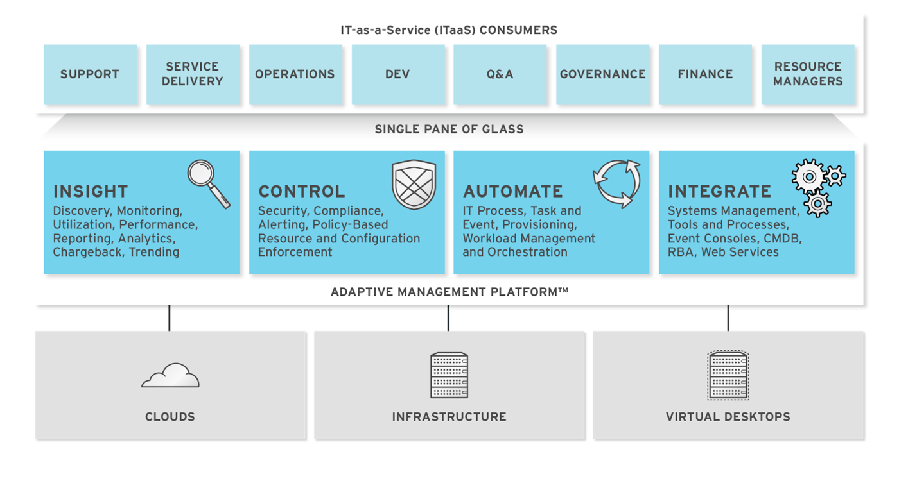

*Figure 1.1. Features*

 +

The architecture comprises the following components:

* The ManageIQ Appliance (Appliance) which is supplied as a secure, high-performance, preconfigured virtual machine. It provides support for Secure Socket Layer (SSL) communications.
* The ManageIQ Server (Server) resides on the Appliance. It is the software layer that communicates between the SmartProxy and the Virtual Management Database. It includes support for Secure Socket Layer (SSL) communications.
* The Virtual Management Database (VMDB) resides either on the Appliance or another computer accessible to the Appliance. It is the definitive source of intelligence collected about your Virtual Infrastructure. It also holds status information regarding Appliance tasks.
* The ManageIQ Console (Console) is the Web interface used to view and control the Server and Appliance. It is consumed through Web 2.0 mash-ups and web services (WS Management) interfaces.
* The SmartProxy can reside on the Appliance or on an ESX Server. If not embedded in the Server, the SmartProxy can be deployed from the Appliance. Each storage location must have a SmartProxy with visibility to it. The SmartProxy acts on behalf of the Appliance communicating with it over HTTPS (SSL) on standard port 443.

=== Requirements

To use ManageIQ, the following requirements must be met:

* One of the following Web Browsers:
** Mozilla Firefox for versions supported under Mozilla's Extended Support Release (ESR) link:#ftn.idm226480397136[^[1]^]
** Internet Explorer 8 or higher
** Google Chrome for Business
* A monitor with minimum resolution of 1280x1024.
* Adobe Flash Player 9 or above. At the time of publication, you can access it at http://www.adobe.com/products/flashplayer/[http://www.adobe.com/products/flashplayer/].
* The ManageIQ Appliance must already be installed and activated in your enterprise environment.
* The SmartProxy must have visibility to the virtual machines and cloud instances that you want to control.
* The resources that you want to control must have a SmartProxy associated with them.

IMPORTANT: Due to browser limitations, ManageIQ supports logging in to only one tab for each multi-tabbed browser. Console settings are saved for the active tab only. For the same reason, ManageIQ does not guarantee that the browser's *Back* button will produce the desired results. ManageIQ recommends using the breadcrumbs provided in the Console.

=== Terminology

*The following terms are used throughout this document. Review them before proceeding.*

Account Role::
  A designation assigned to a user allowing or restricting a user to parts and functions of the ManageIQ console.
Action::
  An execution that is performed after a condition is evaluated.
Alert::
  ManageIQ alerts notify administrators and monitoring systems of critical configuration changes and threshold limits in the virtual environment. The notification can take the form of either an email or an SNMP trap.
Analysis Profile::
  A customized scan of hosts, virtual machines, or instances. You can collect information from categories, files, event logs, and registry entries.
Cloud::
  A pool of on-demand and highly available computing resources. The usage of these resources are scaled depending on the user requirements and metered for cost.
ManageIQ Appliance::
  A virtual machine on which the virtual management database (VMDB) and ManageIQ server reside.
ManageIQ Console::
  A web-based interface into the ManageIQ Appliance.
ManageIQ Role::
  A designation assigned to a ManageIQ server that defines what a ManageIQ server can do.
ManageIQ Server::
  The application that runs on the ManageIQ Appliance and communicates with the SmartProxy and the VMDB.
Cluster::
  Hosts that are grouped together to provide high availability and load balancing.
Condition::
  A test of criteria triggered by an event.
Discovery::
  Process run by the ManageIQ server which finds virtual machine and cloud providers.
Drift::
  The comparison of a virtual machine, instance, host, cluster to itself at different points in time.
Event::
  A trigger to check a condition.
Event Monitor::
  Software on the ManageIQ Appliance which monitors external providers for events and sends them to the ManageIQ server.
Host::
  A computer on which virtual machine monitor software is loaded.
Instance/Cloud Instance::
  A on-demand virtual machine based upon a predefined image and uses a scalable set of hardware resources such as CPU, memory, networking interfaces.
Managed/Registered VM::
  A virtual machine that is connected to a host and exists in the VMDB. Also, a template that is connected to a provider and exists in the VMDB. Note that templates cannot be connected to a host.
Managed/Unregistered VM::
  A virtual machine or template that resides on a repository or is no longer connected to a provider or host and exists in the VMDB. A virtual machine that was previously considered registered may become unregistered if the virtual machine was removed from provider inventory.
Provider::
  A computer on which software is loaded which manages multiple virtual machines that reside on multiple hosts.
Policy::
  A combination of an event, a condition, and an action used to manage a virtual machine.
Policy Profile::
  A set of policies.
Refresh::
  A process run by the ManageIQ server which checks for relationships of the provider or host to other resources, such as storage locations, repositories, virtual machines, or instances. It also checks the power states of those resources.
Resource::
  A host, provider, instance, virtual machine, repository, or datastore.
Resource Pool::
  A group of virtual machines across which CPU and memory resources are allocated.
Repository::
  A place on a datastore resource which contains virtual machines.
SmartProxy::
  The SmartProxy is a software agent that acts on behalf of the ManageIQ Appliance to perform actions on hosts, providers, storage and virtual machines.
  +
  The SmartProxy can be configured to reside on the ManageIQ Appliance or on an ESX server version. The SmartProxy can be deployed from the ManageIQ Appliance, and provides visibility to the VMFS storage. Each storage location must have a SmartProxy with visibility to it. The SmartProxy acts on behalf of the ManageIQ Appliance. If the SmartProxy is not embedded in the ManageIQ server, it communicates with the ManageIQ Appliance over HTTPS (SSL) on standard port 443.
SmartState Analysis::
  Process run by the SmartProxy which collects the details of a virtual machine or instance. Such details include accounts, drivers, network information, hardware, and security patches. This process is also run by the ManageIQ server on hosts and clusters. The data is stored in the VMDB.
SmartTags::
  Descriptors that allow you to create a customized, searchable index for the resources in your clouds and infrastructure.
Storage Location::
  A device, such as a VMware datastore, where digital information resides that is connected to a resource.
Tags::
  Descriptive terms defined by a ManageIQ user or the system used to categorize a resource.
Template::
  A template is a copy of a preconfigured virtual machine, designed to capture installed software and software configurations, as well as the hardware configuration, of the original virtual machine.
Unmanaged Virtual Machine::
  Files discovered on a datastore that do not have a virtual machine associated with them in the VMDB. These files may be registered to a provider that the ManageIQ server does not have configuration information on. Possible causes may be that the provider has not been discovered or that the provider has been discovered, but no security credentials have been provided.
Virtual Machine::
  A software implementation of a system that functions similar to a physical machine. Virtual machines utilize the hardware infrastructure of a physical host, or a set of physical hosts, to provide a scalable and on-demand method of system provisioning.
Virtual Management Database (VMDB)::
  Database used by the ManageIQ Appliance to store information about your resources, users, and anything else required to manage your virtual enterprise.
Virtual Thumbnail::
  An icon divided into smaller areas that summarize the properties of a resource.

=== About this Guide

This Guide includes the following sections:

* _Provisioning Requests_ This section gives out information about Provisioning virtual machines which is a strategy for efficiently managing space in a storage area network (SAN) by allocating physical storage on an "as needed" basis. It discusses how to create a request and how to customize the dialogs displayed.
* _Working with Requests_ This section talks about the different approval methods. The request can be approved manually in the ManageIQ console or by using an external method.
* _Fulfilling Requests_ shows how the requests are executed after they have been approved.
* _Catalogs and Services_ describes how to use ManageIQ to create multi-tiered services.In this section you can find out how through the use of catalogs, ManageIQ provides support for multi-tier service provisioning to deploy layered workloads across hybrid environments.
* _Retirement_ shows the different ways that ManageIQ allows you to control the retirement of Virtual Machines. This feature can be brought to use when a virtual machine or instance is no longer required. Using the Retirement feature a virtual machine or instance is immediately stopped, and will be shut down if an attempt is made to restart it.
* _Automate Model_ describes the parts of the model and how to create and edit them. ManageIQ Automate enables real-time, bi-directional process integration and adaptive automation for management events and administrative or operational activities.
* _Invoking Automate_ shows the different methods by which you can call ManageIQ.

== CloudForms Management Engine Lifecycle

This guide discusses lifecycle activities such as provisioning and retirement that are part of the ManageIQ Automate component. ManageIQ Automate enables real-time, bidirectional process integration and adaptive automation for management events and administrative or operational activities.

* Operations Management with service level resource enforcement.
* Resource Management including datastore cleanup, snapshot aging and enforcement, and virtual machine or instance aging and retirement.
* Configuration and Change Management including enforced closed loop change management.
* Lifecycle Management such as provisioning, customization, reconfiguration, approval, CMDB updates, and retirement.

IMPORTANT: Provisioning requires the *Automation Engine* server role enabled. Check your server role settings in *Configure* → *Configuration* → *Server* → *Server Control*.

=== Provisioning

When a virtual machine or cloud instance is provisioned, it goes through multiple phases. First, the request must be made. The request includes ownership information, tags, virtual hardware requirements, the operating system, and any customization of the request. Second, the request must go through an approval phase, either automatic or manual. Finally, the request is executed. This part of provisioning consists of pre-processing and post-processing. Pre-processing acquires IP addresses for the user, creates CMDB instances, and creates the virtual machine or instance based on information in the request. Post-processing activates the CMDB instance and emails the user. The steps for provisioning may be modified at any time using ManageIQ.

=== Automation

ManageIQ Automate Model provides flexibility to not only change parts of the provisioning process, but also to allow you to automate other operational tasks. Below are some scenarios where ManageIQ can help accomplish these tasks.

* Intelligent Workload Management - An enterprise had a requirement that when a virtual machine has reached a High CPU Percent Ready for a specified period of time, a vMotion should occur to a more suitable host. For this reason, VMware's Distributed Resource Scheduler (DRS) was not practical, as the CPU Ready metric could not trigger DRS. The solution was to leverage ManageIQ Control and ManageIQ Automate to drive the management of this workflow.
* Power on only during business hours - An organization which gave a group of self-service users ManageIQ access had a requirement to only allow certain virtual machines to be powered during business hours. This was solved with ManageIQ Automate.
* Auto-Tagging virtual machines based on file contents - An IT organization needed a way to consume information from a text file on a virtual machine and dynamically populate vCenter. The data used to auto-tag virtual machines is also used to align unmanaged virtual machines to the business.

== Provisioning Requests

This chapter will discuss using ManageIQ Console for provisioning. While making a provisioning request, the user is able to do any of the following:

* Set an owner (User can do this using LDAP lookup)
* Assign a purpose (tag)
* Select a template or image from which to create a new virtual machine or instance respectively
* Choose placement
* Set hardware requirements
* Specify the vLan
* Customize the guest operating system
* Schedule the provisioning

=== Requirements for Provisioning Virtual Machines and Instances

==== Requirements for Provisioning Virtual Machines from VMware Providers

To provision a virtual machine from VMware providers, you will require the following in addition to the ManageIQ Automate requirements:

IMPORTANT: If you are using a Windows template, the following steps are essential.

* To customize settings that are inside the operating system, Sysprep must be copied to the appropriate directory on your vCenter computer. Usually this location is: `C:\Documents and Settings\All Users\Application Data\VMware\VMware VirtualCenter\sysprep`. Copy the Sysprep tools to the relevant operating system subdirectory. If you are running a standard Win2008 operating system, this step will be unnecessary.
+
NOTE: If you are running a standard Win2008 operating system, this step is unnecessary as Sysprep is included as standard.
* The Windows template must have the latest version of VMware tools for its ESX Server. Check the VMware Site for more information. If you will be creating a new password for the Administrator account, the Administrators password must be blank on the template. (This is a limitation of Microsoft Sysprep.)

Refer to VMware documentation for a complete list of customization requirements.

==== Requirements for Provisioning Virtual Machines from Red Hat Enterprise Virtualization Manager

Below are the requirements for using *Red Hat Enterprise Virtualization Manager* with ManageIQ:

*Table 3.1. Red Hat Enterprise Virtualization Manager configuration requirements for ManageIQ*

[width="100%",cols="<50%,<50%",options="header",]
|=============================================================================================================================================================================
|Item |Requirements
|Red Hat Enterprise Virtualization Manager version 3.0 |Red Hat Enterprise Virtualization Manager properly installed with API in default location `(https://server:8443/api)`.
|Red Hat Enterprise Virtualization Manager History Database |[multiblock cell omitted]
|Storage Supported for ManageIQ Virtual Machine Analysis |[multiblock cell omitted]
|=============================================================================================================================================================================

 +

The following are requirements for provisioning virtual machines from Red Hat Enterprise Virtualization Manager:

* DHCP server configured with required PXE implementation
* PXE implementation for Linux virtual machine provisioning

* NFS and SAMBA read and write access to create and modify files on the PXE server
* ManageIQ Server uses NFS mount to read and write the response files

* HTTP read access to the NFS share location as virtual machines use this URL to access PXE images and Kickstart configuration files
* Operating system installation media available to be streamed from PXE server
* Images configured for desired operating systems
* Kickstart templates to configure operating systems with desired packages

Additional Requirements for provisioning Linux virtual machines:

* Linux distribution kernel and ramdisk available over HTTP
* Linux sources available over HTTP
* Sample PXE menu item that boots this kernel

Additional Requirements for provisioning Windows virtual machines:

* WinPE ISO built with proper rhev-agent-tools and configured to mount shares for Windows source files and Sysprep files and configured to run customization script
* Windows based WIM file with operating system installed and configured with Sysprep
* Sample Sysprep unattend file to be used with the operating system
* Sample PXE menu item that downloads WinPE ISO, mount in memdisk and boot into WinPE environment

==== PXE Provisioning

===== PXE Provisioning

PXE is a boot method that allows you to load files from across a network link. ManageIQ uses it for files required for provisioning virtual machines. PXE can be used for provisioning for either Red Hat Enterprise Virtualization Manager or VMware.

* Connect to the *PXE Server*.
* Create a *System Image Type*.
* Associate each *PXE* image with an image type.
* Create a customization template.

===== Connecting to a PXE Server

The following procedure connects to a PXE server and adds its details to ManageIQ.

1.  Navigate to *Infrastructure* → *PXE*.
2.  Click image:images/1847.png[image] (*Configuration*), then image:images/1848.png[image] (*Add a New PXE Server*).
3.  In *Basic Information*, type a *Name* that will be meaningful in your environment.
+
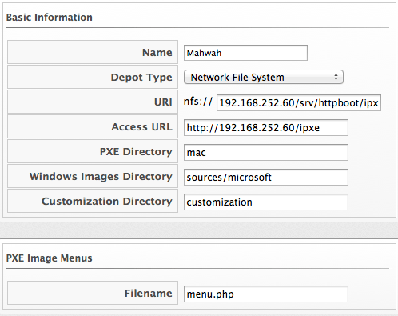
4.  For *Depot Type*, select either *Network File System* (NFS) or *Samba*. The fields to enter in the dialog depend on the *Depot Type*.
* For NFS, type in the *URI*, *Access URL*, *PXE Directory*, *Windows Images Directory* and *Customization Directory*. When you provision, ManageIQ writes a text file to the *PXE Directory*. The file is named after the MAC address of the NIC that is assigned to the virtual machine. It contains where to get the kernel and initrd image. This file is removed after a successful provision. The *Windows Images Directory* is where the files are located on your NFS for the provisioning of Windows operating systems. The *Customization Directory* is where your Kickstart and Sysprep files are located.
* If using a *Depot Type* of *Samba*, you will not need *Access URL*, but you will need a *User ID*, and *Password*, in addition to the items required for NFS.
5.  For *PXE Image Menus*, type the *filename* for the PXE Boot menu.
6.  Click *Add*.
7.  Select the new PXE server from the tree on the left, and click image:images/1847.png[image] (*Configuration*), then  (*Refresh*) to see your existing images.

NOTE: Next, create PXE Image types to associate with the customization templates and to specify if the image type is for a virtual machine, a host, or both.

===== Creating System Image Types for PXE

The following procedure creates a system image type for PXE servers.

1.  Navigate to *Infrastructure* → *PXE*.
2.  Click the *System Image Types* accordion.
+
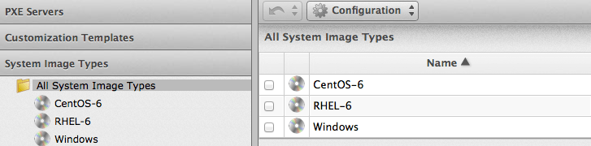
3.  Click image:images/1847.png[image] *Configuration*, then image:images/1848.png[image] *(Add a new System Image Type)*.
4.  In *Basic Information*, type in a *Name* and select a *Type*.
+
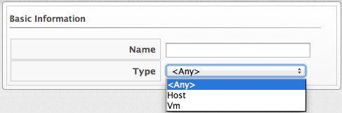
* Use *Host* if you want this image type to only apply to hosts.
* Use *Vm* if you want this image type to only apply to virtual machines.
* Use *Any* if this image type can be used for either hosts or virtual machines.
5.  Click *Add*.

NOTE: After creating the System Image Types, assign the types to each image on your PXE servers. To do this, you will select each image on the PXE server and identify its type.

===== Setting the PXE Image Type for a PXE Image

The following procedure sets the image type for a chosen PXE image.

1.  Navigate to *Infrastructure* → *PXE*.
2.  Click the *PXE Servers* accordion and select the image that you want to set a type for.
3.  Click image:images/1847.png[image] *(Configuration)*, then image:images/1851.png[image] *(Edit this PXE Image)*.
4.  From the *Basic Information* area, select the correct type. If this PXE image will be used as the *Windows Boot Environment*, check *Windows Boot Environment*. At the time of this writing, only one PXE Image can be identified as the *Windows Boot Environment*. Therefore, checking one as the *Windows Boot Environment*, will remove that from any other PXE image with that check.
+
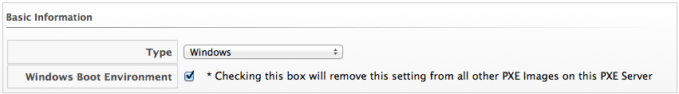
5.  Click *Save*.
+
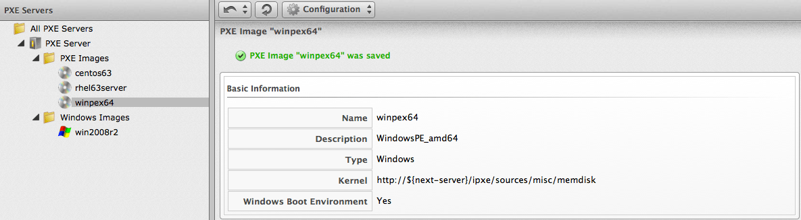

==== ISO Provisioning

===== ISO Provisioning

ManageIQ also allows ISO provisioning from *Red Hat Enterprise Virtualization Manager* datastores. To use this feature, you will need to do the following before creating a provision request.

1.  Add the *ISO Datastore*. The *Red Hat Enterprise Virtualization Manager* system must have already been discovered or added into the VMDB. For more information, see the _Insight Guide_.
2.  Refresh the *ISO Datastore*.
3.  Create a *System Image Type*.
4.  Set the *ISO Image Type*.
5.  *Create* a customization template.

===== Adding an ISO Datastore

The following procedure adds an ISO Datastore from your Red Hat Enterprise Virtualization environment.

1.  Navigate to *Infrastructure* → *PXE*.
2.  Click the *ISO Datastores* accordion.
3.  Click image:images/1847.png[image] *(Configuration)*, image:images/1848.png[image] *(Add a new ISO Datastore)*.
4.  Select the *Red Hat Enterprise Virtualization Manager* Provider hosting the ISO Datastore.
5.  Click *Add*.

The ISO datastore is added to ManageIQ.

===== Refreshing an ISO Datastore

The following procedure refreshes the chosen ISO datastore and updates ManageIQ with available ISOs.

1.  Navigate to *Infrastructure* → *PXE*.
2.  Click the *ISO Datastores* accordion, and select an ISO datastore.
3.  Click image:images/1847.png[image] *(Configuration)*, then click  *(Refresh)*.

===== Creating System Image Types for ISO

The following procedure creates a system image type for ISO Servers.

1.  Navigate to *Infrastructure* → *PXE*.
2.  Click the *System Image Types* accordion.
3.  Click image:images/1847.png[image] *(Configuration)*, then image:images/1848.png[image] *(Add a new System Image Type)*.
4.  In *Basic Information*, type in a *Name* and select a *Type*.
+

* Use *Host* if you want this image type to only apply to hosts.
* Use *Vm* if you want this image type to only apply to virtual machines.
* Use *Any* if this image type can be used for either hosts or virtual machines.
5.  Click *Add*.
+

NOTE: After creating the system image types, assign the types to each image on your ISO servers. To do this, you will select each image on the ISO server and identify its type.

===== Setting the Image Type for an ISO Image

The following procedure sets the image type for an ISO image.

1.  Navigate to *Infrastructure* → *PXE*.
2.  Click the *PXE Servers* accordion, and select the image that you want to set a type for.
3.  Click image:images/1847.png[image] *(Configuration)*, then image:images/1851.png[image] *(Edit this ISO Image)*.
4.  From the *Basic Information* area, select the correct *Type*.
+
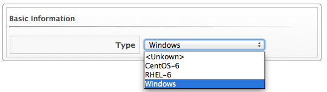
5.  Click *Save*.

==== Customization Templates for Virtual Machine and Instance Provisioning

Add a customization template to provide Kickstart, Cloudinit, or Sysprep files for the initial loading of the operating system. For each of these types of customizations, there are certain sections to use to allow for interactions with the Provisioning Dialogs provided by ManageIQ.

Note the following additional requirements if you are performing PXE or ISO provisioning:

* ISO Provisioning requires that the *Kickstart* file be named `ks.cfg`
* ISO Provisioning requires that the new virtual machine must be set to power down after provisioning is complete.
* When you get to the *Catalog* page in the *Provisioning Dialogs*, be sure to select *Provision Type* of ISO or PXE as appropriate.

===== Customization Script Additions for Virtual Machine and Instance Provisioning

*Table 3.2. List of Customization Script Additions for Virtual Machine Provisioning*

[width="100%",cols="<11%,<22%,<67%",options="header",]
|=====================================================================================================================================================================================================================================================
|Customization Type |Reason to Include |Script entries
|Kickstart |Takes the values from the *Customize* tab in *Provisioning Dialog* and substitutes them into the script. |[multiblock cell omitted]
|Kickstart |Encrypts the root password from the *Customize* tab in the *Provisioning Dialog*. |[multiblock cell omitted]
|Kickstart |Sends status of the provision back to ManageIQ Server for display in the ManageIQ Console. |[multiblock cell omitted]
|Sysprep |Encrypts the root password from the *Customize* tab in the *Provisioning Dialog*. The value for the *AdministratorPassword* line must be inserted to use the password from the *Provision Dialog* and encrypt it. |[multiblock cell omitted]
|=====================================================================================================================================================================================================================================================

 +

===== Adding a Customization Template

1.  Navigate to *Infrastructure* → *PXE*.
2.  Click the *Customization Templates* accordion.
3.  Click image:images/1847.png[image] *(Configuration)*, image:images/1848.png[image] *(Add a new Customization Template)*.
4.  In *Basic Information*, type in a *Name* and *Description*.
+
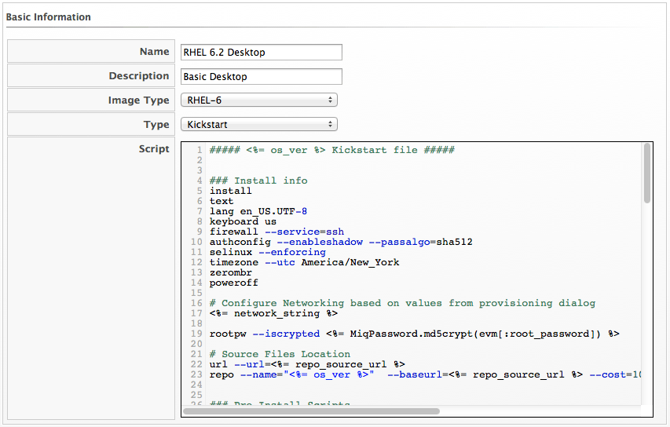
5.  Select the *Image Type*. This list should include the PXE image types you created.
6.  In *Type*, select *Kickstart* or *Cloudinit* for Linux based systems, and *Sysprep* for Windows based system.
7.  In the *Script* area, either paste the script from another source or type the script directly into the ManageIQ interface.
8.  Click *Add*.

NOTE: The default dialogs show all possible parameters for provisioning. To limit the options shown, see _Customizing Provisioning Dialogs_.

=== Requirements for Provisioning a Host

ManageIQ can provision hosts using PXE and Intelligent Platform Management Interface (IPMI) technologies. To do this, complete the following steps before you provision your first host.

When creating a provisioning request, you may want to limit which hosts, datastores, and templates, a group can choose from. To do this, create a tag value with the exact name of the user group for the *Provisioning Scope Category*. For example, if you want to limit the scope for the group named EvmGroup-desktop, create a tag value of EvmGroup-desktop. Then, assign that tag to the hosts, datastores, and template to which you want to limit this group.

IMPORTANT: Provisioning requires the *Automation Engine* server role enabled. Check your server role settings in *Configure* → *Configuration* → *Server* → *Server Control*.

IMPORTANT: In addition to ensuring that the *Automation Engine* role is enabled, you have to go through and set the *Provisioning Scope* tag to *All*, for a provider, a host, and then a data store.

1.  Make a PXE server accessible to the ManageIQ server.
2.  Create a customization template for hosts. This customization template must contain host-specific additions, documented in the _Customization Templates for Host Provisioning_ section.
3.  Create system image types for the host.
4.  Associate images with the image types.
5.  Enable IPMI on provisioning hosts and add them to the ManageIQ Infrastructure.

==== IPMI Hosts

===== IPMI Hosts

There are two ways to get the Intelligent Platform Management Interface (IPMI) Host into the VMDB. You can either use the ManageIQ's discovery process or add the host using its IP address and credentials.

===== Discovering the Management Interface for an IPMI Host

1.  Navigate to *Infrastructure* → *Hosts*.
2.  Click image:images/1847.png[image] *(Configuration)*, then  *(Discover Hosts)*.
3.  In *Discover*, check *IPMI*.
4.  Optionally, in *IPMI Credentials*, type in a *User ID* and *Password*.
+
NOTE: You can also add IPMI credentials after the host has been discovered. See _Adding IPMI Credentials to a Discovered Host_.
5.  In *Subnet Range*, type in a range of IP addresses. For quickest results, use the actual IP address in both fields.
6.  Click *Discover*.

NOTE: After the host is discovered, you can add credentials for IPMI.

===== Adding IPMI Credentials to a Discovered Host

After discovering an IPMI host, add the credentials using the following procedure.

1.  Navigate to *Infrastructure* → *Hosts*.
2.  Click on the host you want to edit.
3.  Click image:images/1847.png[image] *(Configuration)*, and then image:images/1851.png[image] *(Edit this Host)*.
4.  In the *Credentials* area, *IPMI* tab, type in the IPMI credentials
1.  Use *User ID* to specify a login ID.
2.  Use *Password* to specify the password for the user ID.
3.  Use *Verify Password* to confirm the password.
5.  Click *Validate* to test the credentials.
6.  Click *Save*.

===== Adding the Management Interface for an IPMI Host

1.  Navigate to *Infrastructure* → *Hosts*.
2.  Click image:images/1847.png[image] *(Configuration)*, then image:images/1848.png[image] *(Add a New Host)*.
3.  In *Basic Information*, type in a *Name* and the *IPMI IP address*.
4.  In the *Credentials* area, under *IPMI* tab, type in the IPMI credentials
1.  Use *User ID* to specify a login ID.
2.  Use *Password* to specify the password for the User ID.
3.  Use *Verify Password* to confirm the password.
5.  Click *Validate* to test the credentials.
6.  Click *Add*.

The IPMI host is added to the ManageIQ environment; an operating system can now be provisioned onto it.

==== Customization Templates for Host Provisioning

Add a customization template to provide Kickstart files for the initial loading of the operating system. There are certain sections to use to allow for interactions with the provisioning dialogs provided by ManageIQ.

===== Customization Script Additions

*Table 3.3. Customization Script Additions*

[width="100%",cols="<22%,<22%,<56%",options="header",]
|=================================================================================================================================================================
|Customization Type |Reason to Include |Script entries
|Kickstart |Takes the values from the *Customize* tab in *Provisioning Dialog* and substitutes them into the script. |[multiblock cell omitted]
|Kickstart |Encrypts the root password from the *Customize* tab in the *Provisioning Dialog*. |[multiblock cell omitted]
|Kickstart |Sends status of the provision back to ManageIQ for display in the ManageIQ Console. |[multiblock cell omitted]
|=================================================================================================================================================================

 +

===== Adding a Customization Template

1.  Navigate to *Infrastructure* → *PXE*.
2.  Click the *Customization Templates* accordion.
3.  Click image:images/1847.png[image] *(Configuration)*, then image:images/1848.png[image] *(Add a New Customization Template)*.
4.  In *Basic Information*, type in a *Name* and *Description*.
+
image:images/2325.png[image]
5.  Select the *Image Type* dropdown. This list should include the PXE image types you created.
6.  In *Type*, select *Kickstart* or *Cloudinit* for Linux based systems, and *Sysprep* for Windows based system.
7.  In the *Script* area, either paste the script from another source or type the script directly into the ManageIQ interface.
8.  Click *Add*.

NOTE: The default dialogs show all possible parameters for provisioning. To limit the options shown, see _Customizing Provisioning Dialogs_.

=== Provisioning a Host

After setting up the IPMI and PXE environments, you are ready to provision a host. Currently, you can only provision in the cluster where the template is located or you can create a template in each cluster and let a ManageIQ Automate method automatically switch the selected template in the provision object.

IMPORTANT: A customization template with host-specific script additions is required. Ensure especially that the customization template contains the post-installation callback to enable discovery in ManageIQ.

1.  Navigate to *Infrastructure* → *Hosts*.
2.  Select a host with IPMI enabled.
3.  Click  *(Lifecycle)*, then image:images/1848.png[image] *(Provision Hosts)*.
4.  In *Request Information*, type in at least a *First Name* and *Last Name* and an email address. This email is used to send the requester status emails during the provisioning. The other information is optional. If the ManageIQ server is configured to use LDAP, you can use the *Look Up* button to populate the other fields based on the email address.
+
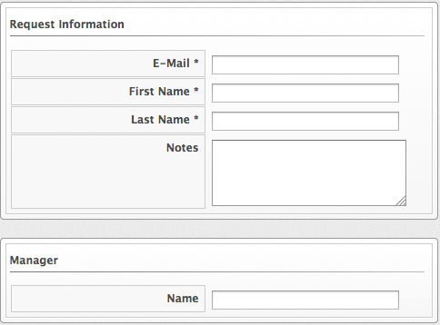
5.  On the *Purpose* page, select the appropriate tags for the provisioned host.
+
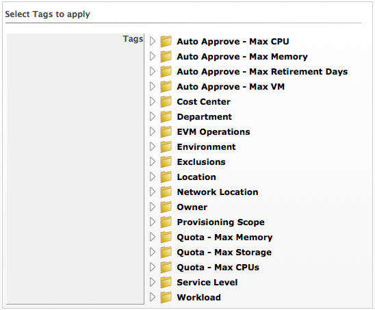
6.  On the *Catalog* page, select the hosts to provision.
* In the *Host* area, select the hosts you want to provision
* In the *PXE* area, select the PXE server and image.
7.  On the *Customize* page, you can select how you might want to customize the operating system of the new host. These options vary based on the operating system to be provisioned.
* Use *Credentials* to type in a root password
* In the *IP Address* area, select either *Static* or *DHCP* and enter any other address information you need. If needed, type in DNS specifications.
* Under *Customize Template*, select a script.
8.  On the *Schedule* page, decide if you want the provisioning to begin as soon as it is approved, or at a specific time.
+
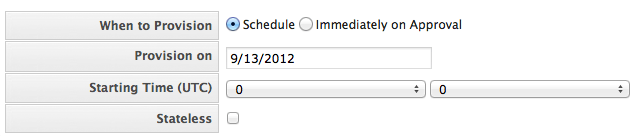
* In *Schedule Info*, choose if you want the provisioning to begin as soon as it is approved, or at a specific time. If you select *Schedule*, you will be prompted to enter a date and time.
* Check *Stateless* if you do not want the files deleted after the provision completes. A stateless provision does not write to the disk so it will need the PXE files on the next boot.
9.  Click *Submit*.

The provisioning request is sent for approval. For the provisioning to begin, a user with the admin, approver, or super admin account role must approve the request. The admin and super admin roles can also edit, delete, and deny the requests. You will be able to see all provisioning requests where you are either the requester or the approver.

=== Provisioning Virtual Machines

There are three types of provisioning requests available in ManageIQ:

1.  Provision a new virtual machine from a template
2.  Clone a virtual machine
3.  Publish a virtual machine to a template

==== Provisioning a Virtual Machine from a Template

You can provision virtual machines through various methods. One method is to provision a virtual machine directly from a template stored on a provider.

1.  Navigate to *Infrastructure* → *Virtual Machines*.
2.  Click  *(Lifecycle)*, and then image:images/1848.png[image] *(Provision)*.
3.  Select a template from the list presented.
4.  Click *Continue*.
5.  On the *Request* tab, enter information about this provisioning request.
+

+
In *Request Information*, type in at least a *First Name* and *Last Name* and an email address. This email is used to send the requester status emails during the provisioning process for items such as auto-approval, quota, provision complete, retirement, request pending approval, and request denied. The other information is optional. If the ManageIQ server is configured to use LDAP, you can use the *Look Up* button to populate the other fields based on the email address.
+
NOTE: Parameters with a * next to the label are required to submit the provisioning request. To change the required parameters, see _Customizing Provisioning Dialogs_.
6.  Click the *Purpose* tab to select the appropriate tags for the provisioned virtual machines.
7.  Click the *Catalog* tab to select the template to provision from. This tab is context sensitive based on provider.
8.  For templates on VMware providers:
1.  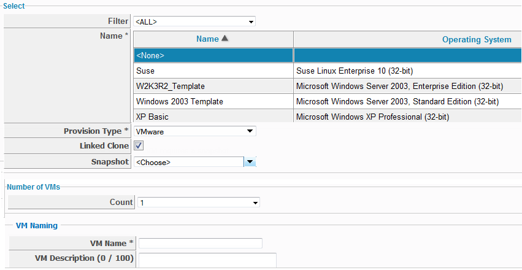
+
For *Provision Type*, select *NetApp*, *VMware*, or *PXE*.
1.  If *VMware* is selected, check *Linked Clone* if you want to create a linked clone to the virtual machine instead of a full clone. Since a snapshot is required to create a linked clone, this box is only enabled if a snapshot is present. Select the snapshot you want to use for the linked clone.
2.  If *PXE* is selected, select a PXE *Server* and *Image* to use for provisioning
2.  Under *Count*, select the number of virtual machines you want to create in this request.
3.  Use *VM Naming* to specify a virtual machine name and virtual machine description. When provisioning multiple virtual machines, a number will be appended to the virtual machine name.
9.  For templates on Red Hat providers:
1.  Select the *Name* of a template to use.
2.  For *Provision Type*, select either *ISO*, *PXE*, or *Native Clone*.
1.  If *Native Clone* is selected, check *Linked Clone* if you want to create a linked clone to the virtual machine instead of a full clone. This is equivalent to _Thin Template Provisioning_ in Red Hat Enterprise Virtualisation. Since a snapshot is required to create a linked clone, this box is only enabled if a snapshot is present. Select the snapshot you want to use for the linked clone.
2.  If *ISO* is selected, select an ISO *Image* to use for provisioning
3.  If *PXE* is selected, select a PXE *Server* and *Image* to use for provisioning
3.  Under *Count*, select the number of virtual machines you want to create in this request.
4.  Use *VM Naming* to specify a *VM Name* and *VM Description*. When provisioning multiple virtual machines, a number will be appended to the *VM Name*.
10. Click the *Environment* tab to decide where you want the new virtual machines to reside.
1.  If provisioning from a template on VMware, you can either let ManageIQ decide for you by checking *Choose Automatically*, or select a specific cluster, resource pool, folder, host, and datastore.
2.  If provisioning from a template on Red Hat, you can either let ManageIQ decide for you by checking *Choose Automatically*, or select a datacenter, cluster, host and datastore.
11. Click the *Hardware* tab to set hardware options.
+
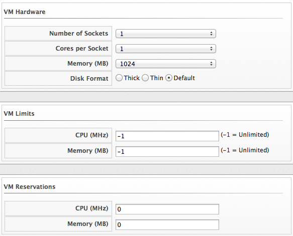
1.  In *VM Hardware*, set the number of CPUs, amount of memory, and disk format: thin, pre-allocated/thick or same as the provisioning template (default).
2.  For VMware provisioning, set the *VM Limits* of CPU and memory the virtual machine can use.
3.  For VMware provisioning, set the In *VM Reservation* amount of CPU and memory.
12. Click *Network* to set the vLan adapter. Additional networking settings that are internal to the operating system appear on the Customize tab.
+
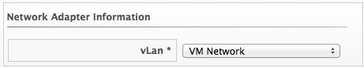
1.  In *Network Adapter Information*, select the *vLan*.
13. Click *Customize* to select how you might want to customize the operating system of the new virtual machine. These options vary based on the _operating system_ of the template.
14. 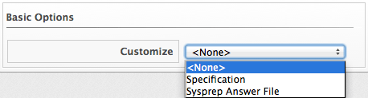
+
For Windows provisioning:
1.  To use a customer specification from the Provider, click *Specification*. To select an appropriate template, a list will be provided in the custom specification area. The values that are honored by ManageIQ will display.
+
NOTE: Any values in the specification that do not show in the ManageIQ console's request dialogs will not be used by ManageIQ. For example, for Windows operating systems, if you have any run once values in the specification, they will not be used in creating the new virtual machines. Currently, for a Windows operating system, ManageIQ honors the unattended GUI, identification, workgroup information, user data, windows options, and server license. If more than one network card is specified, only the first will be used.
+
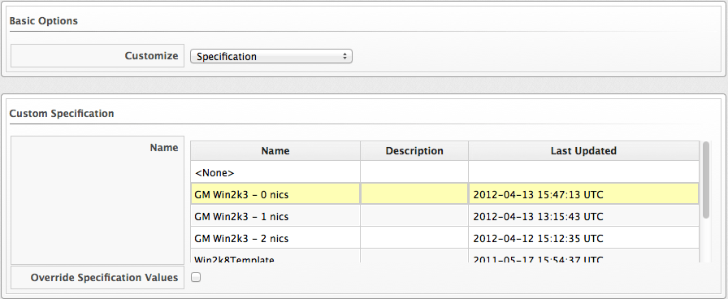
+
To modify the specification, check *Override Specification Values*.
2.  Select *Sysprep Answer File*, to upload a Sysprep file or use one that exists for a custom specification on the Provider where the template resides. To upload a file, click *Browse* to find the file, and then upload. To use an answer file in *Customization Specification*, simply click on the item. The answer file will automatically upload for viewing. You cannot make modifications to it.
15. For Linux provisioning:
1.  Under *Credentials*, enter a *Root Password* for the `root` user to access the instance.
2.  Enter a *IP Address Information* for the instance. Leave as *DHCP* for automatic IP assignment from the provider.
3.  Enter any *DNS* information for the instance if necessary.
4.  Select a *Customize Template* for additional instance configuration. Select from the Kickstart scripts stored on your appliance.
16. Click the *Schedule* tab to decide if you want the provisioning to begin as soon as it is approved, or at a specific time.
1.  In *Schedule Info*, choose if you want the provisioning to begin as soon as it is approved, or at a specific time. If you select *Schedule*, you will be prompted to enter a date and time.
2.  In *Lifespan*, select if you want to power on the virtual machines after they are created, and if you want to set a retirement date. If you select a retirement period, you will be prompted for when you want a retirement warning.
+
image:images/2338.png[image]
17. Click *Submit*.

The provisioning request is sent for approval. For the provisioning to begin, a user with the administrator, approver, or super administrator account role must approve the request. The administrator and super administrator roles can also edit, delete, and deny the requests. You will be able to see all provisioning requests where you are either the requester or the approver.

==== Cloning a Virtual Machine (VMware Virtual Machines Only)

1.  Navigate to *Infrastructure* → *Virtual Machines*, and check the virtual machine you want to clone.
2.  Click  *(Lifecycle)*, and then  *(Clone selected item)*.
3.  Fill in the options as shown in *To Provision* from a template using the provided dialogs. Be sure to check the *Catalog Tab*.
4.  Schedule the request on the *Schedule* tab.
5.  Click *Submit*.

==== Publishing a Virtual Machine to a Template (VMware Virtual Machines Only)

1.  Navigate to *Infrastructure* → *Virtual Machines*, and check the virtual machine you want to publish as a template.
2.  Click  *(Lifecycle)*, and then  *(Publish selected VM to a Template)*.
3.  Fill in the options as shown in *To Provision* from a template using the provided dialogs. Be sure to check the *Catalog* tab.
4.  Schedule the request on the *Schedule* tab.
5.  Click *Submit*.

=== Provisioning Instances

Cloud instances follow the same process (Request, Approval, Deployment) as a standard virtual machine from virtualization infrastructure. First, a user makes a request for instances and specifies the image, tags, availability zone and hardware profile flavor. Second, the request goes through the approval phase. Finally, ManageIQ executes the request.

==== Provisioning an Instance from an Image

1.  Navigate to *Clouds* → *Instances*.
2.  Click  (*Lifecycle*), then click image:images/1848.png[image] *(Provision Instances)*.
3.  Select an image from the list presented.
4.  Click *Continue*.
5.  On the *Request* tab, enter information about this provisioning request. In *Request Information*, type in at least a first and last name and an email address. This email is used to send the requester status emails during the provisioning process for items such as auto-approval, quota, provision complete, retirement, request pending approval, and request denied. The other information is optional. If the ManageIQ Server is configured to use LDAP, you can use the *Look Up* button to populate the other fields based on the email address.
+
NOTE: Parameters with a * next to the label are required to submit the provisioning request. To change the required parameters, see _Customizing Provisioning Dialogs_.
6.  Click the *Purpose* tab to select the appropriate tags for the provisioned instance.
7.  Click the *Catalog* tab for basic instance options.
1.  To change the image to use as a basis for the instance, select it from the list of images.
2.  Select the *Number of VMs* to provision.
3.  Type a *VM Name* and *VM Description*.
8.  Click the *Environment* tab to select the instance's *Availability Zone*. If no specific availability zone is require, select the *Choose Automatically* checkbox.
9.  Click the *Hardware* tab to set provider options such as hardware flavor and security settings.
1.  Select a flavor from the *Instance Type* list.
2.  Select a *Guest Access Key Pair* for access to the instance.
3.  In *Security Groups*, select which security group suits your allowed port and IP address requirements. Otherwise, leave at the default group.
4.  If provisioning from an Amazon EC2 provider, select the *CloudWatch* monitoring level. Leave as *Basic* for the default EC2 monitoring.
5.  In *Public IP Address*, select the public IP address that suits your requirements.
10. Click the *Customize* tab to set additional instance options.
1.  Under *Credentials*, enter a *Root Password* for the `root` user access to the instance.
2.  Enter a *IP Address Information* for the instance. Leave as *DHCP* for automatic IP assignment from the provider.
3.  Enter any *DNS* information for the instance if necessary.
4.  Select a *Customize Template* for additional instance configuration. Select from the Cloudinit scripts stored on your appliance.
11. Click the *Schedule* tab to set the provisioning and retirement date and time.
1.  In *Schedule Info*, choose whether the provisioning begins upon approval, or at a specific time. If you select *Schedule*, you will be prompted to enter a date and time.
2.  In *Lifespan*, select whether to power on the instances after they are created, and whether to set a retirement date. If you select a retirement period, you will be prompted for when to receive a retirement warning.
12. Click *Submit*.

The provisioning request is sent for approval. For the provisioning to begin, a user with the admin, approver, or super admin account role must approve the request. The admin and super admin roles can also edit, delete, and deny the requests. You will be able to see all provisioning requests where you are either the requester or the approver.

=== Customizing Provisioning Dialogs

==== Customizing Provisioning Dialogs

The default set of provisioning dialogs shows all possible options. However, ManageIQ also provides the ability to customize which tabs and fields are shown. You can decide what fields are required to submit the provisioning request or set default values.

For each type of provisioning, there is a dialog that can be created to adjust what options are presented. While samples are provided containing all possible fields for provisioning, you can remove what fields are shown. However, you cannot add fields or tabs.

Edit the dialogs to:

1.  Hide or show provisioning tabs.
2.  Hide or show fields. If you hide an attribute, the default will be used, unless you specify otherwise.
3.  Set default values for a field.
4.  Specify if a field is required to submit the request.
5.  Create custom dialogs for specific users.

==== Adding a Provision Dialog for all Users

1.  Navigate to *Automate* → *Customization*.
2.  Click the *Provisioning Dialogs* accordion.
3.  Click the type of dialog you want to create: *Host Provision*, *VM Provision* or *VM Migrate*.
4.  Select one of the default dialogs.
5.  Click image:images/1847.png[image] *(Configuration)*, and then  *(Copy this Dialog)*.
6.  Type a new *Name* and *Description* for the dialog.
7.  In the *Content* field,
* To remove a tab from display, change its display value to ignore. By choosing ignore, you not only hide the tab, but also skip any fields on that tab that were required. To show the tab, change the display value to show.
* To hide a field, change its display value from _`edit`_ to _`hide`_. To display fields of most data types, use _`edit`_. To display a button, use _`show`_. To set a default value for a field, use _`:default => defaultvalue`_ to the list of parameters for the field. Set the required parameter to either _`true`_ or _`false`_ based on your needs. Note that if you set required parameter to _`true`_, the field must have a value for the provision request to be submitted.
8.  Click *Add*.

If you are using *Provisioning Profiles*, you can specify a specific file that holds the customizations. To do this, you must create an instance mapping to this file in the ManageIQ Applications/provisioning/profile/VM provisioning by group class. By default, if you are using provisioning profiles and the group does not have a defined instance, the appropriate default dialog file will be used based on the type of provisioning selected.

==== Creating a Custom Provision Dialog

1.  Navigate to *Automate* → *Customization*.
2.  Click on the *Provisioning Dialogs* accordion.
3.  Click on the type of dialog you want to create, *Host Provision*, *VM Provision* or *VM Migrate*.
4.  Select one of the default dialogs.
5.  Click image:images/1847.png[image] *(Configuration)*, and then  *(Copy this Dialog).*
6.  Rename the dialog as shown in the examples below.
+
[width="100%",cols="<50%,<50%",options="header",]
|====================================================================
|Type of provision |Dialog name
|Provision Virtual Machine from a template |[multiblock cell omitted]
|Clone a Virtual Machine |[multiblock cell omitted]
|Publish a Virtual Machine to a template |[multiblock cell omitted]
|====================================================================
7.  Make any changes you need.
8.  In the *Content* field,
* To remove a tab from display, change its display value to ignore. By choosing ignore, you not only hide the tab, but also skip any fields on that tab that were required. To show the tab, change the display value to show.
* To hide a field, change its display value from *edit* to *hide*. To ensure the field does not get turned back on by a workflow model, use *:display_override => :hide*. To display fields of most data types, use *edit*. To display a button, use *show*. To set a default value for a field, use *:default => defaultvalue* to the list of parameters for the field. Set the required parameter to either *true* or *false* based on your needs. Note that if you set required to true, the field must have a value for the provision request to be submitted.
9.  Click *Add*.

Enter the name of the new dialog into the dialog name field in the appropriate ManageIQ Applications/provisioning/profile instance. This dialog can now be referred to in an instance in the Provisioning Profiles class so that it can be used for groups of users.

=== Provisioning Profiles

==== Provisioning Profiles

Provisioning profiles can be used to customize the dialogs and the state machine (steps used to provision the machine). Profiles can be created for LDAP or ManageIQ groups. To use provisioning profiles, you will need to:

* Create a *Provisioning Profile* instance for the LDAP or ManageIQ group. If no instance exists, then default settings will be used.
* If customizing dialogs, create a custom dialog file, and specify the name of that file in the provisioning profile instance. If customizing the states for provisioning, create a state instance and set the name of the state instance in the provisioning profile instance.

The diagram below shows where provisioning profiles are called during the entire provisioning process.

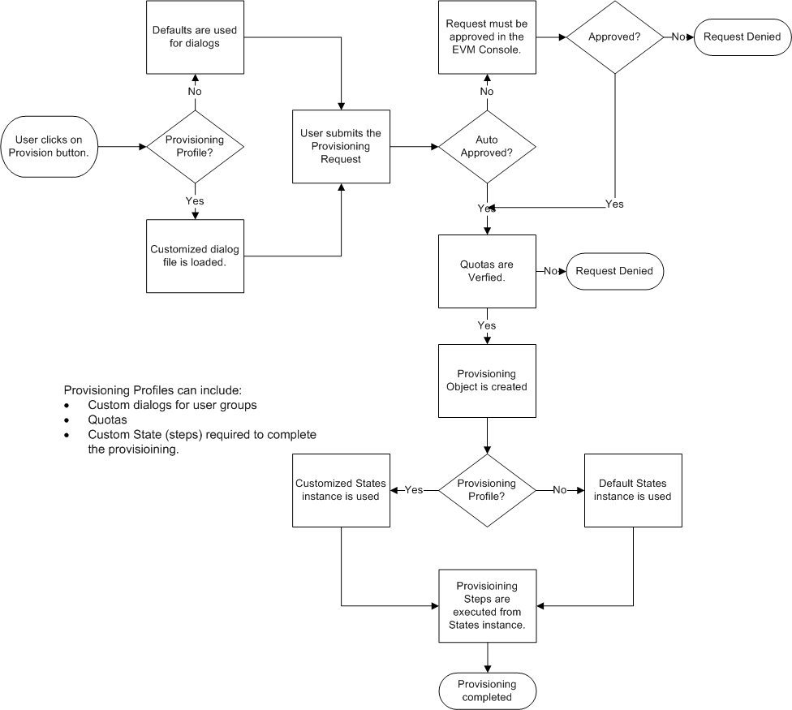

==== Creating a Provisioning Profile Instance

1.  Navigate to *Automate* → *Explorer*.
2.  Using the tree located in the accordion, select *EVMApplications* → *Provisioning* → *Profile* → *VM provisioning Group (VM)*.
3.  Click image:images/1847.png[image] *(Configuration)*,  *(Add a New Instance)*.
4.  Make the name of the tag identical to the name of the LDAP or ManageIQ group you are creating the instance for, replacing spaces in the group name with underscores. For example, change `CloudForms-test group` to `CloudForms-test_group`. This is how ManageIQ knows which instance to use.
+
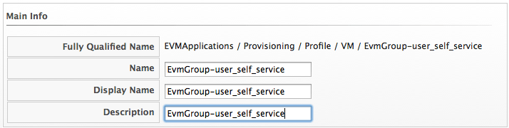
5.  In the dialog name field, type in the name of the customized dialog file. This file must reside on the ManageIQ Appliance in the `/var/www/miq/vmdb/db/fixtures` directory. As a best practice, you should name the file in the format `miq_provision_dialogs-groupname.rb`. Red Hat recommends putting this file on all ManageIQ Appliances. For instructions on how to create a custom dialog file, see *Customizing Provisioning Dialogs*.
+
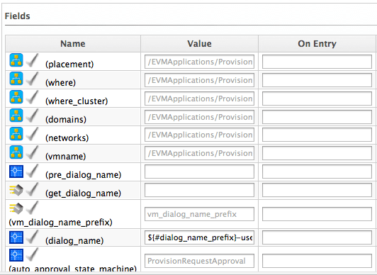
+
NOTE: Be sure that the custom dialog file exists. If it does not, an error will appear when the user clicks on the *Provisioning* button in the ManageIQ console.
6.  After making all required changes, click *Add*.

==== Using Tags to set a Scope for Provisioning

When creating a provisioning request, you may want to limit which hosts, datastores, and templates, a group can choose from. To do this, create a tag value with the exact name of the user group for the *Provisioning Scope Category*. For example, if you want to limit the scope for the group named EvmGroup-desktop, create a tag value of EvmGroup-desktop. Then, assign that tag to the hosts, datastores, and template to which you want to limit this group.

== Working with Requests

=== Provisioning Request Approval Methods

In this chapter, you will learn about the different approval methods. The request can be approved manually in the ManageIQ console, set for automatic approval by setting options in the *Automate Explorer*, or by using an external method.

When using an external method, the approval actually takes place on the external system and is sent directly for execution. This chapter discusses how to view and edit requests in the ManageIQ Console, how to approve a request, and how to set automatic approval parameters.

=== Working with Provisioning Requests

After a provisioning request is sent, if you have proper authority, you can copy, edit, delete, approve, or deny a request.

=== Reloading the Status of Provisioning Requests

1.  Navigate to *Services* → *Requests*.
2.  Click  *(Reload the current display)*.

=== Approving a Provisioning Request

After a user creates provisioning request, administrators have the ability to approve the request and allow ManageIQ to complete virtual machine or instance creation.

1.  Navigate to *Services* → *Requests*.
2.  Click on the request you want to approve.
3.  Type in a *Reason* for the approval.
4.  Click  *(Approve this request)*.

=== Denying a Provisioning Request

1.  Navigate to *Services* → *Requests*.
2.  Click on the request you want to deny.
3.  Type in a *Reason* for the denial.
4.  Click  *(Deny this request)*.

=== Copying a Provisioning Request

1.  Navigate to *Services* → *Requests*.
2.  Click on the request you want to copy.
3.  Click  *(Copy original provision request)*.
4.  Make changes to the request.
5.  Click *Submit*.

NOTE: If the logged in user is not same as the requester or the request has been already approved or denied, you cannot edit or delete the request.

=== Editing a Provisioning Request

1.  Navigate to *Services* → *Requests*.
2.  Click on the request you want to edit.
3.  Click image:images/1851.png[image] *(Edit the original provision request)*.
4.  Make changes to the request.
5.  Click *Submit*.

=== Deleting a Provisioning Request

1.  Navigate to *Services* → *Requests*.
2.  Click on the request you want to delete.
3.  Click  *(Delete this request)*.
4.  Click *OK* to confirm.

=== Automatically Approving Requests

==== Automatically Approving Requests

You can set thresholds for automatic approval of provisioning requests and, therefore, remove the requirement to manually approve the request. You can do this either as a global default or on a per template basis.

==== Enabling Global Defaults for Automatic Approval

To enable a global set of default approval values, edit the defaults instance by navigating to *Automate* → *Explorer*, then *Datastore* → *Factory* → *StateMachines* → *VM Provision Approval State Machine (ProvisionRequestApproval)* in the accordion menu. The parameters in this instance are used by the methods in that same class. By default, the maximum number of virtual machines or instances that can be automatically approved for provisioning is 1. To skip the check for the maximum number of virtual machines, set this field to 0. Set this field to -1 to force manual approval. At a minimum, you must change this parameter for all others to be validated.

1.  Navigate to *Automate* → *Explorer*.
2.  From the tree in the accordion menu, select *Datastore* → *Factory* → *StateMachines* → *VM Provision Approval State Machine (ProvisionRequestApproval)* → *Default*.
+
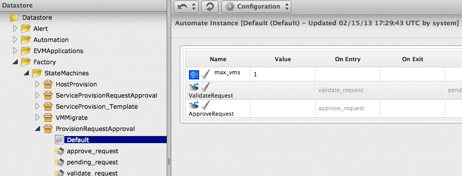
3.  Click image:images/1847.png[image] *(Configuration)*, then image:images/1851.png[image] *(Edit this instance)*.
+
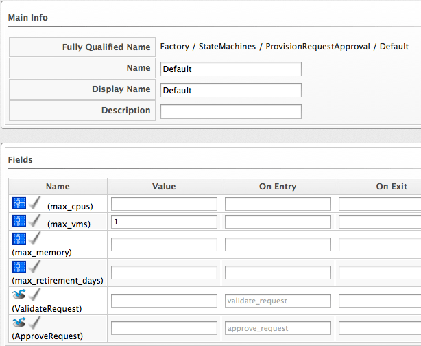
+
NOTE: Do not change any values other than those listed below. Doing so may prevent the automatic approval process from running.
* Use *max_cpus* to set the number of CPUs allowed to approve automatically the provisioning request.
* Use *max_vms* to set the maximum number of virtual machines or instances that are allowed to be provisioned automatically approve the request. If this is set to blank, no requests will be automatically approved.
* Use *max_memory* to set the maximum memory allowed to approve automatically the provisioning request.
* Use *max_retirement_days* to set the maximum number of days until the virtual machine or instance is retired to automatically approve this request.
* If a value is blank or _`0`_, the parameter is ignored.
4.  After making all required changes, click *Save*.

The thresholds for automatic approval are set. The next time a provision request is created these thresholds will be checked. If the requirements are met, the provisioning request will be approved with no user intervention.

==== Template Specific Approval Defaults

ManageIQ provides tags that can be used to set default automatic approval values on a per template or image basis. These values _supersede_ those in the *Automate* model. Use these tags to eliminate the need for manual approval for all provisioning requests. To enable automatic approval, assign the tags directly to templates or images.

[width="100%",cols="<50%,<50%",options="header",]
|====================================================
|[multiblock cell omitted] |[multiblock cell omitted]
|[multiblock cell omitted] |[multiblock cell omitted]
|[multiblock cell omitted] |[multiblock cell omitted]
|[multiblock cell omitted] |[multiblock cell omitted]
|[multiblock cell omitted] |[multiblock cell omitted]
|====================================================

==== Assigning Tags to a Template for Auto Approval

This procedure shows you how to assign tags to a template for auto approval.

1.  Navigate to *Infrastructure* → *Virtual Machines*.
2.  Click the *Templates* accordion, and select the templates that you want to tag.
3.  Click  *(Policy)*, and then  *(Edit Tags)*.
4.  Select a customer tag from the first dropdown, and then a value for the tag.

The thresholds for automatic approval for a specific template are set. The next time a provision request is created for this template these thresholds will be checked. If the requirements are met, the provisioning request will be approved with no user intervention.

=== Setting Provisioning Notification Email Addresses

ManageIQ contains a set of Automate instances for provisioning. These Automate instances also include email fields to set the sender and recipient of provisioning notifications, such as requests. These fields are set to `evmadmin@company.com` as a default.

1.  Navigate to *Automate* → *Explorer*.
2.  Choose the following Namespace: *Datastore* → *Alert*.
3.  Select the *Email Notifications (EmailNotifications)* class.
4.  Select an instance within the chosen class.
5.  Navigate to *Configuration* → *Edit Selected Instance*.
6.  Type the desired email addresses in the `to_email_address` and `from_email_address` fields.
7.  Click the *Save* button.

== Fulfilling Requests

=== Fulfilling a Request

After a request has been approved, ManageIQ then goes through the steps required to complete the request. The steps followed for a regular provision from a virtual machine to a virtual machine (not to a template) are found by navigating to *Automate* → *Explorer*, then listed under *Factory* → *StateMachines* → *VMProvision State Machine (VMProvision_VM)* → *Provision VM from Template (template) instance*. The value for each state shows where the instance resides in the *Datastore* accordion. The default set of execution steps is shown below. For more information on state machines, see _State Machines_.

==== Default Execution Steps in States Instance

*Table 5.1. Default Execution Steps in States Instance*

[width="100%",cols="<50%,<50%",options="header",]
|==================================================================================================
|Step |Description
|Customize Request |Apply customizations.
|Acquire IP Address |Integrates with IPAM (IP Address Management) to get an IP Address.
|Acquire MAC Address |Integrates with IPAM to get a MAC Address.
|Register DNS |Integrates with IPAM to register with DNS.
|Register CMDB |Integrates with CMDB (Configuration Management Database) to register with the CMDB.
|Register AD |Integrates with IPAM to register with active directory.
|PreProvision |Pre-provisioning steps.
|Provision |Create the virtual machine or instance.
|CheckProvisioned |Check that the new virtual machine or instance is in the VMDB.
|PostProvision |Post-provisioning steps.
|Register DHCP |Integrate with IPAM to register the IP address with DHCP Server.
|Activate CMDB |Integrate with IPAM to active the virtual machine or instance in the CMDB.
|Email owner |Send email to owner that the virtual machine or instance has been provisioned.
|==================================================================================================

 +

=== Quotas

==== Quotas

Quotas allow you to establish maximum usage thresholds for an owner or group for provisioned virtual machines or instances and are integrated into provisioning profiles. These maximums are checked after the approval but before the actual provision request is started. The quota is set for the group as a whole.

==== Editing the Default Quota

1.  Log in as a user with administrator or super administrator rights to the ManageIQ console.
2.  Navigate to *Automate* → *Explorer*.
3.  From the accordion menu, click *Datastore* → *Factory* → *StateMachines* → *VM Provision Quota Verification State Machine* → *Default*.
4.  Click image:images/1847.png[image] *(Configuration)*, image:images/1851.png[image] *(Edit this instance)*.
+
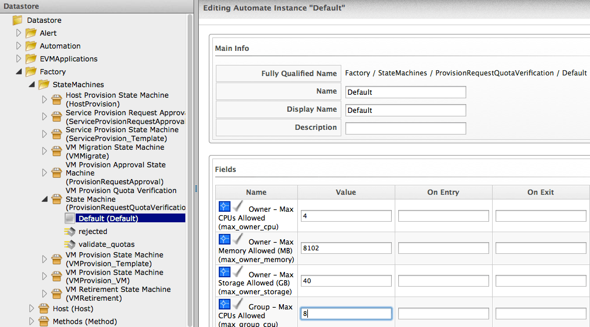
* Set the values for *Owner Max CPUs Allowed*, *Owner -- Max Memory Allowed*, or *Owner -- Max Storage Allowed* to be the maximums for a specific owner.
* Set the values for *Group Max CPUs Allowed*, *Group -- Max Memory Allowed*, or *Group -- Max Storage Allowed* to be the maximums for a specific user group.
5.  After making all required changes, click *Save*.

==== Using Tags for Owner and Group Quotas

ManageIQ provides tags for enforcing quotas for the owners of virtual machines or instances. Ownership of a virtual machine or instance can be set either during the provisioning process or by using the *Configuration Set Ownership* button. If a virtual machine or instance has an owner, the value is displayed in the *Lifecycle* section of the virtual machine or instance summary page.

Quota tags can be assigned directly to _either_ a group or owner _not_ to a configuration item. The table below shows the tags for use in quotas.

[width="100%",cols="<50%,<50%",options="header",]
|====================================================
|[multiblock cell omitted] |Use
|[multiblock cell omitted] |[multiblock cell omitted]
|[multiblock cell omitted] |[multiblock cell omitted]
|[multiblock cell omitted] |[multiblock cell omitted]
|====================================================

==== Applying a Tag to a User or User Group

1.  Click *Configure* → *Configuration*.
2.  Click the *Access Control* accordion, and select the user or group that you want to tag.
3.  Click  *(Policy)*, then click  *(Edit Tags)*.
4.  Select the appropriate customer tag to assign, then the value.
5.  Click *Save*.

=== State Machines

==== State Machines

A *State Machine* stores the status of something at a given time, and can operate on input to change the status. It can also cause an action or output to take place for any given change. State machines are also designed so that State-B cannot begin until State-A completes successfully.

The following components make up a ManageIQ Automate State machine:

*Table 5.2. State Machines Components*

[width="100%",cols="<50%,<50%",options="header",]
|===========================================================================================
|Component |Description
|On_Entry |Method to run when entering the State.
|On_Exit |Method to run when exiting the State.
|On_Error |Method to run if an error is encountered when running the state.
|Default Value |Runs after the On_Entry method completes (The actual state being processed).
|Max Retries |Maximum number of times to retry the state before exiting.
|Max Time |Maximum time in seconds to retry the state before exiting.
|===========================================================================================

 +

In the diagram below, you can see how these components combine to create a state machine workflow.

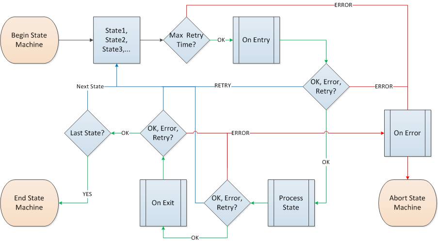

The following image shows a simple state machine pertaining to approving a provision request. This instance can be found in *Datastore* → *Factory* → *StateMachines* → *VM Provision Approval State Machine (Provision Request Approval)* → *Default*.

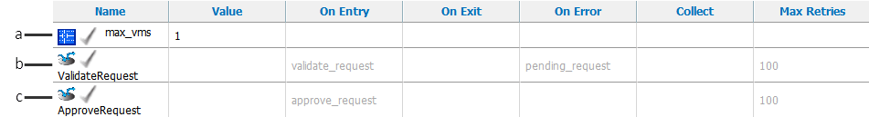

1.  The attribute `max_vms` has a value of 1. State machine processing can use the attributes of the state machine instance to make logic decisions. In this case, the `validate_request` method, which is processed during the `On_Entry` portion of the `ValidateRequest` state, evaluates the `max_vms` attribute. If the number of virtual machines requested is less than the `max_vms` value, the request can be auto-approved. See the `validate_request` method for more details.
2.  _ValidateRequest_ is the first state to be executed.
3.  _ApproveRequest_ is the next state to be executed.

NOTE: Grayed out items reflect values that are set in the class schema. These values can be overwritten on a per instance basis.

==== Customizing Provisioning States

The steps followed when provisioning a virtual machine or cloud instance are completed based on instances from the *Datastore* → *Factory* → *StateMachines* → *VMProvision* class. Depending on your environment you may want to remove, change, or add steps to the provisioning process. For example, if you are not integrating with IPAM or a CMDB, then you will want to remove those execution steps.

==== Editing the Default States Instance

1.  Navigate to *Automate* → *Explorer*.
2.  From the accordion menu, click *Datastore* → *Factory* → *StateMachines* → *VMProvision State Machine (VMProvision_VM)* → *Provision VM from Template (template)*.
3.  Click image:images/1847.png[image] *(Configuration)*, then image:images/1851.png[image] *(Edit this instance)*.
+
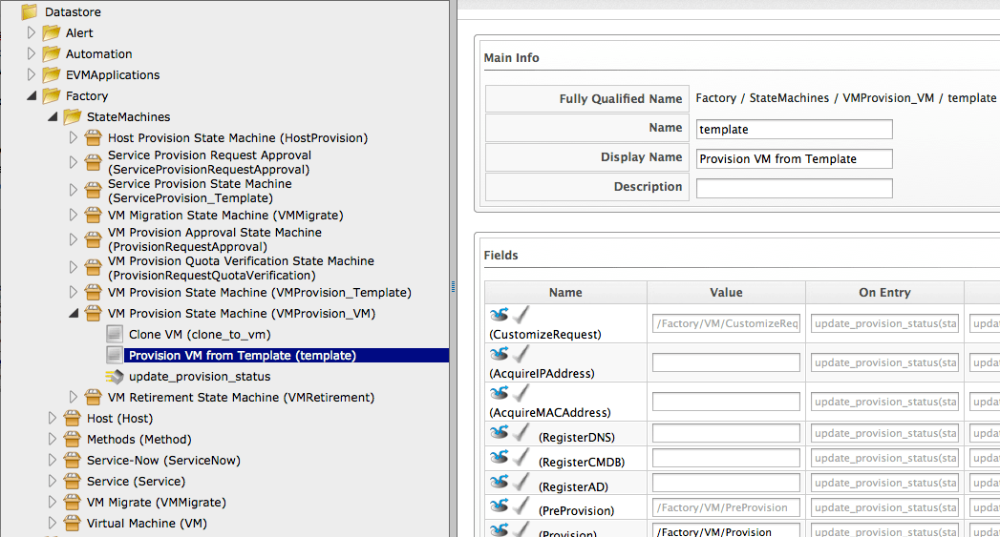
4.  For each step that you want to remove, clear the entries in the *Value*, *On Entry*, *On Exit*, and *On Error* columns.
5.  After making all required changes, click *Save*.

==== Viewing the Status of a Provisioning Request

After a request has been approved, the various stages of fulfillment are executed. You can see the progress of the provisioning process by viewing its status.

1.  Navigate to *Services* → *Requests*. The list of requests is shown.
2.  Click on a specific request for more information. Once the provisioning begins, if the request was supposed to create more than one virtual machine or instance, a field will appear called *Provisioned VMs*. Click on the number that appears next to it for information on each of the individual provisions.

==== Viewing a Provisioned Virtual Machine or Instance

When a virtual machine or instance is created as a result of a provisioning request, its summary screen will show when it was provisioned in the *Lifecycle* area of the respective summary.

* From *Services* → *Workloads*, click the virtual machine or instance that you want to view.
+
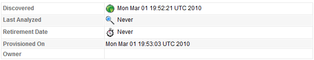

==== Viewing a Virtual Machine or Instance Summary

* From *Services* → *Workloads*, click the virtual machine or instance that you want to view.

== Catalogs and Services

=== About Catalogs and Services

Through the use of catalogs, ManageIQ provides support for multi-tier service provisioning to deploy layered workloads across hybrid environments. You can create customized dialogs that will give consumers of the services the ability to input just a few parameters and provision the entire service.

=== Terminology

*Terminology*

Catalog Bundle::
  A grouping of Templates.
Catalog Item::
  A single Template or a group of Templates (catalog bundle).
Dialog Tabs::
  Part of a Service Dialog.
Element::
  An item on a tab in a Dialog. It can be a Button, Check Box, Drop Down List, Radio Button, Tag Control, Text Area Box, or a Text Box.
Provisioning Dialogs::
  Dialogs created for Host Provisioning, VM Migration, or VM Provisioning. The dialog name must be added to the appropriate provision instance to be processed.
Service Catalog::
  A catalog item or Catalog bundle that is available for provisioning.
Service Dialogs::
  Made up of fully customizable tabs, items, and values for use with Service provisioning.
Template::
  A template is a copy of a preconfigured virtual machine, designed to capture installed software and software configurations, as well as the hardware configuration, of the original virtual machine.

=== Catalogs

==== Catalogs

Catalogs are used to create groups of virtual machines or instances for provisioning. For example, a complete package of a database server, desktop with specialized software already on it, and a firewall. You will need to complete the following steps to create and provision a service catalog.

1.  Create *Catalog Items* for each virtual machine or instance that will be part of the service.
2.  Create a *Service* dialog. For example, create a dropdown with three options small, medium, and large.
3.  Create a method for the *Service Dialog* in the Factory/Service class. This method defines what each of the options means to each of the individual virtual machines or cloud instances for the service. This method is called from a service provisioning instance in the *Automate* model.
4.  Create an instance in the Factory/StateMachines/ServiceProvision class that calls the method.
5.  Associate method with Automate instance
6.  Create a *Catalog Bundle*, adding each of the catalog items to it. Select the *Service Dialog* you created. Use the instance created in the Factory/StateMachines/ServiceProvision class as the *Entry Point*. Check *Display in Catalog* box.
7.  Provision a service

==== Creating a Catalog Item

Create a catalog item for each virtual machine or cloud instance that will be part of the service.

1.  Navigate to *Services* → *Catalogs*.
2.  Click the *Catalog Items* accordion.
3.  Click image:images/1847.png[image] *(Configuration)*, and then image:images/2055.png[image] *(Add a New Catalog Item)*.
4.  Select the *Catalog Item Type* you are adding. The dialogs that appear will be filtered based on the selected type of provider. For example, you will only see templates residing on Red Hat Providers, if the *Catalog Item Type* is *Redhat*.
+
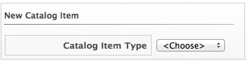
5.  In the *Basic Info* subtab:
1.  Type a *Name/Description*.
2.  Check *Display in Catalog* to edit *Catalog*, *Dialog*, and *Entry Point(NS/Cls/Inst)* options.
1.  *Provisioning Entry Point (NS/Cls/Inst)* requires you to select an Automate instance to run upon provisioning.
2.  *Retirement Entry Point (NS/Cls/Inst)* requires you to select an Automate instance to run upon retirement.
+
NOTE: You can only choose from the catalogs and dialogs you have already created. If you haven't done so, leave the values blank and edit later.
6.  In the *Details* subtab, write a *Long Description* for the catalog item.
7.  In the *Request Info* subtab, select provisioning options that apply to the provider chosen. For more information, refer to the sections on _Provisioning Virtual Machines_ and _Provisioning Instances_.
8.  Click *Add*.

==== Service Dialogs

===== Service Dialogs

When provisioning a service, input will be needed from the requester. *Service Dialogs* are used to take input from the user. This input is connected to a method in the *Automate* model that defines how the users input is translated into the provision request. Before creating a *Service Dialog*, be sure to plan what items you need the user to input.

===== Adding a Service Dialog

1.  Navigate to *Automate* → *Customization*.
2.  Click the *Service Dialogs* accordion.
3.  Click image:images/1847.png[image] *(Configuration)*, and then image:images/1848.png[image] *(Add a new Dialog)*.
4.  In *Dialog Information*, type in a *Label* and *Description*. Check the boxes for the buttons you want available at the bottom of the dialog form. The description will appear as hover text.
5.  Click *Add*.
6.  Select the dialog you just created.
7.  Click image:images/1847.png[image] *(Configuration)*, and then image:images/1851.png[image] *(Edit this Dialog)*.
8.  Add a tab to the dialog.
1.  Click image:images/1848.png[image] *(Add)*, then image:images/1848.png[image] *(Add a New Tab to this Dialog)*.
2.  Type in a *Label* and *Description* for this tab.
9.  Add a box to this tab.
1.  Click image:images/1848.png[image] *(Add)*, then image:images/1848.png[image] *(Add a New Box to this Tab)*.
2.  Type in a *Label* and *Description* for this box.
10. Add an element to this box. Elements are controls that accept input.
1.  Click image:images/1848.png[image] *(Add)*, then image:images/1848.png[image] *(Add a New Element to this Box)*.
2.  Type in a *Label*, *Name*, and *Description* for this element.
+
IMPORTANT: *Name* must use only alphanumeric characters and underscores without spaces. It is also used to retrieve the value of this element in the method used with the dialog and must start with `dialog_service_type`
3.  Select a *Type* for an element type. All *Type* options have a *Required* and *Default Value* field. Check *Required* or set *Required* to *true* if the element is required to proceed. You can also specify a default value. The rest of the options presented are based on which type of element you select.
+
*Table 6.1. Element Types*
+
[width="100%",cols="<50%,<50%",options="header",]
|========================================================================================================================================================================================================================================================================
|Element Types |Additional Info
|Check Box |Check *Default Value* if you want this check box checked by default.
|Date Control |Use *Date Control* to create a field where users can select a date. If you want users to be able to select a date and time, use the *Date/Time Control* option.
|Date/Time Control |Use *Date/Time Control* to create a field where users can select a date and time. Only one *Date Control* or *Date/Time Control* element can be present in a dialog.
|Drop Down Dynamic List |Use *Drop Down Dynamic List* if you want the list options to be created using automate methods. Use *Entry Point (NS/Cls/Inst)* to select an automate instance. Check *Show Refresh Button* to allow users to refresh the list options manually.
|Drop Down List |Use *Drop Down List* to create a list of options for the user to choose from.
|Radio Button |This element type serves the same purpose as *Drop Down List* but displays options using radio buttons.
|Tag Control |Select a *Category* of tags you want assigned to the virtual machines associated with this service dialog. Check *Single Select* if only one tag can be selected.
|Text Area Box |Provides text area for users to type in some text. You can also leave a message to users by typing in the *Default Value* field or leave it as blank.
|Text Box |This element type serves the same purpose as *Text Area Box* with the option to check *Protected* so the text is shown as asterisks (*), instead of plain text.
|========================================================================================================================================================================================================================================================================
+
 +
11. Click *Save*.

==== Methods

===== Creating a Method to Associate with the Dialog

You will need to create a method that connects the values in the dialog with the provisioning request. The method should be created in the Factory/Service class of the *Automate* model. A method is provided below that was created for the following scenario:

* You want to provision a 3-tiered Service that contains catalog items of web, app and DB. Each of these virtual machines (or cloud instances) has been tagged under the *Service* category with the appropriate value. Then, added as a catalog item and combined into a catalog bundle.
* The *Service Dialog* captures the selection of small, medium or large application in a dropdown called `service_type`. When referring to a value captured in an element in a dialog, the name of the element should be prefixed with `dialog_`. For example, `service_type` becomes `dialog_service_type` when used in the method.
* The method will set the memory sizes for each of the catalog items based on the `service_type` selection.

code,programlisting------------------------------------------------------------------------------------------------------------------------------------------------ code,programlisting
#
#            ManageIQ Automate Method
#
$evm.log("info", "ManageIQ Automate Method ConfigureChildDialog Started")
#
#            Method Code Goes here
#
$evm.log("info", "===========================================")
$evm.log("info", "Listing ROOT Attributes:")
$evm.root.attributes.sort.each { |k, v| $evm.log("info", "\t#{k}: #{v}")}
$evm.log("info", "===========================================")

stp_task = $evm.root["service_template_provision_task"]
$evm.log("info", "===========================================")
$evm.log("info", "Listing task Attributes:")
stp_task.attributes.sort.each { |k, v| $evm.log("info", "\t#{k}: #{v}")}
$evm.log("info", "===========================================")

#############################################################
#### This is how the method would look for dialog variables
#############################################################
dialog_service_type = $evm.root['dialog_service_type']
$evm.log("info","User selected Dialog option = [#{dialog_service_type}]")

stp_miq_request_task = stp_task.miq_request_task
#$evm.log("info","(parent) miq_request_task:  = [#{stp_miq_request_task}]")

#############################################################
#### This is how you get the catalog items for the catalog bundle
#############################################################

stp_miq_request_tasks = stp_task.miq_request_tasks
#$evm.log("info","(children) miq_request_tasks count:  = [#{stp_miq_request_tasks.count}]")

#############################################################
#### By going through the children, you can set the dialog variable for each of the children (we based our values on the childrens service tags)
#############################################################

stp_miq_request_tasks.each do |t|

  $evm.log("info"," Setting dialog for: #{t.description}")
  service = t.source
  service_resource = t.service_resource
  #$evm.log("info"," Child service resource name: #{service_resource.resource_name}")
  #$evm.log("info"," Child service resource description: #{service_resource.resource_description}")

  service_tag_array = service.tags(:app_tier)
  service_tag = service_tag_array.first.to_s

  memory_size = nil

#############################################################
#### The dialog_service_type is the attribute set on the service dialog
#### We use the service_tag to decide what child gets what dialog
#############################################################

  case dialog_service_type
  when "Small"
    case service_tag
    when "app"
      memory_size = 1024
    when "web"
      memory_size = 1024
    when "db"
      memory_size = 4096
    else
      $evm.log("info","Unknown Dialog type")
    end
  when "Large"
    case service_tag
    when "app"
      memory_size = 4096
    when "web"
      memory_size = 4096
    when "db"
      memory_size = 8192
    else
      $evm.log("info","Unknown Dialog type")
    end
  else
    $evm.log("info","Unknown Dialog type - setting Dialog options here")
  end

#############################################################
#### set_dialog_option sets the dialog for the child
#############################################################

  t.set_dialog_option('memory',memory_size) unless memory_size.nil?
  $evm.log("info","Set dialog for selection: [#{dialog_service_type}]  Service_Tier: [#{service_tag}] Memory size: [#{memory_size}]")

end
#
#
#
$evm.log("info", "ManageIQ Automate Method ConfigureChildDialog Ended")
exit MIQ_OK
------------------------------------------------------------------------------------------------------------------------------------------------

===== Creating a Method in the Factory/Service Class

1.  Navigate to *Automate* → *Explorer*.
2.  Click the *Datastore* accordion, and select a *Factory* → *Service* class.
3.  Click the *Methods* tab.
4.  Click image:images/1847.png[image] *(Configuration)*, then  *(Add a New Method)*.
5.  Type in a *Name* and *Display Name*.
6.  In the *Data* field, type in the method contents.
7.  Click *Validate* and wait for your data entry to be successfully validated.
8.  Click *Add*.

===== Creating an Instance in the Factory/Service Class

1.  Navigate to *Automate* → *Explorer*.
2.  Click the *Datastore* accordion, and select a *Factory* → *Service* class.
3.  Click the *Instances* tab.
4.  Click image:images/1847.png[image] *(Configuration)*, then  *(Add a new Instance)*.
5.  Type in a *Name* and *Display Name*.
6.  In the *Fields* area, type in the method's name in *Value*.
7.  Click *Add*.

The instance is created so that it can be called from the *ServiceProvision* class.

NOTE: After the method has been created, it must be mapped to an instance in the Factory/StateMachines/Service Provision State Machine class. The name of the instance must be specified as the *Entry Point*. This method must be called before the provision job begins.

===== Associating a Method with an Automate Instance

1.  Navigate to *Automate* → *Explorer*.
2.  From the accordion menu, click *Datastore* → *Factory* → *StateMachines* → *Service Provision State Machine* class.
3.  Either create a new instance or select the `clone_to_service` instance.
4.  Click image:images/1847.png[image] *(Configuration)*, then image:images/1851.png[image] *(Edit Selected Instance)*.
5.  In the `configurechilddialog` value, put the path to the method.
6.  Click *Save* or *Add* if you are adding this to a new instance.

Now that the catalog items, service dialog, dialog methods, and service provision instance have been created, you can create the catalog bundle.

===== Creating a Catalog Bundle

1.  Navigate to *Services* → *Catalogs*.
2.  Click the *Catalog Items* accordion.
3.  Click image:images/1847.png[image] *(Configuration)*, and then image:images/1848.png[image] *(Add a New Catalog Bundle)*.
4.  In *Basic Info*, type in a name and description
5.  Click *Display in Catalog*.
6.  Select the appropriate dialog name.
7.  Select the path to the appropriate Automate/Factory/StateMachines/ServiceProvision instance.
8.  Click on the *Resources* tab, then select the catalog items you want added to the bundle from the *Add a Resource* dropdown.
9.  Click *Add*.

A catalog bundle is created and visible in the *Service Catalog* accordion.

NOTE: You should also create and specify an Entry Point in the Factory/StateMachines/Service Provision State Machine class for each catalog item that is part of a bundle. If you do not, then the pre and post provision processing will occur for each item in the bundle in addition to processing for the *Catalog Bundle*. To set the entry point, go into each *Catalog Item* and check *Display in Catalog*. Then, you will see the Entry Point field.

===== Provisioning a Service

1.  Navigate to *Services* → *Catalogs*.
2.  Click the *Service Catalogs* accordion, and select the service to provision.
3.  Click *Order*. The dialog appears.
4.  Select the options in the *Service* dialog.

The parameters are passed to the children based on the method tied to the choices made in the dialog.

== Retirement

=== Retiring Virtual Machines

==== Retiring Virtual Machines and Instances

When a virtual machine or instance is no longer required, it can be retired. Once a virtual machine or instance reaches its retirement date, it is immediately shut down and not allowed to restart. If an attempt to restart is made, ManageIQ will shut down the virtual machine or instance.

There are three built-in policies involved with retirement.

* If the virtual machine or instance reaches its retirement date, it will be stopped even if it is running.
* If a retired virtual machine or instance is requested to start through ManageIQ, the virtual machine or instance will not be allowed to start.
* If a provider starts a retired virtual machine or instance outside of ManageIQ, the virtual machine or instance will be stopped.

ManageIQ provides a number of ways to retire a virtual machine or instance.

* By using the allocated buttons in the ManageIQ console.
* When creating a provision request, a retirement date can be set up.

==== Using the ManageIQ Console to Retire

Through the ManageIQ console, you can retire a virtual machine on a specific date or immediately.

==== Retiring a Virtual Machine Immediately

1.  Navigate to *Services* → *Workloads*.
2.  Select the virtual machine or instance that you want to retire.
3.  Click  *(Lifecycle)*, then  *(Retire this VM/Instance)*.

The virtual machine or instance is immediately stopped, and will be shut down if an attempt is made to restart it.

==== Setting a Retirement Date for a Virtual Machine or Instance

1.  Navigate to *Services* → *Workloads*.
2.  Select the virtual machine that you want to set a retirement date for.
3.  Click  *(Lifecycle)*, then  *(Set/remove retirement date)*.
4.  Select a date using the calendar control.
5.  Click *Save*

The retirement date is set, and displays in the virtual machine or instance summary screen.

==== Removing a Retirement Date for a Virtual Machine or Instance

1.  Navigate to *Services* → *Workloads*.
2.  Select the virtual machine or instance that you want to remove the retirement date from.
3.  Click  *(Lifecycle)*, then click  *(Set Retirement Date)*.
4.  Click  *(Remove Retirement Date)*.

=== Setting Retirement in a Provision Request

==== Setting Retirement in a Provision Request

If you are using ManageIQ to provision, you can set when you want retirement in the provision request. To see how to create a request, go to _Chapter 3. Provisioning Requests_. A warning email will be sent to the owner before the retirement.

==== Scheduling Retirement in a Provision Request

* After provisioning either a Cloud Instance or Virtual Machine, a multi-tabbed screen appears where you can set up your provision requests. The *Schedule* tab allows you to choose to power on the virtual machines or instances after they are created, and to set a retirement date. If you select a retirement period, you will be prompted for when you want a retirement warning.

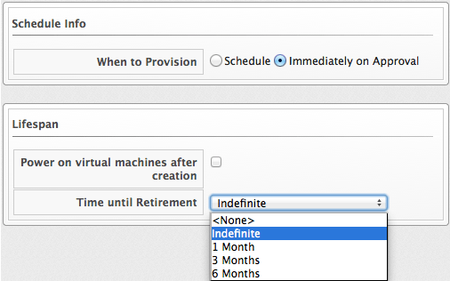

=== Extending Retirement Dates

ManageIQ *Automate* includes a method to extend the retirement of a virtual machine or instance by 14 days. This section describes how to create a button that invokes this method and how to edit the method to change the number of days.

==== Creating a Custom Button to Extend Retirement

1.  Navigate to *Automate* → *Customization*.
2.  Click the *Buttons* accordion.
3.  From the *Object Types* tree, select *VM and Instance*.
4.  Navigate to the button group to which you want to add this button. (If you do not have a button group, add one and then create the button.)
5.  Click image:images/1847.png[image] *(Configuration)*, then image:images/1848.png[image] *(Add a new Button)*.
6.  Type in a button text and button hover text, and select the image you want to use.
7.  In *Object Details*, select *Request* from the */System/Process/* dropdown. By default, the message is `create`. Do not change it.
8.  In *Request*, type _`vm_retire_extend`_ .
9.  Click *Add*.

==== Changing the Number of Days to Extend Retirement

1.  Navigate to *Automate* → *Explorer*.
2.  Click *Datastore* → *Alert* → *Email Notifications* → *vm_retire_extend* instance.
3.  Click image:images/1847.png[image] *(Configuration)*, then image:images/1851.png[image] *(Edit this Instance)*.
4.  In the Data area, change the _`vm_retire_extend_days`_ attribute to the new value.
5.  Click *Save*.

== Automate Model

=== About Automate

This chapter discusses the Automate feature set. ManageIQ Automate enables real-time, bi-directional process integration and adaptive automation for management events and administrative or operational activities.

=== Automate Model

The Automate model is designed to be used by operations administrators, platform and subsystem support administrators, and line of business or application owners. With that in mind, the Automate model is comprised of the following namespaces.

* Alert is used to send emails for different automation tasks.
* Automation is used specifically for management activities for hosts, storage, virtual machines and cloud instances, including both lifecycle and operations.
* ManageIQ Applications includes automation activities specifically used with ManageIQ. For example, the ability to provision virtual machines and cloud instances with customizations.
* Factory includes methods created by ManageIQ that can be reused by creating relationships. For example, it includes the methods for sending emails, logging events, and performing a SmartState analysis.
* Integration is used to interface with systems outside of ManageIQ such as *Configuration Management Database (CMDB)*, *Simple Network Management Protocol (SNMP)*, and *IP Address Management (IPAM)*. Use this namespace if you want to integrate with additional systems.
* Sample provides examples of methods that can be tailored for your own environment.
* System contains classes that can provide the start points for all ManageIQ Automate activities.

Each namespace can contain another namespace or classes. A class has a schema and includes attributes, methods, and relationships. An instance can include a collection of any number of attributes, methods, and relationships. For example, an instance can be a collection of attributes and a relationship or just one method.

NOTE: ManageIQ does not recommend changing any of the existing classes or instances shipped with the product as this may hinder the operation of the ManageIQ. However, you can link to these methods using relationships.

=== Creating a Class

1.  Navigate to *Automate* → *Explorer*, navigate to the namespace you want to add a class to.
2.  Click image:images/1847.png[image] *(Configuration)*, then  *(Add a new Class)*.
3.  Type in a unique *Name* and *Description*.
4.  If you want to use the schema from a class that has already been created, select it from the *Inherits From* dropdown. If the class that the new class inherits from changes, the new class will also change.
5.  Click *Add*.

The new class is created and you can create a schema, add instances and methods.

NOTE: For each class, create a schema if you did not choose to inherit from an existing class. The schema can include attributes, methods, assertions, and relationships.

=== Creating a Schema for a Class

This procedure shows you how to create a schema.

1.  Navigate to *Automate* → *Explorer*, and click the class you want to define a schema for.
2.  Click on the *Schema* tab.
3.  Click image:images/1847.png[image] *(Configuration)*, then image:images/1851.png[image] *(Edit selected Schema)*.
4.  Click  *(Click to add a new field)* to create a new field.
5.  Type in a *Name* for the new field.
6.  From *Type*, select *Assertion*, *Attribute*, *Method*, *Relationship*, or *State*.
7.  If applicable, select a *Data Type* and set a *Default Value*.
8.  Type in a user friendly *Display Name* and *Description*.
9.  Check *Sub* to enable the substitution syntax of `${}`. Uncheck it if you want to use that syntax as a regular string.
10. Fill in *Collect* and *Message* as required. *Collect* is used to rollup values from resolved relationships. For example, a relationship can resolve to a large object tree. Use *collect* to specify how to pull out data from those child objects into the current object. If you give *collect* a name value, it will store the method result in an attribute of the current object with that name.
11. *On Entry*, *On Exit*, *On Error*, *Max Retries*, and *Max Time* are fields used mostly for state machines. Leave blank if not applicable. See _State Machines_.
12. Click image:images/1863.png[image] *(Add this entry)* to confirm the fields values.
13. For each new field, repeat steps 4 through 10.
14. When you have created all of the fields, click *Save*.

The class schema is created, and you can now add instances to it.

NOTE: You may need to edit a class schema to reorder, add, edit, or remove a field. Classes define the order in which fields are processed and you may need to process some items before others.

=== Editing a Field in a Schema

This procedure shows you how to edit schema fields.

1.  Navigate to *Automate* → *Explorer*.
2.  Click the class you want to define a schema for.
3.  Click the *Schema* tab.
4.  Click image:images/1847.png[image] *(Configuration)*, then image:images/1851.png[image] *(Edit selected Schema)*.
5.  Make required changes to any of the definitions for the field.
6.  To remove a field, click  *(Click to delete this field from the schema)*.
7.  Click *Save* when you are finished editing the schema.

Once the schema is created, you can add instances and methods to the class.

=== Editing Schema Sequence

This procedure shows you how to change schema sequence.

1.  Navigate to *Automate* → *Explorer*.
2.  Click the class you want to change the schema sequence for.
3.  Click the *Schema* tab.
4.  Click image:images/1847.png[image] *(Configuration)*, then  *(Edit Sequence)*.
5.  In the *Class Schema Sequencing* area, click the field you want to change the sequence for.
* To move a field up in the order of resolving an instance, click  *(Move selected field up)*.
* To move a field down in the order of resolving an instance, click  *(Move selected field down)*.
6.  Click *Save* when you are finished editing the sequence.

You have rearranged your schema sequence.

=== Adding an Instance to a Class

This procedure shows you how to create an instance.

1.  Navigate to *Automate* → *Explorer*.
2.  Click the class you want to define a schema for.
3.  Click the *Instances* tab.
4.  Click image:images/1847.png[image] *(Configuration)*, then  *(Add a new Instance)*.
5.  In the *Main Info* area, type in a *Name*, *Display Name* and *Description*.
6.  In the *Fields* area, type in an appropriate value for each field, leave the field blank if no value is required, or use the default value.
7.  Click *Add*.

The instance is created.

=== Relationships

==== Relationship Syntax

Relationships are used to connect to other instances in the *Automation Datastore*. Relationships are formed using URI syntax. The following can also be passed through a relationship:

* Use *#* to set the message to send to the item in the relationship.
* To pass an input to the method use *?* followed by the item to pass.
* If you want to use a substitution, the syntax is *$\{}* with the substitution located between the brackets.

==== Table: Relationship Examples

[width="100%",cols="<50%,<50%",options="header",]
|================================================================================================================================================================================================================================================
|Example |Explanation
|/Integration/IPAM/AcquireMACAddress#$\{#ae_message} |Goes to Integration Namespace, IPAM Class, substituting the value of ae_message for the message.
|/FACTORY/METHOD/vm_allowed?vm_id=$\{process#vm_id} |Goes to Factory Namespace, Method class, vm_allowed method, passing the vm_id that came in through the process class (The VM from where the Automation Model was initiated).
|/Factory/Method/VM_SCAN?vm_id=$\{process#vm_id} |Goes to Factory Namespace, Method class, vm_scan (SmartState Analysis) method, passing the vm_id that came in through the process class (The VM from where the Automation Model was initiated).
|================================================================================================================================================================================================================================================

=== Methods

==== Methods

Methods are pieces of code associated with a class or object to perform a task. ManageIQ allows for Perl or Ruby methods. You can create your own methods or use relationships to link to pre-existing ones. In addition, you can use Windows PowerShell to create these methods. If you will be using PowerShell, you must install a SmartProxy on a Windows computer with network access to a ManageIQ Appliance in the ManageIQ Zone where you are running Automation.

==== Installing a Windows SmartProxy for PowerShell

This procedure shows you how to install a Windows SmartProxy for PowerShell. On the computer where you want to run the Windows SmartProxy, log in to the ManageIQ Console.

1.  Click *Configure* → *Configuration*.
2.  Click the *Settings* accordion, and click *Zones*.
3.  Click the zone where the ManageIQ server is located.
4.  Click on the ManageIQ server that you want to apply the maintenance to.
5.  Click the *Maintenance* tab.
6.  Click on the *Product Update* with a component of SmartProxy and platform of Windows.
7.  Click *Download*. The file is downloaded to the computer where you are accessing the ManageIQ Console.
8.  Open a command prompt, and navigate to the directory where you downloaded the file.
9.  Run:
+
code,screen------------------------------------------- code,screen
C:\Downloads\>filename -h ipaddress install
-------------------------------------------
+
NOTE: Ensure that _`filename`_ is replaced with the actual name of the file downloaded, and that _`ipaddress`_ is replaced with the IP address of your ManageIQ host.

To start up the Windows SmartProxy, go to *Services* in the *Control Panel*, *Administrative Tools*. Start the ManageIQ SmartProxy Service. The service is set to automatically start when you restart the computer.

==== Creating a Method

This procedure shows you how to create a method.

1.  Navigate to *Automate* → *Explorer*, navigate to the class where you want to create a method.
2.  Click the *Methods* tab.
3.  Click image:images/1847.png[image] *(Configuration)*,  *(Add a New Method)*.
4.  In the *Main Info* area, type in a *Name* and *Display Name*.
5.  For *Location*, select *inline*. Once selected, you will be presented with a *Data* area in which to write or copy the script.
6.  Click *Validate* to check the syntax.
7.  Click *Add*.

The *Factory Namespace* provides methods that can be re-used throughout the automation model. You can link to these in an instance by using a relationship instead of writing your own scripts.

=== Simulation

==== Simulation

After your model is designed, use the simulate page to test it. It allows you to see the results in tree and XML view.

==== Simulating an Automate Model

This procedure shows you how to simulate an automate model.

1.  Navigate to *Automate* → *Simulation*.
2.  In *Object Details*, select a type of object from */System/Process/* that will initiate the model. The *Message* should be `create`. Type in the name of the *Request* where you are starting from.
+
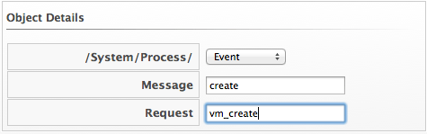
3.  Select the *Type* of item you want to run the simulation on. Then, select a specific one to use as the example.
+
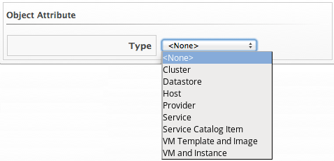
4.  Check *Execute Methods* if you want to perform the model and not just simulate it.
+
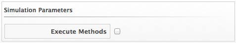
5.  Type in the *Attribute/Value Pairs* fields if applicable.
6.  Click *Submit*.

Click on the *Tree View* or *XML View* tabs to see results.

=== Importing, Exporting, and Resetting the Datastore

==== Importing, Exporting, and Resetting the Datastore

The *Automate Model* can be exported and imported as an XML file. ManageIQ allows you to back up your model by export. ManageIQ may provide you with new or updated classes, and provides an import function for either a class or the entire model. Finally, you can reset the datastore to its default. Always be sure to export the current datastore before importing or resetting.

==== Exporting All Datastore Classes

This procedure shows you how export datastore classes as an XML file.

1.  Navigate to *Automate* → *Import/Export*.
2.  Click  *(Export all Datastore classes and instances to a file)*.
3.  Follow your browsers prompts to save the file.

The datastore is exported as an XML file.

==== Importing Datastore Classes

This procedure shows you how to import datastore classes.

1.  Navigate to *Automate* → *Import/Export*.
2.  Export the datastore so that you have a backup.
3.  Click *Browse* to navigate to the location of the file to import.
4.  Click *Upload*.

The datastore is imported from the XML file.

==== Resetting Datastore to Default

This procedure shows you how reset datastore to default.

1.  Navigate to *Automate* → *Import/Export*.
2.  Export the datastore so that you have a backup.
3.  Click  *(Reset all Datastore custom classes and instances to default)*.
4.  Read the prompt warning you that communication with the datastore will be lost and all classes and instances will be cleared and reset.
5.  After reading the prompt, click *OK*.

The datastore is entirely reset to the default.

== Invoking Automate

=== Automate Examples

This chapter describes the ways to invoke an Automate workflow. Automation can be initiated through an alert, an event, a ManageIQ application, or a custom button. The same automation process can be re-used across more than one of these. For example, using automation to remove orphaned virtual machines and instances could be initiated by:

* An administrator request from the ManageIQ console (from a custom button)
* An alert indicating the datastore has less than 20% free-space
* A virtual machine or instance unregistered event is detected

All invocations of an automate model must enter through the `/System/Process` namespace.

=== Invoking Automate using a Custom Button

One of the ways to invoke an Automate model is to map an instance from the `/System/Process/Request` class to a custom button. Before creating the button, you need to have an instance in the `/System/Process/Request` class to map to it and a button group to assign it to.

Create buttons for a cluster, host, datastore, provider, virtual machines or cloud instances. When the button is clicked, the model will be invoked for the selected item. For each of these, you can have up to 15 buttons.

=== Creating a Custom Button Group

This procedure shows you how to create a custom button group.

1.  Navigate to *Automate* → *Customization*.
2.  Click the *Buttons* accordion.
3.  From the *Object Types* tree, select the type of object you want to create the button group for.
4.  Click image:images/1847.png[image] *(Configuration)*, image:images/1848.png[image] *(Add a new Button Group)*.
5.  Type in a *Button Group Text* and *Button Group Hover Text*, and select the *Button Group Image* you want to use.
6.  If custom buttons have already been created, assign them to the button group. If not, see _Creating a Custom Button_ to create custom buttons.
7.  Click *Add*.

The button group will show in the object type you added the button to.

=== Creating a Custom Button

This procedure shows you how to create a custom button.

1.  Navigate to *Automate* → *Customization*.
2.  Click the *Buttons* accordion.
3.  From the *Object Types* tree, select the type of object you want to create the button for.
4.  Click *Unassigned Buttons*.
5.  Click image:images/1847.png[image] *(Configuration)*, then image:images/1848.png[image] *(Add a new Button)*.
+
NOTE: If image:images/1848.png[image] *(Add a new Button)* is not available, that means you have not created a button group for that object. To continue, create a button group first. See _Creating a Custom Button Group_
6.  In *Action*, type in a *Button Text* and *Button Hover Text*, and select the *Button Image* you want to use.
7.  Select a *Dialog* if applicable.
8.  In *Object Details*, select *Request* from the */System/Process/* dropdown. By default, the message is `create`. Do not change it.
9.  Type in a *Request* name for the `/System/Process/Request` instance.
10. Type in the *Attribute/Value Pairs* fields if applicable.
11. Under *Visibility*, select which *Account Roles* you want to have access to this button.
12. Click *Add* when you have confirmed that the button accomplishes the task you want.

The button will show in the object type you added the button to.

=== Editing a Custom Button

This procedure shows you how to edit a custom button.

1.  Navigate to *Automate* → *Customization*.
2.  From the *Object Types* dropdown, select the type of object you want to edit the button for.
3.  Click the button you want to edit.
4.  Click image:images/1847.png[image] *(Configuration)*, image:images/1851.png[image] *(Edit this Button)*.
5.  Modify as required.
6.  Click *Save*.

The buttons properties are changed.

=== Deleting a Custom Button

This procedure shows you how to delete a custom button.

1.  Navigate to *Automate* → *Customizations*, then select the *Buttons* accordion.
2.  From the *Object Type* tree in the accordion menu, select the type of object you want to remove the button from.
3.  Click image:images/1847.png[image] *(Configuration)*. then click  *(Remove this button)*.
4.  Click *OK* to confirm that you want to delete this button.

The button is removed.

=== Using a Custom Button

This procedure shows you how to use custom buttons to invoke a cluster, host, datastore, provider, virtual machine or instance.

1.  Go to the page for the item that you created a button for.
2.  Click the custom button group from the taskbar, and then your custom button.

The automate model is invoked for the specified item.

=== Initiating Automate from an Event

==== Initiating Automate from an Event

You can also use a ManageIQ Policy Event to initiate automation. You can either use the provided Raise Automation Event action or create a custom automation action. The first case will start in the `/System/Process` class, but then go to the Event that initiated the Automate model in the `/System/Process/Event Class`. If you create your own custom action, it will start from the `/System/Process` class and then go to the `/System/Process/Request Class` instead.

For example, suppose that you always want the same Automate model to occur when a virtual machine is created. You would use the Raise Automation Event Action. There are instances in the `/System/Process/Event Class` for the following Events that you can select as part of a Policy:

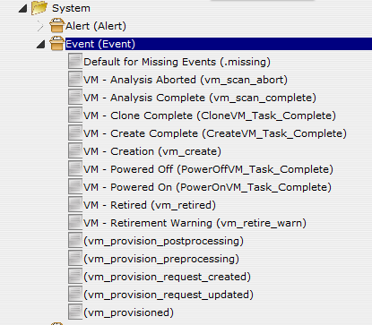

==== Creating a Policy for Automate

This procedure shows you how to create a policy for automate.

1.  Navigate to *Control* → *Explorer*.
2.  Click the *Policies* accordion, and select *Control Policies*.
3.  Select *VM Control Policies*.
4.  Click image:images/1847.png[image] *(Configuration)*, then image:images/1848.png[image] *(Add a New Control Vm Policy)*.
5.  Type in a *Description*.
6.  Uncheck *Active* if you do not want this policy processed even when assigned to a resource.
7.  Click *Add*. You are brought to the page where you add conditions and events to your new policy.
8.  Click image:images/1847.png[image] *(Configuration)*, then  *(Edit this Policy's Event assignments)*.
* Check the events you want to use to send to an *Automate Model*.
* Click *Save*.
* From the *Events* area, click on the *Description of the Event* you want to assign an action to.
* Click  *(Edit Actions for this Policy Event)*.
9.  Select *Raise Automation Event*, and click  *(Move selected Actions into this Event)*.
10. Click *Save*.

You can now assign this policy to a *Policy Profile*. Then, assign the policy profile to the virtual machines. Every time this event happens on the virtual machine the appropriate Automate Model will be initiated.

NOTE: If you want the policy to initiate an Automate Model from the `/System/Process/Request` class, then you can create your own custom action. Be sure to have an instance in the `/System/Process/Request` class for it to map to.

==== Creating a Custom Automate Action

This procedure shows you how to create a custom Automate action.

1.  Navigate to *Control* → *Explorer* accordion.
2.  Click the *Actions* accordion.
3.  Click image:images/1847.png[image] *(Configuration)*, then image:images/1848.png[image] *(Add a new Action)*.
4.  Type in a *Description* for the Action.
5.  Select *Invoke a Custom Automation* from *Action Type*.
6.  In *Custom Automation*,
* For *Message*, type `create`.
* For *Request*, type in the name of the instance of the `/System/Process/Request Class` in the second.
7.  Type in the *Attribute/Value Pairs* fields if applicable.
8.  Click *Add* when you are finished.

The action is created and can be added to a policy.

A.1. Virtual Machine Properties

When using these items in a method, prefix them with `vm.`. For example: `vm.storage_id.`

*Table A.1. Virtual Machine Properties*

[width="100%",cols="<50%,<50%",options="header",]
|==================================================================
|Friendly Name or Description |Raw Column Name
|Allocated Disk Storage |allocated_disk_storage
|Autostart |autostart
|Blackbox Exists |blackbox_exists
|Blackbox Validated |blackbox_validated
|Boot Time |boot_time
|Busy |busy
|Cluster |ems_cluster_name
|Configuration XML |config_xml
|Connection State |connection_state
|CPU Affinity |cpu_affinity
|CPU Limit |cpu_limit
|CPU Reserve |cpu_reserve
|CPU Reserve Expand |cpu_reserve_expand
|CPU Shares |cpu_shares
|CPU Shares Level |cpu_shares_level
|Created on Time |ems_created_on
|Currently Used Space |used_storage_by_state
|Datastore Path |v_datastore_path
|Date Created |created_on
|Date Updated |updated_on
|Description |description
|Ems |ems_id
|Evm Owner |evm_owner_id
|Evm Owner Email |evm_owner_email
|Evm Owner Name |evm_owner_name
|ManageIQ Unique ID (Guid) |guid
|Format |format
|Host |host_id
|Host Name |host_name
|Id |id
|Is a Template |v_is_a_template
|Last Analysis Attempt On |last_scan_attempt_on
|Last Analysis Time |last_scan_on
|Last Compliance Status |last_compliance_status
|Last Compliance Timestamp |last_compliance_timestamp
|Last Perf Capture On |last_perf_capture_on
|Last Sync Time |last_sync_on
|Location |location
|Memory Limit |memory_limit
|Memory Reserve |memory_reserve
|Memory Reserve Expand |memory_reserve_expand
|Memory Shares |memory_shares
|Memory Shares Level |memory_shares_level
|Name |name
|OS Name |os_image_name
|Owner |owner
|Paravirtualization |paravirtualization
|Parent Cluster |v_owning_cluster
|Parent Datacenter |v_owning_datacenter
|Parent Folder (Hosts & Clusters) |v_owning_folder
|Parent Folder (VMs & Templates) |v_owning_blue_folder
|Parent Folder Path (Hosts & Clusters) |v_owning_folder_path
|Parent Folder Path (VMs & Templates) |v_owning_blue_folder_path
|Parent Host Platform |v_host_vmm_product
|Parent Resource Pool |v_owning_resource_pool
|Pct Free Disk |v_pct_free_disk_space
|Platform |platform
|Power State |power_state
|Previous State |previous_state
|Registered |registered
|Reserved |reserved
|Retired |retired
|Retirement |retirement
|Retires On |retires_on
|Service |service_id
|Smart |smart
|Standby Action |standby_action
|State Changed On |state_changed_on
|Storage |storage_id
|Storage Name |storage_name
|Template |template
|Thin Provisioned |thin_provisioned
|Tools Status |tools_status
|Total Provisioned Space |provisioned_storage
|Total Snapshots |v_total_snapshots
|Total Used Disk Space |used_disk_storage
|Uid Ems |uid_ems
|Uncommitted Space |uncommitted_storage
|Used Storage |used_storage
|V Pct Used Disk Space |v_pct_used_disk_space
|Vdi Available |vdi_available
|Vdi Connection Dns Name |vdi_connection_dns_name
|Vdi Connection Logon Server |vdi_connection_logon_server
|Vdi Connection Name |vdi_connection_name
|Vdi Connection Remote Ip Address |vdi_connection_remote_ip_address
|Vdi Connection Session Name |vdi_connection_session_name
|Vdi Connection Session Type |vdi_connection_session_type
|Vdi Connection Url |vdi_connection_url
|Vdi Endpoint Ip Address |vdi_endpoint_ip_address
|Vdi Endpoint Mac Address |vdi_endpoint_mac_address
|Vdi Endpoint Name |vdi_endpoint_name
|Vdi Endpoint Type |vdi_endpoint_type
|Vdi User Appdata |vdi_user_appdata
|Vdi User Dns Domain |vdi_user_dns_domain
|Vdi User Domain |vdi_user_domain
|Vdi User Home Drive |vdi_user_home_drive
|Vdi User Home Path |vdi_user_home_path
|Vdi User Home Share |vdi_user_home_share
|Vdi User Logon Time |vdi_user_logon_time
|Vdi User Name |vdi_user_name
|Vendor |vendor
|Version |version
|VMsafe Agent Address |vmsafe_agent_address
|VMsafe Agent Port |vmsafe_agent_port
|VMsafe Enable |vmsafe_enable
|VMsafe Fail Open |vmsafe_fail_open
|VMsafe Immutable VM |vmsafe_immutable_vm
|VMsafe Timeout (ms) |vmsafe_timeout_ms
|==================================================================

 +

A.2. ManageIQ Methods for use in Ruby Scripts

To use one of these in one of your own Ruby methods, use the syntax of `vm.method`. For example, to reboot the guest operating system, use `vm.rebootGuest`.

[width="100%",cols="<50%,<50%",options="header",]
|========================================================================================================================================
|Method |Description
|start |Start Virtual Machine container.
|stop |Stop Virtual Machine container.
|suspend |Suspend Virtual Machine container.
|unregister |Unregister Virtual Machine.
|collect_running_processes |Collect the running processes from a started Virtual Machine.
|shutdownGuest |Shutdown the guest operating system of the VM container. Requires VMware tools (or vendors tools) installed on the guest.
|standbyGuest |Put the guest operating system into standby. Requires VMware tools (or vendors tools) installed on the guest.
|rebootGuest |Reboot the guest operating system. Requires VMware tools (or vendors tools) installed on the guest.
|========================================================================================================================================

A.3. Factory Methods for VMs

Use the *Automate* → *Explorer* page to see the referenced examples.

[width="100%",cols="<50%,<50%",options="header",]
|=========================================================================================================================================================================
|Method |Description
|log_vm_event |Logs a VM Event.
|vm_email_owner |Sends email to the VM Owner.
|vm_email_remedy |Sends email to Open Remedy.
|vm_scan |Performs SmartState Analysis on a Virtual Machine.
|vm_stop_and_unregister |Stops and unregisters a Virtual Machine.
|vm_post_retire |Stops the Virtual Machine, unregisters it from the Provider, and sends an email to the owner. Meant to be used when a Virtual Machine reaches retirement.
|=========================================================================================================================================================================

A.4. Host Properties

When using these items in a method, prefix them with host, such as `host.ems_id`.

[width="100%",cols="<50%,<50%",options="header",]
|===========================================================================================
|Friendly Name or Description |Raw Column Name
|All Enabled Ports |all_enabled_ports
|Annotation |v_annotation
|Authentication Status |Authentication_status
|Connection State |connection_state
|CPU usage MHz rate average over time period |cpu_usagemhz_rate_average_avg_over_time_period
|CPU usage MHz rate high over time period |cpu_usagemhz_rate_average_high_over_time_period
|CPU usage MHz rate low over time period |cpu_usagemhz_rate_average_low_over_time_period
|Custom Attribute 1 |custom_1
|Custom Attribute 2 |custom_2
|Custom Attribute 3 |custom_3
|Custom Attribute 4 |custom_4
|Custom Attribute 5 |custom_5
|Custom Attribute 6 |custom_6
|Custom Attribute 7 |custom_7
|Custom Attribute 8 |custom_8
|Custom Attribute 9 |custom_9
|Date Created |created_on
|Derived memory usage average over time period |derived_memory_used_avg_over_time_period
|Derived memory usage high over time period |derived_memory_used_high_over_time_period
|Derived memory usage low over time period |derived_memory_used_low_over_time_period
|Ems |ems_id
|Enabled Inbound Ports |enabled_inbound_ports
|Enabled Outbound Ports |enabled_outbound_ports
|Enabled Run Level 0 Services |enabled_run_level_0_services
|Enabled Run Level 1 Services |enabled_run_level_1_services
|Enabled Run Level 2 Services |enabled_run_level_2_services
|Enabled Run Level 3 Services |enabled_run_level_3_services
|Enabled Run Level 4 Services |enabled_run_level_4_services
|Enabled Run Level 5 Services |enabled_run_level_5_services
|Enabled Run Level 6 Services |enabled_run_level_6_services
|Enabled Tcp Inbound Ports |enabled_tcp_inbound_ports
|Enabled Tcp Outbound Ports |enabled_tcp_outbound_ports
|Enabled Udp Inbound Ports |enabled_udp_inbound_ports
|Enabled Udp Outbound Ports |enabled_udp_outbound_ports
|EVM Unique ID (Guid) |guid
|Hostname |hostname
|Id |id
|IP Address |ipaddress
|Last Compliance Status |last_compliance_status
|Last Compliance Timestamp |last_compliance_timestamp
|Last Perf Capture On |last_perf_capture_on
|Last Analysis Time |last_scan_on
|Name |name
|OS Name |os_image_name
|Platform |platform
|Power State |power_state
|Region Description |region_description
|Region Number |region_number
|Reserved |reserved
|Service Names |service_names
|Settings |settings
|Smart |smart
|SSH Root Access |ssh_permit_root_login
|Uid Ems |uid_ems
|Date Updated |updated_on
|User Assigned Os |user_assigned_os
|Parent Cluster |v_owning_cluster
|Parent Datacenter |v_owning_datacenter
|Parent Folder (Hosts & Clusters) |v_owning_folder
|Total Datastores |v_total_storages
|Total VMs |v_total_vms
|VMM Build Number |vmm_buildnumber
|VMM Platform |vmm_product
|VMM Vendor |vmm_vendor
|VMM Version |vmm_version
|===========================================================================================

A.5. Provider Properties

When using these items in a method, prefix them with `ems`, such as `ems.emstype`.

[width="100%",cols="<50%,<50%",options="header",]
|==================================================================================================
|Friendly Name or Description |Raw Column Name
|Aggregate VM CPUs |aggregate_vm_cpus
|Aggregate VM Memory |aggregate_vm_memory
|CPU Ratio |v_cpu_vr_ratio
|CPU Usage MHZ Rate Average High Over Time Period |cpu_usagemhz_rate_average_high_over_time_period"
|CPU Usage MHZ Rate Average Low Over Time Period |cpu_usagemhz_rate_average_low_over_time_period
|CPU Usage MHZ Rate Average Over Time Period |cpu_usagemhz_rate_average_avg_over_time_period
|Date Created |created_on
|Date Updated |updated_on
|Derived Memory Usage Rate Average High Over Time Period |derived_memory_used_high_over_time_period
|Derived Memory Usage Rate Average Low Time Period |derived_memory_used_low_over_time_period
|Derived Memory Usage Rate Average Over Time Period |derived_memory_used_avg_over_time_period
|Distributed Resource Scheduler Automation Level |drs_automation_level
|Distributed Resource Scheduler Enabled |drs_enabled
|Distributed Resource Scheduler Migration Threshold |drs_migration_threshold
|EMS ID |ems_id
|EVM Zone |zone_name
|High-Availability Admission Control |ha_admit_control
|High-Availability Enabled |ha_enabled
|High-Availability Max Failures |ha_max_failures
|Id |id
|Last Performance Data Captured |last_perf_capture_on
|Last Smart State Analysis |last_scan_on
|Memory Ratio |v_ram_vr_ratio
|Name |name
|Parent Datacenter |v_parent_datacenter
|Qualified Description |v_qualified_desc
|Region Description |region_description
|Region Number |region_number
|Reserved |reserved
|Total CPU Speed |aggregate_cpu_speed
|Total Hosts |total_hosts
|Total Memory |aggregate_memory
|Total Number of Logical CPUs |aggregate_logical_cpus
|Total Number of Physical CPUs |aggregate_physical_cpus
|Total Vms |total_vms
|Unique Identifier |uid_ems
|==================================================================================================

A.6. Storage Properties

When using these items in a method, prefix them with `storage`, such as `storage.name`.

*Table A.2. Storage Properties*

Friendly Name or Description

Raw Column Name

Date Created

created_on

Date Updated

updated_on

Disk Files Percent of Used

v_disk_percent_of_used

Free Space

free_space

Free Space Percent of Total

v_free_space_percent_of_total

Id

id

Last Analysis Time

last_scan_on

Last Perf Capture On

last_perf_capture_on

Location

location

Multiple Host Access

multiplehostaccess

Name

name

Non-VM Files Percent of Used

v_debris_percent_of_used

Other VM Files Percent of Used

v_vm_misc_percent_of_used

Provisioned Space Percent of Total

v_provisioned_percent_of_total

Reserved

reserved

Size of Non-VM Files

v_total_debris_size

Size of Other VM Files

v_total_vm_misc_size

Size of VM Memory Files

v_total_vm_ram_size

Size of VM Snapshot Files

v_total_snapshot_size

Snapshot Files Percent of Used

v_snapshot_percent_of_used

Store Type

store_type

Total Hosts

v_total_hosts

Total Managed Registered Vms

total_managed_registered_vms

Total Managed Unregistered Vms

total_managed_unregistered_vms

Total Provisioned Space

v_total_provisioned

Total Space

total_space

Total Unmanaged Vms

total_unmanaged_vms

Total VMs

v_total_vms

Uncommitted

uncommitted

Used Space

v_used_space

Used Space Percent of Total

v_used_space_percent_of_total

VM Memory Files Percent of Used

v_memory_percent_of_used

 +

This appendix lists the Namespaces, Classes, Methods, and Instances for the Automate Model. The Namespace hierarchy for the model is defined as follows:

* Alert
* Automation
* EVMApplications
** Operations
*** Profile
** Provisioning
*** Profile
* Factory
** StateMachines
* Integration
** MIQ_IPAM
* Sample
* System

B.1. Namespace: Alert

* *Class:* Email Notifications (EmailNotifications)
** *Instance:* (MiqHostProvisionRequest_Approved)
+
Contains configurable parameters for the MiqHostProvisionRequest_Approved method.
+
to_email_address - used to specify an email address in the case where vm's owner does not have an email address. To specify more than one email address, separate email addresses with commas.
+
from_email_address - used to specify an email address in the event the requester replies to the email.
+
signature - used to stamp the email with a custom signature.
** *Instance:* (MiqHostProvisionRequest_Complete)
+
Contains configurable parameters for the MiqHostProvisionRequest_Complete method.
+
to_email_address - used to specify an email address in the case where vm's owner does not have an email address. To specify more than one email address, separate email addresses with commas.
+
from_email_address - used to specify an email address in the event the requester replies to the email.
+
signature - used to stamp the email with a custom signature.
** *Instance:* (MiqProvisionRequest_Approved)
+
Contains configurable parameters for the MiqProvisionRequest_Approved method.
+
to_email_address - used to specify an email address in the case where vm's owner does not have an email address. To specify more than one email address, separate email addresses with commas.
+
from_email_address - used to specify an email address in the event the requester replies to the email.
+
signature - used to stamp the email with a custom signature.
** *Instance:* (MiqProvisionRequest_Denied)
+
Contains configurable parameters for the MiqProvisionRequest_Denied method.
+
to_email_address - used to specify an email address in the case where vm's owner does not have an email address. To specify more than one email address, separate email addresses with commas.
+
from_email_address - used to specify an email address in the event the requester replies to the email.
+
signature - used to stamp the email with a custom signature.
** *Instance:* (MiqProvisionRequest_Pending)
+
Contains configurable parameters for the MiqProvisionRequest_Pending method.
+
to_email_address - used to specify an email address in the case where vm's owner does not have an email address. To specify more than one email address, separate email addresses with commas.
+
from_email_address - used to specify an email address in the event the requester replies to the email.
+
signature - used to stamp the email with a custom signature.
** *Instance:* (MiqProvision_Complete)
+
Contains configurable parameters for the MiqProvision_Complete method.
+
to_email_address - used to specify an email address in the case where vm's owner does not have an email address. To specify more than one email address, separate email addresses with commas.
+
from_email_address - used to specify an email address in the event the requester replies to the email.
+
signature - used to stamp the email with a custom signature.
** *Instance:* (ServiceProvision_Complete)
+
Contains configurable parameters for the ServiceProvision_Complete method.
+
to_email_address - used to specify an email address in the case where vm's owner does not have an email address. To specify more than one email address, separate email addresses with commas.
+
from_email_address - used to specify an email address in the event the requester replies to the email.
+
signature - used to stamp the email with a custom signature.
** *Instance:* (ServiceTemplateProvisionRequest_Approved)
+
Contains configurable parameters for the MiqProvisionRequest_Approved method.
+
to_email_address - used to specify an email address in the case where vm's owner does not have an email address. To specify more than one email address, separate email addresses with commas.
+
from_email_address - used to specify an email address in the event the requester replies to the email.
+
signature - used to stamp the email with a custom signature.
** *Instance:* (VmMigrateRequest_Approved)
+
Contains configurable parameters for the VmMigrateRequest_Approved method.
+
to_email_address - used to specify an email address in the case where vm's owner does not have an email address. To specify more than one email address, separate email addresses with commas.
+
from_email_address - used to specify an email address in the event the requester replies to the email.
+
signature - used to stamp the email with a custom signature.
** *Instance:* (VmMigrateTask_Complete)
+
Contains configurable parameters for the VmMigrateTask_Complete method.
+
to_email_address - used to specify an email address in the case where vm's owner does not have an email address. To specify more than one email address, separate email addresses with commas.
+
from_email_address - used to specify an email address in the event the requester replies to the email.
+
signature - used to stamp the email with a custom signature.
** *Instance:* (vm_retire_extend)
+
Contains configurable parameters for the vm_retire_extend method.
+
to_email_address - used to specify an email address in the case where vm's owner does not have an email address. To specify more than one email address, separate email addresses with commas.
+
from_email_address - used to specify an email address in the event the requester replies to the email.
+
signature - used to stamp the email with a custom signature.
+
vm_retire_extend - number of days to extend retirement.
** *Instance:* (vm_retirement_emails)
+
Contains configurable parameters for the vm_retirement_emails method.
+
to_email_address - used to specify an email address in the case where vm's owner does not have an email address. To specify more than one email address, separate email addresses with commas.
+
from_email_address - used to specify an email address in the event the requester replies to the email.
+
signature - used to stamp the email with a custom signature.
** *Method:* (MiqHostProvisionRequest_Approved)
+
This method is used to email the provision requester that the Host provisioning request has been approved.
** *Method:* (MiqHostProvisionRequest_Complete)
+
This method sends an email when the host_provisioned event is raised.
** *Method:* (MiqProvisionRequest_Approved)
+
This method is used to email the provision requester that the VM provisioning request has been approved.
** *Method:* (MiqProvisionRequest_Denied)
+
This method is used to email the provision requester and approver that the VM provisioning request has been denied.
** *Method:* (MiqProvisionRequest_Pending)
+
This method is launched from the not_approved method which raises the requst_pending event when the provisioning request is NOT auto-approved.
** *Method:* (MiqProvision_Complete)
+
This method sends an email when the vm_provisioned event is raised.
** *Method:* (ServiceProvision_Complete)
+
This method sends an email when the service_provisioned event is raised.
** *Method:* (ServiceTemplateProvisionRequest_Approved)
+
This method is used to email the provision requester that the Service provisioning request has been approved.
** *Method:* (VmMigrateRequest_Approved)
+
This method is used to email the provision requester that the VM Migrate request has been approved.
** *Method:* (VmMigrateTask_Complete)
+
This method sends an email when the VmMigrateTask-Complete event is raised.
** *Method:* (vm_retire_extend)
+
This method is used to add 14 days to retirement date when target VM has a retires_on value and is not already retired.
** *Method:* (vm_retirement_emails)
+
This method sends out retirement emails when the following events are raised: vm_retire_warn, vm_retired, vm_entered_retirement
* *Class:* General Email Alerts (Email_Alerts)
** *Instance:* (EMS_Cluster_Alert)
+
Contains configurable parameters for the EMS_Cluster_Alert method.
+
to_email_address - used to specify an email address in the case where vm's owner does not have an email address. To specify more than one email address, separate email addresses with commas.
+
from_email_address - used to specify an email address in the event the requester replies to the email.
+
signature - used to stamp the email with a custom signature.
** *Instance:* (Ext_Management_System_Alert)
+
Contains configurable parameters for the Ext_Management_System _Alert method.
+
to_email_address - used to specify an email address in the case where vm's owner does not have an email address. To specify more than one email address, separate email addresses with commas.
+
from_email_address - used to specify an email address in the event the requester replies to the email.
+
signature - used to stamp the email with a custom signature.
** *Instance:* (Host_Alert)
+
Contains configurable parameters for the Host_Alert method.
+
to_email_address - used to specify an email address in the case where vm's owner does not have an email address. To specify more than one email address, separate email addresses with commas.
+
from_email_address - used to specify an email address in the event the requester replies to the email.
+
signature - used to stamp the email with a custom signature.
** *Instance:* (MIQ_Server_Alert)
+
Contains configurable parameters for the MIQ_Server_Alert method.
+
to_email_address - used to specify an email address in the case where vm's owner does not have an email address. To specify more than one email address, separate email addresses with commas.
+
from_email_address - used to specify an email address in the event the requester replies to the email.
+
signature - used to stamp the email with a custom signature.
** *Instance:* (Parse_Alerts)
+
Contains configurable parameters for the Parse_Alerts method.
+
to_email_address - used to specify an email address in the case where vm's owner does not have an email address. To specify more than one email address, separate email addresses with commas.
+
from_email_address - used to specify an email address in the event the requester replies to the email.
+
signature - used to stamp the email with a custom signature.
** *Instance:* (Storage_Alert)
+
Contains configurable parameters for the Storage_Alert method.
+
to_email_address - used to specify an email address in the case where vm's owner does not have an email address. To specify more than one email address, separate email addresses with commas.
+
from_email_address - used to specify an email address in the event the requester replies to the email.
+
signature - used to stamp the email with a custom signature.
** *Instance:* (VM_Alert)
+
Contains configurable parameters for the VM_Alert method.
+
to_email_address - used to specify an email address in the case where vm's owner does not have an email address. To specify more than one email address, separate email addresses with commas.
+
from_email_address - used to specify an email address in the event the requester replies to the email.
+
signature - used to stamp the email with a custom signature.
** *Method:* (EMS_Cluster_Alert)
+
This method is used to send Email Alerts based on Cluster.
** *Method:* (Ext_Management_System_Alert)
+
This method is used to send Email Alerts based on Provider.
** *Method:* (Host_Alert)
+
This method is used to send Email Alerts based on Host.
** *Method:* (MIQ_Server_Alert)
+
This method is used to send Email Alerts based on ManageIQ Server.
** *Method:* (Parse_Alerts)
+
This method is used to parse incoming Email Alerts.
** *Method:* (Storage_Alert)
+
This method is used to send Email Alerts based on Datastore.
** *Method:* (VM_Alert)
+
This method is used to send Email Alerts based on Virtual Machine.

B.2. Namespace: Automation

* *Class:* Host Lifecycle Management (HostLifecycle)
** *Instance:* Host Discovery (Discovery)
+
For internal use. Do not modify.
** *Instance:* Host Migrate (Migrate)
+
For internal use. Do not modify.
** *Instance:* Host Provisioning (Provisioning)
+
For internal use. Do not modify.
** *Instance:* VM Retirement (Retirement)
+
For internal use. Do not modify.
* *Class:* VM Lifecycle Management (VMLifecycle)
** *Instance:* VM Discovery (Discovery)
+
For internal use. Do not modify.
** *Instance:* VM Migrate (Migrate)
+
For internal use. Do not modify.
** *Instance:* VM Provisioning (Provisioning)
+
For internal use. Do not modify.
** *Instance:* VM Retirement (Retirement)
+
For internal use. Do not modify.
* *Class:* VM Management (vm)
** *Instance:* (.missing)
+
For internal use. Do not modify.

B.3. Namespace: EVMApplications

B.3.1. Namespace: Operations

* *Class:* Intelligent Workload Management (Intelligent_Workload_Management)
** *Instance:* (Cluster_Workload_Management)
+
Contains configurable parameters for the Cluster_Workload_Management method.
+
to_email_address - where to send email
+
from_email_address - specify the from email.
+
signature - used to stamp the email with a custom signature.
+
host_scope: specify scope of other hosts to which this VM can be Vmotioned. Default is to get ESX Hosts from the Cluster source VM resides.
** *Instance:* Host_Evacuation
+
Contains configurable parameters for the Host_Evacuation method.
+
to_email_address - where to send email if the VM is going to be Vmotioned.
+
from_email_address - specify the from email if the VM is going to be Vmotioned.
+
signature - used to stamp the email with a custom signature.
+
host_scope: specify scope of hosts to be evacuated.
** *Instance:* VM_Placement_Optimization (VM_Placement_Optimization)
+
Contains configurable parameters for the VM_Placement_Optimization method.
+
to_email_address - where to send email if the VM is going to be Vmotioned.
+
from_email_address - specify the from email if the VM is going to be Vmotioned.
+
signature - used to stamp the email with a custom signature.
+
host_scope: specify scope of other hosts to which this VM can be Vmotioned. Default is to get ESX Hosts from the Cluster source VM resides.
** *Method:* (Cluster Workload Management)
+
This method will find a VM that is running hot in a given cluster and vMotion the VM to a more desirable host within that cluster.
** *Method:* (Host_Evacuation)
+
When a VM encounters high CPU % Ready, VMotions VM to a more suitable host.
** *Method:* (VM_Placement_Optimization)
+
When a VM encounters high CPU % Ready, VMotion VM to a more suitable host.

B.3.1.1. Namespace: Profile

* *Class:* VM Migrate Group (VmMigrate)
** *Instance:* (.missing)
+
Default instance used when no group is found for the user creating a migrate request.
** *Instance:* (EVMGroup-super_administrator)
+
Instance used when the user is part of the Super Administrator Group. Configurable items:
+
pre_dialog_name
+
dialog_name
+
state_machine
** *Instance:* (EVMGroup-user_self_service)
+
Instance used when the user is part of the User Self Service Group. Configurable items:
+
pre_dialog_name
+
dialog_name
+
state_machine
** *Instance:* (Super_Admin)
+
pre_dialog_name
+
dialog_name
+
state_machine
** *Method:* (get_deploy_dialog)
+
Dynamically choose dialog based on Category:environment chosen in pre-dialog.

B.3.2. Namespace: Provisioning

* *Class:* ActiveDirectory Domain (Domain)
+
Empty
* *Class:* DHCP Server (DHCP_Server)
+
Empty
* *Class:* VM Naming Profiles (Naming)
** *Instance:* (default)
+
Calls the vmname method.
** *Method:* Default (vmname)
+
If VM Name was not chosen during dialog processing then use prefix and [:environment] to generate name (The prefix currently coded into the method is `miq`). Otherwise, use VM name chosen in dialog. When provisioning multiple Virtual Machines, a number will be appended to the VM Name.
* *Class:* VM Placement Profiles (Where)
** *Instance:* (best_fit_cluster)
+
Calls the best_fit_cluster method.
** *Instance:* best_fit_default (best_fit)
+
Calls the /factory/method/host_and_storage_least_utilized method.
** *Instance:* (best_fit_least_utilized)
+
Calls the least_utilized method.
** *Instance:* (best_fit_with_scope)
+
Calls the best_fit_with_scope method.
** *Instance:* (best_fit_with_tags)
+
Calls the best_fit_with_tags method.
** *Instance:* (best_placement_with_scope)
+
Calls the best_placement_with_scope method.
** *Method:* (best_fit_cluster)
+
Used to find the cluster with best fit.
** *Method:* (best_fit_with_scope)
+
Used to find all hosts, datastores that have the tag category prov_scope = 'all'|| prov_scope = <group-name>
** *Method:* (best_fit_with_tags)
+
Used to find all hosts, datastores that match the required tag.
** *Method:* (best_placement_with_scope)
+
This method is used to find the incoming templates cluster as well as hosts and storage that have the tag category prov_scope = 'all' && prov_scope = <group-name>
** *Method:* (least_utilized)
+
Used to find all hosts, datastores that are the least utilized.
* *Class:* vLANs in Virtual Center (Network)
+
Empty

B.3.2.1. Namespace: Profile

* *Class:* Host Provisioning Group (Host)
** *Instance:* (.missing)
+
Default instance used when no group is found for the user creating a host provision request.
** *Instance:* (EVMGroup-super_administrator)
+
Instance used when the user is part of the Super Administrator Group. Configurable items:
+
pre_dialog_name
+
dialog_name
+
state_machine
** *Method:* (get_deploy_dialog)
+
Dynamically choose dialog based on Category:environment chosen in pre-dialog.
* *Class:* Service Provisioning Group (service)
** *Instance:* (.missing)
+
Default instance used when no group is found for the user creating a provision request.
* *Class:* VM Provisioning Group (VM)
** *Instance:* (.missing)
+
Default instance used when no group is found for the user creating a provision request.
** *Instance:* (EVMGroup-super_administrator)
+
Instance used when the user is part of the Super Administrator Group. Configurable items:
*** where
*** domains
*** networks
*** vmname
*** pre_dialog_name: Name of pre-provisioning dialog
*** dialog_name: Name of dialog file
*** auto_approval_state_machine
*** quota_state_machine
*** state_machine
** *Instance:* (EVMGroup-user_self_service)
+
Instance used when the user is part of the User Self Service Group. Configurable items:
+
where
+
domains
+
networks
+
vmname
+
pre_dialog_name: Name of pre-provisioning dialog
+
dialog_name: Name of dialog file
+
auto_approval_state_machine:
+
quota_state_machine
+
state_machine
** *Method:* (get_deploy_dialog)
+
Dynamically choose dialog based on Category:environment chosen in pre-dialog.
** *Method:* (vm_dialog_name_prefix)
+
This is the default method to determine the dialog prefix name to use.

B.4. Namespace: Factory

* *Class:* Host(Host)
** *Instance:* (CheckProvisioned)
+
Calls the check_provisioned method.
** *Instance:* (CustomizeRequest)
+
Calls the CustomizeRequest and vm_email_owner method.
** *Instance:* (PostProvision_Host)
+
Calls the PostProvision_Host method.
** *Instance:* (PreProvision_Host)
+
Calls the PreProvision_Host method.
** *Instance:* (Provision)
+
Calls the Provision method.
** *Method:* (CustomizeRequest)
+
This method is used to Customize the provisioning request.
** *Method:* (PostProvision_Host)
+
This method is used to perform post provisioning tasks.
** *Method:* (PreProvision_Host)
+
This method is used to customize the provisioning request.
** *Method:* (Provision)
+
Launches the provisioning job.
** *Method:* (checkprovisioned)
+
This method checks to see if the host has been provisioned.
* *Class:* Methods
** *Instance:* host_and_storage_least_utilized
+
Calls the host_and_storage_least_utilized method.
** *Instance:* log_Vm_event
+
Calls the log_vm_event method.
** *Instance:* Vm_allowed
+
Calls the vm_allowed2 method.
** *Instance:* Vm_email_remedy
+
Calls the vm_email_remedy and send_email methods. Send_email is an internal method that is not visible in the model.
** *Instance:* Stop VM, Unregister and Email Owner (Vm_Post_Retire)
+
Calls the vm_stop_and_unregister and vm_email_owner methods.
** *Instance:* Vm_scan
+
Calls the vm_scan method.
** *Method:* host_and_storage_least_utilized
+
Built in method to find least used host and storage.
** *Method:* log_vm_event
+
Used to log VM events.
** *Method:* vm_allowed
+
Parse a text file for VM names.
** *Method:* vm_allowed2
+
Parse .csv file for VM names.
** *Method:* vm_email_remedy
+
Used to send an email to Remedy.
** *Method:* vm_scan
+
Used to launch a SmartState Analysis on a VM.
** *Method:* vm_stop_and_unregister
+
Used to stop a VM and unregister it from the VC.
* *Class:* Service-Now
+
Class used for integration with Service-Now.com
** *Instance:* Create CI in Service Now (create_ci_in_eccq).
+
Create CMDB CI for Service-now.
** Unknown: Create Incident in Service Now (create_incident_in_eccq).
+
Create CMDB incident in Service-now.
** *Instance:* (eccq_insert)
+
Inserts a record into Service-Now's eccq queue.
** *Instance:* (eccq_insert1)
+
Inserts a record into Service-Now's eccq queue.
* *Class:* Service (Service)
** *Instance:* (CatalogBundleInitialization)
+
Executes ConfigureParentProvisioningService.
** *Instance:* (CatalogItemInitialization)
+
Executes ConfigureChildProvisioningService.
** *Instance:* (CheckProvisioned)
+
Executes check_provisioned.
** *Instance:* (ConfigureChildDialog)
+
Executes configurechilddialog.
** *Instance:* Provision (provision)
+
Executes provision method.
** *Method:* (CatalogBundleInitialization)
+
This method looks for all service dialog variables that start with "dialog_option_[0-9]" and "dialog_tag_[0-9]" and passes them down to their appropriate child tasks.
** *Method:* (CatalogItemInitialization)
+
This method first looks in the options hash for :child_options and :child_tags then sets the options/tags for the appropriate task.
** *Method:* Check_Provisioned(CheckProvisioned)
+
Checks to see if the service has been provisioned.
** *Method:* (ConfigureChildDialog)
+
Configures the child dialogs for the service.
** *Method:* Provision (provision)
+
Launches the provisioning job.
* *Class:* VM Migrate (VMMigrate)
** *Instance:* (BestHost)
+
Executes BestHost.
** *Instance:* (BestStorage)
+
Executes BestStorage.
** *Instance:* (CheckMigration)
+
Executes CheckMigration.
** *Instance:* (Migrate)
+
Executes Migrate.
** *Instance:* (PostMigration)
+
Executes PostMigration.
** *Instance:* (PreMigration)
+
Executes PreMigration.
** *Method:* (BestHost)
+
Future Use.
** *Method:* (BestStorage)
+
Future Use.
** *Method:* (CheckMigration)
+
Checks to see if the VM has been migrated.
** *Instance:* (Migrate)
+
Launches the migration job.
** *Instance:* (PostMigration)
+
Steps to run after migration.
** *Instance:* (PreMigration)
+
Steps to run before migration.
* *Class:* Virtual Machine (VM)
** *Instance:* (CheckPoweredOff)
+
Executes check_powered_off.
** *Instance:* (CheckProvisioned)
+
Executes check_provisioned.
** *Instance:* (CheckUnregisteredFromVC)
+
Executes check_unregistered_from_vc.
** *Instance:* (CustomizeRequest)
+
Executes CustomizeRequest.
** *Instance:* (DeleteFromVC)
+
Executes delete_from_vc.
** *Instance:* (DeleteFromVMDB)
+
Executes delete_from_vmdb.
** *Instance:* (PostProvision)
+
Executes PostProvision.
** *Instance:* (PostProvision_Clone_to_VM)
+
Executes PostProvision._Clone_to_VM.
** *Instance:* (PowerOff)
+
Executes power_off.
** *Instance:* (PreDeleteFromVC)
+
Executes PreDeleteFromVC.
** *Instance:* (PreProvision)
+
Executes PreProvision.
** *Instance:* (PreProvision_Clone_to_Template)
+
Executes PreProvision_Clone_to_Template.
** *Instance:* (PreProvision_Clone_to_VM)
+
Executes PreProvision_Clone_to_VM.
** *Instance:* (Provision)
+
Executes provision.
** *Instance:* (UnregisterFromVC)
+
Executes unregister_from_vc.
** *Instance:* (VdiAddVmToDesktopPool)
+
Executes vdi_add_vm_to_desktop_pool.
** *Instance:* (VdiWaitForHostname)
+
Executes vdi_wait_for_hostname.
** *Method:* CheckPoweredOff (check_powered_off)
+
Checks to see if the VM has been deleted from the VC.
** *Method:* CheckProvisioned (check_provisioned)
+
Checks to see if the vm has been provisioned.
** *Method:* CheckUnregisteredFromVC (check_unregistered_from_vc)
+
Checks to see if the VM is unregistered from the VC.
** *Method:* (CustomizeRequest)
+
This method is used to Customize the Provisioning Request:
+
1. Customization Specification Mapping for VMware provisioning.
+
2. Customization Template and PXE for RHEV provisioning.
** *Method:* DeleteFromVCCheck (delete_from_vc_check)
+
Checks to see if the VM has been deleted from the VC.
** *Method:* DeleteFromVC (delete_from_vc)
+
Deletes the VM from the VC.
** *Method:* DeleteFromVMDB (delete_from_vmdb)
+
Removes the VM from the VMDB database.
** *Method:* (PostProvision)
+
Used to customize the provisioning object prior to provisioning.
** *Method:* (PostProvision_Clone_to_VM)
+
Used to customize the provisioning object prior to provisioning.
** *Method:* PowerOff (power_off)
+
powers-off the VM on the VC.
** *Method:* (PreDeleteFromVC)
+
runs prior to deleting the VM from VC.
** *Method:* (PreProvision)
+
Used to apply PreProvision customizations as follows:
1.  Customization Spec
2.  VLAN
3.  VM Description/Annotations
4.  Target VC Folder
5.  Resource Pool
** *Method:* (PreProvision_Clone_to_Template)
+
This default method is used to apply PreProvision customizations as follows:
+
1. VM Description/Annotations
+
2. Target VC Folder
+
3. Tag Inheritance
** *Method:* (PreProvision_Clone_to_VM)
+
Used to apply PreProvision customizations during the cloning to a VM:
1.  Customization Spec
2.  VLAN
3.  VM Description/Annotations
4.  Target VC Folder
5.  Resource Pool
** *Method:* Provision (provision)
+
Launches the provisioning job.
** Unknown: Scan (scan)
+
Performs SmartState analysis on a VM.
** *Method:* UnregisterFromVC (unregister_from_vc)
+
Unregisters the VM from the VC.
** *Method:* VDI Add VM to Desktop Pool (vdi_add_vm_to_desktop_pool)
+
Adds a provisioned VM to a VDI Desktop Group and optionally creates the Desktop Group.
** *Method:* VDI wait for hostname (vid_wait_for_hostname)
+
Waits for the VM's hostname, then starts the VM.

B.4.1. Namespace: StateMachines

* *Class:* Host Provision State Machine (HostProvision)
** *Instance:* Provision Host from PXE (host_pxe_install)
+
Steps to complete to provision a Host using PXE.
** *Method:* (update_provision_status)
+
Updates provisioning status.
* *Class:* Service Provision Request Approval (ServiceProvisionRequestApproval)
** *Instance:* Default (Default)
+
Validates or approves request.
** *Method:* (approve_request)
+
Executed when the provisioning request is auto-approved.
** *Method:* (pending_request)
+
Executed when the provisioning request is NOT auto-approved.
** *Method:* (validate_request)
+
Validates the request.
* *Class:* Service Provision State Machine (ServiceProvision_Template)
** *Instance:* clone_to_service (clone_to_service)
+
Steps to complete to clone a service to a service template.
** *Method:* (update_provision_status)
+
Updates provisioning status.
* *Class:* VM Migration State Machine (VMMigrate)
** *Instance:* (default)
+
Steps to complete to migrate a Virtual Machine.
** *Method:* (update_migration_status)
+
Updates provisioning status.
* *Class:* VM Provision Approval State Machine (ProvisionRequestApproval)
** *Instance:* Default (Default)
+
Create new instances for group profiles for automatic approval.
+
Configurable parameters for autoapproval:
+
max_cpus: maximum number of cpus allowed for autoapproval.
+
max_vms: maximum number of VMs allowed for autoapproval.
+
max_memory: maximum amount of memory allowed for autoapproval.
+
max_retirement_days: maximum number of days until retirement allowed for autoapproval.
** *Method:* (approve_request)
+
Executed when the provisioning request is auto-approved.
** *Method:* (pending_request)
+
Executed when the provisioning request is NOT auto-approved.
** *Method:* (validate_request)
+
This method validates the provisioning request using the values [max_vms, max_cpus, max_memory, max_retirement_days] from values in the following order:
+
1. In the model.
+
2. Template tags - This looks at the source provisioning template/VM for the following tags: category values: [prov_max_cpu, prov_max_vm, prov_max_memory, prov_max_retirement_days].
+
Tag values supersede values in the model.
* *Class:* VM Provision Quota Verification State Machine (ProvisionRequestQuotaVerification)
** *Instance:* Default (Default)
+
Default instance for quotas for user group provisioning profiles.
+
Configurable parameter for group quotas:
+
max_owner_cpu: maximum number of cpus allowed for the VM Owner
+
max_owner_memory: maximum memory allowed for the VM Owner
+
max_owner_storage: maximum storage allowed for the VM Owner
+
max_group_cpu: maximum number cpus allowed for the Owner's Group
+
max_group_memory: maximum memory allowed for the Owner's Group
+
max_group_storage: maximum storage allowed for the Owner's Group
** *Method:* (rejected)
+
Runs when the provision request quota validation has failed.
** *Method:* (validate_quotas)
+
This method validates the group and owner quotas using the values [max_owner_cpu, max_owner_memory, max_owner_storage, max_group_cpu, max_group_memory, max_group_storage] from values in the following order:
+
1. In the model
+
2. Group tags - This looks at the Group for the following tag values: [quota_max_cpus, quota_max_memory, quota_max_storage]
+
3. Owner tags - This looks at the User for the following tag values: [quota_max_cpus, quota_max_memory, quota_max_storage]
+
Tags supersede values in the model.
* *Class:* VM Provision State Machine (VMProvision_Template)
** *Instance:* Clone VM to Template (clone_to_template)
+
Steps to complete for cloning a Virtual Machine to a template.
** *Method:* (update_provision_status)
+
Updates provisioning status. Calls Service Now if applicable.
* *Class:* VM Provision State Machine (VMProvision_VM)
** *Instance:* Clone VM (clone_to_vm)
+
Steps to complete for cloning a Virtual Machine.
** *Instance:* Provision VM from Template (template)
+
Steps to complete for creating a Virtual Machine from a template.
** *Method:* (update_provision_status)
+
Updates provisioning status. Calls Service Now if applicable.
* *Class:* VM Retirement State Machine (VMRetirement)
** *Instance:* Default
+
Steps to complete for retiring a Virtual Machine.
** *Method:* (update_retirement_status)
+
Updates retirement status.

B.5. Namespace: Integration

* *Class:* BMC Remedy (Remedy)
+
Integration with Remedy
** *Instance:* (Remedy_Change_Query_Service)
+
Executes (Remedy_Change_Query_Service).
** *Instance:* (Remedy_ReassignRFC)
+
Executes (Remedy_ReassignRFC).
** *Instance:* (Remedy_SearchCommentbyParentId)
+
Executes (Remedy_SearchCommentbyParentId).
** *Instance:* (Remedy_SubmitComment)
+
Executes (Remedy_SubmitComment).
** *Method:* (Remedy_Change_Query_Service)
+
Query Remedy Change Management Work Details.
** *Method:* (Remedy_ReassignRFC)
+
Reassign Service Request in Remedy.
** *Method:* (Remedy_SearchCommentbyParentId)
+
Search Remedy Comments by Parent ID.
** *Method:* (Remedy_SubmitComment)
+
Submit Comments to Remedy.
* *Class:* Configuration Management Database (CMDB)
+
For future use.
** *Instance:* Activate CI (Activate)
+
For future use.
** *Instance:* Called when Specified Instance is Missing (.missing)
+
For future use.
** *Instance:* Deactivate CI (Deactivate)
+
For future use.
** *Instance:* Register CI (Register)
+
For future use.
** *Instance:* Unregister CI (Unregister)
+
For future use.
* *Class:* Event (Event)
+
For SNMP traps.
** *Instance:* Event - Error (Error)
+
For SNMP traps categorized as an Error.
** *Instance:* Event - Information (Information)
+
For SNMP traps categorized as Informational.
** *Instance:* Event - Warning (Warning)
+
For SNMP traps categorized as a Warning.
** *Method:* (EVMSNMP)
+
For future use.
* *Class:* HP Operations Manager (HPOM)
+
Used to send HPOM Alerts.
** *Instance:* (HPOM_EMS_Cluster_Alert)
+
Contains configurable parameters for the EMS_Cluster_Alert method.
+
to_email_address - used to specify an email address in the case where vm's owner does not have an email address. To specify more than one email address, separate email addresses with commas.
+
from_email_address - used to specify an email address in the event the requester replies to the email.
+
signature - used to stamp the email with a custom signature.
** *Instance:* (HPOM_Ext_Management_System_Alert)
+
Contains configurable parameters for the HPOM_Ext_Management_System _Alert method.
+
to_email_address - used to specify an email address in the case where vm's owner does not have an email address. To specify more than one email address, separate email addresses with commas.
+
from_email_address - used to specify an email address in the event the requester replies to the email.
+
signature - used to stamp the email with a custom signature.
** *Instance:* (HPOM_Host_Alert)
+
Contains configurable parameters for the HPOM_Host_Alert method.
+
to_email_address - used to specify an email address in the case where vm's owner does not have an email address. To specify more than one email address, separate email addresses with commas.
+
from_email_address - used to specify an email address in the event the requester replies to the email.
+
signature - used to stamp the email with a custom signature.
** *Instance:* (HPOM_MIQ_Server_Alert)
+
Contains configurable parameters for the HPOM_MIQ_Server_Alert method.
+
to_email_address - used to specify an email address in the case where vm's owner does not have an email address. To specify more than one email address, separate email addresses with commas.
+
from_email_address - used to specify an email address in the event the requester replies to the email.
+
signature - used to stamp the email with a custom signature.
** *Instance:* (HPOM_Storage_Alert)
+
Contains configurable parameters for the HPOM_Storage_Alert method.
+
to_email_address - used to specify an email address in the case where vm's owner does not have an email address. To specify more than one email address, separate email addresses with commas.
+
from_email_address - used to specify an email address in the event the requester replies to the email.
+
signature - used to stamp the email with a custom signature.
** *Instance:* (HPOM_VM_Alert)
+
Contains configurable parameters for the HPOM_VM_Alert method.
+
to_email_address - used to specify an email address in the case where vm's owner does not have an email address. To specify more than one email address, separate email addresses with commas.
+
from_email_address - used to specify an email address in the event the requester replies to the email.
+
signature - used to stamp the email with a custom signature.
** *Instance:* (Parse_HPOM_Alerts)
+
Contains configurable parameters for the Parse_ HPOM_Alerts method.
+
to_email_address - used to specify an email address in the case where vm's owner does not have an email address. To specify more than one email address, separate email addresses with commas.
+
from_email_address - used to specify an email address in the event the requester replies to the email.
+
signature - used to stamp the email with a custom signature.
** *Method:* (HPOM_EMS_Cluster_Alert)
+
This method is used to send HPOM Alerts based on Cluster
** *Method:* (HPOM_Ext_Management_System_Alert)
+
This method is used to send HPOM Alerts based on Provider.
** *Method:* (HPOM_Host_Alert)
+
This method is used to send HPOM Alerts based on Host.
** *Method:* (HPOM_MIQ_Server_Alert)
+
This method is used to send HPOM Alerts based on ManageIQ Server.
** *Method:* (HPOM_Storage_Alert)
+
This method is used to send HPOM Alerts based on Datastore.
** *Method:* (HPOM_VM_Alert)
+
This method is used to send HPOM Alerts based on Virtual Machine.
** *Method:* (Parse_HPOM_Alerts)
+
This method is used to parse incoming HPOM Alerts.
* *Class:* IP Address Management (IPAM)
+
IPAM methods reside in this class.
** *Instance:* Acquire IP Address (AcquireIPAddress)
+
Executes acquire_ip_address method.
** *Instance:* Acquire MAC Address (AcquireMacAddress)
+
Executes acquire_mac_address method.
** *Instance:* Called when Specified Instance is Missing (.missing)
+
Default instance.
** *Instance:* Register ActiveDirectory (RegisterAD)
+
Executes register_ad method.
** *Instance:* Register DNS (RegisterDNS)
+
Executes register_dns method.
** *Instance:* Release DHCP (ReleaseDHCP)
+
Executes release_dhcp method.
** *Instance:* Release IP Address (ReleaseIPAddress)
+
Executes release_ip_address method.
** *Instance:* Release MAC Address (ReleaseMacAddress)
+
Recommended to be used for customer specific IPAM release of MAC address.
** *Instance:* (ipam_release_ip_from_file)
+
Executes ipam_release_ip_from_file method.
** *Method:* Acquire IP Address (acquire_ip_address)
+
Used to acquire an IP Address from an IPAM Server.
** *Method:* Acquire MAC Address (acquire_mac_address)
+
Used to acquire a MAC Address.
** *Method:* Register ActiveDirectory (register_ad)
+
Used to register a VM in Active Directory.
** *Method:* Register DHCP (register_dhcp)
+
Used to register a VM in DHCP.
** *Method:* Register DNS (register_dns)
+
Used to register a VM in DNS.
** *Method:* Release DHCP (release_dhcp)
+
Used to release IP Address from DHCP.
** *Method:* Unregister DHCP (unregister_dhcp)
+
Used to unregister a VM from DHCP.
** *Method:* (ipam_release_ip_from_file)
+
Used to release an IP Address from an ASCII file living on an appliance.
* *Class:* VMware SRM(SRM)
+
Integration with VMware SRM
** *Instance:* (querySRM)
+
Executes querySRM method.
** *Method:* (querySRM)
+
Calls VMware SRM to query protected group information for a VM and then dynamically tags the vm based SRM information.
+
Inputs: $evm.root['vm']
* *Class:* VMware VIX(VIX)
+
Integration with VMware VIX
** *Instance:* (RunProgramInGuest)
+
Executes (RunProgramInGuest) method.
** *Method:* (RunProgramInGuest)
+
This method will run a program on a guest VM via VIX SDK/API./

B.5.1. Namespace: MIQ_IPAM

Namespace for MIQ IPAM.

* *Class:* IPAM Database (IPAM_DB)
+
Class for IPAM Database instances.
* *Instance:* (sample-10.0.0.10)
* *Class:* (IPAM_Methods)
* *Instance:* (IPAM_Acquire_from_MIQ)
+
Contains parameters and runs (IPAM_Acquire_from_MIQ) method.
* *Instance:* (IPAM_Import)
+
Contains parameters and runs (IPAM_Import) method.
* *Instance:* (IPAM_Release_from_MIQ)
+
Contains parameters and runs (IPAM_Release_from_MIQ) method.
* *Method:* (IPAM_Acquire_from_MIQ)
+
Acquires IP Address information from ManageIQ Automate Model.
* *Method:* (IPAM_Import)
+
Imports IPAM .csv file into ManageIQ Automate.
* *Method:* (IPAM_Release_from_MIQ)
+
Releases IP Address information from ManageIQ Automate Model.
* *Method:* Sample (ipamdb_csv)
+
Sample ipam .csv file. Make necessary changes to this file and place in the /var/www/miq directory.

B.6. Namespace: Sample

* *Class:* (Methods)
+
All methods in this class are samples only.
** *Instance:* (InspectME)
+
Calls InspectMe method.
** *Method:* (CheckMulticast)
+
For future use.
** *Method:* (ConfigureChildDialog)
+
Sample method to configure/set child dialog values.
** *Method:* (InspectMe)
+
Returns all properties of specified object.
** *Method:* (PowerOn_DHOB)
+
Powers On During Hours of Business is triggered using a Custom Button and allows vms to be powered on only during business hours
** *Method:* (PreProvision_sample1)
+
Used to customize the provisioning object prior to provisioning.
** *Method:* (auto_tag)
+
Used to Auto Tag vms based on a CA ASCII file content extracted from VM SmartState Analysis.
** *Method:* (clone)
+
Run from "VM Lifecycle - Clone (vm_clone)".
** *Method:* (cluster_cpu_utilization)
+
Power on or off Grid Application vm based on an alert. Can be called in three ways; high cpu utilization, low cpu utilization, and hourly for business hours check.
** *Method:* (extend_retirement_date)
+
Add 14 days to retirement date when target vm has a retires_on value and is not already retired.
** *Method:* (group_specific_quotas)
+
Allows for specific quotas based on LDAP group membership.
** *Method:* (print_profiles)
+
Launched from "VM Lifecycle - Created (vm_created)".
** *Method:* (vdi_reboot)
+
Reboots the VDI endpoint for a VM.
** *Method:* (vm2clone)
+
Clone a VM to a new VM using the perl CLI.
** *Method:* (vm2template)
+
Convert a VM to template using the perl CLI.
** *Method:* (vmname_sample1)
+
Names a VM with the following characteristics: XXDC-WOS-INP
+
Where:
+
XX = static 2 chars that will always be the prefix when naming a vm
+
DC = 3 char from Tag Category Datacenter
+
W = 1 char from Tag Category Function
+
OS = 3 for Win2K3 8 for Win2K8 based on Template
+
IN = 3 char user will be required to input from dialog where VM Naming was before. We have renamed and set limits on this dialog field accordingly.
+
$n(2) = 2 digit generated number 01, 02, 03
** *Method:* (vmname_sample2)
+
This method names the vm using the following:
+
location}#\{os_type}#\{domain}$n\{4}
** *Method:* (vmname_sample3)
+
This method names the vm based on tag category chosen in dialog.
** *Method:* (workload_manager)
+
For future use.
* *Class:* (Service_Now_Methods)
+
Sample methods for use with Service-now.
** *Method:* (Create_CI)
+
Used to create a CMDB in Service-now.
** *Method:* (Create_CI_For_Host)
+
Used to create a CMDB in Service-now.
** *Method:* (Create_Incident)
+
Used to create an incident in Service-now.
** *Method:* (Tag_By_Application)
+
Used to tag vms by application.

B.7. Namespace: System

* *Class:* Automation Requests (Requests)
** *Instance:* (Cluster_Workload_Management)
+
Connects to /System/Event/Alert_Cluster_Workload_Management.
** *Instance:* Default for Undefined Requests (.missing)
+
Default instance.
** *Instance:* Host - EVM Provisioning Application (UI_Host_Provision_Info)
+
Connects request to /EVMApplications/Provisioning/Profile/Host/$\{/#user.normalized_ldap_group}#$\{process#message}.
** *Instance:* (Host_Evacuation)
+
Connects to /System/Event/Alert_Host_Evacuation.
** *Instance:* (InspectME)
+
Connects request to /Sample/Methods/InspectME.
** *Instance:* VM - EVM Provisioning Application (UI_Provision_Info)
+
Connects request to Group Profile
** *Instance:* (VM_Alert_CPU_Ready)
+
Connects to VM_Alert CPU_Ready event.
** *Instance:* (vm_retire_extend)
+
Connects to alert for retirement extension.
* *Class:* Automation Starting Point(Process)
** *Instance:* EVM Automation (Automation)
+
Connects to an instance in the Automation class.
** *Instance:* EVM Events (Event)
+
Connects to instance in System/Event class.
** *Instance:* EVM Requests (Request)
+
Connects to instance in System/Request class.
** *Method:* (parse_automation_request)
+
Used to parse incoming automation requests.
* *Class:* Event (Event)
** *Instance:* Alert Cluster Workload Management (Alert_Cluster_Workload_Management)
+
Connects to /EVMApplications/Operations/Intelligent_Workload_Management/Cluster_Workload_Management.
** *Instance:* Alert Host Evacuation (Alert_Host_Evacuation)
+
Connects to /EVMApplications/Operations/Intelligent_Workload_Management/Host_Evacuation.
** *Instance:* Request Approved (request_approved)
+
Connects to /System/Policy/request_approved.
** *Instance:* Request Created (request_created)
+
Connects to /System/Policy/request_created.
** *Instance:* Default for Missing Events (.missing)
** Unknown: General Email Alerts (Email_Alerts)
+
Connects to appropriate Alert under Alert/Email_Alerts.
** Unknown: HP Operations Manager Alerts (HPOM_Alerts)
+
Connects to appropriate Alert under Integration/HPOM.
** *Instance:* Request Denied (request_denied)
+
Connects to /System/Policy/request_denied.
** *Instance:* Request Pending (request_pending)
+
Connects to /System/Policy/request_pending.
** *Instance:* Request Starting (request_starting)
+
Connects to /System/Policy/request_starting.
** *Instance:* Request Updated (request_updated)
+
Connects to /System/Policy/request_updated.
** *Instance:* VM - Alert - CPU ready (VM_Alert_CPU_Ready)
+
Connects to /EVMApplications/Operations/Intelligent_Workload_Management/VM_Placement_Optimization.
** *Instance:* VM - Analysis Aborted (vm_scan_abort)
+
Connects to /Automation/Vm/$\{#vm_scan}?vm_id=$\{process#vm_id}&status=error.
** *Instance:* VM - Analysis Complete (vm_scan_complete)
+
Connects to /Automation/Vm/$\{#vm_scan}?vm_id=$\{process#vm_id}&status=ok.
** *Instance:* VM - Clone Complete (CloneVM_Task_Complete)
+
Connects to /Automation/Vm/$\{#logical_event}?vm_id=$\{process#dest_vm_id}.
** *Instance:* VM - Create Complete (CreateVM_Task_Complete)
+
Connects to /Automation/Vm/$\{#logical_event}?vm_id=$\{process#vm_id}.
** *Instance:* VM - Creation (vm_create)
+
Connects to /Automation/VMLifecycle/Discovery?vm_id=$\{process#vm_id}.
** *Instance:* VM - Powered Off (PowerOffVM_Task_Complete)
+
Connects to /Automation/Vm/$\{#logical_event}?vm_id=$\{process#vm_id}.
** *Instance:* VM - Powered On (PowerOnVM_Task_Complete)
+
Connects to /Automation/vm/$\{#logical_event}?vm_id=$\{process#vm_id}.
** *Instance:* VM - Provisioned (vm_provisioned)
+
Connects to /Alert/EmailNotifications/provision_complete_email.
** *Instance:* VM - Retired (vm_retired)
+
Connects to /Alert/EmailNotifications/retirement_emails.
** *Instance:* VM - Retirement Warning (vm_retire_warn)
+
Connects to /Alert/EmailNotifications/vm_retirement_emails.
** *Instance:* VM - Start (vm_start)
* *Class:* Policy (Policy)
** *Instance:* (.missing)
** *Instance:* Host Provision Request Created (MiqHostProvisionRequest_created)
+
Connects provision request to auto-approval.
** *Instance:* Host Provision Request Starting (Miq HostProvisionRequest_starting)
+
Future use.
** *Instance:* Host Provision Request Updated (Miq HostProvisionRequest_Updated)
+
Future use.
** *Instance:* Provision Request Created (MiqProvisionRequest_created)
+
Connects provision request to profile and state machine.
** *Instance:* Provision Request Starting (MiqProvisionRequest_starting)
+
Connects provision request to profile and state machine.
** *Instance:* Provision Request Updated (MiqProvisionRequest_Updated)
+
Connects provision request to profile and state machine.
** *Instance:* Request Approved (request_approved)
+
Connects to /Alert/EmailNotifications/requestapproved.
** *Instance:* Request Created (request_created)
+
Gets request type and connects to appropriate request instance.
** *Instance:* Request Denied (request_denied)
+
Connects to /Alert/EmailNotifications/requestdenied.
** *Instance:* Request Pending (request_pending)
+
Connects to /Alert/EmailNotifications/requestpending.
** *Instance:* Request Starting (request_starting)
+
Gets request type and connects to appropriate request starting instance.
** *Instance:* Request Updated (request_updated)
+
Gets request type and connects to appropriate request updated instance.
** *Instance:* Request (request)
+
Executes auto_approve method.
** *Instance:* Service Template Provision Request Created (ServiceTemplateProvisionRequest_created)
+
Connects to profiles and state machines for service template provisioning.
** *Instance:* VM Migration Request Created (VmMigrateRequest_created)
+
Connects request to auto-approval.
** *Instance:* VM Migration Request Starting (VmMigrateRequest _starting)
+
Future use.
** *Instance:* VM Migration Request Updated (VmMigrateRequest _Updated)
+
Future use.
** *Method:* (MiqHostProvision_Auto_Approve)
+
This method auto-approves the host provisioning request.
** *Method:* (VmMigrateRequest_Auto_Approve)
+
This method auto-approves the vm migration request.
** *Method:* (get_request_type)
+
Used to get the incoming request type.

C.1. Phase 1: Create Provision Request

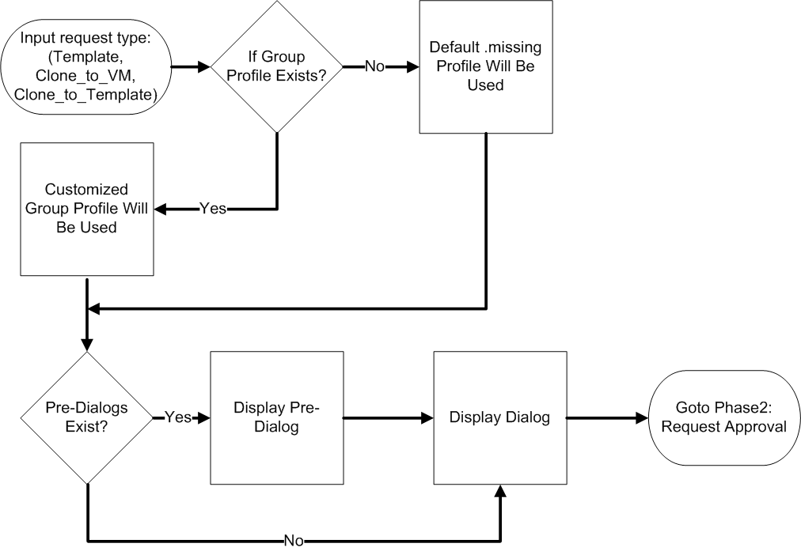

[width="100%",cols="<50%,<50%",options="header",]
|==================================================================================================================================================================================================================================================================================================================================================
|Question |Answer
|Where do I create a new provisioning profile based on a users LDAP group? |Navigate to [/EVMApplications/Provisioning/Profile/Group]. This is where you can create group profiles.
|Where can I specify a pre-dialog to present to a Requester in their LDAP group? |Custom pre-dialogs can be defined in [/EVMApplications/Provisioning/Profile/Group/<LDAP Group Name>].
|I would like to customize our dialogs. Where are all the dialogs kept? |All dialogs are located on each ManageIQ Appliance in the [/var/www/miq/vmdb/db/fixtures] directory.
|What happens if I do not specify any profiles for provisioning? |ManageIQ searches for a matching LDAP group in the [/EVMApplications/Provisioning/Profile/Group] class, if an LDAP profile is NOT found then ManageIQ will use the [/EVMApplications/Provisioning/Profile/Group/.missing] class instance.
|==================================================================================================================================================================================================================================================================================================================================================

C.2. Phase 2: Request Approval

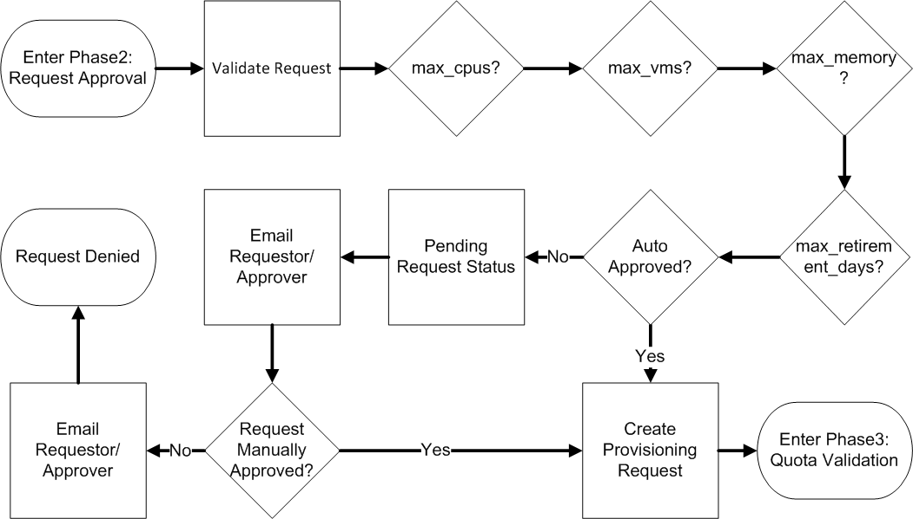

[width="100%",cols="<50%,<50%",options="header",]
|================================================================================================================================================================================================================================
|Question |Answer
|Where can I specify auto-approval values on a per virtual machine template basis? |Tags can be assigned to templates in the form of [prov_max_vms, prov_max_cpus, prov_max_memory, prov_max_retirement_days].
|Where can I modify the default Auto-Approval values? |These values can be set in the [/Factory/StateMachines/ProvisionRequestApproval/Default] class instance.
|How can I customize the email that is sent when a request is approved? |The Request Approved email message can be modified in [/Alert/EmailNotifications/request_approved].
|How can I customize the email that is sent when a request is denied? |The Request Denied email message can be modified in [/Alert/EmailNotifications/request_denied].
|How can I customize the email that is sent when a request is not Auto-approved? |The Request Pending email message can be modified in [/Alert/EmailNotifications/request_pending].
|If a Request Approval requires manual approval, how does an Approver approve the request? |Log into ManageIQ as an approver/admin and Navigate to [Virtual Machines/Requests] and then click on the request.
|================================================================================================================================================================================================================================

C.3. Phase 3: Quota Validation

[width="100%",cols="<50%,<50%",options="header",]
|============================================================================================================================================================================================================================================================================================================================
|Question |Answer
|Where in ManageIQ can I set default quota thresholds for users and groups? |These values can be set in the [/Factory/StateMachines/ProvisionRequestQuotaVerification/Default] class instance.
|Where in ManageIQ can I set individual and group quota thresholds? |Tags can be assigned to groups or users by navigating to Wrench\Configuration\Access Control . The following are valid tags that can be assigned to group or individual users: [quota_max_cpu, quota_max_memory, quota_max_storage].
|Where can I customize the way our virtual machines are named? |Virtual machine naming conventions can be altered using the methods in the [/EVMApplications/Provisioning/Naming] class.
|How can I customize the email that is sent when a request is denied? |The Request Denied email message can be modified in the [/Alert/EmailNotifications/request_denied.
|============================================================================================================================================================================================================================================================================================================================

C.4. Phase 4: Provisioning

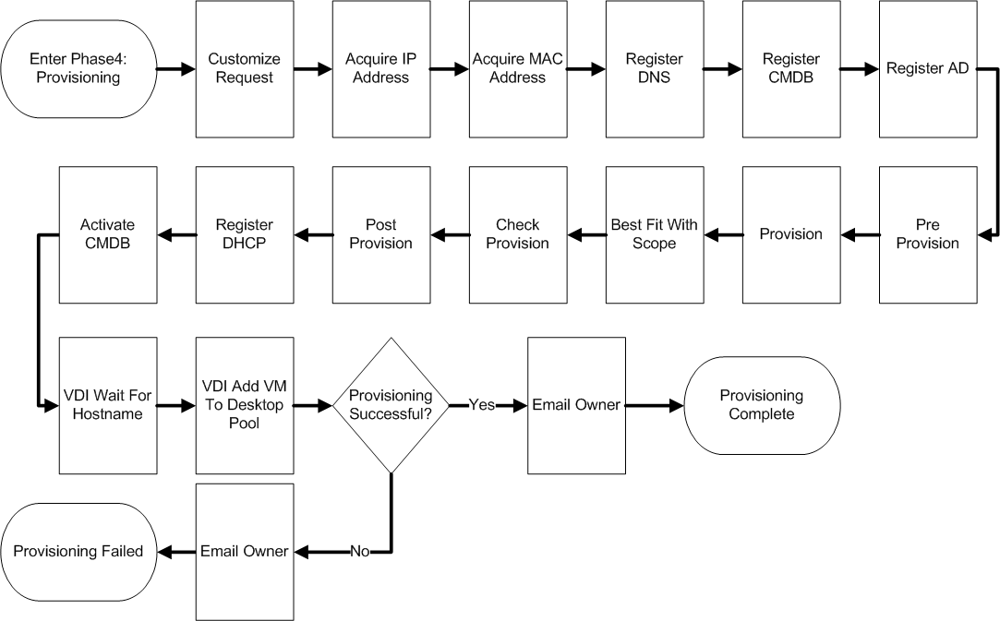

*Figure C.1. Target Type: Cloning a Template to a Virtual Machine*

 +

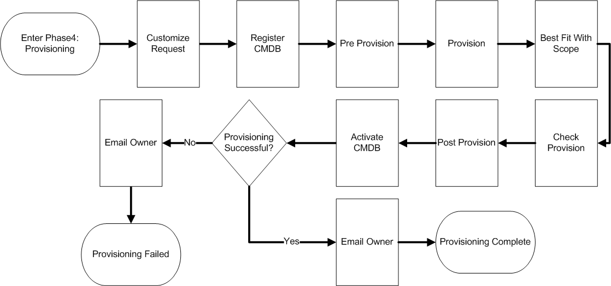

*Figure C.2. Target Type: Clone to Template*

 +

[width="100%",cols="<50%,<50%",options="header",]
|=================================================================================================================================================================================
|Question |Answer
|Where can I customize the email message that is sent upon provisioning completion? |This can be customized using the [/Alert/EmailNotifications/provision_complete_email].
|Where can I change what is put into the virtual machines Annotation after provisioning? |These settings can be modified by leveraging the [/Factory/VM/PreProvision] Ruby method.
|Where do I set the default VC folder location for provisioning virtual machines? |This can be modified by leveraging the [/Factory/VM/PreProvision] Ruby method.
|Where can I modify the virtual machine customization spec mapping? |This can be modified by leveraging the [/Factory/VM/PreProvision] Ruby method.
|Where can I modify the Clone_to_Template state_machine? |Navigate to the [/Factory/StateMachines/VMProvision_Template/Default] class instance.
|Where can I modify the Clone_to_VM state_machine? |Navigate to the [/Factory/StateMachines/VMProvision_VM/clone_to_vm] class instance.
|=================================================================================================================================================================================

C.5. Phase 5: Retirement

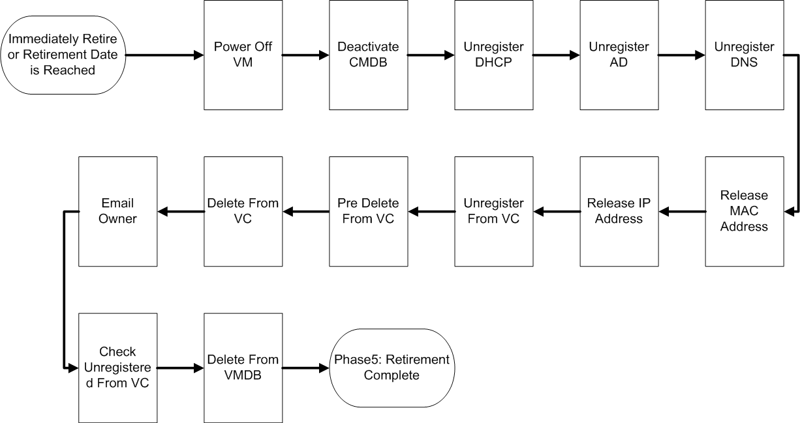

[width="100%",cols="<50%,<50%",options="header",]
|========================================================================================================================================================================================================================================================================================================
|Question |Answer
|Where can I customize the email message that is sent upon completion of virtual machine retirement? |This can be customized using the [/Alert/EmailNotifications/retirement_emails].
|Where can I customize the email message that is sent during virtual machine retirement warnings? |This can be customized using the [/Alert/EmailNotifications/retirement_emails].
|If I want to customize what gets called during the retirement phase where should I look? |Navigate to the [/Factory/StateMachines/VMRetirement/Default] class instance.
|How can I extend the virtual machine retirement date an additional number of days? |Create a custom button for virtual machines that launches [/System/Request/vm_retire_extend]. Then navigate to the [/Alert/EmailNotifications/vm_retire_extend] Ruby method and set the vm_retire_extend_days value.
|========================================================================================================================================================================================================================================================================================================

D.1. Ruby method

code,programlisting---------------------------------------------------------------------------------------------------------- code,programlisting

# ManageIQ Automate Method
#
$evm.log("info", "ManageIQ Automate Method  Building VM Provisioning Request Started")
#

prov    = $evm.root['miq_provision']

    # arg1 = version
    args = ['1.1']
    # arg2 = templateFields
    args << "name=App"
    # arg3 = vmFields
    args << 'vm_name=CRM_APP|request_type=template'
    #args << 'vm_name=service_test2|request_type=template|placement_host_name=esx.asdf.com'
    #args << 'request_type=template'
    # arg4 = requester
    args << 'owner_email=admin@asd.com|owner_last_name=Admin|owner_first_name=Admin|user_name=admin'
    #args << 'user_name=crm'
    # arg5 = tags
    args << 'crm=true'
    # arg6 = WS Values
    args << nil
    # arg7 = emsCustomAttributes
    args << nil
    # arg8 = miqCustomAttributes
    args << nil

    $evm.log("info","Building provisioning request with the following arguments: <#{args.inspect}>")
    result = $evm.execute('create_provision_request', *args)
----------------------------------------------------------------------------------------------------------
