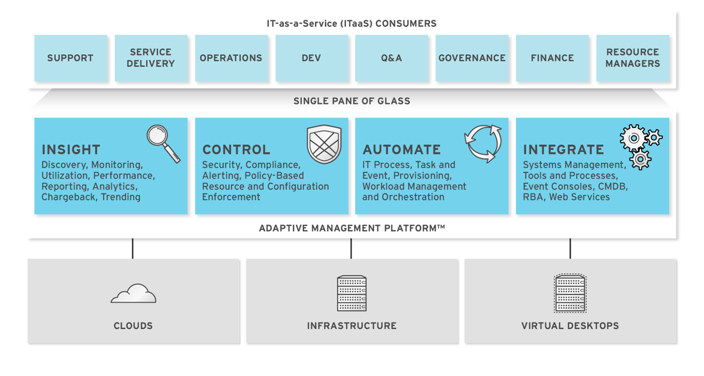

= ManageIQ 5.3 Methods Avilable for Automation

== Introduction

ManageIQ delivers the insight, control, and automation enterprises need to address the challenges of managing virtual environments. This technology enables enterprises with existing virtual infrastructures to improve visibility and control, and those starting virtualization deployments to build and operate a well-managed virtual infrastructure.

ManageIQ 5.3 is comprised of a single component, the ManageIQ. It has the following feature sets:

* Insight: Discovery, Monitoring, Utilization, Performance, Reporting, Analytics, Chargeback, and Trending.
* Control: Security, Compliance, Alerting, and Policy-Based Resource, and Configuration Enforcement.
* Automate: IT Process, Task and Event, Provisioning, and Workload Management and Orchestration.
* Integrate: Systems Management, Tools and Processes, Event Consoles, Configuration Management Database (CMDB), Role-based Administration (RBA), and Web Services.

=== Architecture

The diagram below describes the capabilities of ManageIQ. Its features are designed to work together to provide robust management and maintenance of your virtual infrastructure.

*Figure 1.1. Features*

 +

The architecture comprises the following components:

* The ManageIQ Appliance (Appliance) which is supplied as a secure, high-performance, preconfigured virtual machine. It provides support for Secure Socket Layer (SSL) communications.
* The ManageIQ Server (Server) resides on the Appliance. It is the software layer that communicates between the SmartProxy and the Virtual Management Database. It includes support for Secure Socket Layer (SSL) communications.
* The Virtual Management Database (VMDB) resides either on the Appliance or another computer accessible to the Appliance. It is the definitive source of intelligence collected about your Virtual Infrastructure. It also holds status information regarding Appliance tasks.
* The ManageIQ Console (Console) is the Web interface used to view and control the Server and Appliance. It is consumed through Web 2.0 mash-ups and web services (WS Management) interfaces.
* The SmartProxy can reside on the Appliance or on an ESX Server. If not embedded in the Server, the SmartProxy can be deployed from the Appliance. Each storage location must have a SmartProxy with visibility to it. The SmartProxy acts on behalf of the Appliance communicating with it over HTTPS (SSL) on standard port 443.

=== Requirements

To use ManageIQ, the following requirements must be met:

* One of the following Web Browsers:
** Mozilla Firefox for versions supported under Mozilla's Extended Support Release (ESR) link:#ftn.idm226499862144[^[1]^]
** Internet Explorer 8 or higher
** Google Chrome for Business
* A monitor with minimum resolution of 1280x1024.
* Adobe Flash Player 9 or above. At the time of publication, you can access it at http://www.adobe.com/products/flashplayer/[http://www.adobe.com/products/flashplayer/].
* The ManageIQ Appliance must already be installed and activated in your enterprise environment.
* The SmartProxy must have visibility to the virtual machines and cloud instances that you want to control.
* The resources that you want to control must have a SmartProxy associated with them.

IMPORTANT: Due to browser limitations, Red Hat supports logging in to only one tab for each multi-tabbed browser. Console settings are saved for the active tab only. For the same reason, ManageIQ does not guarantee that the browser's *Back* button will produce the desired results. ManageIQ recommends using the breadcrumbs provided in the Console.

=== Terminology

*The following terms are used throughout this document. Review them before proceeding.*

Account Role::
  A designation assigned to a user allowing or restricting a user to parts and functions of the ManageIQ console.
Action::
  An execution that is performed after a condition is evaluated.
Alert::
  ManageIQ alerts notify administrators and monitoring systems of critical configuration changes and threshold limits in the virtual environment. The notification can take the form of either an email or an SNMP trap.
Analysis Profile::
  A customized scan of hosts, virtual machines, or instances. You can collect information from categories, files, event logs, and registry entries.
Cloud::
  A pool of on-demand and highly available computing resources. The usage of these resources are scaled depending on the user requirements and metered for cost.
ManageIQ Appliance::
  A virtual machine on which the virtual management database (VMDB) and ManageIQ server reside.
ManageIQ Console::
  A web-based interface into the ManageIQ Appliance.
ManageIQ Role::
  A designation assigned to a ManageIQ server that defines what a ManageIQ server can do.
ManageIQ Server::
  The application that runs on the ManageIQ Appliance and communicates with the SmartProxy and the VMDB.
Cluster::
  Hosts that are grouped together to provide high availability and load balancing.
Condition::
  A test of criteria triggered by an event.
Discovery::
  Process run by the ManageIQ server which finds virtual machine and cloud providers.
Drift::
  The comparison of a virtual machine, instance, host, cluster to itself at different points in time.
Event::
  A trigger to check a condition.
Event Monitor::
  Software on the ManageIQ Appliance which monitors external providers for events and sends them to the ManageIQ server.
Host::
  A computer on which virtual machine monitor software is loaded.
Instance/Cloud Instance::
  A on-demand virtual machine based upon a predefined image and uses a scalable set of hardware resources such as CPU, memory, networking interfaces.
Managed/Registered VM::
  A virtual machine that is connected to a host and exists in the VMDB. Also, a template that is connected to a provider and exists in the VMDB. Note that templates cannot be connected to a host.
Managed/Unregistered VM::
  A virtual machine or template that resides on a repository or is no longer connected to a provider or host and exists in the VMDB. A virtual machine that was previously considered registered may become unregistered if the virtual machine was removed from provider inventory.
Provider::
  A computer on which software is loaded which manages multiple virtual machines that reside on multiple hosts.
Policy::
  A combination of an event, a condition, and an action used to manage a virtual machine.
Policy Profile::
  A set of policies.
Refresh::
  A process run by the ManageIQ server which checks for relationships of the provider or host to other resources, such as storage locations, repositories, virtual machines, or instances. It also checks the power states of those resources.
Resource::
  A host, provider, instance, virtual machine, repository, or datastore.
Resource Pool::
  A group of virtual machines across which CPU and memory resources are allocated.
Repository::
  A place on a datastore resource which contains virtual machines.
SmartProxy::
  The SmartProxy is a software agent that acts on behalf of the ManageIQ Appliance to perform actions on hosts, providers, storage and virtual machines.
  +
  The SmartProxy can be configured to reside on the ManageIQ Appliance or on an ESX server version. The SmartProxy can be deployed from the ManageIQ Appliance, and provides visibility to the VMFS storage. Each storage location must have a SmartProxy with visibility to it. The SmartProxy acts on behalf of the ManageIQ Appliance. If the SmartProxy is not embedded in the ManageIQ server, it communicates with the ManageIQ Appliance over HTTPS (SSL) on standard port 443.
SmartState Analysis::
  Process run by the SmartProxy which collects the details of a virtual machine or instance. Such details include accounts, drivers, network information, hardware, and security patches. This process is also run by the ManageIQ server on hosts and clusters. The data is stored in the VMDB.
SmartTags::
  Descriptors that allow you to create a customized, searchable index for the resources in your clouds and infrastructure.
Storage Location::
  A device, such as a VMware datastore, where digital information resides that is connected to a resource.
Tags::
  Descriptive terms defined by a ManageIQ user or the system used to categorize a resource.
Template::
  A template is a copy of a preconfigured virtual machine, designed to capture installed software and software configurations, as well as the hardware configuration, of the original virtual machine.
Unmanaged Virtual Machine::
  Files discovered on a datastore that do not have a virtual machine associated with them in the VMDB. These files may be registered to a provider that the ManageIQ server does not have configuration information on. Possible causes may be that the provider has not been discovered or that the provider has been discovered, but no security credentials have been provided.
Virtual Machine::
  A software implementation of a system that functions similar to a physical machine. Virtual machines utilize the hardware infrastructure of a physical host, or a set of physical hosts, to provide a scalable and on-demand method of system provisioning.
Virtual Management Database (VMDB)::
  Database used by the ManageIQ Appliance to store information about your resources, users, and anything else required to manage your virtual enterprise.
Virtual Thumbnail::
  An icon divided into smaller areas that summarize the properties of a resource.

=== About this Guide

This guide provides advanced methods for ManageIQ's automation functions. This document is organized by the object hierarchy in the Automate Model. The sublevels in the hierarchy have access to the methods for itself and the levels above it.

Methods can be used from within ManageIQ to create custom actions and workflows for the objects managed for your ManageIQ Infrastructure. This document describes the methods available for use in ManageIQ. The document outlines the following topics:

* The base methods that can be used with all objects available in the Automate Model.
* Methods that can be used on a virtual machine or template object, hosts and virtual machines, snapshots, switches, and currently logged in user.
* Methods that are available to the ManageIQ Server.
* Methods to handle requests.
* Methods for creating categories and tags.

 +

'''''
== ethods Available for Use with ManageIQ

Methods can be used from within ManageIQ to create custom actions and workflows for the objects managed for your ManageIQ Infrastructure. This document describes the methods available for use in ManageIQ. This document is organized by the object hierarchy in the Automate Model.

=== About $evm.root

When an Automate method is launched, it has one global variable: `$evm`. The `$evm` variable allows the method to communicate back to ManageIQ. The `$evm.root` is the root object in the workspace, it provides access to the data currently loaded in the ManageIQ model. It use the objects data to solve more complex problems by integrating with ManageIQ methods. For example, the EVMApplications / Provisioning / Where / least_utilized method uses data collected from ManageIQ Server to figure out where to place a virtual machine during provisioning.

The following is an excerpt from the *InspectMe* method that can be found in the *Sample Namespace*. The dumpRoot method accesses the `$evm.root` object, and sends all of its attributes to the ManageIQ Automate log for review. In the dumpServer Method, the inspect method is run based on the value of the miq_server obtained from the `$evm.root` object.

code,programlisting------------------------------------------------------------------------------------------------------------------------------------------------------------------------ code,programlisting

#########################
  #
  # Method: dumpRoot
  # Description: Dump Root information
  #
  ##########################
  def dumpRoot
    $evm.log("info", "#{@log_prefix} - Root:<$evm.root> Begin Attributes")
    $evm.root.attributes.sort.each { |k, v| $evm.log("info", "#{@log_prefix} - Root:<$evm.root> Attributes - #{k}: #{v}")}
    $evm.log("info", "#{@log_prefix} - Root:<$evm.root> End Attributes")
    $evm.log("info", "")
  end

  #########################
  #
  # Method: dumpServer
  # Inputs: $evm.root['miq_server']
  # Description: Dump MIQ Server information
  #
  ##########################
  def dumpServer
    $evm.log("info","#{@log_prefix} - Server:<#{$evm.root['miq_server'].name}> Begin Attributes")
    $evm.root['miq_server'].attributes.sort.each { |k, v| $evm.log("info", "#{@log_prefix} - Server:<#{$evm.root['miq_server'].name}> Attributes - #{k}: #{v.inspect}")}
    $evm.log("info","#{@log_prefix} - Server:<#{$evm.root['miq_server'].name}> End Attributes")
    $evm.log("info", "")
  end
------------------------------------------------------------------------------------------------------------------------------------------------------------------------

The result of dumpRoot is below. The value of miq_server is what gets passed into the dumpServer method.

code,programlisting----------------------------------------------------------------------------------------------------------------------------------------------------------------------------------------------------------- code,programlisting

[----] I, [2012-10-23T13:53:54.517279 #5320:f329024]  INFO -- : <User-Defined Method> [InspectMe] - EVM Automate Method Started
[----] I, [2012-10-23T13:53:54.523637 #5320:f329024]  INFO -- : <User-Defined Method> [InspectMe] - Root:<$evm.root> Begin Attributes
[----] I, [2012-10-23T13:53:54.527552 #5320:ef8c538]  INFO -- : <User-Defined Method> [InspectMe] - Root:<$evm.root> Attributes - miq_server: #<MiqAeMethodService::MiqAeServiceMiqServer:0x0000001e76d900>
[----] I, [2012-10-23T13:53:54.528801 #5320:ef8c538]  INFO -- : <User-Defined Method> [InspectMe] - Root:<$evm.root> Attributes - miq_server_id: 1
[----] I, [2012-10-23T13:53:54.529961 #5320:ef8c538]  INFO -- : <User-Defined Method> [InspectMe] - Root:<$evm.root> Attributes - object_name: Request
[----] I, [2012-10-23T13:53:54.531067 #5320:ef8c538]  INFO -- : <User-Defined Method> [InspectMe] - Root:<$evm.root> Attributes - request: inspectme
[----] I, [2012-10-23T13:53:54.534054 #5320:ef8c538]  INFO -- : <User-Defined Method> [InspectMe] - Root:<$evm.root> Attributes - vm: DEV-JaneM
[----] I, [2012-10-23T13:53:54.535156 #5320:ef8c538]  INFO -- : <User-Defined Method> [InspectMe] - Root:<$evm.root> Attributes - vm_id: 85
[----] I, [2012-10-23T13:53:54.536238 #5320:ef8c538]  INFO -- : <User-Defined Method> [InspectMe] - Root:<$evm.root> Attributes - vmdb_object_type: vm
[----] I, [2012-10-23T13:53:54.537159 #5320:f329024]  INFO -- : <User-Defined Method> [InspectMe] - Root:<$evm.root> End Attributes
[----] I, [2012-10-23T13:53:54.537772 #5320:f329024]  INFO -- : <User-Defined Method>
-----------------------------------------------------------------------------------------------------------------------------------------------------------------------------------------------------------

=== Method Hierarchy

The Automate Model inline methods have a hierarchy. The sublevels in the hierarchy have access to the methods for itself and the levels above it. For example, Red Hat Hosts have access to the Red Hat Host methods, Host Methods, and Base Methods.

Top Level: Base

1.  Virtual Machines and Templates
1.  Virtualization Infrastructure
1.  Red Hat (no additional methods)
2.  Vmware (no additional methods)
2.  Cloud Instances
1.  Amazon (no additional methods)
2.  OpenStack (no additional methods)
2.  Host
1.  Red Hat (no additional methods)
2.  VMware (no additional methods)
3.  VMware ESX
3.  Availability Zone
1.  Amazon (no additional methods)
2.  OpenStack (no additional methods)
4.  Cluster
5.  Datastore (Storage)
6.  Provider
1.  Virtualization Infrastructure
1.  Red Hat (no additional methods)
2.  Vmware (no additional methods)
2.  Cloud
1.  Amazon (no additional methods)
2.  OpenStack (no additional methods)
7.  Management System Folder
8.  Management System Events
9.  Filesystem (no additional methods)
10. Flavors
11. Guest Application
12. Guest Device
13. Hardware
14. Job (no additional methods)
15. Lan
16. MIQGroup
17. MIQServer
18. Network
19. Operating System (no additional methods)
20. Resource Pools (no additional methods)
21. Snapshot
22. Switch
23. Templates (See Virtual Machines and Templates.)
1.  Virtualization Infrastructure
1.  Red Hat (no additional methods)
2.  Vmware (no additional methods)
2.  Cloud Images
1.  Amazon (no additional methods)
2.  OpenStack (no additional methods)
24. User
25. Customization_Template
1.  Customization_template_kickstart (no additional methods)
2.  Customization_template_sysprep (no additional methods)
3.  Customization_template_cloudinit (no additional methods)
26. Miq_Request
1.  Automation_request
2.  Miq_host_provision_request
3.  Miq_provision_request
1.  Template (no additional methods)
4.  Service_template_provision_request (no additional methods)
5.  Vm_migrate_request (no additional methods)
6.  Vm_reconfigure_request (no additional methods)
27. Miq_Request_Task
1.  Automation_Task
2.  Miq_host_provision
3.  Miq_provision
1.  Amazon (no additional methods)
2.  Red Hat (no additional methods)
3.  VMware (no additional methods)
4.  Service_template_provision_task
5.  Vm_migrate_task
6.  Vm_reconfigure_task (no additional methods)
28. Pxe_Image
1.  Pxe_Image_Ipxe (no additional methods)
2.  Pxe_Image_pxeLinux (no additional methods)
29. Pxe_server
30. Service
31. Service_Template
32. Windows_image

=== Base Methods

These methods may be used with all objects available in the Automate Model.

[width="100%",cols="<50%,<50%",options="header",]
|============================================================================================================================
|Method |Usage
|inspect |Returns a string containing a list of attributes of the object. See the *InspectMe* method in *Samples* class.
|inspect_all |Returns all information for an object.
|virtual_column_names |Returns the objects virtual columns names.
|virtual_columns_inspect |Returns the objects virtual columns and values.
|reload |Returns to original object to prevent the internal object from being returned.
|model_suffix |Returns objects suffix. For an object of type MiqAeServiceVmVmware, returns *"Vmware"*.
|tagged_with?(category, name) |Is the object tagged with the category and name specified?
|tags(category = nil)-- this means that category is an optional parameter, with a default of nil. |Returns the tags.
|tag_assign(tag) |Assigns tag to the object, except for the `miq_provision` object, which uses `add_tag(category, tag_name)`.
|============================================================================================================================

The *InspectMe* *Sample Method* uses many of the Methods shown in this document. The method returns attributes of the ManageIQ Server and then returns attributes for the host, cluster, and virtual machine from the provider of invocation. In many environments it is linked to a button.

code,programlisting----------------------------------------------------------------------------- code,programlisting

###################################
# EVM Automate Method: InspectMe
#
# Notes: Dump the objects in storage to the automation.log
#
###################################
begin
  @method = 'InspectMe'
  @log_prefix = "[#{@method}]"
  $evm.log("info", "#{@log_prefix} - EVM Automate Method Started")

  # Turn on verbose logging
  @debug = true

  # List the types of object we will try to detect
  obj_types = %w{ vm host storage ems_cluster ext_management_system }
  obj_type = $evm.root.attributes.detect { |k,v| obj_types.include?(k)}

  # uncomment below to dump root object attributes
  dumpRoot

  # uncomment below to dump miq_server object attributes
  dumpServer

  # If obj_type is NOT nil
  unless obj_type.nil?
    rootobj = obj_type.first
    obj = obj_type.second
    $evm.log("info", "#{@log_prefix} - Detected Object:<#{rootobj}>")
    $evm.log("info","")

    case rootobj
    when 'host' then dumpHost(obj)
    when 'vm' then dumpVM(obj)
    when 'ems_cluster' then dumpCluster(obj)
    when 'ext_management_system' then dumpEMS(obj)
    when 'storage' then dumpStorage(obj)
    end
  end

  #
  # Exit method
  #
  $evm.log("info", "#{@log_prefix} - EVM Automate Method Ended")
  exit MIQ_OK

  #
  # Set Ruby rescue behavior
  #
rescue => err
  $evm.log("error", "#{@log_prefix} - [#{err}]\n#{err.backtrace.join("\n")}")
  exit MIQ_ABORT
end
-----------------------------------------------------------------------------

=== Virtual Machines and Templates (vm_or_template)

The following methods can be used on a virtual machine or template object.

[width="100%",cols="<50%,<50%",options="header",]
|==============================================================================================================================================================================
|Method |Use
|changed_vm_value? |Checks the 2 most recent drift state captures , and answers whether the specified value changed between them.
|collect_running_processes |Collects the running processes of the object.
|create_snapshot(name, desc = nil) |Create a snapshot of the object.
|custom_get(key) |Get the value of specified ManageIQ Server key from the object.
|custom_keys |List all ManageIQ Server custom keys for the object.
|custom_set(key, value) |Set a custom ManageIQ Server key value.
|datacenter |Returns objects Datacenter
|direct_service |Show the direct service relationship of the virtual machine.
|directories |Returns number of directories on the object.
|ems_blue_folder (this will be reworked to be more VMware-specific) |Returns objects blue folder from VMware. These are the folders showing in VM and Templates view in VMware.
|ems_cluster |Returns objects cluster.
|ems_custom_get(key) |Gets specified key of custom Management System Attribute.
|ems_custom_keys |List the custom keys defined by the Management System for the object.
|ems_custom_set(attribute, value) |Sets specified key and value of custom Management System Attribute.
|ems_folder |Returns objects folder on Management System.
|ems_ref_string |Returns unique identifier the Management System uses to identify this resource. For example, in VMware a VM would return a value like: "vm-26622".
|event_log_threshold? (options) |[multiblock cell omitted]
|event_threshold?(options) |[multiblock cell omitted]
|ext_management_system |Returns objects Management System.
|files |Returns number of files on the object.
|get_realtime_metric(metric, range, function) |Returns specified realtime metric.
|group=(group) |Sets objects group.
|guest_applications |Returns objects Guest Application list.
|hardware |Returns objects Hardware.
|host |Returns objects Host.
|migrate(host, pool = nil, priority = "defaultPriority", state = nil) |Migrates the object to another host. The only required parameter is host.
|miq_provision |If VM was created using ManageIQ Server provisioning, this is the miq_provision task instance that created the VM.
|operating_system |Returns objects Operating System.
|owner |Return objects owner.
|owner=(owner) |Sets objects owner.
|performances_maintains_value_for_duration? |[multiblock cell omitted]
|reboot_guest |Reboots the guest operating system.
|reconfigured_hardware_value? |Checks if hardware value has been reconfigured.
|refresh |Refresh power states and relationships of the object.
|registered? |Is the object registered?
|remove_all_snapshots |Remove all of the objects snapshots.
|remove_from_disk |Removes the object from disk.
|remove_from_vmdb |Removes the object from the VMDB.
|remove_snapshot(snapshot_id) |Remove a specific snapshot based on the snapshot_id.
|resource_pool |Returns objects Resource Pool.
|retire_now |Retire the object immediately.
|retirement_warn=(seconds) |Send a retirement warning.
|retires_on=(date) |Retire the object on date specified.
|revert_to_snapshot(snapshot_id) |Revert to a snapshot based on the snapshot_id.
|scan(scan_categories = nil) |Perform SmartState Analysis on the object. Scan_categories is optional.
|service |Show the top-level service for a virtual machine in a service hierarchy. For the immediate parent service relationship of a virtual machine, use direct_service.
|shutdownGuest |Shuts down the guest operating system of the object.
|snapshots |Returns list of snapshots for the object.
|standby_guest |Puts the operating system on standby.
|start |[multiblock cell omitted]
|stop |Stops the object.
|storage |Returns objects Datastore.
|suspend |Suspends the object.
|to_s |Converts object to string
|unlink_storage |Removes the reference to the VM's Datastore.
|unregister |Unregisters the object from the Management System.
|availability_zones |Return the virtual machine instance's availability zone (Cloud instances only).
|flavors |Return the virtual machine instance's hardware flavor (Cloud instances only).
|add_to_service(service) |Adds the VM to a service object.
|remove_from_service |Removes the VM from its parent service.
|==============================================================================================================================================================================

==== Excerpt from Sample/InspectMe

code,programlisting------------------------------------------------------------------------------------------------------------------------------------------------------------------------------------------------------------------------------------------ code,programlisting

#########################
  #
  # Method: dumpVM
  # Inputs: $evm.root['vm']
  # Description: Dump VM information
  #
  ##########################
  def dumpVM(vm)
    $evm.log("info","#{@log_prefix} - VM:<#{vm.name}> Begin Attributes [vm.attributes]")
    vm.attributes.sort.each { |k, v| $evm.log("info", "#{@log_prefix} - VM:<#{vm.name}> Attributes - #{k}: #{v.inspect}")}
    $evm.log("info","#{@log_prefix} - VM:<#{vm.name}> End Attributes [vm.attributes]")
    $evm.log("info","")

    $evm.log("info","#{@log_prefix} - VM:<#{vm.name}> Begin Associations [vm.associations]")
    vm.associations.sort.each { |assc| $evm.log("info", "#{@log_prefix} - VM:<#{vm.name}> Associations - #{assc}")}
    $evm.log("info","#{@log_prefix} - VM:<#{vm.name}> End Associations [vm.associations]")
    $evm.log("info","")

    $evm.log("info","#{@log_prefix} - VM:<#{vm.name}> Begin Hardware Attributes [vm.hardware]")
    vm.hardware.attributes.each { |k,v| $evm.log("info", "#{@log_prefix} - VM:<#{vm.name}> Hardware - #{k}: #{v.inspect}")}
    $evm.log("info","#{@log_prefix} - VM:<#{vm.name}> End Hardware Attributes [vm.hardware]")
    $evm.log("info","")

    $evm.log("info","#{@log_prefix} - VM:<#{vm.name}> Begin Hardware Associations [vm.hardware.associations]")
    vm.hardware.associations.sort.each { |assc| $evm.log("info", "#{@log_prefix} - VM:<#{vm.name}> hardware Associations - #{assc}")}
    $evm.log("info","#{@log_prefix} - VM:<#{vm.name}> End hardware Associations [vm.hardware.associations]")
    $evm.log("info","")

    $evm.log("info","#{@log_prefix} - VM:<#{vm.name}> Begin Neworks [vm.hardware.nics]")
    vm.hardware.nics.each { |nic| nic.attributes.sort.each { |k,v| $evm.log("info", "#{@log_prefix} - VM:<#{vm.name}> VLAN:<#{nic.device_name}> - #{k}: #{v.inspect}")}}
    $evm.log("info","#{@log_prefix} - VM:<#{vm.name}> End Networks [vm.hardware.nics]")
    $evm.log("info","")

    unless vm.ext_management_system.nil?
      $evm.log("info","#{@log_prefix} - VM:<#{vm.name}> Begin EMS [vm.ext_management_system]")
      vm.ext_management_system.attributes.sort.each { |ems_k, ems_v| $evm.log("info", "#{@log_prefix} - VM:<#{vm.name}> EMS:<#{vm.ext_management_system.name}> #{ems_k} - #{ems_v.inspect}")}
      $evm.log("info","#{@log_prefix} - VM:<#{vm.name}> End EMS [vm.ext_management_system]")
      $evm.log("info","")
    end

    unless vm.owner.nil?
      $evm.log("info","#{@log_prefix} - VM:<#{vm.name}> Begin Owner [vm.owner]")
      vm.owner.attributes.each { |k,v| $evm.log("info", "#{@log_prefix} - VM:<#{vm.name}> Owner - #{k}: #{v.inspect}")}
      $evm.log("info","#{@log_prefix} - VM:<#{vm.name}> End Owner [vm.owner]")
      $evm.log("info","")
    end

    unless vm.operating_system.nil?
      $evm.log("info","#{@log_prefix} - VM:<#{vm.name}> Begin Operating System [vm.operating_system]")
      vm.operating_system.attributes.sort.each { |k, v| $evm.log("info", "#{@log_prefix} - VM:<#{vm.name}> Operating System - #{k}: #{v.inspect}")}
      $evm.log("info","#{@log_prefix} - VM:<#{vm.name}> End Operating System [vm.operating_system]")
      $evm.log("info","")
    end

    unless vm.guest_applications.nil?
      $evm.log("info","#{@log_prefix} - VM:<#{vm.name}> Begin Guest Applications")
      vm.guest_applications.each { |guest_app| guest_app.attributes.sort.each { |k, v| $evm.log("info", "#{@log_prefix} - VM:<#{vm.name}> Guest Application:<#{guest_app.name}> - #{k}: #{v.inspect}")}} unless vm.guest_applications.nil?
      $evm.log("info","#{@log_prefix} - VM:<#{vm.name}> End Guest Applications")
      $evm.log("info","")
    end

    unless vm.snapshots.nil?
      $evm.log("info","#{@log_prefix} - VM:<#{vm.name}> Begin Snapshots")
      vm.snapshots.each { |ss| ss.attributes.sort.each { |k, v| $evm.log("info", "#{@log_prefix} - VM:<#{vm.name}> Snapshot:<#{ss.name}> - #{k}: #{v.inspect}")}} unless vm.snapshots.nil?
      $evm.log("info","#{@log_prefix} - VM:<#{vm.name}> End Snapshots")
      $evm.log("info","")
    end

    unless vm.storage.nil?
      $evm.log("info","#{@log_prefix} - VM:<#{vm.name}> Begin VM Storage [vm.storage]")
      vm.storage.attributes.sort.each { |stor_k, stor_v| $evm.log("info", "#{@log_prefix} - VM:<#{vm.name}> Storage:<#{vm.storage.name}> #{stor_k} - #{stor_v.inspect}")}
      $evm.log("info","#{@log_prefix} - VM:<#{vm.name}> End VM Storage [vm.storage]")
      $evm.log("info","")
    end

    $evm.log("info","#{@log_prefix} - VM:<#{vm.name}> Begin Virtual Columns -----")
    vm.virtual_column_names.sort.each { |vcn| $evm.log("info", "#{@log_prefix} - VM:<#{vm.name}> Virtual Columns - #{vcn}: #{vm.send(vcn).inspect}")}
    $evm.log("info","#{@log_prefix} - VM:<#{vm.name}> End Virtual Columns -----")
    $evm.log("info","")
  end
------------------------------------------------------------------------------------------------------------------------------------------------------------------------------------------------------------------------------------------

==== Snapshot Example

code,programlisting--------------------------------------------------------------------------------------------------------------- code,programlisting

####################
  #
  # Method: createSnapshot
  #
  ####################
  def createSnapshot(vm, snap_name, snap_desc=snap_name)
    $evm.log("info","#{@method} - VM:<#{vm.name}> Creating Snapshot:<#{snap_name}> Description:<#{snap_desc}>")
    vm.create_snapshot(snap_name, snap_desc)
  end
---------------------------------------------------------------------------------------------------------------

=== Hosts (host)

[width="100%",cols="<50%,<50%",options="header",]
|===============================================================================================
|Method |Use
|authentication_password |Returns credential password.
|authentication_userid |Returns credential user.
|datacenter |Returns datacenter.
|directories |Returns list of directories for the object.
|domain |Returns the domain portion of the hostname.
|ems_cluster |Returns cluster.
|ems_events |Returns an array of EmsEvent records associated with the object.
|ems_folder |Returns hosts folder on Management System.
|event_log_threshold?(options) |[multiblock cell omitted]
|ext_management_system |Returns Management System.
|files |Returns list of files for the object.
|guest_applications |Returns Guest Applications.
|hardware |Returns hardware.
|lans |Returns LANs.
|operating_system |Returns Operating System.
|storages |Returns datastores.
|switches |Returns network switches.
|vms |Returns VMs.
|credentials(type = :remote) |[multiblock cell omitted]
|ems_custom_keys |Returns Management Systems custom keys.
|ems_custom_get(key) |Gets Value for specified Management Systems custom key.
|ems_custom_set(attribute, value) |Sets value for specified custom key of the Management System.
|custom_keys |Lists ManageIQ Server custom keys.
|custom_get(key) |Gets value for specified ManageIQ Server custom key.
|custom_set(key, value) |Sets value for specified ManageIQ Server custom key
|ssh_exec(script) |Runs the specified script on the host.
|get_realtime_metric(metric, range, function) |Returns specified realtime metric.
|current_memory_usage |Returns current memory usage.
|current_cpu_usage |Returns current cpu usage.
|current_memory_headroom |Returns current memory headroom.
|to_s |Converts object to string
|scan |Performs SmartState Analysis on the object.
|===============================================================================================

==== Excerpt from Sample/InspectMe

code,programlisting------------------------------------------------------------------------------------------------------------------------------------------------------------------------------------------------------------ code,programlisting

#########################
  #
  # Method: dumpHost
  # Inputs: $evm.root['host']
  # Description: Dump Host information
  #
  ##########################
  def dumpHost(host)
    host = $evm.object['host'] || $evm.root['host']
    $evm.log("info","#{@log_prefix} - Host:<#{host.name}> Begin Attributes")
    host.attributes.sort.each { |k, v| $evm.log("info", "#{@log_prefix} - Host:<#{host.name}> Attributes - #{k}: #{v.inspect}")}
    $evm.log("info","#{@log_prefix} - Host:<#{host.name}> End Attributes")
    $evm.log("info","")

    $evm.log("info","#{@log_prefix} - Host:<#{host.name}> Begin Associations")
    host.associations.sort.each { |assc| $evm.log("info", "#{@log_prefix} - Host:<#{host.name}> Associations - #{assc}")}
    $evm.log("info","#{@log_prefix} - Host:<#{host.name}> End Associations")
    $evm.log("info","")

    $evm.log("info","#{@log_prefix} - Host:<#{host.name}> Begin Hardware")
    host.hardware.attributes.each { |k,v| $evm.log("info", "#{@log_prefix} - Host:<#{host.name}> Hardware - #{k}: #{v.inspect}")}
    $evm.log("info","#{@log_prefix} - Host:<#{host.name}> End Hardware")
    $evm.log("info","")

    $evm.log("info","#{@log_prefix} - Host:<#{host.name}> Begin Lans")
    host.lans.each { |lan| lan.attributes.sort.each { |k,v| $evm.log("info", "#{@log_prefix} - Host:<#{host.name}> Lan:<#{lan.name}> - #{k}: #{v.inspect}")}}
    $evm.log("info","#{@log_prefix} - Host:<#{host.name}> End Lans")
    $evm.log("info","")

    $evm.log("info","#{@log_prefix} - Host:<#{host.name}> Begin Switches")
    host.switches.each { |switch| switch.attributes.sort.each { |k,v| $evm.log("info", "#{@log_prefix} - Host:<#{host.name}> Swtiche:<#{switch.name}> - #{k}: #{v.inspect}")}}
    $evm.log("info","#{@log_prefix} - Host:<#{host.name}> End Switches")
    $evm.log("info","")

    $evm.log("info","#{@log_prefix} - Host:<#{host.name}> Begin Operating System")
    host.operating_system.attributes.sort.each { |k, v| $evm.log("info", "#{@log_prefix} - Host:<#{host.name}> Operating System - #{k}: #{v.inspect}")}
    $evm.log("info","#{@log_prefix} - Host:<#{host.name}> End Operating System")
    $evm.log("info","")

    $evm.log("info","#{@log_prefix} - Host:<#{host.name}> Begin Guest Applications")
    host.guest_applications.each { |guest_app| guest_app.attributes.sort.each { |k, v| $evm.log("info", "#{@log_prefix} - Host:<#{host.name}> Guest Application:<#{guest_app.name}> - #{k}: #{v.inspect}")}}
    $evm.log("info","#{@log_prefix} - Host:<#{host.name}> End Guest Applications")
    $evm.log("info","")

    $evm.log("info","#{@log_prefix} - Host:<#{host.name}> Begin Virtual Columns")
    host.virtual_column_names.sort.each { |vcn| $evm.log("info", "#{@log_prefix} - Host:<#{host.name}> Virtual Columns - #{vcn}: #{host.send(vcn).inspect}")}
    $evm.log("info","#{@log_prefix} - Host:<#{host.name}> End Virtual Columns")
    $evm.log("info", "")
  end
------------------------------------------------------------------------------------------------------------------------------------------------------------------------------------------------------------

==== Hosts: Vmware ESX (host_vmware_esx)

[width="100%",cols="<50%,<50%",options="header",]
|====================================================================================
|Method |Use
|disable_vmotion(device = nil) |Disable vMotion.
|enable_vmotion(device = nil) |Enable vMotion.
|enter_maintenance_mode(timeout = 0, evacuate = false) |Put Host in Maintenance Mode.
|exit_maintenance_mode(timeout = 0) |Leave Maintenance Mode.
|in_maintenance_mode? |Check to see if the host is in Maintenance Mode.
|power_down_to_standby(timeout = 0, evacuate = false) |Put Host in standby.
|power_up_from_standby(timeout = 0) |Take Host out of standby.
|reboot(force = false) |Reboot Host.
|shutdown(force = false) |Shutdown Host.
|vmotion_enabled?(device = nil) |Check to see if vMotion is enabled.
|====================================================================================

=== Host and Virtual Machine Metrics

The following table lists the metric types available for the `get_realtime_metric(metric, range, function)` method for hosts and virtual machines.

[width="100%",cols="<50%,<50%",options="header",]
|========================================================================================
|Metric |Description
|v_derived_storage_used |Capacity - Used space in bytes
|v_pct_cpu_ready_delta_summation |CPU - Percentage ready
|v_pct_cpu_wait_delta_summation |CPU - Percentage wait
|v_pct_cpu_used_delta_summation |CPU - Percentage used
|v_derived_vm_count |State - Peak average virtual machines (Hourly Count / Daily Average)
|v_derived_host_count |State - Number of hosts (Hourly Count / Daily Average)
|v_derived_cpu_reserved_pct |CPU - Percentage available
|v_derived_memory_reserved_pct |Memory - Percentage available
|========================================================================================

The following Ruby snippet demonstrates using the `get_realtime_metric(metric, range, function)` method using the `v_pct_cpu_ready_delta_summation` metric.

code,programlisting------------------------------------------------------------------------------------------------------------------ code,programlisting
host = $evm.root['host']
cpu_rdy = host.get_realtime_metric(:v_pct_cpu_ready_delta_summation, [15.minutes.ago.utc,5.minutes.ago.utc], :avg)
------------------------------------------------------------------------------------------------------------------

=== Clusters (ems_cluster)

[width="100%",cols="<50%,<50%",options="header",]
|============================================================================
|Method |Use
|all_resource_pools, |Return all of the objects Resource Pools.
|all_vms |Return all of the objects Virtual Machines
|default_resource_pool |Return the objects default Resource Pool.
|ems_events |Returns an array of EmsEvent records associated with the object.
|ext_management_system |Return objects Management System.
|hosts |Return objects Hosts.
|parent_folder |Return objects Parent Folder.
|register_host(host) |Register Host to this Cluster.
|resource_pools |Return objects Resource Pools.
|storages |Return objects datastores.
|vms |Return objects Virtual Machines.
|============================================================================

==== Excerpt from Sample/InspectMe

code,programlisting----------------------------------------------------------------------------------------------------------------------------------------------------------------- code,programlisting

  #########################
  #
  # Method: dumpCluster
  # Inputs: $evm.root['ems_cluster']
  # Description: Dump Cluster information
  #
  ##########################
  def dumpCluster(cluster)
    $evm.log("info","#{@log_prefix} - Cluster:<#{cluster.name}> Begin Attributes")
    cluster.attributes.sort.each { |k, v| $evm.log("info", "#{@log_prefix} - Cluster:<#{cluster.name}> Attributes - #{k}: #{v.inspect}")}
    $evm.log("info","#{@log_prefix} - Cluster:<#{cluster.name}> End Attributes")
    $evm.log("info","")

    $evm.log("info","#{@log_prefix} - Cluster:<#{cluster.name}> Begin Associations")
    cluster.associations.sort.each { |assc| $evm.log("info", "#{@log_prefix} - Cluster:<#{cluster.name}> Associations - #{assc}")}
    $evm.log("info","#{@log_prefix} - Cluster:<#{cluster.name}> End Associations")
    $evm.log("info","")

    $evm.log("info","#{@log_prefix} - Cluster:<#{cluster.name}> Begin Virtual Columns")
    cluster.virtual_column_names.sort.each { |vcn| $evm.log("info", "#{@log_prefix} - Cluster:<#{cluster.name}> Virtual Columns - #{vcn}: #{cluster.send(vcn)}")}
    $evm.log("info","#{@log_prefix} - Cluster:<#{cluster.name}> End Virtual Columns")
    $evm.log("info","")
  end
-----------------------------------------------------------------------------------------------------------------------------------------------------------------

=== Datastores (storage)

[width="100%",cols="<50%,<50%",options="header",]
|================================================================
|Method |Use
|ext_management_systems, |Returns objects Management System.
|hosts |Returns objects Hosts.
|vms |Returns objects Virtual Machines.
|unregistered_vms |Returns objects unregistered Virtual Machines.
|to_s |Converts object to string
|scan |Performs SmartState Analysis on the object.
|================================================================

==== Excerpt from Sample/InspectMe

code,programlisting----------------------------------------------------------------------------------------------------------------------------------------------------------------- code,programlisting

 #########################
  #
  # Method: dumpStorage
  # Inputs: $evm.root['storage']
  # Description: Dump Storage information
  #
  ##########################
  def dumpStorage(storage)
    $evm.log("info","#{@log_prefix} - Storage:<#{storage.name}> Begin Attributes")
    storage.attributes.sort.each { |k, v| $evm.log("info", "#{@log_prefix} - Storage:<#{storage.name}> Attributes - #{k}: #{v.inspect}")}
    $evm.log("info","#{@log_prefix} - Storage:<#{storage.name}> End Attributes")
    $evm.log("info","")

    $evm.log("info","#{@log_prefix} - Storage:<#{storage.name}> Begin Associations")
    storage.associations.sort.each { |assc| $evm.log("info", "#{@log_prefix} - Storage:<#{storage.name}> Associations - #{assc}")}
    $evm.log("info","#{@log_prefix} - Storage:<#{storage.name}> End Associations")
    $evm.log("info","")

    $evm.log("info","#{@log_prefix} - Storage:<#{storage.name}> Begin Virtual Columns")
    storage.virtual_column_names.sort.each { |vcn| $evm.log("info", "#{@log_prefix} - Storage:<#{storage.name}> Virtual Columns - #{vcn}: #{storage.send(vcn)}")}
    $evm.log("info","#{@log_prefix} - Storage:<#{storage.name}> End Virtual Columns")
    $evm.log("info","")
  end
-----------------------------------------------------------------------------------------------------------------------------------------------------------------

=== Providers (ext_management_system)

[width="100%",cols="<50%,<50%",options="header",]
|====================================================================================
|Method |Use
|authentication_password_encrypted |Returns credentials password encrypted.
|authentication_password |Returns credentials password unencrypted.
|authentication_userid |Returns credentials user id.
|ems_clusters |Returns objects clusters.
|ems_events |Returns an array of EmsEvent records associated with the object.
|ems_folders |Returns objects folders.
|hosts |Returns objects hosts.
|refresh |Refreshes relationships and power states for objects related to the object.
|resource_pools |Returns objects resource pools.
|storages |Returns objects storages.
|vms |Returns objects vms.
|to_s |Converts object to string
|availability_zones |Return the provider's availability zones (Cloud providers only).
|cloud_networks |Return the provider's available networks (Cloud providers only).
|flavors |Return the provider's hardware flavors (Cloud providers only).
|floating_ips |Return the provider's floating IP addresses (Cloud providers only).
|key_pairs |Return the provider's key pairs (Cloud providers only).
|security_groups |Return the provider's security groups (Cloud providers only).
|====================================================================================

==== Excerpt from Sample/InspectMe

code,programlisting------------------------------------------------------------------------------------------------------------------------------------------------------------------- code,programlisting

  #########################
  #
  # Method: dumpEMS
  # Inputs: $evm.root['ext_management_system']
  # Description: Dump EMS information
  #
  ##########################
  def dumpEMS(ems)
    $evm.log("info","#{@log_prefix} - EMS:<#{ems.name}> Begin Attributes")
    ems.attributes.sort.each { |k, v| $evm.log("info", "#{@log_prefix} - EMS:<#{ems.name}> Attributes - #{k}: #{v.inspect}")}
    $evm.log("info","#{@log_prefix} - EMS:<#{ems.name}> End Attributes")
    $evm.log("info","")

    $evm.log("info","#{@log_prefix} - EMS:<#{ems.name}> Begin Associations")
    ems.associations.sort.each { |assc| $evm.log("info", "#{@log_prefix} - EMS:<#{ems.name}> Associations - #{assc}")}
    $evm.log("info","#{@log_prefix} - EMS:<#{ems.name}> End Associations")
    $evm.log("info","")

    $evm.log("info","#{@log_prefix} - EMS:<#{ems.name}> Begin EMS Folders")
    ems.ems_folders.each { |ef| ef.attributes.sort.each { |k,v| $evm.log("info", "#{@log_prefix} - EMS:<#{ems.name}> EMS Folder:<#{ef.name}> #{k}: #{v.inspect}")}}
    $evm.log("info","#{@log_prefix} - EMS:<#{ems.name}> End EMS Folders")
    $evm.log("info","")

    $evm.log("info","#{@log_prefix} - EMS:<#{ems.name}> Begin Virtual Columns")
    ems.virtual_column_names.sort.each { |vcn| $evm.log("info", "#{@log_prefix} - EMS:<#{ems.name}> Virtual Columns - #{vcn}: #{ems.send(vcn)}")}
    $evm.log("info","#{@log_prefix} - EMS:<#{ems.name}> End Virtual Columns")
    $evm.log("info","")
  end
-------------------------------------------------------------------------------------------------------------------------------------------------------------------

=== Management System Events (ems_event)

[width="100%",cols="<50%,<50%",options="header",]
|===============================================================================================================
|Method |Use
|ext_management_system |Returns object's provider.
|ems |Shortcut to ext_management_system.
|src_vm |Source VM for the event.
|vm |VM for the event.
|src_host |Source Host for the event.
|host |Host for the event.
|dest_vm |Destination VM for the event.
|service |Service for the event.
|dest_host |Destination Host for the event.
|refresh(*targets) |Refresh the target types specified (ems, vm, host, src_vm, src_host, dest_vm, or dest_host).
|===============================================================================================================

=== Management System Folders (ems_folder)

[width="100%",cols="<50%,<50%",options="header",]
|============================================================
|Method |Use
|hosts |Returns hosts that are in the folder.
|vms |Returns VMs that are in folder.
|register_host(host) |Registers specified host to the folder.
|folder_path(*options) |Returns folders path.
|============================================================

=== Guest Applications (guest_application)

[width="100%",cols="<50%,<50%",options="header",]
|===========================
|Method |Use
|vm |Returns objects VM.
|host |Returns objects Host.
|===========================

=== Guest Device (guest_device)

[width="100%",cols="<50%,<50%",options="header",]
|===================================
|Method |Use
|hardware |Returns objects hardware.
|switch |Returns objects switch.
|lan |Returns objects LAN.
|network |Returns objects network.
|===================================

=== Hardware (hardware)

[width="100%",cols="<50%,<50%",options="header",]
|===================================================
|Method |Use
|ipaddresses |Returns objects IP addresses.
|guest_devices |Returns objects guest devices.
|storage_adapters |Returns objects storage adapters.
|nics |Returns objects nics.
|ports |Returns objects ports.
|vm |Returns objects Virtual Machine.
|host |Returns objects Host.
|mac_addresses |Returns objects MAC addresses.
|===================================================

=== LAN (lan)

[width="100%",cols="<50%,<50%",options="header",]
|=============================================
|Method |Use
|switch |Returns objects switch.
|guest_devices |Returns objects guest devices.
|vms |Returns objects Virtual Machines.
|templates |Returns objects templates.
|hosts |Returns objects Hosts.
|=============================================

=== Groups (miq_group)

[width="100%",cols="<50%,<50%",options="header",]
|=============================================================================
|Method |Use
|users |Returns users in the current miq_group.
|vms |Returns Virtual Machines that this group owns.
|custom_keys |Returns all custom keys for the group.
|custom_get(key) |Returns the value of the specified custom key for the group.
|custom_set(key, value) |Sets the value for the specified key.
|=============================================================================

==== Excerpt from Sample/InspectMe

code,programlisting------------------------------------------------------------------------------------------------------------------------------------------------------------------------------------------ code,programlisting

  #########################
  #
  # Method: dumpGroup
  # Inputs: $evm.root['user'].miq_group
  # Description: Dump User's Group information
  #
  ##########################
  def dumpGroup
    user = $evm.root['user']
    unless user.nil?
      miq_group = user.miq_group
      unless miq_group.nil?
        $evm.log("info","#{@method} - Group:<#{miq_group.description}> Begin Attributes [miq_group.attributes]")
        miq_group.attributes.sort.each { |k, v| $evm.log("info", "#{@method} - Group:<#{miq_group.description}> Attributes - #{k}: #{v.inspect}")} unless $evm.root['user'].miq_group.nil?
        $evm.log("info","#{@method} - Group:<#{miq_group.description}> End Attributes [miq_group.attributes]")
        $evm.log("info", "")

        $evm.log("info","#{@method} - Group:<#{miq_group.description}> Begin Associations [miq_group.associations]")
        miq_group.associations.sort.each { |assc| $evm.log("info", "#{@method} - Group:<#{miq_group.description}> Associations - #{assc}")}
        $evm.log("info","#{@method} - Group:<#{miq_group.description}> End Associations [miq_group.associations]")
        $evm.log("info","")

        $evm.log("info","#{@method} - Group:<#{miq_group.description}> Begin Virtual Columns [miq_group.virtual_column_names]")
        miq_group.virtual_column_names.sort.each { |vcn| $evm.log("info", "#{@method} - Group:<#{miq_group.description}> Virtual Columns - #{vcn}: #{miq_group.send(vcn).inspect}")}
        $evm.log("info","#{@method} - Group:<#{miq_group.description}> End Virtual Columns [miq_group.virtual_column_names]")
        $evm.log("info","")
      end
    end
  end
------------------------------------------------------------------------------------------------------------------------------------------------------------------------------------------

=== Servers (miq_server)

These methods are available to the ManageIQ Server.

[width="100%",cols="<50%,<50%",options="header",]
|==========================================================================
|Method |Use
|zone |Returns ManageIQ Servers Zone.
|region_number |Returns ManageIQ Servers Region Number.
|region_name |Returns ManageIQ Servers Region Name.
|==========================================================================

==== Excerpt from Sample/InspectMe

code,programlisting-------------------------------------------------------------------------------------------------------------------------------------------------------------------- code,programlisting

  #########################
  #
  # Method: dumpServer
  # Inputs: $evm.root['miq_server']
  # Description: Dump MIQ Server information
  #
  ##########################
  def dumpServer
    $evm.log("info","#{@method} - Server:<#{$evm.root['miq_server'].name}> Begin Attributes")
    $evm.root['miq_server'].attributes.sort.each { |k, v| $evm.log("info", "#{@method} - Server:<#{$evm.root['miq_server'].name}> Attributes - #{k}: #{v.inspect}")}
    $evm.log("info","#{@method} - Server:<#{$evm.root['miq_server'].name}> End Attributes")
    $evm.log("info", "")
  end
--------------------------------------------------------------------------------------------------------------------------------------------------------------------

=== Network (network)

[width="100%",cols="<50%,<50%",options="header",]
|============================================
|Method |Use
|hardware |Returns objects hardware.
|guest_device |Returns objects guest devices.
|============================================

=== Snapshot (snapshot)

These methods can be used on Snapshots

[width="100%",cols="<50%,<50%",options="header",]
|========================================================
|Method |Use
|vm |Returns Snapshots VM.
|current? |Checks to see if this is the current snapshot.
|get_current_snapshot |Returns the current snapshot id.
|revert_to |Reverts to specified snapshot.
|remove |Removes specified snapshot.
|========================================================

=== Switch (switch)

These methods can be used on Switches.

[width="100%",cols="<50%,<50%",options="header",]
|==============================================
|Method |Use
|host |Returns switch's Host.
|guest_devices |Returns switch's guest devices.
|lans |Returns switch's lans.
|==============================================

=== User (user)

These methods can be used on the currently logged on user.

[width="100%",cols="<50%,<50%",options="header",]
|=============================================================================
|Method |Use
|custom_get(key) |Returns the custom key value specified by "key".
|custom_keys |Returns an array of custom keys.
|custom_set(key,value) |Sets custom value for "key" to "value".
|email |Returns user's email address.
|find_ldap_user |Returns user's LDAP object.
|get_ladap_attribute(name) |Returns the value of the specified LDAP attribute.
|get_ldap_atttribute_names |Returns user's LDAP attribute names.
|ldap_group |Returns user's ldap_group.
|miq_group |Returns user's miq_group
|miq_requests |Returns user's requests.
|name |Returns user's name.
|miq_user_role_name |Returns user's groups role.
|userid |Returns user's userid.
|vms |Returns Virtual Machines that this user owns.
|=============================================================================

==== Excerpt from Sample/InspectMe

code,programlisting----------------------------------------------------------------------------------------------------------------------------------------------------------- code,programlisting

  #########################
  #
  # Method: dumpUser
  # Inputs: $evm.root['user']
  # Description: Dump User information
  #
  ##########################
  def dumpUser
    user = $evm.root['user']
    unless user.nil?
      $evm.log("info","#{@method} - User:<#{user.name}> Begin Attributes [user.attributes]")
      user.attributes.sort.each { |k, v| $evm.log("info", "#{@method} - User:<#{user.name}> Attributes - #{k}: #{v.inspect}")}
      $evm.log("info","#{@method} - User:<#{user.name}> End Attributes [user.attributes]")
      $evm.log("info", "")

      $evm.log("info","#{@method} - User:<#{user.name}> Begin Associations [user.associations]")
      user.associations.sort.each { |assc| $evm.log("info", "#{@method} - User:<#{user.name}> Associations - #{assc}")}
      $evm.log("info","#{@method} - User:<#{user.name}> End Associations [user.associations]")
      $evm.log("info","")

      $evm.log("info","#{@method} - User:<#{user.name}> Begin Virtual Columns [user.virtual_column_names]")
      user.virtual_column_names.sort.each { |vcn| $evm.log("info", "#{@method} - User:<#{user.name}> Virtual Columns - #{vcn}: #{user.send(vcn).inspect}")}
      $evm.log("info","#{@method} - User:<#{user.name}> End Virtual Columns [user.virtual_column_names]")
      $evm.log("info","")
    end
  end
-----------------------------------------------------------------------------------------------------------------------------------------------------------

=== Customization Template (customization_template)

[width="100%",cols="<50%,<50%",options="header",]
|=======================================================
|Method |Use
|Pxe_images |Returns customization templates pxe images.
|=======================================================

=== Request (miq_request)

Request objects are submitted to ManageIQ Server for processing. After the request phase, the request becomes a task object. The table below shows the relationship between a request object and a task object.

[width="100%",cols="<50%,<50%",options="header",]
|===================================================================
|Request Object |Task Object
|automation_request |automation_task
|miq_host_provision_request |miq_host_provision
|miq_provision_request |miq_provision
|vm_reconfigure_request |vm_reconfigure_task
|service_template_provision_request |service_template_provision_task
|vm_migrate_request |vm_migrate_task
|===================================================================

If you set something on the request object, it will be inherited by the task instance that does the work. This may be useful if you are provisioning multiple virtual machines at a time and need to modify the same setting for all. Otherwise, the item can be modified on the individual task.

[width="100%",cols="<50%,<50%",options="header",]
|=============================================================================================================================================================================================================================================================================================================
|Method |Use
|add_tag(category, tag_name) |[multiblock cell omitted]
|approve(approver,reason for approval) |[multiblock cell omitted]
|approvers |Returns request approvers.
|authorized? |Returns true if authorized, false if not.
|clear_tag(category=nil, tag_name=nil) |[multiblock cell omitted]
|deny |[multiblock cell omitted]
|get_classification(category) |[multiblock cell omitted]
|get_classifications |[multiblock cell omitted]
|get_option(key) |[multiblock cell omitted]
|get_tag(category) |[multiblock cell omitted]
|get_tags |[multiblock cell omitted]
|miq_request |(Legacy support) Internal Note: The miq_request instance use to be a separate instance from the specific request instance (like miq_provision_request). When the classes were refactored into 1 this method was added to allow existing code and automate methods to continue to run unchanged.)
|miq_request_tasks |Returns the requests tasks.
|options |Returns a hash containing all the options set for the current provision object.
|pending |[multiblock cell omitted]
|reason |Returns reason for approval or denial of request.
|requester |Returns the requester.
|resource |Returns the resource for the request.
|set_message(value) |Sets the message for the request.
|set_option(key, value) |Sets the specified key/value pair for the object.
|=============================================================================================================================================================================================================================================================================================================

==== Automation Request (automation_request)

[width="100%",cols="<50%,<50%",options="header",]
|=================================================
|Method |Use
|automation_tasks |Returns objects automate tasks.
|=================================================

==== Host Provision Request (miq_host_provision_request)

[width="100%",cols="<50%,<50%",options="header",]
|=============================================================
|Method |Use
|miq_host_provisions |Returns the miq_host_provisions objects.
|=============================================================

==== VM Provision Request (miq_provision_request)

[width="100%",cols="<50%,<50%",options="header",]
|==========================================================================================================================================================================================================================================================================================================================================================================================================================================
|Method |Use
|check_quota(quota_type, options=\{}) |Returns the quota information for the specified type.
|eligible_clusters |Returns an array of available Cluster objects filtered by previously selected resources.
|eligible_customization_templates |Returns an array of available Customization Templates filtered by previously selected resources.
|eligible_folders |Returns an array of available Folder objects filtered by previously selected resources.
|eligible_hosts |Returns an array of available Host objects filtered by previously selected resources.
|eligible_pxe_images |Returns an array of available PXE Image objects filtered by previously selected resources.
|eligible_pxe_servers |Returns an array of available PXE Server objects filtered by previously selected resources.
|eligible_resource_pools |Returns an array of available Resource Pool objects filtered by previously selected resources.
|eligible_resources(rsc_type) |Returns eligible resources given the type specified.
|eligible_storages |Returns an array of available Storage (Datastore) objects filtered by previously selected resources.
|eligible_windows_images |Returns an array of available Windows Image objects filtered by previously selected resources.
|get_folder_paths |Returns a hash where the key is an index and the value is the fully-qualified path name of the folder. (Sample: \{7 => Dev/Dept1/QA, 8 => Test/Dept2/QA}) This format is useful when a fully-qualified path is required to match the folder name. For example, if you had multiple QA folders under different departments in the sample above. To find the proper QA folder you need to evaluate the entire folder path.
|miq_provision |Returns the task.
|miq_request |Returns the miq_provision_requests miq_request object.
|set_cluster(rsc) |Set the cluster to use based on object returned from eligible_clusters.
|set_customization_template(rsc) |Set the customization_template to use based on object returned from eligible_customization_templates.
|set_folder(folder_path) |[multiblock cell omitted]
|set_host(rsc) |Set the host to use based on object returned from eligible_hosts.
|set_network_adapter(idx, nic_hash, value=nil) |[multiblock cell omitted]
|set_network_address_mode(mode) |Sets IP address type. Available modes are dhcp and static.
|set_nic_settings(idx, nic_hash, value=nil) |[multiblock cell omitted]
|set_pxe_image(rsc) |Set the pxe_image to use based on object returned from eligible_pxe_images.
|set_pxe_server(rsc) |Set the pxe_server to use based on object returned from eligible_pxe_servers.
|set_resource_pool(rsc) |Set the resource_pool to use based on object returned from eligible_resource_pools.
|set_resource(rsc) |Sets the resource for the request. (Helper method, should not be called directly)
|set_retirement_days |Set the number of days until retirement.
|set_storage(rsc) |Set the Datastore (storage object) to use based on object returned from eligible_storages.
|set_vm_notes(note) |Sets text for the VM notes (aka annotation) field
|set_windows_image(rsc) |Set the windows_image to use based on object returned from eligible_windows_images.
|source_type |Returns the provision source type. (values are 'vm' or 'template')
|src_vm_id |Returns ID of the template being cloned..
|target_type |Returns the provision target type. (values are 'vm' or 'template')
|vm_template |Returns the requests template.
|==========================================================================================================================================================================================================================================================================================================================================================================================================================================

=== Request Task (miq_request_task)

[width="100%",cols="<50%,<50%",options="header",]
|=======================================================================================================================================================================================
|Method |Use
|add_tag(category, tag_name) |[multiblock cell omitted]
|clear_tag(category=nil, tag_name=nil) |[multiblock cell omitted]
|destination |Returns the destination object. (The resultant object from running the task. In the case of provisioning, this would be the newly created VM.)
|execute |Executes or processes the request.
|finished(msg) |Sets the task to finished with the supplied message.
|get_classification(category) |[multiblock cell omitted]
|get_classifications |[multiblock cell omitted]
|get_option_last(key) |This method is the same as get_option, except that it returns the last array value.
|get_option(key) |[multiblock cell omitted]
|get_tag(category) |[multiblock cell omitted]
|get_tags |[multiblock cell omitted]
|message=(msg) |Sets the message for the request task.
|miq_request |Returns the miq_request for the task.
|miq_request_task |Returns the parent miq_request task.
|miq_request_tasks |Returns the children miq_request tasks.
|options |Returns a hash containing all the options set for the current object.
|set_option(key, value) |Updates a key/value pair in the options hash for the provision object. Often the value is required to be an array.
|source |Returns the source object. (The source, or input, object that the task runs against. In the case of provisioning, this would be the VM or template selected to be provisioned.)
|=======================================================================================================================================================================================

==== Automation Task (automation_task)

[width="100%",cols="<50%,<50%",options="header",]
|=================================================================
|Method |Use
|automation_request |Returns associated automation_request object.
|status |Returns status of the task.
|=================================================================

==== Host Provision Task (miq_host_provision)

[width="100%",cols="<50%,<50%",options="header",]
|======================================================================
|Method |Use
|host |Returns objects host.
|miq_host_provision_request |Returns the request that created the task.
|status |Returns status of host provision.
|======================================================================

==== VM Provision Task (miq_provision)

[width="100%",cols="<50%,<50%",options="header",]
|==========================================================================================================================================================================================================================================================================================================================================================================================================================================
|Method |Use
|check_quota(quota_type, options=\{}) |Returns the quota information for the specified type.
|eligible_clusters |Returns an array of available Cluster objects filtered by previously selected resources.
|eligible_customization_templates |Returns an array of available Customization Templates
|eligible_folders |Returns an array of available Folder objects filtered by previously selected resources.
|eligible_hosts |Returns an array of available Host objects filtered by previously selected resources.
|eligible_pxe_images |Returns an array of available PXE Image objects filtered by previously selected resources.
|eligible_pxe_servers |Returns an array of available PXE Servers filtered by previously selected resources.
|eligible_resource_pools |Returns an array of available Resource Pool objects filtered by previously selected resources.
|eligible_resources(rsc_type) |Returns the eligible resources for the resource type specified.
|eligible_storages |Returns an array of available Storage (Datastore) objects filtered by previously selected resources.
|eligible_windows_images |Returns an array of available Windows Image objects filtered by previously selected resources.
|get_domain_details |Returns domain information.
|get_domain_name |Returns domain name.
|get_folder_paths |Returns a hash where the key is an index and the value is the fully-qualified path name of the folder. (Sample: \{7 => Dev/Dept1/QA, 8 => Test/Dept2/QA}) This format is useful when a fully-qualified path is required to match the folder name. For example, if you had multiple QA folders under different departments in the sample above. To find the proper QA folder you need to evaluate the entire folder path.
|get_network_details |Returns network information.
|get_network_scope |Returns network scope.
|miq_provision_request |Returns the provision request object.
|set_cluster(rsc) |Set the cluster to use based on object returned from eligible_clusters.
|set_customization_spec(name=nil, override=false) |Sets the name of the custom spec to use as defined by its name in Virtual Center.
|set_customization_template(rsc) |Set the customization_template to use based on object returned from eligible_customization_templates.
|set_dvs(portgroup, switch = portgroup) |[multiblock cell omitted]
|set_folder(folder_path) |[multiblock cell omitted]
|set_host(rsc) |Set the host to use based on object returned from eligible_hosts.
|set_network_adapter(idx, nic_hash, value=nil) |[multiblock cell omitted]
|set_network_address_mode(mode) |Available modes are dhcp and static.
|set_nic_settings(idx, nic_hash, value=nil) |[multiblock cell omitted]
|set_pxe_image(rsc) |Set the pxe_image to use based on object returned from eligible_pxe_images.
|set_pxe_server(rsc) |Set the pxe_server to use based on object returned from eligible_pxe_servers.
|set_resource_pool(rsc) |Set the resource_pool to use based on object returned from eligible_resource_pools.
|set_storage(rsc) |Set the Datastore (storage object) to use based on object returned from eligible_storages.
|set_vlan(vlan) |[multiblock cell omitted]
|set_vm_notes(note) |Sets text for the VM notes (aka annotation) field.
|set_vm_notes(notes) |Sets text for the VM notes (aka annotation) field.
|set_windows_image(rsc) |Set the windows_image to use based on object returned from eligible_windows_images.
|source_type |Returns the provision source type. (values are 'vm' or 'template')
|status |Returns provision status.
|target_type |Returns the provision target type. (values are 'vm' or 'template')
|vm |The newly created vm
|vm_template |Returns the template selected to be provisioned.
|==========================================================================================================================================================================================================================================================================================================================================================================================================================================

===== Example using miq_provision object

code,programlisting---------------------------------------------------------------------------------------------------------------------- code,programlisting

begin
  miq_provision = $evm.root["miq_provision"] || $evm.root['miq_provision']
  prov = $evm.root["miq_provision"]
  user = prov.miq_request.requester
  raise "User not specified" if user.nil?

  ###################################
  # Process Change Request Number and set VM Annotation
  ###################################
  intake = prov.get_option(:vm_description)
  intake = "Change Request#: #{intake}"
  prov.set_option(:vm_description,intake)

  ###################################
  # Set the customization spec based on the environment tag chosen in the dialog
  ###################################
  tags = prov.get_tags
  $evm.log("info","Tags: #{tags.inspect}")
  env = tags[:environment]
  $evm.log("info", "Mapping custom spec based on Category Environment <#{env}> chosen in the dialog")
  if env.eql? "dev"
    customization_spec = "Dev-Specification"
    miq_provision.set_customization_spec(customization_spec)
  end
  if env.eql? "stg"
    customization_spec = "Stg-Specification"
    miq_provision.set_customization_spec(customization_spec)
  end

  ###################################
  # Set the VM Notes as follows:
  ###################################
  vm_notes = "#{intake}"
  vm_notes +=  "\nOwner: #{miq_provision.get_option(:owner_first_name)} #{miq_provision.get_option(:owner_last_name)}"
  vm_notes += "\nEmail: #{miq_provision.get_option(:owner_email)}"
  vm_notes += "\nSource Template: #{miq_provision.vm_template.name}"
  miq_provision.set_vm_notes(vm_notes)

  ###################################
  # Drop the VM in the targeted folder
  # In VC a folder must exist that matches the LDAP Group
  # VM will be placed in the Folder
  ###################################
  if prov.get_option(:placement_folder_name).nil?
    ###################################
    # If you want to use a Default folder, set folder = below to the default
    ###################################
    #    folder = "22F DC/LAB FARM/GSE/Intel/Infrastructure/ManageIQ/SelfServiceVMs"
    folder = "DC1/Infrastructure/ManageIQ/SelfService"
    $evm.log("info", "Placing VM in VC folder: <#{folder}")
    $evm.log("info", "Set_folder called with [#{folder.inspect}]")

    miq_provision.set_folder(folder)
  end

  ####################################################
  # Set the IP Address based on the :mac_address entered in the dialog
  #
  ####################################################
  ipaddr = prov.get_option(:mac_address)

  if ! ipaddr.nil?
    # Set provisioning options to override options
    prov.set_option(:sysprep_spec_override, [true, 1])
    prov.set_option(:addr_mode, ["static", "Static"])
    prov.set_option(:ip_addr, ipaddr)
    # Reset :mac_address to nil
    prov.set_option(:mac_address, nil)
  end

  $evm.log("info", "Provision Options: #{prov.options.inspect}")

  exit MIQ_OK

rescue => err
  $evm.log("info", "Set_folder err [#{err}]\n#{err.backtrace.join("\n")}")
end
----------------------------------------------------------------------------------------------------------------------

==== Service Template Provision Task (service_template_provision_task)

[width="100%",cols="<50%,<50%",options="header",]
|===========================================================================
|Method |Use
|dialog_options |Returns objects dialog options hash.
|get_dialog_option(key) |Returns objects dialog value for the specified key.
|Service_resource |Returns the service resource for the task.
|Set_dialog_option(key, value) |[multiblock cell omitted]
|status |Returns the tasks status.
|===========================================================================

==== VM Migrate Task (vm_migrate_task)

[width="100%",cols="<50%,<50%",options="header",]
|=============================================
|Method |Use
|status |Returns status of the migration task.
|=============================================

=== PXE Image (pxe_image)

[width="100%",cols="<50%,<50%",options="header",]
|=================================================================
|Method |Use
|customization_templates |Returns objects customization templates.
|pxe_server |Returns objects pxe server.
|=================================================================

=== PXE Server (pxe_server)

[width="100%",cols="<50%,<50%",options="header",]
|=============================================================================
|Method |Use
|advertised_images |Returns objects advertised images.
|advertised_pxe_images |Returns objects advertised pxe images.
|default_pxe_image_for_windows |Returns objects default pxe image for windows.
|discovered_images |Returns objects discovered images.
|discovered_pxe_images |Returns objects discovered pxe images.
|images |Returns objects images.
|pxe_images |Returns objects pxe_images.
|windows_images |Returns objects windows images.
|=============================================================================

=== Service (service)

[width="100%",cols="<50%,<50%",options="header",]
|====================================================================================================
|Method |Use
|group=(group) |Sets group that owns the service.
|name=(new_name) |Sets name of service.
|owner=(owner) |Sets owner of the service.
|retire_now |Retire Service immediately.
|retirement_warn=(seconds) |Sets when to send retirement warning.
|retires_on=(date) |Sets retirement date.
|shutdown_guest |Shuts downs guest operating system of the Service.
|start |Start the Service.
|stop |Stop the Service.
|suspend |Suspend the Service.
|vms |Show all virtual machines associated with this service.
|direct_vms |Show virtual machines directly associated with this service.
|indirect_vms |Show virtual machines associated with lower level services in the hierarchy.
|root_service |Show the top level service in the hierarchy for the target service.
|all_service_children |Show all lower level services to the target service in the hierarchy.
|direct_service_children |Show direct services associated with the target service.
|indirect_service_children |Show services associated with lower level services of the target service.
|parent_service |Show the parent service for the target service.
|description=(new_description) |Sets the service description.
|remove_from_vmdb |Delete the service from the database.
|====================================================================================================

=== Service Template (service_template)

[width="100%",cols="<50%,<50%",options="header",]
|===================================================
|Method |Use
|group=(group) |Sets group for the service template.
|owner=(owner) |Sets owner for the service template.
|===================================================

=== Service Resource (service_resource)

[width="100%",cols="<50%,<50%",options="header",]
|==========================================================
|Method |Use
|service |Returns the associated service.
|service_template |Returns the associated service template.
|resource |Returns the resource for the request.
|source |Returns the source object.
|==========================================================

=== Windows Image (windows_image)

[width="100%",cols="<50%,<50%",options="header",]
|====================================================================
|Method |Use
|Customization_templates |Returns the images customization templates.
|Pxe_server |Returns the images pxe server.
|====================================================================

=== Creating Categories and Tags

These methods are invoked using $evm.execute. See after the table for usage examples.

[width="100%",cols="<50%,<50%",options="header",]
|===========================================
|Method(_parameter_) |Use
|category_exists? |[multiblock cell omitted]
|category_create |[multiblock cell omitted]
|tag_exists? |[multiblock cell omitted]
|tag_create |[multiblock cell omitted]
|===========================================

==== Category and Tags Methods Example

In this example, the VMDB is checked to see if the *Department* category exists. If it does, then a message is logged. If not, the category is created and a message is logged. Values are then added to the category.

code,programlisting-------------------------------------------------------------------------------------------------------------- code,programlisting

if $evm.execute('category_exists?', "department")
  $evm.log("info", "Classification department exists")
else
  $evm.log("info", "Classification department doesn't exist, creating category")
  $evm.execute('category_create', :name => "department", :single_value => false, :description => "Department")
  $evm.log("info", "Adding new tag in Department Category")
  $evm.execute(tag_create', "department", :name => "finance", :description => "Finance")
--------------------------------------------------------------------------------------------------------------

=== Quota

[width="100%",cols="<50%,<50%",options="header",]
|=====================================================================================================
|Method(_parameter_) |Use
|vms_by_owner, vms_by_group, vms_by_owner_and_group |[multiblock cell omitted]
|retired_vms_by_owner, retired_vms_by_group, retired_vms_by_owner_and_group |[multiblock cell omitted]
|provisions_by_owner, provisions_by_group |[multiblock cell omitted]
|requests_by_owner, requests_by_group |[multiblock cell omitted]
|active_provisions_by_owner, active_provisions_by_group, active_provisions |[multiblock cell omitted]
|=====================================================================================================