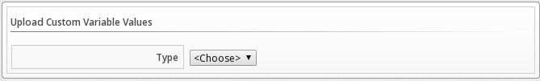
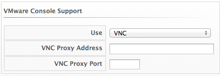

= ManageIQ 5.3 Settings and Operations Guide

== Introduction

ManageIQ delivers the insight, control, and automation enterprises need to address the challenges of managing virtual environments. This technology enables enterprises with existing virtual infrastructures to improve visibility and control, and those starting virtualization deployments to build and operate a well-managed virtual infrastructure.

ManageIQ 5.3 is comprised of a single component, the ManageIQ. It has the following feature sets:

* Insight: Discovery, Monitoring, Utilization, Performance, Reporting, Analytics, Chargeback, and Trending.
* Control: Security, Compliance, Alerting, and Policy-Based Resource, and Configuration Enforcement.
* Automate: IT Process, Task and Event, Provisioning, and Workload Management and Orchestration.
* Integrate: Systems Management, Tools and Processes, Event Consoles, Configuration Management Database (CMDB), Role-based Administration (RBA), and Web Services.

=== Architecture

The diagram below describes the capabilities of ManageIQ. Its features are designed to work together to provide robust management and maintenance of your virtual infrastructure.

image:images/1845.png[Features]

*Figure 1.1. Features*

 +

The architecture comprises the following components:

* The ManageIQ Appliance (Appliance) which is supplied as a secure, high-performance, preconfigured virtual machine. It provides support for Secure Socket Layer (SSL) communications.
* The ManageIQ Server (Server) resides on the Appliance. It is the software layer that communicates between the SmartProxy and the Virtual Management Database. It includes support for Secure Socket Layer (SSL) communications.
* The Virtual Management Database (VMDB) resides either on the Appliance or another computer accessible to the Appliance. It is the definitive source of intelligence collected about your Virtual Infrastructure. It also holds status information regarding Appliance tasks.
* The ManageIQ Console (Console) is the Web interface used to view and control the Server and Appliance. It is consumed through Web 2.0 mash-ups and web services (WS Management) interfaces.
* The SmartProxy can reside on the Appliance or on an ESX Server. If not embedded in the Server, the SmartProxy can be deployed from the Appliance. Each storage location must have a SmartProxy with visibility to it. The SmartProxy acts on behalf of the Appliance communicating with it over HTTPS (SSL) on standard port 443.

=== Requirements

To use ManageIQ, the following requirements must be met:

* One of the following Web Browsers:
** Mozilla Firefox for versions supported under Mozilla's Extended Support Release (ESR) link:#ftn.idm226492821856[^[1]^]
** Internet Explorer 8 or higher
** Google Chrome for Business
* A monitor with minimum resolution of 1280x1024.
* Adobe Flash Player 9 or above. At the time of publication, you can access it at http://www.adobe.com/products/flashplayer/[http://www.adobe.com/products/flashplayer/].
* The ManageIQ Appliance must already be installed and activated in your enterprise environment.
* The SmartProxy must have visibility to the virtual machines and cloud instances that you want to control.
* The resources that you want to control must have a SmartProxy associated with them.

IMPORTANT: Due to browser limitations, Red Hat supports logging in to only one tab for each multi-tabbed browser. Console settings are saved for the active tab only. For the same reason, ManageIQ does not guarantee that the browser's *Back* button will produce the desired results. ManageIQ recommends using the breadcrumbs provided in the Console.

=== Terminology

*The following terms are used throughout this document. Review them before proceeding.*

Account Role::
  A designation assigned to a user allowing or restricting a user to parts and functions of the ManageIQ console.
Action::
  An execution that is performed after a condition is evaluated.
Alert::
  ManageIQ alerts notify administrators and monitoring systems of critical configuration changes and threshold limits in the virtual environment. The notification can take the form of either an email or an SNMP trap.
Analysis Profile::
  A customized scan of hosts, virtual machines, or instances. You can collect information from categories, files, event logs, and registry entries.
Cloud::
  A pool of on-demand and highly available computing resources. The usage of these resources are scaled depending on the user requirements and metered for cost.
ManageIQ Appliance::
  A virtual machine on which the virtual management database (VMDB) and ManageIQ server reside.
ManageIQ Console::
  A web-based interface into the ManageIQ Appliance.
ManageIQ Role::
  A designation assigned to a ManageIQ server that defines what a ManageIQ server can do.
ManageIQ Server::
  The application that runs on the ManageIQ Appliance and communicates with the SmartProxy and the VMDB.
Cluster::
  Hosts that are grouped together to provide high availability and load balancing.
Condition::
  A test of criteria triggered by an event.
Discovery::
  Process run by the ManageIQ server which finds virtual machine and cloud providers.
Drift::
  The comparison of a virtual machine, instance, host, cluster to itself at different points in time.
Event::
  A trigger to check a condition.
Event Monitor::
  Software on the ManageIQ Appliance which monitors external providers for events and sends them to the ManageIQ server.
Host::
  A computer on which virtual machine monitor software is loaded.
Instance/Cloud Instance::
  A on-demand virtual machine based upon a predefined image and uses a scalable set of hardware resources such as CPU, memory, networking interfaces.
Managed/Registered VM::
  A virtual machine that is connected to a host and exists in the VMDB. Also, a template that is connected to a provider and exists in the VMDB. Note that templates cannot be connected to a host.
Managed/Unregistered VM::
  A virtual machine or template that resides on a repository or is no longer connected to a provider or host and exists in the VMDB. A virtual machine that was previously considered registered may become unregistered if the virtual machine was removed from provider inventory.
Provider::
  A computer on which software is loaded which manages multiple virtual machines that reside on multiple hosts.
Policy::
  A combination of an event, a condition, and an action used to manage a virtual machine.
Policy Profile::
  A set of policies.
Refresh::
  A process run by the ManageIQ server which checks for relationships of the provider or host to other resources, such as storage locations, repositories, virtual machines, or instances. It also checks the power states of those resources.
Resource::
  A host, provider, instance, virtual machine, repository, or datastore.
Resource Pool::
  A group of virtual machines across which CPU and memory resources are allocated.
Repository::
  A place on a datastore resource which contains virtual machines.
SmartProxy::
  The SmartProxy is a software agent that acts on behalf of the ManageIQ Appliance to perform actions on hosts, providers, storage and virtual machines.
  +
  The SmartProxy can be configured to reside on the ManageIQ Appliance or on an ESX server version. The SmartProxy can be deployed from the ManageIQ Appliance, and provides visibility to the VMFS storage. Each storage location must have a SmartProxy with visibility to it. The SmartProxy acts on behalf of the ManageIQ Appliance. If the SmartProxy is not embedded in the ManageIQ server, it communicates with the ManageIQ Appliance over HTTPS (SSL) on standard port 443.
SmartState Analysis::
  Process run by the SmartProxy which collects the details of a virtual machine or instance. Such details include accounts, drivers, network information, hardware, and security patches. This process is also run by the ManageIQ server on hosts and clusters. The data is stored in the VMDB.
SmartTags::
  Descriptors that allow you to create a customized, searchable index for the resources in your clouds and infrastructure.
Storage Location::
  A device, such as a VMware datastore, where digital information resides that is connected to a resource.
Tags::
  Descriptive terms defined by a ManageIQ user or the system used to categorize a resource.
Template::
  A template is a copy of a preconfigured virtual machine, designed to capture installed software and software configurations, as well as the hardware configuration, of the original virtual machine.
Unmanaged Virtual Machine::
  Files discovered on a datastore that do not have a virtual machine associated with them in the VMDB. These files may be registered to a provider that the ManageIQ server does not have configuration information on. Possible causes may be that the provider has not been discovered or that the provider has been discovered, but no security credentials have been provided.
Virtual Machine::
  A software implementation of a system that functions similar to a physical machine. Virtual machines utilize the hardware infrastructure of a physical host, or a set of physical hosts, to provide a scalable and on-demand method of system provisioning.
Virtual Management Database (VMDB)::
  Database used by the ManageIQ Appliance to store information about your resources, users, and anything else required to manage your virtual enterprise.
Virtual Thumbnail::
  An icon divided into smaller areas that summarize the properties of a resource.

=== About this Guide

This guide provides instructions on configuring ManageIQ, including appliance settings, access control, web console appearance, registration, and updates.

This Guide includes the following sections:

* _Settings_: Settings enable you to modify the configuration of your ManageIQ infrastructure. You can also create analysis profiles and schedules for these profiles. Options under *Configuration* → *My Settings* enable you to control user settings such as how things are displayed, default views, and individual tags. You can also set your color scheme, button options, and external RSS feeds on the main ManageIQ dashboard.
* _Tasks_: In ManageIQ, all tasks run by SmartProxies are tracked under the VM Analysis Tasks page. The SmartProxy and console create virtual machine SmartState Analysis tasks that can be tracked through the console. The status of each task is shown including time started, time ended, what part of the task is currently running, and any errors encountered.
* _Configuration_: From the Configuration area, you can specify operating parameters for the ManageIQ infrastructure, view diagnostic information, and analytics on the servers. The accordion menu shows your ManageIQ infrastructure at the enterprise, zone, and server levels.
* _SmartProxies_: In ManageIQ, the embedded SmartProxy can analyze virtual machines that are registered to a host and templates that are associated with a provider. To provide visibility to repositories, install the SmartProxy on a host from the console. This SmartProxy can also analyze virtual machines on the host on which it is installed.

 +

'''''

== Settings Overview

To view and modify Configuration Options, hover over the *Configure* menu. Then, click on the type of setting you want to modify.

Configuration is divided into the following areas. The availability of each of these areas depends on the logged in user's account role. See Roles for more information.

* *My Settings* is available to all ManageIQ users. Its settings control the visual aspects of the console, time profiles, and tags used by the individual user.
* *Tasks* provides a list and status of jobs run by SmartProxies and jobs initiated from the console.
* *Configuration* is used to specify enterprise, region, zone, and server settings for the ManageIQ infrastructure. Diagnostics including logs and process status is also shown here.
* *SmartProxies* enables you to install and control SmartProxies that are installed on individual Hosts.
* *About* provides session information and links to ManageIQ documentation.

== My Settings

Options under *Configuration* → *My Settings* enable you to control user settings such as how things are displayed, default views, and individual tags. You can also set your color scheme, button options, and external RSS feeds on the main ManageIQ dashboard.

=== Visual Settings

For all of the *Visual* options, click *Save* to update your configuration settings. Click *Reset* to undo any unsaved changes that have been made on the current screen.

==== Grid and Tile Icons

This group of settings is used to control the view of your virtual thumbnails. Each thumbnail can be viewed as a single icon or as an icon with four quadrants. Use the quadrant view to see a component's properties at a glance.

* Check *Show Infrastructure Quadrants* to see the 4 icons in your provider. Uncheck to see only one icon.
* Check *Show Cloud Provider Quadrants* to see the 4 icons in your hosts. Uncheck to see only one icon.
* Check *Show Host Quadrants* to see the 4 icons in your hosts. Uncheck to see only one icon.
* Check *Show Datastore Quadrants* to see the 4 icons in your Datastores. Uncheck to see only one icon.
* Check *Show Datastore Item Quadrants* to see 4 icons, where applicable, in items inside a Datastore. Uncheck to see only one icon.
* Check *Show VM Quadrants* to see the 4 icons in your virtual machines. Uncheck to see only one icon.
* Check *Show VM Item Quadrants* to see 4 icons, where applicable, in items inside the virtual machines. Uncheck to see only one icon.
* Check *Show Template Quadrants* to see the 4 icons in your templates. Uncheck to see only one icon.
* Under *Truncate Long Text* to specify how you want names of items displayed if they are too long to show entirely. Select the option based on the pattern shown.

===== Changing Grid and Tile Icon Settings

1.  Navigate to *Configure* → *My Settings*, then click on the *Visual* tab.
2.  In *Grid/Tile Icons*, check the items that you want to see all 4 quadrants for.
3.  Click *Save*.

==== Setting Default Items Per Page

You can set the default number of items to display on each resource page.

1.  Navigate to *Configure* → *My Settings*, then click on the *Visual* tab.
2.  In *Default Items Per Page* area, select the default number of items you want displayed for each view from the appropriate dropdown.
+

3.  Click *Save*.

==== Setting the Start Page

You can set the default start page after logging in. For example, instead of going to the ManageIQ dashboard, you can set the default start page to see a list of your virtual machines.

1.  Navigate to *Configure* → *My Settings*, then click on the *Visual* tab.
2.  In the *Start Page* area, select the page you want to see at login.
+

3.  Click *Save*.

==== Setting Display Settings

You can set your own themes, colors, and time zone for the console. These settings are specific to the logged on user.

1.  Navigate to *Configure* → *My Settings*, then click on the *Visual* tab.
2.  Make selections from *Display Settings* for the following items.
* Use *Header Accent Color* to select a color for your console header.
* Use *Chart Theme* to select a group of colors and font sizes specifically for charts.
* Use *Time Zone* to select in which time zone you want the console to display.
+
*Note*
+
Note that in time zones where clocks are set forward for daylight savings time, the time zone correctly displays as EDT (Eastern Daylight Time) in the console. When the clocks are set back, it correctly displays as EST (Eastern Standard Time).
3.  Click *Save*.

=== Default Views

You can decide on the default views for your virtual machines, infrastructure, and other pages where the view is customizable. These settings can also be controlled on the actual pages where the items appear.

==== Setting General View Options

1.  Navigate to *Configure* → *My Settings*, then click on the *Default Views* tab.
2.  In the *General* area, click the appropriate button for the way you want to view each type of screen listed.
+

* Click image:images/2020.png[image] (*Grid View*) to view virtual thumbnails or icons
* Click image:images/2021.png[image] (*Tile View*) for a view that combines the virtual thumbnail with some text properties that describe the items
* Click  (*List View*) or  (*Details Mode*) or  (*Text View*) for a detailed textual listing of virtual machines
* Click  (*Expanded View*) for an expanded view
* Click  (*Compressed View*) for a compressed view
* Click  (*Exists Mode*) for an exists mode
* Click  (*Graphical View*) for a graphical view
3.  Click *Save*.

==== Setting Default View for Management Engine

1.  Navigate to *Configure* → *My Settings*, then click on the *Default Views* tab.
2.  In the *Management Engine* area, click the button for the way you want to view SmartProxies.
+

* Click image:images/2020.png[image] (*Grid View*) to view virtual thumbnails or icons
* Click image:images/2021.png[image] (*Tile View*) for a view that combines the virtual thumbnail with some text properties that describe the items
* Click  (*List View*) that provides a text listing of virtual machines
3.  Click *Save*.

==== Setting Default Views for Infrastructure Components

1.  Navigate to *Configure* → *My Settings*, then click on the *Default Views* tab.
2.  In the *Infrastructure* area, click the appropriate button for the way you want to view each item.
+

* Click image:images/2020.png[image] (*Grid View*) to view virtual thumbnails or icons
* Click image:images/2021.png[image] (*Tile View*) for a view that combines the virtual thumbnail with some text properties that describe the items
* Click  (*List View*) that provides a text listing of virtual machines
3.  Click *Save*.

==== Setting Default Views for Clouds

1.  Navigate to *Configure* → *My Settings*, then click on the *Default Views* tab.
2.  In the *Clouds* area, click the button for the way you want to view each item.
+

* Click image:images/2020.png[image] (*Grid View*) to view virtual thumbnails or icons
* Click image:images/2021.png[image] (*Tile View*) for a view that combines the virtual thumbnail with some text properties that describe the items
* Click  (*Detail View*) that provides a text listing of virtual machines
3.  Click *Save*.

==== Setting Default Views for Services

1.  Navigate to *Configure* → *My Settings*, then click on the *Default Views* tab.
2.  In the *Services* area, click the appropriate button for the way you want to view each item.
+

* Click image:images/2020.png[image] (*Grid View*) to view just virtual thumbnails or icons
* Click image:images/2021.png[image] (*Tile View*) for a view that combines the virtual thumbnail with some text properties that describe the items
* Click  (*Detail View*) that provides a text listing of virtual machines
3.  Click *Save*.

=== Default Filters

You can set the default filters displayed for your hosts, virtual machines, and templates. These settings are available to all users.

==== Setting Default Filters for Hosts

1.  Navigate to *Configure* → *My Settings*, then click on the *Default Filters* tab.
2.  From the *Hosts* folder, check the boxes for the default filters that you want available on the Hosts page. (Not all filters are listed in the figure below.) Items that have changed will show in blue, bold text.
+

3.  Click *Save*.

==== Setting Default Filters for Templates

1.  Navigate to *Configure* → *My Settings*, then click on the *Default Filters* tab.
2.  From the *Templates and Images* folder, check the boxes for the default filters that you want available. Items that have changed show in blue and bold text.
3.  Click *Save*.

==== Setting Default Filters for Virtual Machines

1.  Navigate to *Configure* → *My Settings*, then click on the *Default Filters* tab.
2.  From the *VMs and Instances* folder, check the boxes for the default filters that you want available. Items that have changed show in blue and bold text.
3.  Click *Save*.

=== Time Profiles

Time profiles limit the hours for which data is displayed when viewing capacity and utilization screens. They are also used for performance and trend reports, and for *Optimize* pages.

==== Creating a Time Profile

1.  Navigate to *Configure* → *My Settings*, then click on the *Time Profiles* tab.
2.  Click image:images/1847.png[image] (*Configuration*), and image:images/1848.png[image] (*Add a new Time Profile*).
+

3.  Type a meaningful name in the *Description* field.
4.  For *Scope*, select *All Users* to create a global time profile available to all users. Only the super administration and administration roles can create, edit, and delete a global profile. Select *Current User* if this time profile should only be available to the user creating it.
5.  Check the *Days* and *Hours* for the time profile.
6.  For *Time zone*, you can select a specific time zone or, you can let the user select a time zone when displaying data.
7.  If you select a specific time zone, you also have the option to *Roll Up Daily Performance* data. This option is only available to users with the administration or super administration role. Enabling the *Roll Up Daily Performance* option reduces the time required to process daily capacity and utilization reports and to display daily capacity and utilization charts.
8.  Click *Add*.

NOTE: The following relationships exist between time zones and performance reports:

* The configured time zone in a performance report is used to select rolled up performance data, regardless of the user's selected time zone.
* If the configured time zone is null, it defaults to UTC time for performance reports.
* If there is no time profile with the report's configured time zone that is also set to roll up capacity and utilization data, the report does not find any records.

For non-performance reports, the user's time zone is used when displaying dates and times in report rows.

==== Editing a Time Profile

1.  Navigate to *Configure* → *My Settings*, then click on the *Time Profiles* tab.
2.  Check the time profile you want to edit.
3.  Click image:images/1847.png[image] (*Configuration*), and  (*Edit Selected Time Profile*).
4.  Make the required changes.
5.  Click *Save*.

==== Copying a Time Profile

1.  Navigate to *Configure* → *My Settings*, then click on the *Time Profiles* tab.
2.  Check the time profile you want to copy.
3.  Click image:images/1847.png[image] (*Configuration*), and image:images/1859.png[image] (*Copy Selected Time Profile*).
4.  Make the required changes.
5.  Click *Save*.

==== Deleting a Time Profile

1.  Navigate to *Configure* → *My Settings*, then click on the *Time Profiles* tab.
2.  Check the time profile you want to edit.
3.  Click image:images/1847.png[image] (*Configuration*), and  (*Delete Selected Time Profile*).
4.  Make the required changes.
5.  Click *Save*.

== Tasks

The SmartProxy and console create virtual machine SmartState Analysis tasks that can be tracked through the console. The status of each task is displayed including time started, time ended, what part of the task is currently running, and any errors encountered.

=== My VM Analysis Tasks

All tasks run by SmartProxies are tracked under the *VM Analysis Tasks* page.

From My VM Analysis Tasks, you can:

* See jobs that the logged on user created for the SmartProxy either through a schedule or by manually initiating a SmartState Analysis of a virtual machine.
* See if a job completed successfully, resulted in an error, or is running.
* See the reason for an error.
* Filter the tasks by status and state.
* View the owner or host of the virtual machine referenced.
* Delete a task either explicitly or older than another task.

NOTE: If you are logged on as super administrator, you can see all tasks started by any user, including the internal user, from *Assistance* → *Diagnostics*

==== Viewing SmartProxy Tasks

1.  Navigate to *Configure* → *Tasks*, then click on the *VM Analysis Tasks* tab.
2.  Click on a row to be taken to the detail page for the resource referenced in the task.
+
*Note*
+
You can filter the task list by *Zone*, *24 Hour Time Period*, *Task Status*, and *Task State*.

==== Filtering the VM Analysis Task List

This procedure describes how to filter VM analysis task lists. You can filter the task list by zone, time period, task status, and task state.

1.  Navigate to *Configure* → *Tasks*, then click on the *My VM Analysis Tasks* tab.
+

2.  * From *Zone*, select either a specific zone or *All Zones*.
* From *24 Hour Time Period*, select the period of time to view the tasks.
* For *Task Status*, check the boxes next to the status you want to view.
* From the *Tasks State* dropdown, select the state you want to view.
3.  Click *Apply*.

==== Deleting VM Analysis Tasks

1.  Navigate to *Configure* → *Tasks*, then click on the *My VM Analysis Tasks* tab.
2.  Check the boxes for the tasks you want to delete.
3.  Click  (*Delete Tasks*), and then  (*Delete*).
4.  Click *OK* to confirm.

==== Deleting VM Analysis Tasks Older than a Specific Task

1.  Click *Configure* → *Tasks*.
2.  Click the *My VM Analysis Tasks* tab.
3.  Check the box for the task you want to delete tasks older than.
4.  Click  (*Delete Tasks*), and then  (*Delete Older*).
5.  Click *OK* to confirm.

=== Viewing UI Tasks

* Navigate to *Configure* → *Tasks*, then click on the *My Other UI Tasks* tab.

NOTE: You can also filter your tasks. See _Filtering the UI Task List_.

==== Filtering a UI Task List

This procedure describes how to filter tasks. You can filter a task list by time period, task status, and task state.

1.  Navigate to *Configure* → *Tasks*, then click on the *My Other UI Tasks* tab.
2.  From the *24 Hour Time Period* dropdown, select the period of time to view the tasks.
3.  For *Task Status*, check the boxes next to the status you want to view.
4.  From the *Tasks State* dropdown, select the state you want to view.
5.  Click *Apply*.

==== Deleting UI tasks

1.  Navigate to *Configure* → *Tasks*, then click on the *My Other UI Tasks* tab.
2.  Check the boxes for the tasks you want to delete.
3.  Click  (*Delete Tasks*), and then  (*Delete*).
4.  Click *OK* to confirm.

==== Deleting UI Tasks Older than a Specific Task

1.  Navigate to *Configure* → *Tasks*, then click on the *My Other UI Tasks* tab.
2.  Check the box for the task you want to delete tasks older than.
3.  Click  (*Delete Tasks*), and then  (*Delete Older*).
4.  Click *OK* to confirm.

=== All Tasks

If you are logged on as super administrator or administration, you can see all tasks started by any user, including the internal user, from *Configure* → *Tasks*, then clicking on the *All VM Analysis Tasks* or *My Other UI Tasks* pages.

== Configuration

From the *Configuration* area, you can specify operating parameters for the ManageIQ infrastructure, view diagnostic information, and analytics on the servers. The accordion menu shows your ManageIQ infrastructure at the enterprise, zone, and server levels. There are three main areas.

* *Settings* enable you to modify the configuration of your ManageIQ infrastructure. You can also create analysis profiles and schedules for these profiles.
* *Diagnostics* dsiplays the status of your servers and their roles and provides access to logs.

=== Settings

Under *Configure* → *Configuration*, then in the *Settings* accordion, you have a hierarchy of the configurable items in your ManageIQ architecture. At the top level, you have *Settings* including users, LDAP Groups, account roles, capacity and utilization collection, tag categories, values, and imports, custom variable imports, and license uploads. When you click on *Settings* and expand it, you can configure *Analysis Profiles*, *Zones*, and *Schedules*.

When you go the *Settings* area, you are automatically taken to the server list under *Zones*.

==== Regions

===== Region Settings

In the *Region* area, set items that apply to your entire ManageIQ infrastructure such as users, LDAP Groups, capacity and utilization collection, company tags and tag categories, and licensing. Regions are also used for database replication.

===== About Regions

Regions are used to consolidate data from multiple VMDBs to a central database. The database at the top level, the master VMDB, cannot be used for operational tasks such as SmartState Analysis or Capacity and Utilization data collection. It is intended for use as a reporting database that includes all information across multiple subordinate regions. The subordinate regions replicate their information to the master. Note that the subordinate regions are not aware of each other from a database perspective. That is, you will not see information from one subordinate region in another. The only VMDB with data visibility to all subordinate regions is the top level.

*Masters Regions Scope*

* Reports all information from all subordinate VMDBs reporting up to it
* Can perform power operations on virtual machines from subordinate regions
* Controls its own access control list

*Subordinate Regions Scope*

* Each subordinate controls its own access control independent of the other regions
* Can only do work (such as SmartState Analysis and Capacity and Utilization collection) in its own region
* Has no knowledge of the other regions
* Replicates its data up to the master region

===== Capacity and Utilization Collections

====== Capacity and Utilization Collection Settings

Use *C & U Collection Settings* to select specifically which clusters and datastores you want to collect usage data for. By selecting a cluster, you are choosing to collect data for all hosts and virtual machines that are part of that cluster. You must also have a server with the Capacity & Utilization Coordinator, Data Collector, and Data Processor roles enabled as well. See _Server Control Settings_.

After a provider has been discovered and its relationships refreshed, the clusters, hosts, and datastores show under *Configure* → *Configuration*, then by clicking on the *Settings* accordion, then *Region*, then by clicking on the *C & U Collection* tab.

====== Enabling a Cluster, Host, or Datastore for Capacity and Utilization Collection

1.  Navigate to *Configure* → *Configuration*, then click on the *Settings* accordion.
2.  Select *Region*, then click on the *C & U Collection* tab.
3.  In the *Clusters* area, check all clusters and hosts that you want to collect data for.
4.  In the *Datastores* area, check all datastores that you want to collect data for.
5.  Click *Save*.

NOTE: As new clusters, hosts, and datastores are discovered, you will need to come back to this configuration to enable collection of capacity and utilization data unless you have used the *Collect for All* check boxes

===== Tags

====== Company Tag Categories and Tags

ManageIQ allows you to create your own set of tags and tag categories. Use tags to create a customized, searchable index for your resources. Depending on your database type, your tags may be case sensitive. After creating these values, you can apply them to your resources. There are two kinds of tags.

* Company tags which you will see under *My Company Tags* for a resource. Create company tags by navigating to *Configure* → *Configuration*, then clicking on the *Settings*, then selecting *Region*, then the *My Company Tags* tab. A selection of company tags is provided to you by default as samples. These can be deleted if you do not need them, but are not recreated by ManageIQ.

* System tags are assigned automatically by ManageIQ.

NOTE: If you entered a *Company Name* under *Configure* → *Configuration*, then clicking on the *Settings* tab, then the Server your desired server, that name will appear on the tab instead of *My Company*.

====== Creating a Tag Category

1.  Navigate to *Configure* → *Configuration*.
2.  Click on the *Settings* accordion, then *Region*, then click on the *My Company Categories* tab.
3.  Click image:images/1848.png[image] (*Click to add a new category*).
4.  In the *Category Information* area,
+

* Use *Name* to create a short name that refers to category in the VMDB.
+
*Note*
+
The *Name* and *Single Value* fields cannot be changed after the category has been added.
* Use *Display Name* to specify how you want to see the name of the category in the Console.
* Use *Description* to type a brief explanation of how the category should be used. This shows when you try to add a value to the category.
* Check *Show in Console* when you feel that the category is ready for use in the console. For example, you want to populate values for the category before exposing it to users.
* Check *Single Value* for categories that can only have a single value assigned to a resource. For example, a virtual machine can only be assigned to one location, but could belong to more than one department.
* Check *Capture C & U Data* by tag to be able to group capacity and utilization data by this tag category. To use this, be sure to assign this tag to all the resources that you want to group by.
5.  Click *Add*.

Repeat these steps for each category you need. After you have created the category, you can add values to it.

IMPORTANT: If no values are created for a category, you are unable to assign a value from that category nor be able to filter by that category.

====== Deleting a Tag Category

1.  Navigate to *Configure* → *Configuration*.
2.  Click on the *Settings* accordion, then *Region*, then click on the *My Company Categories* tab.
3.  Click  (*Delete this category*) next to the category to delete it.
+
*Note*
+
When you delete a tag category, the category values are removed, and any tags from the category are unassigned from all resources.

====== Creating a Company Tag

1.  Navigate to *Configure* → *Configuration*.
2.  Click on the *Settings* accordion, then *Region*, then click on the *My Company Tags* tab.
3.  In the *Choose a Category* area, select a category from the *Category* dropdown.
+
Note that some categories only allow one value to be assigned to a resource.
+
*Note*
+
For some databases such as *PostgreSQL*, tags are case sensitive. For example, filtering by `Linux` in title case give you different results from filtering by `linux` in lower case.
4.  Click image:images/1848.png[image] (*New Entry*), and type a *Name* and *Display Name* for your new value.
5.  Click  (*Add this entry*) to confirm the entry.
6.  Repeat these steps for each value you need.

====== Deleting a Company Tag

1.  Navigate to *Configure* → *Configuration*.
2.  Click on the *Settings* accordion, then *Region*, then click on the *My Company Tags* tab.
3.  Click  (*Click to delete this entry*) next to the tag to delete it.
+
*Note*
+
When you delete a tag, the tag is also deleted from any resource to which it was assigned.

====== Importing Tags for Virtual Machines

You can import a CSV file with tag assignments into the VMDB. For the import to be successful, be aware of the following:

* The file must be in the following format, with one line for each virtual machine. One virtual machine per tag must be on a separate line even if you are assigning multiple tags of the same category.
* You must use the display names of the category and the display name for the tag for the import to work.

code,screen---------------------------------------- code,screen

name,category,entry
evm2,Provisioning Scope,All
evm2,Exclusions,Do not Analyze
evm2,EVM Operations,Analysis Successful
rhel6,Department,Presales
rhel6,Department,Support
----------------------------------------

====== Importing Tags for a Virtual Machine from a CSV File

1.  Make sure the CSV file is in the required format.
2.  Navigate to *Configure* → *Configuration*.
3.  Click on the *Settings* accordion, then *Region*, then click on the *Import Tags* tab.
4.  Click *Choose File* to go to the location where the file is located.
+

5.  Click *Upload*.
+
*Note*
+
If there are any problems with the file, such as an incorrect column name, unknown virtual machine, unknown tag, or multiple values for a tag that should have only one, an error message will appear in the console for those records.
6.  Click *Apply*.

====== Importing Custom Values for Virtual Machines and Hosts

You can import a CSV file with asset tag information into the VMDB for a virtual machine or import custom values for hosts. For the import to be successful, the file must be in the following format, with one line for each virtual machine or host.

* There are two columns
* The first line of the file must have the column names as shown below
* The column names are case sensitive
* Each value must be separated by a comma

Virtual Machine Import Example

code,screen---------------- code,screen
name,custom_1
Ecommerce,665432
Customer,883452
SQLSrvr,1090430
Firewall,8230500
----------------

For virtual machines, the value for custom_1 will show in the *VM Summary* page as the *Custom Identifier* in the *Properties* area. All of the custom values will show in the *Custom Fields* area.

Host Import Example

code,screen------------------------------------- code,screen
hostname,custom_1,custom_2
esx303.galaxy.local,15557814,19948399
esxd1.galaxy.local,10885574,16416993
esxd2.galaxy.local,16199125,16569419
-------------------------------------

For hosts, the value for custom_1 will show in the *Host Summary* page as the *Custom Identifier* in the *Properties* area. All of the custom values will show in the *Custom Fields* area.

====== Importing Asset Tags for a Virtual Machine from a CSV File

1.  Make sure the CSV file is in the required format.
2.  Navigate to *Configure* → *Configuration*.
3.  Click on the *Settings* accordion, then *Region*, then click on the *Import* tab.
4.  Select the type of custom variable you want to import, either *Host* or *VM*.
+

5.  Click *Browse* to go to the location where the custom variable file is located.
6.  Click *Upload*.
+
*Note*
+
If there are any problems with the file, such as an incorrect column name, unknown virtual machine or host, a message appears.
7.  Click *Apply*.

===== Registering and Updating ManageIQ

The *Red Hat Updates* page enables you to edit customer information, register appliances, and update appliances. Editing customer information enables you to determine the registration point, User ID, and password. ManageIQ prompts you to update the Server URL when updating the registration point to a local Red Hat Satellite. The *Status of Available Servers* area provides options to refresh, register, check for updates, and to update. The Red Hat Updates page enables the Content Delivery Network (CDN) to assign the necessary update packages to the ManageIQ Server.

Using the *Check For Updates* task button, the CDN assigns any necessary update packages to your server and notifies you. Click *Update* and the ManageIQ packages install and update.

Three steps are required for updating the ManageIQ Appliance:

1.  Register the ManageIQ for updates if it is not already registered.
2.  Update the ManageIQ Appliance.
3.  Update other system packages.

The following tools are used during the update process:

* `Yum` provides package installation, updates, and dependency checking.
* `Red Hat Subscription Manager` manages subscriptions and entitlements.
* `Red Hat Satellite Server` runs at customer locations providing local system registration and updates from inside the customer's firewall.

IMPORTANT: The update worker synchronizes the VMDB with the status of available ManageIQ content every 12 hours.

NOTE: Servers with the *RHN Mirror* role also act as a repository for other Appliances to pull ManageIQ packages updates.

====== Editing Customer Information

The *Red Hat Updates* page enables you to edit customer information.

1.  Navigate to *Configure* → *Configuration*. Select *Region* in the accordian menu and click the *Red Hat Updates* tab.
2.  Click *Edit Registration*.
3.  The Customer Information area displays options to edit registration, User ID and Password.
* *Register to* field provides options for the Customer Portal, RHN Satellite v5 for Red Hat Satellite 5.x servers, and RHN Satellite v6 for Red Hat Satellite 6.x servers. If switching to RHN Satellite v5 or v6, the page will refresh and a prompt for a Server URL will be included in the Customer Information area.
* The HTTP Proxy area displays options to enable usage of the HTTP Proxy.
* The *User ID* and *Password* are the customer account details for the Customer Portal or Satellite.

====== Registering Appliances

The *Red Hat Updates* page enables you to register appliances.

1.  Navigate to *Configure* → *Configuration*. Select *Region* in the accordian menu and click the *Red Hat Updates* tab.
2.  Click *Edit Registration*. Three options are available for registering the ManageIQ Appliance:
+
[width="100%",cols="<33%,<67%",options="header",]
|==================================================================================================================================================================================================================================================================================================================
|Option |Use
|Red Hat Subscription Management |Registers to the Red Hat hosted server (`subscription-manager` commands). Due to dependency issues, you must enable the ManageIQ repo to use this option. To enable the repo, open a terminal to the appliance and run `yum-config-manager --enable cf-me-5.2-for-rhel-6-rpms`.
|Red Hat Satellite 5 |Registers to a Satellite 5 server that you have installed inside your firewall (`rhn` commands). This option is recommended for large, multi-appliance ManageIQ deployments.
|Red Hat Satellite 6 |Register to a Satellite 6 server (pending release) that you have installed inside your firewall (`subscription-manager` commands).
|==================================================================================================================================================================================================================================================================================================================

====== Updating Appliances

The *Red Hat Updates* page enables you to check for updates and update registered appliances.

1.  Navigate to *Configure* → *Configuration*. Select *Region* in the accordian menu and click the *Red Hat Updates* tab.
2.  After registering, the following options are available in the *Appliance Updates* section of the *Red Hat Updates* tab:
+
[width="100%",cols="<33%,<67%",options="header",]
|======================================================================================================================================================================================================================================================================================================================================================================================================================================================================================
|Option |Use
|Check for Updates |Checks for available updates using `yum`.
|Register |Attempts to register the appliance if it is not already registered. ManageIQ subscribes to the `rhel-x86_64-server-6-cf-me-2` RHN channel for RHN registered appliances, and to the products designated by Red Hat product certification for `subscription-manager` registered appliances. The Red Hat Enterprise Linux channels are enabled by default on registration. In addition, ManageIQ checks for updates after registering.
|Apply CFME Update |Applies updates to ManageIQ packages only. Specifically, this option runs the `yum -y update cfme-appliance` command. This command installs every package listed in the dependency tree if it is not already installed. If a specific version of a package is required, that version of the package is installed or upgraded. No other packages, such as PostgreSQL or Red Hat Enterprise Linux, are updated.
|======================================================================================================================================================================================================================================================================================================================================================================================================================================================================================

==== Profiles

===== Creating an Analysis Profile

You can create an analysis profile by referring to the sample profiles provided in the console. You can copy the sample profile or create a new one.

===== Creating a Host Analysis Profile

1.  Navigate to *Configure* → *Configuration*.
2.  Click on the *Settings* accordion, then click *Analysis Profiles*.
3.  Click image:images/1847.png[image] (*Configuration*), and image:images/1848.png[image] (*Add Host Analysis Profile*).
4.  In the *Basic Information* area, type in a *Name* and *Description* for the analysis profile.
+

5.  Click *File* to collect information about a file or group of files.
6.  From the *File Entry* area, click image:images/1848.png[image] (*Click to add a new entry*) to add a file or group of files.
+

* Check *Collect Contents* to not only check for existence, but also gather the contents of the file. If you do this, then you can use the contents to create policies in ManageIQ Control. See the _ManageIQ Control Guide_.
7.  Click *Event Log* to specify event log entries to collect.
8.  From the *Event Log Entry* area, click image:images/1848.png[image] (*Click to add a new entry*) to add a type of event log entry. Type in a *Name*. You can type in a specific message to find in *Filter Message*. In *Level*, set the value for the level of the entry and above. Specify the *Source* for the entry. Finally, set the *# number of days* that you want to collect event log entries for. If you set this to _`0`_, it will go as far back as there is data available.
+

9.  Click *Add*.

===== Creating a Virtual Machine Analysis Profile

1.  Navigate to *Configure* → *Configuration*.
2.  Click on the *Settings* accordion, then click *Analysis Profiles*.
3.  Click image:images/1847.png[image] (*Configuration*), and image:images/1848.png[image] (*Add VM Analysis Profile*).
4.  In the *Basic Information* area, type in a *Name* and *Description* for the analysis profile.
+

5.  You begin in the *Category* area. From the *Category Selection* area, check the categories you want to collect information for. This is available for virtual machine profiles only.
+

6.  Click *File* to collect information about a file or group of files.
7.  From the *File Entry* area, type a name, then click image:images/1848.png[image] (*Click to add a new entry*) to add a file or group of files. For virtual machines, specify the file to check for. Check the box under *Collect Contents* if you want to collect the file contents as well. The files can be no larger than 1 MB.
+

8.  Click *Registry* to collect information on a registry key.
9.  From the *Registry Entry* area, click image:images/1848.png[image] (*Click to add a new entry*) to add a file or group of files. To evaluate whether a registry key exists or does not exist on a virtual machine, without providing a value, type * in the *Registry Value* field. Then, you do not need to know the registry value to collect the keys. This is available for virtual machine profiles only.
10. Click *Event Log* to specify event log entries to collect.
11. From the *Event Log Entry* area, click image:images/1848.png[image] (*Click to add a new entry*) to add a type of event log entry. You can type in a specific message to find in *Filter Message*. In *Level*, set the value for the level of the entry and above. Specify the *Source* for the entry. Finally, set the *# (number) of days* that you want to collect event log entries for. If you set this to 0, it will go as far back as there is data available.
+

12. Click *Add*.

===== Editing an Analysis Profile

1.  Navigate to *Configure* → *Configuration*.
2.  Click on the *Settings* accordion, then click *Analysis Profiles*.
3.  Check the analysis profile you want to edit.
4.  Click  (*Edit this Analysis Profile*).
5.  Make any changes.
6.  Click *Save*.

The changes are added to the analysis profile. The virtual machines or hosts must be re-analyzed to collect the new or modified information.

===== Copying an Analysis Profile

1.  Navigate to *Configure* → *Configuration*.
2.  Click on the *Settings* accordion, then click *Analysis Profiles*.
3.  Check the analysis profile you want to copy.
4.  Click image:images/1859.png[image] (*Copy this Analysis Profile*).
5.  Type a new *Name* and *Description*.
6.  Make required changes.
7.  Click *Add*.

===== Setting a Default Analysis Profile

If you want to set an analysis profile to be used for all virtual machines, you can create a default profile.

1.  Navigate to *Configure* → *Configuration*.
2.  Click on the *Settings* accordion, then click *Analysis Profiles*.
3.  Click on the analysis profile you want to set as the default.
4.  Click  (*Edit this Analysis Profile*).
5.  Type `default` for the *Name* for a virtual machine profile. For a host profile, the name should be `host default`.
+

+
*Important*
+
The name must be all lower case.
6.  Click *Save*.

==== Zones

You can organize your ManageIQ Infrastructure into zones to configure failover and isolate traffic. A provider that is discovered by a server in a specific zone gets monitored and managed in that zone. All jobs, such as a SmartState Analysis or VM power operation, dispatched by a server in a specific zone can get processed by any ManageIQ Appliance assigned to that same zone.

Zones can be created based on your own environment. You can make zones based on geographic location, network location, or function. When first started, a new server is put into the _default_ zone.

Suppose you have four ManageIQ Appliances with two in the East zone, Appliances A and B, and two in the West zone, Appliances C and D. VC East is discovered by one of the ManageIQ Appliances in the ManageIQ Eastern zone. If Appliance A dispatches a job of analyzing twenty virtual machines, this job can be processed by either Appliance A or B, but not C or D.

NOTE: Only users assigned the super administrator role can create zones. There must always be at least one zone. Default zone is provided. This can be removed only after you have created your own zones.

===== Creating a Zone

1.  Navigate to *Configure* → *Configuration*.
2.  Click on the *Settings* accordion, then click *Zones*.
3.  Click image:images/1847.png[image] (*Configuration*), and image:images/1848.png[image] (*Add a new zone*) to create a zone.
4.  In the *Zone Information* area, type in a *Name* and *Description* for the new zone.
+

5.  Use *SmartProxy Server IP* to specify the IP address of the server that you want SmartProxies installed in this zone to report to. If this is not set, then the IP address of the server that deployed the SmartProxy is used. This does not apply to embedded SmartProxies.
6.  In the *Credentials - Windows Domain* area, type in Windows domain credentials to be able to collect running processes from Windows virtual machines that are on a domain.
+

7.  Optionally, you can configure NTP servers for the entire zone in the *NTP Servers* area. These settings will be used if the NTP servers have not been set for the appliance in the Operations-Server page.
8.  In the *Settings* area, set the number for *Max Active VM Scans*. The default is *Unlimited*.
9.  Click *Save*.

===== Deleting a Zone

1.  Navigate to *Configure* → *Configuration*.
2.  Click on the *Settings* accordion, then click *Zones*.
3.  Click the zone you want to remove.
+
*Note*
+
You cannot delete a zone if there are servers assigned to it.
4.  Click image:images/1847.png[image] (*Configuration*), then click  (*Delete this Zone*).
5.  Click *OK* to confirm.

===== Editing a Zone

1.  Navigate to *Configure* → *Configuration*.
2.  Click on the *Settings* accordion, then click *Zones*.
3.  Click the zone you want to edit.
4.  Click image:images/1847.png[image] (*Configuration*), then click  (*Edit this Zone*).
5.  Make the required changes.
6.  Click *Save*.

===== SmartProxy Affinity

If you are using embedded SmartProxies, you can select which hosts they are allowed to analyze. Embedded SmartProxies are those that are run as a role from a server. This helps to control or eliminate unnecessary network traffic. Recall that a server is using the embedded SmartProxy if its SmartProxy server role is enabled.

====== Assigning Embedded SmartProxies to Hosts

1.  Navigate to *Configure* → *Configuration*.
2.  Click on the *Settings* accordion, then click *Zones*.
3.  Click the zone you want to edit.
4.  Click the *SmartProxy Affinity* tab.
5.  If you have multiple servers in the selected zone, select the one you want to configure from the *Server* dropdown in the *Assign Hosts to Embedded SmartProxies* area. If there is only one server with the SmartProxy role enabled, you cannot select a specific server. If there are no embedded SmartProxies being used in that zone, you cannot select any servers.
6.  Select the hosts you want to assign to this embedded SmartProxy from *Available Hosts*.
7.  Click image:images/1876.png[image] (*Move selected Hosts right*).
8.  Click *Save*.

==== Servers

Server settings enables you to control how each ManageIQ server operates including authentication, logging, and email. If you have multiple servers in your environment that are reporting to one central VMDB, then you can edit some of these settings from the console by specifying which server you want to change.

NOTE: The server selection options are only available if you have multiple servers sharing one VMDB.

===== Changing Server Settings

1.  Navigate to *Configure* → *Configuration*.
2.  Click on the *Settings* accordion, then click *Zones*.
3.  Click the zone where the ManageIQ server is located.
4.  In the *Servers* area, click on the ManageIQ server.
5.  Click *Server*.
6.  Make any required changes.
7.  Click *Save*.

====== Basic Information Settings

* Use *Company Name* to customize the interface with your company's name. You will see the company name when you are viewing or modifying the tags of an infrastructure object or virtual machine.
* Specify the *Appliance Name* you want displayed as the appliance that you are logged into. You will see this in the upper right corner of the interface with the name of the consoles logged on user.
* Use *Zone* to isolate traffic and provide load balancing capabilities. Specify the zone that you want this ManageIQ Appliance to be a member of. At startup, the zone is set to default.
* Use *Appliance Time Zone* to set the time zone for this server.
+
*Note*
+
This is the time zone used when created scheduled analyses. This is not the same as the *Time Zone* parameter, which is found by navigating to *Configure* → *My Settings*, then exploring the *Display Settings* area, and is the time zone displayed in the console.

====== Server Control Settings

Server role defines what a server can do. ManageIQ recommends that *Event Monitor*, *Reporting*, *Scheduler*, and *SmartState Analysis* be enabled on at least one server in each zone. These roles are enabled by default on all servers.

NOTE: Only super administrators can change server roles.

====== Server Roles

[width="100%",cols="<50%,<50%",options="header",]
|===========================================================================================================================================================================================================================================================================================================================================================================================================================================================================================================================================================================================================================
|Server Role |Description
|Automation Engine |Use this role if you want to use this ManageIQ server to process automation tasks.
|[multiblock cell omitted] |[multiblock cell omitted]
|Database Operations |Use Database Operations to enable this ManageIQ server to run database backups or garbage collection.
|Database Synchronization |Use *Database Synchronization* to enable this ManageIQ server's VMDB to replicate to a higher-level VMDB. This should only be enabled after creating settings for the Replication Worker.
|Event Monitor |This role is enabled by default and provides the information shown in timelines. *Event Monitor* is responsible for the work between the ManageIQ server and your providers. It starts 2 workers for each provider. One worker, the monitor, is responsible for maintaining a connection to a provider, catching events, and putting them on the ManageIQ message queue for processing. The second worker, the handler, is a message queue worker responsible for delivering only those messages for a provider. You should have at least one of these in each zone.
|Provider Inventory |This role is enabled by default. This role is responsible for refreshing provider information including EMS, hosts, virtual machines, and clusters, and is also responsible for capturing datastore file lists. If more than one ManageIQ server in a specific zone has this role, only one will be active at a time.
|Provider Operations |This role is enabled by default. This role sends stop, start, suspend, shutdown guest, clone, reconfigure, and unregister to the provider, directly from the console or through a policy action if you have ManageIQ Control. More than one ManageIQ server can have this role in a zone.
|Notifier |Use this role if you will be using ManageIQ Control or Automate to forward SNMP traps to a monitoring system or send e-mails. See the _ManageIQ Control Guide_ for details on creating SNMP alerts. If more than one ManageIQ server in a specific zone has this role, only one will be active at a time.
|Reporting |This role is enabled by default. The *Reporting* role specifies which ManageIQ servers can generate reports. If you do not have a ManageIQ server set to this role in a zone, then no reports can be generated in that zone. You should have at least one of these in each zone.
|RHN Mirror |An appliance with *RHN Mirror* enabled acts as a server containing a repository with the latest ManageIQ packages. This also configures other Appliances within the same region to point to the chosen *RHN Mirror* server for updates. This provides a low bandwidth method to update environments with multiple Appliances.
|Scheduler |This role is enabled by default. The *Scheduler* sends messages to start all scheduled activities such as report generation and SmartState Analysis. This role also controls all system schedules such as capacity and utilization data gathering. One server in each zone must be assigned this role or scheduled ManageIQ events will not occur. If more than one ManageIQ server in a specific zone has this role, only one will be active at a time.
|SmartProxy |Enabling the *SmartProxy* role turns on the embedded SmartProxy on the ManageIQ server. The embedded SmartProxy can analyze virtual machines that are registered to a Host and templates that are associated with a provider. To provide visibility to repositories, install the SmartProxy on a host from the ManageIQ console. This SmartProxy can also analyze virtual machines on the host on which it is installed.
|SmartState Analysis |This role is enabled by default. The *SmartState Analysis* role controls which ManageIQ servers can control SmartState Analyses and process the data from the analysis. You should have at least one of these in each zone.
|User Interface |This role is enabled by default. Uncheck *User Interface* if you do _not_ want users to be able to access this ManageIQ server using the ManageIQ console. For example, you may want to turn this off if the ManageIQ server is strictly being used for capacity and utilization or reporting generation. More than one ManageIQ server can have this role in a zone.
|Web Services |This role is enabled by default. Uncheck *Web Services* to stop this ManageIQ server from acting as a Web service provider. More than one ManageIQ server can have this role in a zone.
|===========================================================================================================================================================================================================================================================================================================================================================================================================================================================================================================================================================================================================================

ManageIQ recommends that *Database Operations*, *Event Monitor*, *Reporting*, *Scheduler*, *SmartState Analysis*, *User Interface*, *Provider Inventory*, *Provider Operations*, and *Web Services* be enabled on at least one server in each zone. These roles are enabled by default on all servers.

* Use *Default Repository SmartProxy* to set the SmartProxy from which you will be refreshing your virtual machine repositories. This host must have access to your repositories to analyze its virtual machines.

NOTE: If you are using more than one ManageIQ Appliance, be sure to set this on all of the Appliances.

====== VMware Console Settings

If you are using the ManageIQ Control feature set, then you have the ability to connect to a Web console for virtual machines that are registered to a host. To use this feature, you must have VNC installed, the appropriate version of the VMware MKS plug-in or the appropriate VMRC viewer installed in your Web browser. Note that you are responsible for installing the correct version for your virtual infrastructure. See the vendors documentation for information.

After installing the appropriate software or version, you must specify which version you are using in the ManageIQ configuration settings.

NOTE: To edit the *VMware MKS plug-in* settings, you must have the super administrator role.

* If you select *VNC*, type in the port number used. This port must be open on the target virtual machine and the VNC software must be installed there. On the computer that you are running the console from, you must install the appropriate version of *Java Runtime* if it is not already installed.
* If you select *VMware MKS plug-in*, select the appropriate version.
* If using *VMware VMRC plug-in*, be sure that you have fulfilled the requirements.
+
The correct version of the VMRC plug-in from VMware must be installed on the client computer. To do this, log into the Virtual Center Web Service and attempt to open a virtual machine console. This should prompt you to install the required plug-in.
+
The VSphere Web Client must be installed on VC version 5, and the provider must be registered to it. For Virtual Center version 4, the VMware VirtualCenter Management Webservice must be running.

====== Outgoing SMTP Email Settings

To use the email action in ManageIQ, set an email address that you will have the emails sent from.

NOTE: To be able to send any emails from the server, you must have the *Notifier Server* role enabled. You can test the settings without the role enabled.

* Use *Host* to specify the host name of the mail server.
* Use *Port* to specify the port for the mail server.
* Use *Domain* to specify domain name for the mail server.
* Check *Start TLS Automatically* if the mail server requires TLS.
* Select the appropriate *SSL Verify Mode*.
* Use the *Authentication* drop down to specify if you want to use login or plain authentication.
* Use *User Name* to specify the user name required for login authentication.
* Use *Password* to specify the password for login authentication.
* Use *From Email Address* to set the address you want to send the email from.
* Use *To Email Address* if you want to test your email settings.

5.1.4.1.5.1. Testing Outgoing SMTP Email Server Settings

1.  Type in all settings in the Outgoing SMTP Email Server settings, including *Test Email Address*.
2.  Click image:images/1863.png[image] (*Send test email*).

====== Web Services Settings

Web services are used by the server to communicate with the SmartProxy.

* Set *Mode* to invoke to enable 2-way Web services communication between the ManageIQ Appliance and the SmartProxy. Set *Mode* to disabled to use Web services from the SmartProxy to the ManageIQ Appliance only. When the ManageIQ Appliance has work for the SmartProxy, the work will be placed in a queue in the VMDB. The work will be completed either when the ManageIQ Appliance is able to contact the SmartProxy or when the next SmartProxy heartbeat occurs, whichever comes first.
* If Web services are enabled, you have the option to use *ws-security*.

====== Logging Settings

* Use *Log Level* to set the level of detail you want in the log. You can select from fatal, error, warn, info, and debug. The default setting is 'info'.

====== Custom Support URL Settings

* Use *URL* to specify a specific URL that you want to be accessible from the *About Product Assistance* area.
* Use *Description* to set a label for the URL.

===== Authentication

Use the *Authentication* tab to specify how you want users authenticated on the console. You can use the VMDB or integrate with LDAP, LDAPS, or Amazon.

====== Changing an Authentication Setting

1.  Navigate to *Configure* → *Configuration*.
2.  Click on the *Settings* accordion, then click *Zones*.
3.  Click the zone where the server is located.
4.  Click on the server.
5.  Click on the *Authentication* tab.
6.  Make any required changes. If you check *LDAP*, *LDAPS*, or *Amazon* as the authentication mode, click *Validate* to check your settings in the *Role Settings* area.
7.  Click *Save*.

====== Authentication Settings

* Use *Session Timeout* to set the period of inactivity before a user is logged out of the console.
* Use *Mode* to set the type of authentication. Choose from *Database* (using the VMDB), *LDAP* (Lightweight Directory Authentication Protocol), *LDAPS* (Secure Lightweight Directory Authentication Protocol), or *Amazon*. The default is *Database*. If you choose *Database*, see _Creating a User_ to create users. See _LDAP Settings_ for more information on configuration for LDAP and LDAPS. If you choose *Amazon*, see _Amazon Settings_.

====== LDAP Settings

If you choose LDAP or LDAPS as your authentication mode, required parameters are exposed under LDAP Settings. Be sure to validate your setting before saving them.

* Use *LDAP Host Name* to specify the fully qualified domain names of your LDAP servers. ManageIQ will search each host name in order until it finds one that authenticates the user.
* Use *LDAP Port* to specify the port for your LDAP server. The default is 389 for LDAP and 636 for LDAPS.
* From the *User Type* dropdown select *User Principal Name* to type the user name in the format of user@domainname. Select Email Address to login with the users email address. Select Distinguished Name (CN=<user>) or Distinguished Name (UID=<user>) to use just the user name, but be sure to enter the proper *User Suffix* for either one. Choose the correct Distinguished Name option for your directory service implementation.
* Specify the *User Suffix*, such as _acme.com_ for *User Principal Name* or _cn=users,dc=__acme__,dc=com_for Distinguished Name, in Base DN.

====== Amazon Settings

If you choose Amazon as your authentication mode, required parameters are exposed under *Amazon Primary AWS Account Settings for IAM*. Be sure to validate your setting before saving them.

* Type in an *Access Key* provided by your Amazon account.
* Type in a *Secret Key* provided by your Amazon account.

Users logging into ManageIQ with Amazon authentication enter their own *IAM Access Key* as the username and *IAM Secret Key* as the password. Amazon users must be added as a ManageIQ user or belong to an IAM user group added to the list of ManageIQ groups.

====== Role Settings

If you choose LDAP, you can use groups from your directory service to set the role for the authenticated LDAP User. The LDAP user must be in one of the Account Role Groups. See LDAP Groups.

If you do not check *Get User Groups from LDAP*, the user must be defined in the VMDB using the console where the User ID is the same as the user's name in your directory service typed in lowercase. For example, `dbright@acme.com` when using User Principal Name, `cn=dan bright,ou=users,dc=acme,dc=com` when using Distinguished Name (`CN=<user>`), or `uid=dan bright,ou=users,dc=acme,dc=com` when using Distinguished Name (`UID=<user>`). Then, when logging in, the user would type either `dbright` (User Principal Name) or `dan bright` (Distinguished Name). If the user is not defined in the VMDB, they will be denied access to ManageIQ.

* Check *Get Roles from Home Forest* to use the LDAP roles from the LDAP users home forest.
* Check *Follow Referrals* to lookup and bind a user that exists in a domain other than the one configured in the LDAP authentication settings.
* Use *Base DN* to set the place in the directory tree from which you want to start searching for users.
* Specify the user name to bind to the LDAP server in *Bind DN*. This user must have read access to all users and groups that will be used for ManageIQ authentication and role assignment.
* Specify the password for the Bind DN user in *Bind Password*.

Click *Validate* to verify your settings.

====== Trusted Forests

5.1.4.2.6.1. Trusted Forest Settings

If a user has group memberships in another LDAP Forest, then specify the settings to access the memberships in the trusted forest.

5.1.4.2.6.2. Adding Settings for a Trusted Forest

1.  Navigate to *Configure* → *Configuration*.
2.  Click on the *Settings* accordion, then click *Zones*.
3.  Click the Zone where the Server is located.
4.  Click on the Server.
5.  Click Authentication.
6.  Check Get Role from LDAP, and enter all items in the Role Settings Area.
7.  In the Trusted Forest Settings area, click image:images/1848.png[image] (*Click to add a new forest*).
8.  Enter the LDAP Host Name, select a Mode, and enter an LDAP Port, Base DN, Bind DN, and Bind Password.
9.  Click Save.

===== Workers

Use the Workers page to specify the number of workers and amount of memory allowed to be used for each type.

NOTE: Only make these changes when directed to by Red Hat Support.

====== Changing Settings for a Worker

1.  Navigate to *Configure* → *Configuration*.
2.  Click on the *Settings* accordion, then click *Zones*.
3.  Click the zone where the server is located.
4.  Click on the server.
5.  Click *Workers*.
6.  Go to the type of worker you have been directed to change.
7.  If applicable, change *Count* or *Memory Threshold* using the dropdown boxes.
8.  Click *Save*.

====== Changing Settings for the Replication Worker

IMPORTANT: This should only be entered on subordinate servers that will have the Database Synchronization role enabled. These settings must be completed before enabling that role.

1.  Navigate to *Configure* → *Configuration*.
2.  Click on the *Settings* accordion, then click *Zones*.
3.  Click the zone where the server is located.
4.  Click on the server.
5.  Click *Workers*.
6.  Go to the *Replication Worker* area.
+

* Use *Database* to specify the name of your VMDB.
* Specify the *User Name* to connect to the VMDB.
* Use *Password* and *Verify Password* to specify the password for the user name.
* Use *Host* to specify the IP address or hostname of the top level VMDB.
7.  Click *Validate* to confirm that the VMDB is accessible.
8.  Click *Save*.

The new settings take one to two minutes to take effect. Next, you need to enable the replication worker on the subordinate regions VMDB server.

===== Database

Use the Database page to specify the location of your Virtual Machine Database (VMDB) and its login credentials. By default, the type is PostgreSQL on the Server.

NOTE: The server may not start if the database settings are changed. Be sure to validate your new settings before restarting the server.

====== Changing a Database Setting

1.  Navigate to *Configure* → *Configuration*.
2.  Click on the *Settings* accordion, then click *Zones*.
3.  Click the zone where the server is located.
4.  Click on the server.
5.  Click the *Database* tab.
6.  In the *Database* area, select the *Type* of database. You can select from *External Database on another Server*, *External PostgreSQL Database*, and *Internal Database on this Appliance (default)*. The rest of the possible settings will vary depending on which type of database you chose.
* Use *Hostname* to specify the IP address or hostname of the external database server.
* Use *Database Name* to specify the name of your VMDB.
* Specify the *User Name* to connect to the VMDB.
* Use *Password* and *Verify Password* to specify the password for the user name.
7.  Click *Validate* to check the settings.
8.  Click *Save*.
9.  Click *OK* to the warning that the server will restart immediately after you save the changes.

During the restart, you are unable to access the server. When the restart is complete, the new database settings are in effect.

===== Customization and Logos

====== Custom Logos

Use *Custom Logos* to display your own logo in the corner of the console or on the ManageIQ login panel.

====== Uploading a Custom Logo to the Console

1.  Make sure the desired logo is accessible from the computer where you are running the console. The file must be in portable network graphics (png) format with dimensions of 350 x 70.
2.  Navigate to *Configure* → *Configuration*.
3.  Click on the *Settings* accordion, then click *Zones*.
4.  Click the zone where the ManageIQ server is located.
5.  Click on the server.
6.  Click the *Custom Logos* tab.
+

7.  Click *Choose File* in the *Custom Logo Image (Shown on top right of all screens)* area to go to the location where the logo file is located.
8.  Click *Upload*. The icon is displayed above the file name box, and an option is shown to use the logo.
9.  Check *Use Custom Logo Image* to add the logo to your console.
10. Click *Save*.

====== Customizing the Login Panel

1.  Make sure the logo that you want to use is accessible from the computer where you are running the console. The file must be in a PNG format with dimensions of 675 x 500.
2.  Navigate to *Configure* → *Configuration*.
3.  Click on the *Settings* accordion, then click *Zones*.
4.  Click the zone where the server is located.
5.  Click on the server.
6.  Click the *Custom Logos* tab.
7.  Click *Choose File* in the *Custom Login Panel Image* area to go to the location where the logo file is located.
+

8.  Click *Upload*. The icon is displayed above the file name box, and an option is shown to use the logo.
9.  Check Use *Custom Login Image* to add the logo to your console.
10. Click *Save*.

====== Customizing the Login Panel Text

1.  Navigate to *Configure* → *Configuration*.
2.  Click on the *Settings* accordion, then click *Zones*.
3.  Click the zone where the server is located.
4.  Click on the server.
5.  Click the *Custom Logos* tab.
6.  In *Custom Login Panel Text*, type in text that you want to show on the consoles login screen.
+

7.  Check *Use Custom Login Text* box to add the text to the screen.
8.  Click *Save*.

===== SmartProxy

Use these settings to configure default behaviors of your host-based SmartProxies such as frequency of heartbeats, ports, and log settings.

NOTE: These settings are only for SmartProxies installed from this point forward. To change the settings for an already installed SmartProxy, see Editing the SmartProxy Settings.

====== Changing Host Based SmartProxy Default Settings

1.  Navigate to *Configure* → *Configuration*.
2.  Click on the *Settings* accordion, then click *Zones*.
3.  Click the zone where the server is located.
4.  Click on the server.
5.  Click the *SmartProxy* tab.
+

* Use *Heartbeat Frequency* to configure how often you want the SmartProxy to contact the server to check for tasks.
* Check *Read Only Mode* so that the SmartProxy will not perform any tasks that change the host computer or virtual machines. For example, the SmartProxy will discover and analyze, but will not stop, start, or pause virtual machines.
* Use *Web Services Listen Port* to specify the port you want web services for the SmartProxy to listen on. The default is port 1139.
* Use *Log Level* to specify the default log level for the SmartProxys log.
* Use *Log Wrap Size* to set a size for the log to wrap in megabytes. The size can be from 1 to 999 MB.
* Use *Log Wrap Time* to set a time frequency for log wrapping. The units are in days and hours.
+
*Note*
+
The log wrapping will occur on whichever limit is reached first, size or time.
6.  Click *Save*.

===== Advanced Settings

====== Advanced

You may be instructed by Red Hat to edit some configuration settings manually. This feature is available for a limited number of options and can only be used by users assigned the super administrator role. Changing settings using this procedure may disable your ManageIQ server.

NOTE: Only make manual changes to your configuration files if directed to do so by Red Hat.

====== Editing Configuration Files Manually

1.  Navigate to *Configure* → *Configuration*.
2.  Click on the *Settings* accordion, then click *Zones*.
3.  Click the zone where the server is located.
4.  Click on the server.
5.  Click the *Advanced* tab.
6.  Select the configuration file to edit from the *Configuration File to Edit* area.
7.  Make the required changes.
8.  Click *Save*.

====== Configuration Parameters

*Table 5.1. authentication*

[width="100%",cols="<40%,<60%",options="header",]
|======================================================
|Parameters |Description
|amazon_key |[multiblock cell omitted]
|amazon_secret |[multiblock cell omitted]
|basedn |[multiblock cell omitted]
|bind_dn |[multiblock cell omitted]
|bind_pwd: |[multiblock cell omitted]
|get_direct_groups |[multiblock cell omitted]
|group_memberships_max_depth |[multiblock cell omitted]
|ldaphost |[multiblock cell omitted]
|ldapport |[multiblock cell omitted]
|mode |[multiblock cell omitted]
|user_type |[multiblock cell omitted]
|user_suffix |[multiblock cell omitted]
|======================================================

 +

*Table 5.2. coresident_miqproxy*

[width="100%",cols="<40%,<60%",options="header",]
|==============================================
|Parameters |Description
|use_vim_broker |[multiblock cell omitted]
|concurrent_per_ems |[multiblock cell omitted]
|concurrent_per_host |[multiblock cell omitted]
|scan_via_host |[multiblock cell omitted]
|==============================================

 +

*Table 5.3. ems_refresh*

[width="100%",cols="<40%,<60%",options="header",]
|========================================================================
|Parameter |Description
|capture_vm_created_on_date |[multiblock cell omitted]
|collect_advanced_settings |[multiblock cell omitted]
|ec2 |[multiblock cell omitted]
|get_private_images |[multiblock cell omitted]
|get_public_images |[multiblock cell omitted]
|get_shared_images |[multiblock cell omitted]
|ignore_terminated_instances |[multiblock cell omitted]
|full_refresh_threshold |[multiblock cell omitted]
|raise_vm_snapshot_complete_if_created_within: |[multiblock cell omitted]
|refresh_interval |[multiblock cell omitted]
|========================================================================

 +

*Table 5.4. host_scan*

[width="100%",cols="<40%,<60%",options="header",]
|========================================
|Parameter |Description
|queue_timeout |[multiblock cell omitted]
|========================================

 +

*Table 5.5. log*

[width="100%",cols="<40%,<60%",options="header",]
|=============================================
|Parameter |Description
|level |[multiblock cell omitted]
|level_aws |[multiblock cell omitted]
|level_aws_in_evm |[multiblock cell omitted]
|level_fog |[multiblock cell omitted]
|level_fog_in_evm |[multiblock cell omitted]
|level_rails |[multiblock cell omitted]
|level_rhevm |[multiblock cell omitted]
|level_rhevm_in_evm |[multiblock cell omitted]
|level_vim |[multiblock cell omitted]
|level_vim_in_evm |[multiblock cell omitted]
|=============================================

 +

*Table 5.6. db_stats*

[width="100%",cols="<40%,<60%",options="header",]
|========================================
|Parameter |Description
|enabled |[multiblock cell omitted]
|log_frequency |[multiblock cell omitted]
|========================================

 +

*Table 5.7. callsites*

[width="100%",cols="<40%,<60%",options="header",]
|========================================
|Parameter |Description
|enabled |[multiblock cell omitted]
|depth |[multiblock cell omitted]
|min_threshold |[multiblock cell omitted]
|path |[multiblock cell omitted]
|line_limit |[multiblock cell omitted]
|========================================

 +

*Table 5.8. collection*

[width="100%",cols="<40%,<60%",options="header",]
|=================================================================================================================================
|Parameter |Description
|ping_depot |[multiblock cell omitted]
|ping_depot_timeout |[multiblock cell omitted]
|current |[multiblock cell omitted]
|archive |Specifies what is considered archived logging. The default pattern is blank which means *.gz files in the log directory.
|=================================================================================================================================

 +

*Table 5.9. log_depot*

[width="100%",cols="<40%,<60%",options="header",]
|===================================
|Parameter |Description
|uri |[multiblock cell omitted]
|username |[multiblock cell omitted]
|password |[multiblock cell omitted]
|===================================

 +

*Table 5.10. performance*

[width="100%",cols="<30%,<70%",options="header",]
|========================================================
|Parameter |Description
|capture_threshold |[multiblock cell omitted]
|vm |[multiblock cell omitted]
|host |[multiblock cell omitted]
|ems_cluster |[multiblock cell omitted]
|storage |[multiblock cell omitted]
|capture_threshold_with_alerts |[multiblock cell omitted]
|host |[multiblock cell omitted]
|ems_cluster |[multiblock cell omitted]
|vm |[multiblock cell omitted]
|concurrent_requests |[multiblock cell omitted]
|hourly |[multiblock cell omitted]
|realtime |[multiblock cell omitted]
|history |[multiblock cell omitted]
|initial_capture_days |[multiblock cell omitted]
|Keep_daily_performances |[multiblock cell omitted]
|keep_realtime_performances |[multiblock cell omitted]
|keep_hourly_performances |[multiblock cell omitted]
|purge_window_size |[multiblock cell omitted]
|========================================================

 +

*Table 5.11. repository_scanning*

[width="100%",cols="<40%,<60%",options="header",]
|============================================
|Parameter |Description
|defaultsmartproxy |[multiblock cell omitted]
|============================================

 +

*Table 5.12. server*

[width="100%",cols="<40%,<60%",options="header",]
|===================================================================================================================================
|Parameter |Description
|case_sensitive_name_search |[multiblock cell omitted]
|company |[multiblock cell omitted]
|custom_logo |[multiblock cell omitted]
|events |[multiblock cell omitted]
|disk_usage_gt_percent |[multiblock cell omitted]
|heartbeat_timeout |[multiblock cell omitted]
|host |[multiblock cell omitted]
|hostname |[multiblock cell omitted]
|listening_port |[multiblock cell omitted]
|mks_version |[multiblock cell omitted]
|name |[multiblock cell omitted]
|restore_points_to_keep |[multiblock cell omitted]
|role |[multiblock cell omitted]
|session_store |[multiblock cell omitted]
|startup_timeout |[multiblock cell omitted]
|timezone |[multiblock cell omitted]
|vnc_port |[multiblock cell omitted]
|zone |[multiblock cell omitted]
|:worker_monitor |Starts and monitors the workers. Parameters specified here will override those set in the workers:default section.
|poll |[multiblock cell omitted]
|miq_server_time_threshold |[multiblock cell omitted]
|nice_delta |[multiblock cell omitted]
|sync_interval |[multiblock cell omitted]
|wait_for_started_timeout |[multiblock cell omitted]
|kill_algorithm |[multiblock cell omitted]
|name |[multiblock cell omitted]
|value |[multiblock cell omitted]
|start_algorithm |[multiblock cell omitted]
|name |[multiblock cell omitted]
|value |[multiblock cell omitted]
|===================================================================================================================================

 +

*Table 5.13. session*

[width="100%",cols="<40%,<60%",options="header",]
|===============================================
|Parameter |Description
|interval |[multiblock cell omitted]
|timeout |[multiblock cell omitted]
|memcache_server |[multiblock cell omitted]
|memcache_server_opts |[multiblock cell omitted]
|show_login_info |[multiblock cell omitted]
|===============================================

 +

*Table 5.14. smartproxy_deploy*

[width="100%",cols="<40%,<60%",options="header",]
|========================================
|Parameter |Description
|queue_timeout |[multiblock cell omitted]
|========================================

 +

*Table 5.15. smtp*

[width="100%",cols="<40%,<60%",options="header",]
|=========================================
|Parameter |Description
|host |[multiblock cell omitted]
|port |[multiblock cell omitted]
|domain |[multiblock cell omitted]
|authentication |[multiblock cell omitted]
|user_name |[multiblock cell omitted]
|password |[multiblock cell omitted]
|from |[multiblock cell omitted]
|=========================================

 +

*Table 5.16. snapshots*

[width="100%",cols="<40%,<60%",options="header",]
|==============================================
|Parameter |Description
|create_free_percent |[multiblock cell omitted]
|remove_free_percent |[multiblock cell omitted]
|==============================================

 +

*Table 5.17. webservices*

[width="100%",cols="<40%,<60%",options="header",]
|=========================================
|Parameter |Description
|contactwith |[multiblock cell omitted]
|mode |[multiblock cell omitted]
|nameresolution |[multiblock cell omitted]
|security |[multiblock cell omitted]
|timeout |[multiblock cell omitted]
|use_vim_broker |[multiblock cell omitted]
|=========================================

 +

*Table 5.18. workers*

[width="100%",cols="<40%,<60%",options="header",]
|==========================================================================================================================================================================================================================================================================================================================================================================================================
|Parameter |Description
|worker_base |[multiblock cell omitted]
|defaults |If the following parameters are NOT explicitly defined for a specific worker, then these values will be used.
|count |[multiblock cell omitted]
|gc_interval |[multiblock cell omitted]
|poll |[multiblock cell omitted]
|poll_method |[multiblock cell omitted]
|poll_escalate_max |[multiblock cell omitted]
|heartbeat_freq |[multiblock cell omitted]
|heartbeat_method |[multiblock cell omitted]
|heartbeat_timeout |[multiblock cell omitted]
|parent_time_threshold |[multiblock cell omitted]
|memory_threshold |[multiblock cell omitted]
|nice_delta |[multiblock cell omitted]
|restart_interval |[multiblock cell omitted]
|starting_timeout |[multiblock cell omitted]
|event_catcher |Associated with Event Monitor Server Role. Captures ems events and queues them up for the event_handler to process. Parameters specified here will override those set in the worker_base:default section.
|ems_event_page_size |[multiblock cell omitted]
|ems_event_thread_shutdown_timeout |[multiblock cell omitted]
|memory_threshold |[multiblock cell omitted]
|nice_delta |[multiblock cell omitted]
|poll |[multiblock cell omitted]
|event_catcher_redhat |Contains settings that supersede the event_catcher for event_catcher_redhat.
|poll |[multiblock cell omitted]
|event_catcher_vmware |Contains settings that supersede the event_catcher for event_catcher_vmware.
|poll |[multiblock cell omitted]
|event_catcher_openstack |Contains settings that supersede the event_catcher for event_catcher_openstack.
|poll |[multiblock cell omitted]
|topics |List of AMQP topics that should be monitored by CFME when gathering events from Openstack.
|duration |[multiblock cell omitted]
|capacity |[multiblock cell omitted]
|amqp_port |[multiblock cell omitted]
|replication_worker: |Performs database replication tasks. Settings for Database Synchronization Server Role. Parameters specified here will override those set in the queue_worker_base:default section.
|connection_pool_size |[multiblock cell omitted]
|memory_threshold |[multiblock cell omitted]
|poll |[multiblock cell omitted]
|replication: |This section contains information for the destination database for the replication.
|destination: |[multiblock cell omitted]
|database |[multiblock cell omitted]
|username: root |[multiblock cell omitted]
|password |Stores password for destination database in encrypted format.
|host |Host of the destination database.
|port |[multiblock cell omitted]
|include_tables |[multiblock cell omitted]
|exclude_tables |Lists tables not to be included in the replication. Do NOT modify unless specifically instructed to do so by ManageIQ support.
|options |[multiblock cell omitted]
|replication_trace |[multiblock cell omitted]
|schedule_worker |Settings for Scheduler Server Role and any other work that runs on a schedule. Parameters specified here will override those set in the worker_base:default section.
|db_diagnostics_interval |[multiblock cell omitted]
|job_proxy_dispatcher_interval |[multiblock cell omitted]
|job_proxy_dispatcher_stale_message_check_interval |How often to check for the dispatch message in the queue Default: 60.seconds
|job_proxy_dispatcher_stale_message_timeout |[multiblock cell omitted]
|job_timeout_interval |[multiblock cell omitted]
|license_check_interval |[multiblock cell omitted]
|memory_threshold |[multiblock cell omitted]
|nice_delta |[multiblock cell omitted]
|performance_collection_interval |[multiblock cell omitted]
|performance_collection_start_delay |[multiblock cell omitted]
|poll |[multiblock cell omitted]
|server_logs_stats_interval |[multiblock cell omitted]
|server_stats_interval |[multiblock cell omitted]
|session_timeout_interval |[multiblock cell omitted]
|storage_file_collection_interval |[multiblock cell omitted]
|storage_file_collection_time_utc |[multiblock cell omitted]
|vdi_refresh_interval |[multiblock cell omitted]
|vm_retired_interval |[multiblock cell omitted]
|vm_scan_interval |[multiblock cell omitted]
|smis_refresh_worker |Settings for Storage Inventory Server Role and any other work that runs on a schedule. Parameters specified here will override those set in the worker_base:default section
|poll |[multiblock cell omitted]
|connection_pool_size |[multiblock cell omitted]
|memory_threshold |[multiblock cell omitted]
|nice_delta |[multiblock cell omitted]
|smis_update_period |[multiblock cell omitted]
|status_update_period |[multiblock cell omitted]
|stats_update_period |[multiblock cell omitted]
|vim_broker_worker |Launched for any of these roles: Capacity & Utilization Collector, SmartProxy, SmartState Analysis, Management System Operations, Management System Inventory. Also launched if the use_vim_broker setting is on. Provides connection pooling, caching of data to and from the VMware infrastructure. Parameters specified here will override those set in the workers:default section.
|heartbeat_freq |[multiblock cell omitted]
|memory_threshold |[multiblock cell omitted]
|nice_delta |[multiblock cell omitted]
|poll |[multiblock cell omitted]
|reconnect_retry_interval |[multiblock cell omitted]
|vim_broker_status_interval |[multiblock cell omitted]
|vim_broker_update_interval |[multiblock cell omitted]
|wait_for_started_timeout |[multiblock cell omitted]
|ui_worker: |Settings for User Interface Server Role. Parameters specified here will override those set in the worker_base:default section.
|connection_pool_size |[multiblock cell omitted]
|memory_threshold |[multiblock cell omitted]
|nice_delta: 1 |[multiblock cell omitted]
|poll |[multiblock cell omitted]
|web_service_worker: |Settings for Web Services Server Role. Parameters specified here will override those set in the worker_base:default section.
|connection_pool_size |[multiblock cell omitted]
|memory_threshold |[multiblock cell omitted]
|nice_delta |[multiblock cell omitted]
|poll |[multiblock cell omitted]
|queue_worker_base |Base class of all queue workers that work off of the queue..
|defaults |If the following parameters are NOT explicitly defined for a queue worker, then these values will be used.
|cpu_usage_threshold |[multiblock cell omitted]
|queue_timeout |[multiblock cell omitted]
|memory_threshold |[multiblock cell omitted]
|restart_interval |[multiblock cell omitted]
|poll_method |[multiblock cell omitted]
|generic_worker |Performs work that is not classified as any specific type of work. Processes all normal priority or non-specific queue items. Parameters specified here will override those set in the queue_worker_base:default section
|count |[multiblock cell omitted]
|ems_refresh_worker |Performs all ems (management system) refreshes to keep the vmdb in sync with the state of the components of the virtual infrastrucutre in the various management systems. Parameters specified here will override those set in the queue_worker_base:default section
|poll |[multiblock cell omitted]
|memory_threshold |[multiblock cell omitted]
|nice_delta |[multiblock cell omitted]
|restart_interval |[multiblock cell omitted]
|queue_timeout |[multiblock cell omitted]
|event_handler |Associated with Event Monitor Server Role. Handles all events caught by the event catcher worker. Parameters specified here will override those set in the workers:default section. Parameters specified here will override those set in the queue_worker_base:default section
|cpu_usage_threshold |[multiblock cell omitted]
|nice_delta |[multiblock cell omitted]
|perf_collector_worker |Connects to VC/ESX to collect the raw performance data. Same as the Capacity & Utilization Data Collector Server Role. Parameters specified here will override those set in the queue_worker_base:default section
|count |[multiblock cell omitted]
|poll_method |[multiblock cell omitted]
|nice_delta |[multiblock cell omitted]
|perf_processor_worker |Processes the raw performance data into a reportable format. Same as the Capacity & Utilization Data Processor Server Role. Parameters specified here will override those set in the queue_worker_base:default section
|count |[multiblock cell omitted]
|poll_method |[multiblock cell omitted]
|memory_threshold |[multiblock cell omitted]
|nice_delta |[multiblock cell omitted]
|priority_worker |Performs all high priority queue items including many tasks on behalf of the UI. UI requests are normally executed by a priority worker so they will not to block the UI. Parameters specified here will override those set in the queue_worker_base:default section
|count |[multiblock cell omitted]
|memory_threshold |[multiblock cell omitted]
|nice_delta |[multiblock cell omitted]
|poll |[multiblock cell omitted]
|reporting_worker |Compiles reports. Settings for Reporting Server Role. Parameters specified here will override those set in the queue_worker_base:default section
|count |[multiblock cell omitted]
|nice_delta |[multiblock cell omitted]
|smart_proxy_worker |Performs the embedded scanning of virtual machines. Settings for SmartProxy Server Role. Parameters specified here will override those set in the queue_worker_base:default section
|count |[multiblock cell omitted]
|memory_threshold |[multiblock cell omitted]
|queue_timeout |[multiblock cell omitted]
|restart_interval |[multiblock cell omitted]
|==========================================================================================================================================================================================================================================================================================================================================================================================================

 +

==== Schedules

===== Scheduling SmartState Analyses and Backups

From the *Schedules* area in *Settings* you can schedule the analyses of virtual machines, hosts, clusters, and datastores to keep the information current. Depending on which resource you want to analyze, you can filter which ones to analyze. You may also specify only one virtual machine or perform an analysis on all virtual machines. In addition, you can schedule compliance checks, and database backups.

===== Scheduling a SmartState Analysis or Compliance Check

1.  Navigate to *Configure* → *Configuration*.
2.  Click on the *Settings* accordion, then click *Schedules*.
3.  Click image:images/1847.png[image] (*Configuration*), and image:images/1848.png[image] (*Add a new Schedule*).
4.  In the *Basic Information* area, type in a *Name* and *Description* for the schedule.
5.  Check *Active* if you want to enable this scan.
6.  From the *Action* dropdown, select the type of analysis you want to schedule. Based on the type of analysis you choose, you are presented with one of the following group boxes.
+

* *VM Analysis*: Displays *VM Selection* where you can choose to analyze *All VMs*, *All VMs for Provider*, *All VMs for Cluster*, *All VMs for Host*, *A single VM*, or *Global Filters*.
* *Template Analysis*: Displays *Template Selection* where you can choose to analyze *All Templates*, *All Templates for Provider*, *All Templates for Cluster*, *All Templates for Host*, *A single Template*, or *Global Filters*.
* *Host Analysis*: Displays *Host Selection* where you can choose to analyze *All Hosts*, *All Hosts for Provider*, *A single Host*, or *Global Filters*.
+
*Note*
+
You can only schedule host analyses for connected virtual machines, not repository virtual machines that were discovered through that host. Since repository virtual machines do not retain a relationship with the host that discovered them, there is no current way to scan them through the scheduling feature. The host is shown because it may have connected virtual machines in the future when the schedule is set to run.
* *Cluster Analysis*: Displays *Cluster Selection* where you can choose to analyze *All Clusters*, *All Clusters for Provider*, or *A single Cluster*.
* *Datastore Analysis*: Displays *Datastore Selection* where you can choose to analyze *All Datastores*, *All Datastores for Host*, *All Datastores for Provider*, *A single Datastore*, or *Global Filters*.
* *VM Compliance Check*: Displays *VM Selection* where you can choose to analyze *All VMs*, *All VMs for Provider*, *All VMs for Cluster*, *All VMs for Host*, *A single VM*, or *Global Filters*.
* *Host Compliance Check*: Displays *Host Selection* where you can choose to analyze *All Hosts*, *All Hosts for Provider*, *All Hosts for Cluster*, *A single Host*, or *Global Filters*.
7.  By applying *Global Filters* within any of the above items, you can designate which virtual machines or hosts to analyze.
8.  In the *Timer* area, click the *Run* dropdown to set the frequency of the analysis to run. There are further options based on which *Run* option you choose.
+
image:images/2080.png[image]
* Click *Once* to have the analysis run just one time.
* Click *Daily* to run the analysis on a daily basis. You will be prompted to select how many days you want between each analysis.
* Click *Hourly* to run the analysis hourly. You will be prompted to select how many hours you want between each analysis.
9.  Select a *Time Zone*. Note that if you change the *Time Zone*, you will need to reset the stating date and time.
10. Type or select a date to begin the schedule in *Starting Date*.
11. Select a *Starting Time* based on a 24 hour clock in the selected *Time Zone*.
12. Click *Add*.

===== Scheduling a Database Backup

1.  Navigate to *Configure* → *Configuration*.
2.  Click on the *Settings* accordion, then click *Schedules*.
3.  Click image:images/1847.png[image] (*Configuration*), and image:images/1848.png[image] (*Add a new Schedule*).
4.  In the *Basic Information* area, type in a *Name* and *Description* for the schedule.
+

5.  Check *Active* if you want to enable this backup schedule.
6.  From the *Action* dropdown, select *Database backup*.
7.  In the *Database Backup Settings* area, select a type of server to put the backups. You can either use *Network File System* or *Samba*.
+

* If selecting *Samba*, enter the *URI*, *User ID*, and a valid *Password*. Then, click *Validate* to check the settings.
* If you choose *Network File System*, enter the *URI*.
8.  In the *Timer* area, click the *Run* dropdown to specify how often you want the analysis to run. Your options after that will depend on which *Run* option you choose.
+
image:images/2084.png[image]
* Click *Once* to have the backup run just one time.
* Click *Daily* to run the backup on a daily basis. You will be prompted to select how many days you want between each analysis.
* Click *Hourly* to run the backup hourly. You will be prompted to select how many hours you want between each analysis.
9.  Select a *Time Zone*. Note that if you change the *Time Zone*, you will need to reset the stating date and time.
10. Type or select a date to begin the schedule in *Starting Date*.
11. Select a *Starting Time (UTC)* based on a 24 hour clock in the selected time zone.
12. Click *Add*.

===== Modifying a Schedule

1.  Navigate to *Configure* → *Configuration*.
2.  Click on the *Settings* accordion, then click *Schedules*.
3.  Click the schedule that you want to edit.
4.  Click image:images/1847.png[image] (*Configuration*), and then click  (*Edit this Schedule*).
5.  Make the required changes.
6.  Click *Save*.

=== Access Control

From navigating to *Configure* → *Configuration*, then clicking on the *Access Control* accordion, you have a hierarchy of the configurable items for users, groups, and roles. You can add and modify users, groups, and account roles.

==== Creating a User

1.  Navigate to *Configure* → *Configuration*.
2.  Click on the *Access Control* accordion, then click *Users*.
+

3.  Click image:images/1847.png[image] (*Configuration*), and image:images/1848.png[image] (*Add a new User*) to create a user.
4.  Type in a *Name*, *UserID*, *Password* with confirmation, and *Email Address* for the user.
+

+
*Note*
+
If you are using LDAP, but did not enable *Get User Groups from LDAP* in your server's *Authentication* tab, you will need to define a user. The UserID must match exactly the user's name as defined in your directory service. Use all lowercase to be sure that the user can be found in the VMDB. For example, _`jdunn@acme.com`_ when using User Principal Name, _`cn=Jack Dunn,ou=users,dc=acme,dc=com`_ when using Distinguished Name (_`CN=<user>`_), or _`uid=Jack Dunn,ou=users,dc=acme,dc=com`_ when using Distinguished Name (_`UID=<user>`_). Then, when logging in, the user would type either _`jdunn`_ for User Principal Name or _`Jack Dunn`_ for Distinguished Name. If the user is not defined in the VMDB, they will be denied access to ManageIQ. The password field will not be used. When the user logs in they should use their LDAP password.
5.  Select a *Group*.
6.  Click *Add*.

==== Deleting a User

For security reasons, delete any user that no longer needs access to the information or functions of the server

1.  Navigate to *Configure* → *Configuration*.
2.  Click on the *Access Control* accordion, then click *Users*.
3.  Select the user you want to delete.
4.  Click image:images/1847.png[image] (*Configuration*), and  (*Delete selected Users*) to delete a user.

==== Groups

User groups create filters and assign roles to users. You can either create your own user groups or leverage your LDAP directory service to assign groups of users to account roles. For a list of what each pre-defined account role can do, see _Roles_.

==== Creating a User Group

1.  Navigate to *Configure* → *Configuration*.
2.  Click on the *Access Control* accordion, then click *Groups*.
3.  Click image:images/1847.png[image] (*Configuration*), and image:images/1848.png[image] (*Add a new Group*) to create a group.
4.  Enter a name for the group in the *Description* field. To ensure compatibility with tags, use underscores in place of spaces. For example, `CloudForms-test_group`.
5.  Select a role to map to this group.
6.  Select any filters that you want applied to what this group can view in the *Assign Filters* area.
7.  Check the boxes for the filters you want applied to this user. The items that have changed will show in a bold, blue font.
8.  Click the *Host & Clusters* tab.
9.  Check the boxes for the host and clusters that you want to limit this user to. The items that have changed will show in a bold, blue font.
+

10. Click the *VMs & Templates* tab. This shows folders that you have created in your virtual infrastructure.
11. Check the boxes for the folders that you want to limit this user to. The items that have changed will show in a bold, blue font.
+

12. Click *Add*.

==== LDAP Groups

When leveraging your LDAP groups, if you are using LDAP and the LDAP user is not a member of any of the defined groups, then the user will be denied access to ManageIQ. There are two ways to use LDAP groups with ManageIQ:

* Create groups with a specific set of names as provided by ManageIQ. These groups automatically get assigned to a specific role.
* Assign pre-existing groups from your LDAP server to ManageIQ account roles.

==== Using ManageIQ’s Named Groups to Assign Account Roles

In your directory service, define a distribution group for each of the account roles with the names shown in the table below. This group must be in the LDAP directory source you specified for the Server. See LDAP Settings.

==== Account Role and Directory Service Group Names

[width="100%",cols="<50%,<50%",options="header",]
|============================================================
|Directory Service Distribution Group Name |Account Role
|EvmGroup-administrator |Administrator
|EvmGroup-approver |Approver
|EvmGroup-auditor |Auditor
|EvmGroup-desktop |Desktop
|EvmGroup-operator |Operator
|EvmGroup-security |Security
|EvmGroup-super_administrator |Super Administrator
|EvmGroup-support |Support
|EvmGroup-user |User
|EvmGroup-user_limited_self_server |User Limited Self Service
|EvmGroup-user_self_service |User Self Service
|EvmGroup-vm_user |Vm User
|============================================================

1.  Make each user of your directory service that you want to have access to ManageIQ a member of one of these groups.
2.  Navigate to *Configure* → *Configuration*, then click on the *Settings* accordion, then *Zones*, then the *Authentication* tab, you can enable *Get User Groups from LDAP* after typing in all of the required settings. See _LDAP Settings_.

==== Using Pre-existing LDAP Groups to Assign Account Roles

1.  Navigate to *Configure* → *Configuration*.
2.  Click on the *Access Control* accordion, then click *Groups*.
3.  Click image:images/1847.png[image] (*Configuration*), and image:images/1848.png[image] (*Add a new Group*) to create a group.
4.  There are two ways to specify which group you want to use:
* Type in the cn for the group in LDAP Group. This group must be in the LDAP directory source you specified under Operations-Server.
+

* Or check *Look Up LDAP Groups* to find a list of groups, and then use the dropdown that appears in the LDAP *Group Information* area to choose a group.
+

5.  Select a *Role* to map to this group.
6.  Select any filters that you want applied to what this group can view in the *Assign Filters* area.
7.  Check the boxes for the filters you want applied to this user. The items that have changed will show in a bold, blue font.
8.  Click the *Host & Clusters* tab.
9.  Check the boxes for the host and clusters that you want to limit this user to. The items that have changed will show in a bold, blue font.
+
image:images/2093.png[image]
10. Click the *VMs & Templates* tab. This shows folders that you have created in your virtual infrastructure.
11. Check the boxes for the folders that you want to limit this user to. The items that have changed will show in a bold, blue font.
12. Click *Add*.

==== Roles

When you create a user group, you must specify a role to give the group rights to resources in the console, and then assign a user to a group. ManageIQ provides a default group of roles, but you can also create your own as well as copy the default groups. The table below shows the function available to each group.

NOTE: If you have enabled *Get Role from LDAP* under LDAP Settings, then the role is determined by the LDAP users group membership in the directory service. See LDAP Settings

==== Account Roles and Descriptions

[width="100%",cols="<50%,<50%",options="header",]
|=============================================================================================================================================================================================================================================================
|Role |Description
|Administrator |Administrator of the virtual infrastructure. Can access all infrastructure functionality. Cannot change server configuration.
|Approver |Approver of processes, but not operations. Can view items in the virtual infrastructure, view all aspects of policies and assign policies to policy profiles. Cannot perform actions on infrastructure items.
|Auditor |Able to see virtual infrastructure for auditing purposes. Can view all infrastructure items. Cannot perform actions on them.
|Desktop |Access to VDI pages.
|Operator |Performs operations of virtual infrastructure. Can view and perform all functions on virtual infrastructure items including starting and stopping virtual machines. Cannot assign policy, but can view policy simulation from Virtual Machine page.
|Security |Enforces security for the virtual environment. Can assign policies to policy profiles, control user accounts, and view all parts of virtual infrastructure. Cannot create policies or perform actions on virtual infrastructure.
|Super Administrator |Administrator of ManageIQ and the virtual infrastructure. Can access all functionality and configuration areas.
|Support |Access to features required by a support department such as diagnostics (logs). Can view all infrastructure items and logs. Cannot perform actions on them.
|User |User of the virtual infrastructure. Can view all virtual infrastructure items. Cannot perform actions on them.
|User Limited Self Service |Limited User of virtual machines. Can make provision requests. Can access some functions on the virtual machine that the user owns including changing power state.
|User Self Service |User of virtual machines. Can make provision requests. Can access some functions on the virtual machine that the user owns and that the user's LDAP groups own including changing power state.
|VM User |User of virtual machines. Can access all functions on the virtual machine including changing power state and viewing its console. Cannot assign policy, but can view policy simulation from virtual machine page.
|=============================================================================================================================================================================================================================================================

==== Creating a Role

1.  Navigate to *Configure* → *Configuration*.
2.  Click on the *Access Control* accordion, then click *Roles*.
3.  Click image:images/1847.png[image] (*Configuration*), and image:images/1848.png[image] (*Add a new Role*).
4.  In the *Role Information* area, type a name for the new role. For *VM & Template Access Restriction*, select if you want to limit users with this role to only see virtual machines specifically used by the user, by the user or its group, or all virtual machines.
+

5.  Under *Product Features (Editing)*, navigate to the appropriate feature and enable or disable it.
+

6.  Click *Add*.

=== Diagnostics

From navigating to *Configure* → *Configuration*, then clicking on the *Diagnostics* tab, you can also see the status of the different ManageIQ roles and workers for each server, view and collect logs, and gather data if there are any gaps in capacity and utilization information. The *Diagnostics* area is designed in a hierarchy.

* At the _region_ level, you can see replication status, backup the VMDB, and run garbage collection on the VMDB.
* At the _zone_ level, you can see ManageIQ roles by servers and servers by roles. In addition, you can set log collection values for a specific zone, and collect gap data for capacity and utilization.
* At the _server_ level, you can see the workers for each server, set log collection values for a specific server, and view current logs.

==== Region Diagnostics

Using the console, set the priority of server regional roles, can check and reset replication, and create backups of your database either on demand or on a schedule.

Regions are used primarily to consolidate multiple VMDBs into one master VMDB for reporting while zones are used to define functional groups of servers. There can be only one region per VMDB, but multiple zones per region (or VMDB). Some server roles are aware of each other across ManageIQ Appliances at the region level. This means that redundancy and failover rules apply at the region level. You can also set priorities for the server roles that provide failover.

If you have multiple servers in your environment with duplicate failover roles, then you can set the priority of the server role.

* Only server roles that support failover can be marked as primary. These roles only allow one server to be active at a time. These are Notifier, Capacity & Utilization Coordinator, Database Synchronization, Event Monitor, Scheduler, Storage Inventory, and Provider Inventory.
* All other server roles are additive. The more servers with that role in a zone the more work that can be performed.

There are three role priorities.

* Primary: There can only be one primary per zone or region per role. When an appliance is started, the system looks to see if any role is set to primary. If that is the case, the role is activated on that appliance and deactivated from the secondary. In the console, primary roles are shown in bold letters. The text turns red if the server goes down. You must actively set the primary priority.
* Secondary: This is the default priority. There can be multiple secondaries. When an appliance is started, if no primary is found in the zone, the first appliance to start takes the role. In the console, secondary roles are displayed normally with the word "secondary".
* Tertiary: If all appliances with primary roles or secondary roles were down, one of the tertiary would be activated. The reason for tertiary is to ensure that if a server with crucial roles such as Provider Inventory or Event Monitor goes down, you have a way to associate those roles to different appliances by organizing the priorities. Tertiary roles simply show as active in the console.

==== Region Aware Server Roles

[width="99%",cols="<34%,<33%,<33%",options="header",]
|=====================================================
|Role |More than one per Region |Can have Priority Set
|Automation Engine |Y |N
|Database Operations |Y |N
|Database Synchronization |N |Y
|Notifier |N |Y
|Reporting |Y |N
|Scheduler |N |Y
|User Interface |Y |N
|Web Services |Y |N
|=====================================================

==== Setting the Priority of a Failover Role

1.  Navigate to *Configure* → *Configuration*.
2.  Click on the *Diagnostics* accordion, then click the *Zone* that you want to view.
3.  Depending on how you want to view your servers, click either the *Roles by Servers* tab or the *Servers by Roles* tab.
4.  In the *Status of Roles for Servers in Zone Default Zone* area, click on the role that you want to set the priority for.
5.  Click image:images/1847.png[image] (*Configuration*), and  (*Promote Server*) to make this the primary server for this role.
6.  Click image:images/1847.png[image] (*Configuration*), and  (*Demote Server*) to demote the priority of this server for this role.

==== Replication

You must be on the server where replication has been set up to check status. To run backups, the database operations server role must be enabled. Databases can then be restored using the black console on the ManageIQ Appliance. These features are available only when using the internal *PostgreSQL* VMDB.

===== Checking Status of Replication

1.  Navigate to *Configure* → *Configuration*.
2.  Click on the *Diagnostics* accordion, then click *Region* name.
3.  Click the *Replication* tab.

If directed to by Red Hat, you may need to reset replication. Do this from the server that is replicating up to a higher level VMDB. When you do this, the subordinate regions data is removed from the top level, and then the replication is restarted.

===== Resetting Replication

1.  Navigate to *Configure* → *Configuration*.
2.  Click on the *Diagnostics* accordion, then click *Region* name.
3.  Click the *Replication* tab.
4.  Click *Reset*.

===== Running a Single Backup

1.  Navigate to *Configure* → *Configuration*.
2.  Click on the *Diagnostics* accordion, then click *Region* name.
3.  Click the *Database* tab.
4.  If you have created a backup schedule, and want to use the same depot settings, select it under *Backup Schedules*.
5.  If you do not want to use the settings from a backup schedule, or need to create settings, go into the *Database Backup Settings* area.
6.  Select a type of server to put the backups. You can either use *Network File System* or *Samba*.
+
image:images/2099.png[image]
* If selecting *Samba*, enter the *URI*, *User ID*, a *Password*, and a *Verify Password*. Click *Validate* to check the settings.
* If you choose *Network File System*, enter the *URI*.
7.  Click *Submit*.

The database backup is run immediately. You can see the task by navigating to *Configure* → *Tasks*, then clicking on the *All Other Tasks* tab.

===== Restoring a Database from Backup

1.  Copy the database backup file to `/tmp`, and name it `evm_db.backup`. The server looks specifically for this file to restore from.
2.  Log in to the black appliance console with a user name of `admin` and the default password. The ManageIQ Appliance summary screen displays.
3.  Press *Enter* to manually configure settings.
4.  Press the number *8* to select *Restore Database From Backup*.
5.  Press *Y* to confirm.

If directed by Red Hat, you can run database garbage collection to reclaim unused space in your VMDB. Generally, the database server does this automatically.

==== Zone Diagnostics

The console provides a way to see all the server roles that a server has been assigned and if these roles are running. This is especially helpful when you have multiple servers with different server roles. For each zone you can also set a central place for all logs to be collected, and collect capacity and utilization data that may be missing.

===== Viewing the Status of Server Roles

1.  Navigate to *Configure* → *Configuration*.
2.  Click on the *Diagnostics* accordion, then click the *Zone* that you want to view.
3.  Depending on how you want to view your servers, click either *Roles by Servers* or the *Servers by Roles*.

===== Setting Server Role Priorities

If you have multiple servers in your environment with duplicate failover roles, then you can set the priority of the server role.

* Only server roles that support failover can be marked as primary. These are Notifier, Capacity & Utilization Coordinator, Database Synchronization, Event Monitor, Scheduler, Storage Inventory, and Provider Inventory.
* All other server roles are additive. The more servers with that role in a zone the more work that can be performed.

There are three role priorities.

* Primary: There can only be one primary per zone per role. When an appliance is started, the system looks to see if any role is set to primary. If that is the case, the role is activated on that appliance and deactivated from the secondary. In the console, primary roles are shown in bold letters. The text turns red if the server goes down.
* Secondary: This is the default priority. There can be multiple secondaries. When an appliance is started, if no primary is found in the zone, the first appliance to start takes the role. In the console, secondary roles are displayed normally with the word "secondary".
* Tertiary: If all appliances with primary roles or secondary roles are down, one of the tertiary would be activated. The reason for tertiary is to ensure that if a Server with crucial roles such as Provider Inventory or Event Monitor goes down, you have a way to associate those roles to different appliances by organizing the priorities. Tertiary roles simply show as active in the console.

===== Zone Aware Server Roles

[width="99%",cols="<34%,<33%,<33%",options="header",]
|====================================================
|Role |More than one per Zone? |Can have Priority Set
|Automation Engine |Y |N
|Capacity & Utilization Coordinator |N |Y
|Capacity & Utilization Data Collector |Y |N
|Capacity & Utilization Data Processor |Y |N
|Database Operations |Y |N
|Database Synchronization |N |Y
|Event Monitor |N |Y
|Provider Inventory |N |Y
|Provider Operations |Y |N
|Notifier |N |Y
|Reporting |Y |N
|Scheduler |N |Y
|SmartProxy |Y |N
|SmartState Analysis |Y |N
|SmartState Drift Analysis |Y |N
|User Interface |Y |N
|Web Services |Y |N
|====================================================

===== Setting the Priority of a Failover Role

1.  Navigate to *Configure* → *Configuration*.
2.  Click on the *Diagnostics* accordion, then click the *Zone* that you want to view.
3.  Depending on how you want to view your servers, click either the *Roles by Servers* tab or the *Servers by Roles* tab.
4.  From the *Status of Roles for Servers in Zone Default Zone* area, click on the role that you want to set the priority for.
5.  Click  *(Promote Server to primary for this role)* to make this the primary Server for this role.
6.  Click  *(Demote Server to normal for this role)* to demote the priority of this Server for this role.

===== Removing an Inactive Server

1.  Navigate to *Configure* → *Configuration*.
2.  Click on the *Diagnostics* accordion, then click the *Zone* that you want to view.
3.  Click on the name of the server in the tree view.
4.  Click  (*Delete Server*). This button is available only if the server is inactive.

===== Zone Log Collections

====== Zone Log Collection Settings

If you have multiple servers reporting to one central VMDB, then you can collect the configuration files and logs from the console of any of the servers. While you can set this either at the zone or server level, settings at the server level supersede the ones at the zone level. You will designate a log depot which is an File Transfer Protocol, Samba, or Network File System location to store the files. See your network administrator if need to set up one of these shares. You will also need a user that has write access to that location.

====== Setting the Location of the Log Depot

1.  Navigate to *Configure* → *Configuration*.
2.  Click on the *Diagnostics* accordion, then click the *Zone* that you want to view.
3.  Click *Collect Logs*.
4.  Click  (*Edit the Log Depot Settings for the selected Zone*).
5.  Select the *Type* of share.
+

6.  Type in the appropriate settings for the *URI*.
+
*Note*
+
Use the fully qualified domain name (FQDN) of the destination server.
7.  Type a *Password* and a *Verify Password*.
8.  Click *Validate* to check the settings.
9.  Click *Save*.

====== Collecting and Downloading Logs from All Servers in a Zone

1.  Navigate to *Configure* → *Configuration*.
2.  Click on the *Diagnostics* accordion, then click the *Zone* that you want to view.
3.  Click the *Collect Logs* tab.
4.  Click  (*Collect logs*). All files in the logs directory as well as configuration files are collected.
5.  Click *OK*. The status of the log retrieval shows in the ManageIQ console.

===== Capacity and Utilization Repair

Under certain circumstances, it is possible that ManageIQ is not able to collect capacity and utilization data. This could be due to password expiration, a change in rights to the cloud provider and this change didn't provide enough granularity to the ManageIQ service account, or network connectivity. The gap data is collected directly by extracting the monthly performance data. Gap collection need to be completed for each zone individually. Therefore, the procedure below need to be repeated for each zone.

====== Repairing Capacity and Utilization Data

1.  Login to a ManageIQ Appliance located in the zone for which you want to gather the data.
2.  Navigate to *Configure* → *Configuration*.
3.  Click on the *Diagnostics* accordion, then click the *Zone* that you want to view.
4.  Click *C & U Gap Collection*.
+

* Select the appropriate *Timezone*.
* _Do not select more than one week unless instructed to do so by Red Hat Support._
* Select a *Start Date*.
* Select an *End Date*.
5.  Click *Submit*.

After the gap collection has completed for this zone, repeat these same steps for the next zone. You can check for completion by going to the clusters page and checking for the capacity and utilization data for the time period specified.

==== Server Diagnostics

Under Diagnostics for a server, you can view the status of ManageIQ workers running on the server, set log collection setting for only that server, and view the server's current ManageIQ and audit logs.

===== Workers

The *Workers* tab enables you to see the status of and restart ManageIQ Workers.

You can see additional information on and restart the following items.

* C & U Metrics Collectors that collects capacity and utilization data.
* C & U Metrics Processors, which processes the collected capacity and utilization data.
* Database Replication Worker that is responsible for maintaining replication activities.
* Event Handlers put events from the Event Monitor into the VMDB and starts ManageIQ processes if needed base on that information.
* Event Monitors that communicate with the external cloud provider to deliver up to date event information.
* Generic Workers that perform long running and priority processes.
* Priority Workers that perform high priority, short processes.
* Schedule Workers that maintains any items that run on a schedule.
* Session Broker that maintains a single connection to the cloud providers .
* Refresh Workers that runs the refresh processes.
* Reporting Workers that generate reports.
* SmartProxy Workers that run SmartState Analyses on virtual machine.
* User Interface Worker that allows users access to the console.
* Web Services Worker that maintains ManageIQ Web services.
* VM Analysis Collectors that run and process SmartState Analyses on virtual machines.

====== Reloading Worker Display

1.  Navigate to *Configure* → *Configuration*.
2.  Click on the *Diagnostics* accordion, then click the *Zone* that you want to view.
3.  Select the server that you want to view.
4.  Click the *Workers* tab.
5.  Click image:images/2106.png[image] (*Refresh Current Workers display*).

====== Restarting a ManageIQ Worker

1.  Navigate to *Configure* → *Configuration*.
2.  Click on the *Diagnostics* accordion, then click the *Zone* that you want to view.
3.  Select the server that you want to view.
4.  Click on the *Workers* tab.
5.  Click on the worker you want to restart.
6.  Click  (*Restart selected worker*).
7.  Click *OK* to confirm.

===== Server and Audit Logs

====== Collecting Server Logs and Configuration Files

While you can designate a central location to collect logs for all servers in a specific zone, you can override those values for a specific server. To do this, designate a log depot which is an File Transfer Protocol, Samba, or Network File System location to store the files. See your network administrator to set up one of these shares. You also need a user that has write access to that location. Settings at the server level supersede the ones at the zone level.

====== Setting the Location of the Log Depot for a Specific Server

1.  Navigate to *Configure* → *Configuration*.
2.  Click on the *Diagnostics* accordion, then click the *Zone* that you want to view.
3.  Select the server that you want to collect logs for.
4.  Click on the *Collect Logs* tab.
5.  Click  (*Edit Log Depot Settings for the selected Server*).
6.  Select the *Type* of share.
7.  Type in the appropriate settings for the *URI*.
+
*Note*
+
Use the fully qualified domain name (FQDN) of the destination server.
8.  Click *Validate* to check the settings.
9.  Click *Save*.

====== Collecting the Current Log Set of a Server

1.  Navigate to *Configure* → *Configuration*.
2.  Click on the *Diagnostics* accordion, then click the *Zone* that you want to view.
3.  Select the server that you want to collect logs for.
4.  Click on the *Collect Logs* tab.
5.  Click  (*Collect*), then click  (*Collect current logs*). All current log files in as well as configuration files are collected.
6.  Click *OK*. The status of the log retrieval shows in the ManageIQ console.

====== Collecting All Log Sets from a Server

1.  Navigate to *Configure* → *Configuration*.
2.  Click on the *Diagnostics* accordion, then click the *Zone* that you want to view.
3.  Select the server that you want to collect logs for.
4.  Click *Collect Logs*.
5.  Click  (*Collect*), then click  (*Collect all logs*). All files in the logs directory as well as configuration files are collected.
6.  Click *OK*. The status of the log retrieval shows in the ManageIQ console.

====== Viewing the Server, Audit, and Production Logs

The server and audit logs roll over daily. The previous logs are stored as zipped files in the `/var/www/miq/vmdb/log` folder. The current logs can be easily viewed and downloaded from the *Configure* → *Configuration*, then click on the *Diagnostics* accordion.

Use the server log to see all actions taken by the server including communication with the SmartProxy and tasks.

====== Viewing the Server Log

1.  Navigate to *Configure* → *Configuration*.
2.  Click on the *Diagnostics* accordion, then click the *Zone* that you want to view.
3.  Select the server that you want to view.
4.  Click *CFME Log*.

The ManageIQ server automatically retrieves the last 1000 lines of the log.

====== Reloading the Server Log

1.  Navigate to *Configure* → *Configuration*.
2.  Click on the *Diagnostics* accordion, then click the *Zone* that you want to view.
3.  Select the server that you want to view.
4.  Click *CFME Log*.
5.  Click image:images/2106.png[image] (*Reload the Log Display*).

====== Downloading the Server Log

1.  Navigate to *Configure* → *Configuration*.
2.  Click on the *Diagnostics* accordion, then click the *Zone* that you want to view.
3.  Select the server that you want to view.
4.  Click *CFME Log*.
5.  Click image:images/2107.png[image] (*Download the Entire Log File*).

NOTE: Use the Audit Log to see changes to the user interface and authentication.

====== Viewing the Audit Log

1.  Navigate to *Configure* → *Configuration*.
2.  Click on the *Diagnostics* accordion, then click the *Zone* that you want to view.
3.  Select the server that you want to view.
4.  Click *Audit Log*.

The server automatically retrieves the last 1000 lines of the log.

====== Reloading the Audit Log

1.  Navigate to *Configure* → *Configuration*.
2.  Click on the *Diagnostics* accordion, then click the *Zone* that you want to view.
3.  Select the server that you want to view.
4.  Click *Audit Log*.
5.  Click image:images/2106.png[image] (*Reload the Audit Log Display*).

====== Downloading the Audit Log

1.  Navigate to *Configure* → *Configuration*.
2.  Click on the *Diagnostics* accordion, then click the *Zone* that you want to view.
3.  Select the server that you want to view.
4.  Click *Audit Log*.
5.  Click image:images/2107.png[image] (*Download the Entire Audit Log File*).

====== Viewing the Production Log

Use the production log to see all actions performed using the console.

1.  Navigate to *Configure* → *Configuration*.
2.  Click on the *Diagnostics* accordion, then click the *Zone* that you want to view.
3.  Select the server that you want to view.
4.  Click *Production Log*.

The ManageIQ server automatically retrieves the last 1000 lines of the log.

====== Reloading the Production Log

1.  Navigate to *Configure* → *Configuration*.
2.  Click on the *Diagnostics* accordion, then click the *Zone* that you want to view.
3.  Click *Production Log*.
4.  Click the *ManageIQ Log* tab.
5.  Click image:images/2106.png[image] (*Reload the Product Log Display*).

====== Downloading the Production Log

1.  Navigate to *Configure* → *Configuration*.
2.  Click on the *Diagnostics* accordion, then click the *Zone* that you want to view.
3.  Select the server that you want to view.
4.  Click *Production Log*.
5.  Click image:images/2107.png[image] *(Download the Production Log File)*.

=== Database Operations

==== Viewing Information on the VMDB

The *Database* accordion displays a summary of VMDB information, a list of all tables and indexes, settings for the tables, active client connection, and database utilization.

1.  Navigate to *Configure* → *Configuration*.
2.  Click the *Diagnostics* accordion.
3.  Click *VMDB* in the tree view on the left.
4.  Click the appropriate tab to view the desired information:
* *Summary*: displays statistics about the database.
* *Tables*: displays a clickable list of all the tables.
* *Indexes*: displays a clickable list of all the indexes.
* *Settings*: displays a list of all tables, their descriptions, and other valuable Information.
* *Client Connections*: displays all current connections to the VMDB.
* *Utilization*: displays usage charges for the disk and index nodes.

==== Database Regions and Replication

===== Database Regions and Replication

Regions are used to create a central database for reporting and charting. Do not use the database at the top level for operational tasks such as SmartState Analysis or Capacity and Utilization data collection. Assign each server participating in the Region a unique number during the regionalization process. After creating the top level region, create the subordinate regions and set each to replicate to the top region. Note that the subordinate regions are not aware of each other from a database perspective. That is, you cannot see information from one subordinate region in another. The only VMDB with visibility to all subordinate regions is the top level.

The following is an example of regionalized database scenario:

1.  Create Region Number 99 to which all other VMDBs replicate.
* Treat this as a read only database for reporting and charting.
* Enable only the Reporting, Scheduler, and User Interface Server Roles. To perform database maintenance items, such as scheduled backups, on the top-level region (master), also enable the Database Operations role.
* No additional settings aside from assigning the region ID. No need to configure any replication.
2.  Create Region Number 1
1.  Add replication worker settings pointing to the VMDB for Region 99.
2.  Enable Database Synchronization Server role on one Server in the Region. If you have a second Server in the same region, do not enable the DB Synchronization role. Do not enable more than one Database Synchronization Role per Region.
3.  Create Region Number 2
1.  Add replication worker settings pointing to the VMDB for Region 99.
2.  Enable Database Synchronization Server role on one Server in the Region. If you have a second Server in the same region, do not enable the DB Synchronization role. Do not enable more than one Database Synchronization Role per Region.

===== Creating a Region

The process of creating a region takes a few minutes. The database is dropped and rebuilt to accommodate the region numbers. After creating a region, upload a valid license file to the VMDB.

1.  Start the appliance and log in to the black appliance console with a user name of _`admin`_ and the default password. The *Appliance Summary Screen* displays.
2.  Press *Enter* to manually configure settings.
3.  Enter *11* to *Stop Server Processes*.
4.  Enter *Y* to confirm.
5.  After all processes are stopped, press *Enter* to return to the menu.
6.  Press *Enter* again to manually configure settings.
7.  Enter *9* to select *Setup Database Region*.
+
*Warning*
+
Performing this action destroys any existing data and cannot be undone. Back up the existing database before proceeding. By default, new ManageIQ Appliances are assigned region 0. Do not use this number when creating a region as duplicating region numbers can compromise the integrity of the data.
8.  Enter *Y* to confirm the selection.
9.  Enter a database region number that has not been used in your environment. Do not enter duplicate region numbers as this can corrupt the data.
10. Press *Enter*.
11. After the process is complete, press *Enter* to return to the menu.
12. Press *Enter* again to manually configure settings.
13. Enter *12* to select *Start Server Processes*.
14. Enter *Y* to confirm.

After a region is created, you can create subordinate regions as necessary and set up replication to the top level region.

===== Replicating a Database

1.  Navigate to *Configure* → *Configuration*.
2.  Click the *Settings* accordion and click *Zones*.
3.  Click the *Zone* where the server is located and click the server name.
4.  Click *Workers*.
5.  In the *Replication Worker* area, enter the worker information:
1.  *Database*: the name of your VMDB.
2.  *Username*: the user name to connect to the VMDB user name.
3.  *Password* and *Verify Password*: the password for the user name.
4.  *Host*: the IP address or hostname of the top level VMDB.
6.  Click *Validate* to confirm that the VMDB is accessible.
7.  Click *Save*.

===== Enabling the Database Synchronization Role

When you start the replication worker, all of the information in the subordinate database is sent to the top region (99). The worker also creates triggers so that future changes made to subordinate regions are sent automatically to the top region.

1.  Navigate to *Configure* → *Configuration*.
2.  Click the *Settings* accordion and click *Zones*.
3.  Click the *Zone* where the server is located and click the server name.
+
*Note*
+
Only enable database synchronization on subordinate servers with replication worker settings already configured. Do not enable more than one Database Synchronization role per region.
4.  Click *Server*.
5.  In the *Server Control* area, check *Database Synchronization*.
6.  Click *Save*.

===== Scheduling a Database Backup

Schedule database backups on a regular basis to preserve data.

1.  Navigate to *Configure* → *Configuration*.
2.  Click the *Settings* accordion and click *Schedules*.
3.  Click image:images/1847.png[image] (*Configuration*), and image:images/1848.png[image] (*Add a new Schedule*).
4.  In the *Basic Information* box, enter a *Name* and *Description* for the schedule.
+
image:images/2108.png[image]
5.  Check *Active* to enable the backup schedule.
6.  In the *Action* drop-down list, select *Database Backup*.
7.  In the *Database Backup Settings* box, select a type of server for storing the backups from the *Type* drop-down list. You can use Network File System (NFS) or Samba.
+
image:images/2109.png[image]
* If you select Samba, enter the *URI*, *User ID*, and a valid *Password*. Click *Validate* to check the settings.
* If you select Network File System, enter the *URI*.
8.  In the *Timer* box, select the desired backup frequency from the *Run* dropdown list.
+

* Once: the backup runs one time.
* Hourly: select the number of hours between backups from the drop-down list.
* Daily: select the number of days between backups from the drop-down list.
* Weekly: select the number of weeks between backups from the drop-down list.
* Monthly: select the number of months between backups from the drop-down list.
9.  Select a *Time Zone* for the schedule.
10. Type or select a *Starting Date* for the schedule.
11. Select a *Starting Time* based on a 24 hour clock.
12. Click *Add*.

===== Running a Single Database Backup

1.  Navigate to *Configure* → *Configuration*.
2.  Click the *Diagnostics* accordion and click the *Region* name.
3.  Click the *Database* tab.
4.  If you have created a backup schedule and want to use the same depot settings, select the schedule in the *Backup Schedules* box.
5.  If you do not want to use the settings from a backup schedule, select a type of server for storing the backups from the *Type* drop-down list in the *Database Backup Settings* box. You can use Network File System (NFS) or Samba.
+
image:images/2111.png[image]
* If you select Samba, enter the *URI*, *User ID*, and a valid *Password*. Click *Validate* to check the settings.
* If you select Network File System, enter the *URI*.
6.  Click *Submit* to run the database backup.

===== Restoring a Database from a Backup

If a database is corrupt or fails, restore it from a backup.

1.  Save the database backup file as `/tmp/evm_db.backup`. ManageIQ looks specifically for this file when restoring a database from a backup.
2.  Log in to the black appliance console with a user name of _`admin`_ and the default password. The *Appliance Summary Screen* displays.
3.  Press *Enter* to manually configure settings.
4.  Enter *11* to *Stop Server Processes*. Stop the process on all servers that connect to this VMDB.
5.  Enter *Y* to confirm.
6.  After all processes are stopped, press *Enter* to return to the menu.
7.  Press *Enter* again to manually configure settings.
8.  Enter *8* to select *Restore Database From Backup*. If connections are open, the server may still be shutting down. Wait a minute and try again.
9.  Enter *y* to keep the database backup after restoring from it. Enter *n* to delete it.
10. Press *Y* to confirm.
11. After the backup completes, press *Enter* to return to the menu.
12. Press *Enter* again to manually configure settings.
13. Enter *12* to *Start Server Processes*.
14. Enter *Y* to confirm.

===== Running Database Garbage Collection

The database server collects garbage automatically, but Red Hat may occasionally direct you to run database garbage collection manually in order to reclaim unused space in your VMDB.

1.  Navigate to *Configure* → *Configuration*.
2.  Click the *Diagnostics* accordion and click the *Region* name.
3.  Click the *Database* tab.
4.  In the *Run Database Garbage Collection Now* box, click *Submit*.

== SmartProxies

The embedded SmartProxy can analyze virtual machines that are registered to a host and templates that are associated with a provider. To provide visibility to repositories, install the SmartProxy on a host from the console. This SmartProxy can also analyze virtual machines on the host on which it is installed.

=== Installing the SmartProxy from the Console

The server comes with one SmartProxy version already available. It can also be installed on an ESX Server version 3.0.2, 3.5 or 4.

IMPORTANT: Contact Red Hat before installing a new SmartProxy on an ESX Server.

Requirements:

* On ESX, SSH (Secure Shell) must be enabled. This is usually port 22.
* 300 MB free disk space to install and run the SmartProxy.
* Administrator or root credentials.
* The host must already be in the VMDB either by discovery or manually. See the _Insight Guide_ for information on discovery.

=== Entering Credentials and Operating System for the Target Host

Set the credentials and operating system for the target host to prepare for the installation of SmartProxy.

1.  Navigate to *Infrastructure* → *Hosts*.
2.  Check the host you want to edit.
3.  Click image:images/1847.png[image] (*Configuration*), then  (*Edit Selected Hosts*).
4.  In the *Credentials* box, click the *Default* tab and enter your login credentials. If you are using domain credentials, the format for *User ID* must be in the format of _`<domainname>\<username>`_. For ESX hosts, if SSH login is disabled for the default user, click the *Remote Login* tab and enter a user with remote login access.
+

+
*Important*
+
If the target is a Windows host, disconnect all network connections between the Windows proxy and the target. If an existing connection uses a different set of credentials than those set in the console, the installation may fail.
5.  Click *Validate* to verify the credentials.
6.  If you added the host manually instead of *Host Discovery* or *Provider Refresh* finding it, select the host's operating system from the *Host Platform* drop-down box to ensure the host platform is available.
7.  Click *Save*.

When remotely installing on Windows hosts, the SmartProxy file is first copied to a Windows proxy. That computer then installs the file to the target host. The Windows proxy is the same as when you check the *Default Repository SmartProxy* box located by navigating to *Configure* → *Configuration*, then clicking on the desired server, then the *Server* tab, and exploring the *Server Control* area.

=== Adding a SmartProxy

1.  Navigate to *Configure* → *Smartproxies*.
2.  Click image:images/1848.png[image] (*Add a new SmartProxy*).
3.  From the *Name* dropdown, select the host on which you want to install the SmartProxy.
+

4.  Click *Add*.

=== Installing a SmartProxy

1.  Navigate to *Configure* → *Smartproxies*.
2.  Check the SmartProxy where you want to install the software.
3.  Click  (*Deploy to the selected SmartProxy*).
4.  From *Version to Install*, select the version of the SmartProxy to install.
5.  If you have already entered credentials for this host, the *Credentials* area should already be entered. Otherwise, on the Credentials, Default tab type a user name with elevated security credentials and the users password. If you are using domain credentials, the format for User ID must be in the format of <domainname>\<username>. On ESX hosts, if SSH login is disabled for the Default user, type in a user with remote login access on the Remote Login tab. See _Editing Host Information_.
6.  Click *Validate* to verify the credentials.
7.  Click *Save*.

=== Reviewing a SmartProxy

==== Reviewing a SmartProxy

After viewing your list of SmartProxies, you can review a specific SmartProxy by clicking on it. The screen provides you with a SmartProxy taskbar, a SmartProxy accordion, and a SmartProxy summary.

* Use the SmartProxy taskbar to modify the SmartProxy settings.
* Use the SmartProxy accordion to view the log and summary of the SmartProxy.
* Use the SmartProxy summary to drill down to the SmartProxy relationships.

[width="10%",cols="<100%",]
|============================
|
|[multiblock cell omitted]
|============================

==== Editing SmartProxy Settings

1.  Navigate to *Configure* → *Smartproxies*.
2.  Click the SmartProxy that you want to edit.
3.  From the SmartProxy Taskbar, click  (*Edit this SmartProxy*).
+

* Use *Heartbeat Frequency* to configure how often you want the SmartProxy to contact the ManageIQ Appliance to check for tasks.
* Check *Read Only Mode* so that the SmartProxy will not perform any tasks that change the host computer or virtual machines. For example, the SmartProxy will discover and analyze, but will not stop, start, or pause virtual machines.
* Use *Web Services Listen Port* to specify the port you want web services for the SmartProxy to listen on.
* Use *Log Level* to specify the default log level for the SmartProxy log.
* Use *Log Wrap Size* to set a size for the log to wrap in megabytes. The size can be from 1 to 999 MB.
* Use *Log Wrap Time* to set a time frequency for log wrapping.
+
*Note*
+
Log wrapping occurs on whichever limit is reached first, size or time.
4.  Modify settings for this specific SmartProxy.
5.  Click *Save* to activate the changes. Click *Reset* to undo any changes you made on the current session of this page.

==== Updating the SmartProxy

1.  Navigate to *Configure* → *Smartproxies*.
2.  Click the SmartProxy that you want to update.
3.  Click  (*Re-install over the SmartProxy version on the Host*).
4.  From *Version to Install*, select the new version of the SmartProxy to install.
5.  If you have already entered credentials for this host, the *Credentials* area should already be completed. Otherwise, on the *Credentials Default* tab type a user name with elevated security credentials and the users password. If you are using domain credentials, the format for User ID must be in the format of <domainname>\<username>. On ESX hosts, if SSH login is disabled for the Default user, type in a user with remote login access on the Remote Login tab. See _Editing Host Information_.
6.  Click *Validate* to verify the credentials.
7.  Click *Save*.

=== SmartProxy Accordion

==== SmartProxy Accordion

Use the SmartProxy Accordion to view the summary of the SmartProxy, view its logs, and view the objects it is related to.

* Click Properties to view the SmartProxy Summary screen and the SmartProxy logs.
* Click Relationships to see the items related to this SmartProxy.

==== Viewing the SmartProxy Summary

Use the *Server Summary* to see the member virtual machines.

1.  Navigate to *Configure* → *Smartproxies*.
2.  Click the SmartProxy that you want to view. The summary is automatically displayed.
3.  If you have navigated away from the summary, click *Properties*, then *Summary*.

==== Viewing the SmartProxy Log

Use the logs to troubleshoot communications and operational events of the SmartProxy. The server gets the log on demand.

1.  Navigate to *Configure* → *Smartproxies*.
2.  Click the SmartProxy with the log you want to view.
3.  From the *SmartProxy* accordion, click *Properties*, and then *Log Viewer*.
4.  Click image:images/2003.png[image] (*Retrieve the current SmartProxy log*) to get the latest log from the SmartProxy.
5.  Refresh your browser.

==== Downloading the SmartProxy Log

This procedure decsribes how to download a SmartProxy log.

1.  Navigate to *Configure* → *Smartproxies*.
2.  Click the SmartProxy with the log you want to download.
3.  From the *SmartProxy* accordion, click *Properties*, and then *Log Viewer*.
4.  Click image:images/2107.png[image] (*Download the SmartProxy log as a Zip File*) to download the log.

== About

=== Accessing ManageIQ Guides and Support

In the *About* area of *Configure*, you can see session information for the console, download PDFs of the ManageIQ documentation and navigate to the Red Hat Customer Portal site.

1.  Navigate to *Configure* → *About*.
2.  To go to the Red Hat Customer Portal, click the link to http://access.redhat.com/home[http://access.redhat.com/home].
3.  To view the documentation, click the document title.
